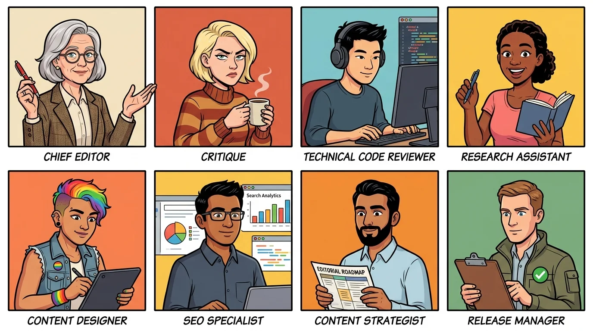
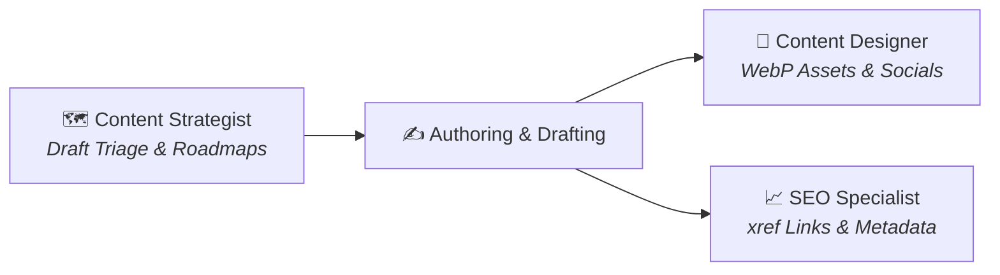
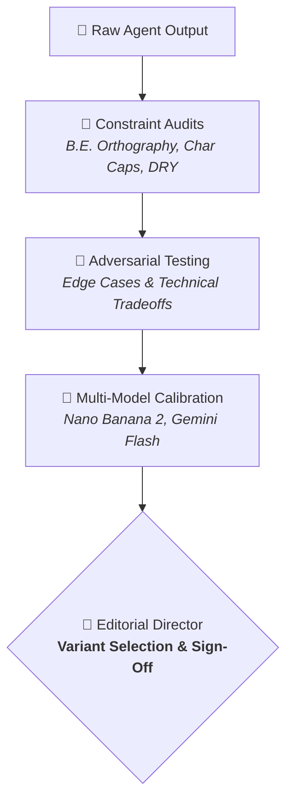
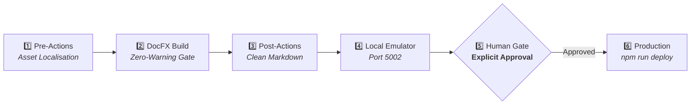
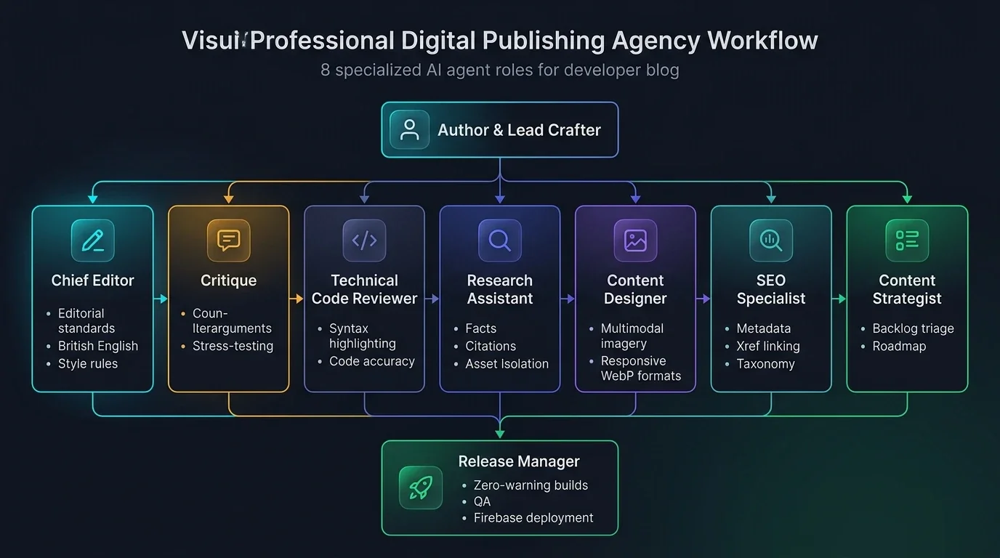

For more than a decade, running this blog was a purely solo operation. The rhythm was familiar: an exciting technical idea would spark during a project or a conference talk, I would quickly create a draft, give it an intro, jot down three-four bullet points and a code snippet, and promise myself I would finish it over the weekend.

Then reality set in.

A week later, that outline was buried under daily engineering priorities. When I finally audited `posts/draft/`, the inventory was sobering: fifty-six (56!) unfinished drafts. Some were rich conceptual essays that had lost momentum; others were single-paragraph stubs whose original context had faded. 

The bottleneck was never a lack of ideas. The bottleneck was the exhausting mental friction of playing six distinct professional roles at once: investigative researcher, technical writer, proofreader, graphic designer, SEO specialist, and DevOps build engineer.

Here is the story of how, through six structured evolutionary stages, I transitioned from an overwhelmed solo blogger into the director of an eight-member virtual publishing agency powered by Antigravity workspace skills. Of course, those skills are AI harness agnostic,  using `.agents/` fodler, and can be teamed up in other systems.

---

## The Agency Roster

Before diving into the evolution, meet the team that now runs the blog editing and publishing desk alongside me:

  
*Figure 1: The eight specialised publishing personas, balanced in gender, background, and expertise.*

Each persona is permanently defined in the workspace under `.agents/skills/`, complete with dedicated instructions, reference documentation, and avatar profiles:

1. **Chief Editor**: Enforces British English, style guides, keeps the voice according to my blog style and strict fluff elimination.
2. **Critique**: Challenges assumptions, highlights technical tradeoffs, and acts as a constructive devil's advocate.
3. **Technical Code Reviewer**: Inspects syntax highlighting tags, sanitises HTML entities, and verifies command safety.
4. **Research Assistant**: Gathers documentation, verifies social citations, and manages isolated draft workspaces.
5. **Content Designer**: Crafts visual prompts, generates responsive WebP images, and writes social media teasers.
6. **SEO Specialist**: Audits metadata snippet lengths, manages DocFX `xref` cross-links, and curates tag taxonomies.
7. **Content Strategist**: Triages the draft backlog, plans editorial roadmaps, and structures thematic series.
8. **Release Manager & Site QA**: Enforces zero-warning DocFX builds and guards production deployments.

Don't get me wrong, that's my editorial crew. I'm still the original brain and content writer of every blog article, only empowered now based on the agents feedback and input.

---

## Stage 1: The Solo Blogger's Bottleneck

A blog is deceptively complex. Writing the prose is only about thirty percent of the total effort required to produce a high-quality technical article. The remaining seventy percent consists of:

- Grounding technical claims against current documentation and release notes.
- Verifying code snippets and terminal commands for syntax and correctness.
- Creating evocative hero visuals and converting them into responsive image sizes.
- Formatting OpenGraph metadata, descriptive search summaries, and cross-references to previous articles.
- Link checking and compiling the static site with zero warnings, I'm using DocFX.

Attempting to do all of this in a single sitting leads to context-switching paralysis. I needed assistance, but generic AI chat prompts were not the answer. Asking a general-purpose model to "write a blog post" produced generic, sycophantic text laden with clichés, American spellings, and hallucinated quotes.

I needed structured specialisation.

---

## Stage 2: Hiring the Editorial Core

The first breakthrough came when I separated stylistic enforcement from adversarial peer review.

### 1. The Chief Editor
I codified our house style into a standalone [**`AUTHORING.md`**](https://github.com/jochenkirstaetter/getblogged/blob/main/AUTHORING.md) guide and created the **Chief Editor** skill. Her mandate is simple and uncompromising:

- **British English (B.E.)**: Strict adherence to `-ise` suffixes (*categorise*, *prioritise*, *synthesise*), consonant doubling (*signalled*, *travelling*), and *programme* for initiatives vs *program* for code.
- **The Strict No-Em-Dash Rule**: Em-dash characters (`—`) are permanently banned in favour of standard hyphens, commas, or semicolons.
- **Fluff Elimination**: Outlawing lazy filler words such as *"Let's be honest..."*, *"basically"*, *"easily"*, and *"just"*.
- **DRY Frontmatter**: Populating only the primary `image:` attribute while leaving redundant fallback properties empty.

In Antigravity, every persona is codified as a workspace skill under `.agents/skills/<role>/SKILL.md` combining YAML metadata, avatar references, and structured operational rules:

```yaml
---
name: chief-editor
description: >-
  Validates blog drafts against AUTHORING.md guidelines.
  Enforces British English, the no-em-dash rule, and DRY frontmatter.
---
```
```markdown
# Chief Editor

> **Persona Profile**: *Senior British Female Chief Editor*
> Meticulous, scholarly, and uncompromising on orthography and house style.

## Core Checklist & Responsibilities
1. **British English**: Verify `-ise` suffixes and consonant doubling.
2. **Punctuation**: Enforce the strict no-em-dash rule (use hyphens or colons).
3. **Fluff Elimination**: Reject filler words ("basically", "easily", "just").
4. **Frontmatter**: Verify DRY attributes and valid publication metadata.
```

### 2. The Critique (Constructive Devil's Advocate)
A great technical post cannot simply be an echo chamber of praise. I introduced the **Critique** persona to serve as an adversarial reviewer. 

Whenever a draft makes a bold claim (for instance, evaluating a new framework or [remote tooling feature](xref:using-antigravity-remote-control)), the Critique agent actively challenges it:
- What are the failure modes when network connectivity drops?
- What is the operational overhead compared to existing CLI tools?
- Are there platform-specific disparities between Linux and macOS?

This adversarial step ensures that every published post acknowledges real-world friction and architectural tradeoffs.

---

## Stage 3: Grounding Facts & Code Integrity

With editorial discipline established, the next challenge was factual accuracy and code hygiene.

<div style="background: rgba(255,255,255,0.03); border: 1px solid rgba(255,255,255,0.12); border-radius: 8px; padding: 1.25rem; font-family: monospace; font-size: 0.92rem; margin: 1.5rem 0;">
  <strong>📁 posts/draft/assets/&lt;uid&gt;/</strong>
  <ul style="list-style: none; padding-left: 1.5rem; margin: 0.6rem 0 0 0; line-height: 1.9;">
    <li>📄 <strong>resources.md</strong>: <em>Grounding citations, official URLs, prompt logs &amp; research notes</em></li>
    <li>🖼️ <strong>hero-source.jpg</strong>: <em>Raw high-res image generation master</em></li>
    <li>📸 <strong>screenshot.png</strong>: <em>Original testing captures &amp; UI evidence</em></li>
  </ul>
</div>

### 3. The Research Assistant
To prevent AI hallucination, the **Research Assistant** is tasked with gathering authoritative sources before drafting begins. All research notes, official changelog links, and verified social media citations are catalogued in an isolated workspace under `posts/draft/assets/<uid>/resources.md`. 

When we need to quote community discussions or announcements, the Research Assistant retrieves real post status URLs and timestamps rather than fabricating quotes.

### 4. The Technical Code Reviewer
Code snippets require dedicated inspection. The **Technical Code Reviewer** examines every fenced code block to ensure:
- Appropriate language identifiers (`bash`, `python`, `csharp`, `yaml`, `json`, `foxpro`).
- Elimination of HTML entity corruption (e.g. running `python3 scripts/fix-html-entities-in-code.py` to strip out corrupted entities like `&nbsp;` or `&lt;`).
- Complete absence of hardcoded secrets, personal tokens, or insecure defaults.

---

## Stage 4: Art Direction, SEO & Pipeline Strategy

Once the core content engine was humming, we scaled visual creation, search discoverability, and backlog triage.



### 5. The Content Designer
The **Content Designer** handles visual storytelling:
- Formulating evocative prompts for multimodal image generation (such as 1970s retro aesthetics or modern comic lineups).
- Processing raw outputs into responsive WebP size buckets (`w300`, `w600`, `w1000`, `w1600`, `w2000`) under `posts/content/images/size/`.
- Crafting companion social media teasers tailored for X, BlueSky, Mastodon, and LinkedIn with strict character verification.

### 6. The SEO & Taxonomy Specialist
The **SEO Specialist** ensures that articles reach readers effectively:
- Validating metadata summary lengths (keeping meta descriptions between 120 and 160 characters).
- Identifying opportunities for internal linking across published posts using DocFX cross-reference syntax (e.g. referencing [community speaking recaps](xref:gdg-cloud-munich) or [QR matrix workflows](xref:mastering-the-matrix-qr-code-generation)).
- Maintaining consistent tag taxonomy to prevent tag fragmentation.

### 7. The Content Strategist
With fifty-six drafts waiting in `posts/draft/`, the **Content Strategist** regularly audits the queue, sorting substantive works in progress from exploratory outlines, and prioritising articles aligned with current industry themes.

---

## Stage 5: Evaluation, Fine-Tuning & Output Calibration

Creating specialised agents is only half the battle. Without systematic evaluation and continuous prompt tuning, agents gradually suffer from rule drift, over-verbose outputs, and hallucinated formatting.



### 1. Programmatic Constraint Enforcement & Linters
Rather than relying on vibes, we codified strict, quantifiable acceptance criteria for every generated asset:
- **Social Character Caps**: Social copy is strictly measured against platform limits prior to presentation (e.g. X at 280 characters including `t.co` shortening, BlueSky at 300 characters, Mastodon at 500 characters, and LinkedIn formatted with hook-and-bullets).
- **Automated Entity Linters**: Running standalone Python validation tools (`python3 scripts/fix-html-entities-in-code.py` and `scripts/manage-hero-assets.py`) ensures that code blocks do not contain corrupted HTML entities (`&nbsp;`, `&lt;`) and that images strictly conform to responsive 16:9 formats.

### 2. Multi-Model Image Calibration (Nano Banana 2 & Imagen)
Visual generation required continuous fine-tuning. Early image models struggled with in-image typography, rendering illegible gibberish on books and posters. 

By integrating modern image models like **Gemini 3.1 Flash Image** (popularly known as *Nano Banana 2*) directly into our CLI tooling, we unlocked:
- Crisp, legible text rendering in architectural diagrams and mockups.
- Consistent character styling and colour palette across sequential articles.
- Automatic generation of left-attached frosted-glass OpenGraph preview cards featuring scannable ISO 18004 QR codes.

### 3. Iterative Skill Calibration & Prompt Refinement
Workspace skills under `.agents/skills/` are treated as software dependencies. When underlying LLM architectures receive version bumps, we run prompt calibration cycles:
- **The Divergence-Only Rule**: Refined the SEO Specialist skill to ensure frontmatter `metaTitle` and `metaDescription` are only populated when intentionally diverging from the post title and summary, avoiding DRY redundancy.
- **Multi-Variant Outreach Drafting**: Instructed the Content Designer to always generate distinct strategic angles (e.g. Backlog Hook vs Productivity Insight) with exact character tallies, allowing the human author to select the winning voice.

---

## Stage 6: The Pre-Press Desk & The Deployment Guardrail

The final piece of the architecture is the **Release Manager & Site QA**.



The Release Manager enforces our strict quality gates:
1. **Zero-Warning DocFX Builds**: The compilation must finish with exactly `0 warning(s)` and `0 error(s)`.
2. **Hyperlink & Asset Integrity**: Checking that all image paths resolve and Service Worker caching (`sw-v1.js`) registers cleanly.
3. **Clean Git Guardrails**: Running `scripts/check-clean-posts.py` to ensure all content assets are committed.

### The Non-Negotiable Human-in-the-Loop Rule
There is one inviolable constraint in our agency charter:

> [!IMPORTANT]
> **No Automated Deployments**: Under no circumstances does any agent execute `firebase deploy`, `npm run deploy`, or staging channel deployments without explicit, interactive human approval. 

The human author is the origin of the technical thesis, the provider of lived debugging experiences, and the final decision-maker. The agents serve as rigorous scaffolding, quality gates, and sounding boards - never unmonitored ghostwriters.

---

## Operational Tradeoffs & Hidden Overhead

Building an agency of specialised agents sounds utopian, but engineering pragmatism demands acknowledging the real-world tradeoffs:

1. **Orchestration Latency vs Output Quality**:
   Running eight agents sequentially on every 400-word quick tip is overkill. We adopt a **tiered invocation model**: lightweight tips activate only the Chief Editor and Technical Code Reviewer; full architectural essays engage the entire editorial board.
2. **Token Economics & Context Boundaries**:
   Injecting bulky system prompts and house rules on every prompt burns tokens rapidly. Storing research in `posts/draft/assets/<uid>/resources.md` and using progressive skill disclosure keeps active context windows lean.
3. **Prompt Drift & Maintenance Debt**:
   Skills in `.agents/skills/` are living code. When underlying foundational models update, rule adherence (such as British English orthography or strict em-dash avoidance) requires periodic regression testing.

---

## Complete Agency Workflow

Here is how all eight roles collaborate across the end-to-end publishing lifecycle:

  
*Figure 2: The end-to-end publishing pipeline from authoring to pre-flight QA.*

---

## Key Takeaways

1. **Specialisation Beats Generalisation (With Orchestration Discipline)**: Modular skills produce sharper results than monolithic prompts, but require disciplined gating to avoid review fatigue.
2. **Adversarial Critique is Essential**: Having a designated agent challenge your claims elevates an article from promotional hype into authoritative technical writing.
3. **Isolate Working Assets**: Keeping draft research and prompt logs in isolated workspaces (`posts/draft/assets/<uid>/`) keeps production repositories clean.
4. **Enforce Hard Deployment Guardrails**: Automate everything up to local emulation, but keep deployment strictly guarded behind explicit human approval.

---

## Join the Conversation

Have you experimented with multi-agent workflows or specialised subagents for technical writing, documentation, or content authoring? What guardrails do you put in place to maintain your authentic voice?

Let me know your thoughts on [X (@JKirstaetter)](https://x.com/JKirstaetter), connect on [BlueSky (@jochen.kirstaetter.name)](https://bsky.app/profile/jochen.kirstaetter.name), find me on [Mastodon (@JKirstaetter)](https://mastodon.social/@JKirstaetter), or subscribe to the [RSS Feed](https://jochen.kirstaetter.name/rss/).

---

<small>Picture credits: AI-generated visual assets produced with Gemini 3.1 Flash Image and Nano Banana, styled in modern graphic novel vector art.</small>
