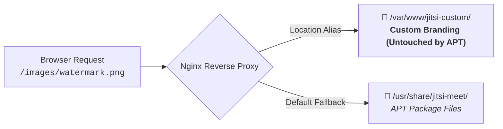
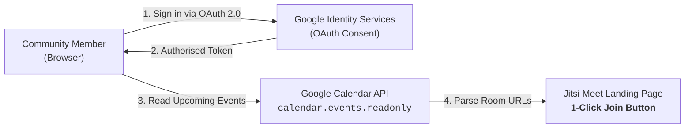
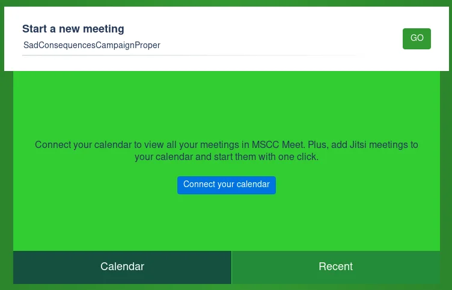
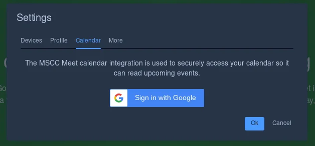
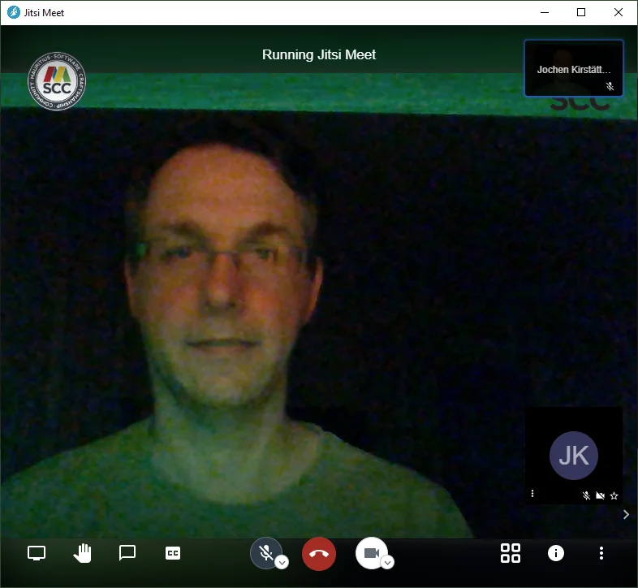

In the previous two articles of this series, we set up our self-hosted video conferencing infrastructure. First, we walked through how to [Install Jitsi Meet on Compute Engine (GCP)](xref:install-jitsi-meet-on-gcp), providing a scalable, isolated WebRTC server. Next, we secured our installation against unauthorised room squatting by learning how to [Enable Authentication in Jitsi Meet](xref:authentication-jitsi-meet).

Now that your instance is operational and secure, it is time to make it truly your own. 

Out of the box, Jitsi Meet displays default branding, external links to the Jitsi community, and generic meeting room titles. Customising the interface to display your own community logo, custom colour scheme, tailored welcome text, and default audio/video behaviour transforms a generic utility into a professional, cohesive communication hub.

However, anyone who has modified a Debian or Ubuntu package installation knows the frustration of running `apt-get upgrade` only to find that their custom logos, stylesheets, and configurations have been completely overwritten.

In this third article, we will explore:
- Core feature configuration in `hostname-config.js`.
- Visual appearance customisation covering logos, watermarks, titles, and welcome content.
- Practical strategies to make customisations upgrade-persistent across package updates with hardened Nginx rules and caching.
- Google Calendar integration for agenda synchronisation on the landing page and user settings.
- Desktop and mobile client integration, including in-browser WebRTC vs native mobile app server configuration.

> [!NOTE]
> The adjustments described below require administrative permissions. You can execute them by launching an interactive root terminal (`sudo -i`) or by prefixing individual commands with `sudo`.

---

## Core Feature Configuration (`config.js`)

The primary configuration file controlling client-side behaviour is located at:

```bash
sudo nano /etc/jitsi/meet/$(hostname -f)-config.js
```

This JavaScript file is loaded by every participant's browser before entering a room. It governs meeting defaults, audio/video policies, and third-party integrations.

### Essential Participant Settings
When hosting large community meetups or webinars, having every attendee enter with microphones and cameras blazing creates immediate audio feedback and bandwidth congestion. You can set sane community defaults:

```javascript
// Start every participant muted to avoid immediate audio feedback
startWithAudioMuted: true,

// Start participants with video muted if bandwidth is constrained
startWithVideoMuted: false,

// Require participants to verify mic and camera in a prejoin lobby
prejoinPageEnabled: true,

// Default UI language (e.g. English)
defaultLanguage: 'en',

// Enable or disable peer-to-peer mode for 1-on-1 calls
p2p: {
    enabled: true,
    preferH264: true
}
```

---

## Branding and Appearance Customisation

The visual presentation of Jitsi Meet is distributed across static HTML templates, configuration files, and image assets located in `/usr/share/jitsi-meet/`.

### Custom Watermark & Logos
The most recognisable element in a Jitsi call is the watermark shown in the top-left corner of the video grid.

- **Main Watermark**: `/usr/share/jitsi-meet/images/watermark.png`
- **Favicon**: `/usr/share/jitsi-meet/favicon.ico`

To display your community or company logo, prepare a transparent PNG image (recommended size: `166 × 48 px`) and replace the default file:

```bash
sudo cp /path/to/my-logo.png /usr/share/jitsi-meet/images/watermark.png
```

### Fine-Tuning UI Elements (`interface_config.js`)
To adjust watermark links, application names, and toolbar buttons, open the interface configuration:

```bash
sudo nano /usr/share/jitsi-meet/interface_config.js
```

Key variables to customise include:

```javascript
// Customise the application name shown on browser tabs and notifications
APP_NAME: 'MSCC Meet',
NATIVE_APP_NAME: 'MSCC Meet',

// Direct clicking the top-left logo to your organisation website
JITSI_WATERMARK_LINK: 'https://www.mscc.mu',

// Hide promotional banners
SHOW_JITSI_WATERMARK_FOR_GUESTS: true,
SHOW_WATERMARK_FOR_GUESTS: false,

// Curate visible toolbar buttons to remove unused features
TOOLBAR_BUTTONS: [
    'microphone', 'camera', 'closedcaptions', 'desktop', 'fullscreen',
    'fodeviceselection', 'hangup', 'profile', 'chat', 'recording',
    'livestreaming', 'etherpad', 'sharedvideo', 'settings', 'raisehand',
    'videoquality', 'filmstrip', 'tileview', 'shortcuts', 'help'
],
```

> [!NOTE]
> In recent Jitsi Meet releases, several user interface parameters originally located in `interface_config.js` (such as `toolbarButtons` and `filmstrip` controls) are being progressively consolidated directly into `config.js`. If you are running an updated package version or containerised deployment, verify whether your target parameter has moved into your primary `config.js` schema.

### Social Media & Open Graph Previews (`title.html`)
When you share a meeting URL on messaging platforms like Slack, Microsoft Teams, or WhatsApp, the client fetches Open Graph metadata to render a link preview card.

Open `/usr/share/jitsi-meet/title.html`:

```bash
sudo nano /usr/share/jitsi-meet/title.html
```

Replace the default tags with your custom branding:

```html
<title>MSCC Meet - Virtual Developer Meetup</title>
<meta property="og:title" content="MSCC Meet - Community Video Calls" />
<meta property="og:image" content="/images/watermark.png" />
<meta property="og:description" content="Secure, high-quality video meetings hosted by the Mauritius Software Craftsmanship Community." />
<meta itemprop="name" content="MSCC Meet" />
```

### Landing Page Footer & Welcome Content
The landing page displays a room creation box. You can inject custom announcements, code of conduct links, or server sponsorship details below this box using `welcomePageAdditionalContent.html`:

```bash
sudo nano /usr/share/jitsi-meet/static/welcomePageAdditionalContent.html
```

Add your custom HTML snippet:

```html
<template id="welcome-page-additional-content-template">
    <div style="text-align: center; margin-top: 2rem; color: #fff;">
        <p>Hosted by the <strong>Mauritius Software Craftsmanship Community</strong>.</p>
        <p><small>Please respect our <a href="https://www.mscc.mu/code-of-conduct/" target="_blank" style="color: #4a90e2;">Code of Conduct</a> during all sessions.</small></p>
    </div>
</template>
```

---

## The Upgrade Dilemma

Here is the catch: Jitsi Meet receives frequent software updates. When you run `sudo apt-get upgrade`, the `jitsi-meet-web` package extracts clean upstream files into `/usr/share/jitsi-meet/`. 

Without precaution, your custom `watermark.png`, `interface_config.js`, `title.html`, and welcome snippets are immediately overwritten by the default upstream templates.

To solve this, we employ two different strategies depending on your operational preferences.

---

### Virtual Locations via Nginx Aliases (Recommended)

The most robust architectural solution is to separate your custom assets from the operating system's package directory entirely. 

By placing your custom assets in an independent directory (e.g. `/var/www/jitsi-custom/`) and using Nginx `location` alias directives, Nginx intercepts requests for specific assets and serves your custom files before the request ever touches `/usr/share/jitsi-meet/`.



#### Create an Isolated Custom Assets Directory
```bash
sudo mkdir -p /var/www/jitsi-custom/images
sudo mkdir -p /var/www/jitsi-custom/static

# Copy your branding assets into the safe location
sudo cp /path/to/my-logo.png /var/www/jitsi-custom/images/watermark.png
sudo cp /usr/share/jitsi-meet/static/welcomePageAdditionalContent.html /var/www/jitsi-custom/static/
```

#### Configure Nginx Location Directives
Open your active Jitsi Nginx server block:

```bash
sudo nano /etc/nginx/sites-available/$(hostname -f).conf
```

Inside the `server` block listening on port 443, insert the specific alias overrides **above** the general root block:

```nginx
# ----------------------------------------------------
# Upgrade-Safe Custom Branding Aliases
# ----------------------------------------------------
location ^~ /images/watermark.png {
    alias /var/www/jitsi-custom/images/watermark.png;
    add_header Cache-Control "no-cache, must-revalidate";
}

location ^~ /static/welcomePageAdditionalContent.html {
    alias /var/www/jitsi-custom/static/welcomePageAdditionalContent.html;
    add_header Cache-Control "no-cache, must-revalidate";
}
```

Two specific architectural choices make this block particularly resilient:
- **Prefix Matching (`^~`)**: Using `^~` instructs Nginx that once this prefix matches, it must stop checking for any subsequent regular expression locations (`~` or `~*`). Jitsi Meet's default Nginx configuration includes regular expressions for routing room names; using `^~` ensures that your custom asset aliases take absolute precedence without being bypassed by upstream regex rules.
- **Cache-Control Headers**: Web browsers aggressively cache static PNG images and HTML snippets. Without explicit cache instructions, attendees may continue seeing the default Jitsi logo or outdated announcements long after you have refreshed files on disk. Adding `Cache-Control "no-cache, must-revalidate"` forces the browser to revalidate the asset with Nginx on every request. If the file has not changed, Nginx replies with a fast `304 Not Modified`, giving you instantaneous visual updates without wasting network bandwidth.

#### Test and Reload Nginx
```bash
sudo nginx -t
sudo systemctl reload nginx
```

Whenever `apt-get upgrade` updates `jitsi-meet-web`, it can freely replace `/usr/share/jitsi-meet/images/watermark.png`. Nginx will continue serving your file from `/var/www/jitsi-custom/` without skipping a beat!

---

### Git Time-Capsule in `/usr/share/jitsi-meet`

If you prefer modifying files directly in-place (for example, when tweaking complex CSS or JavaScript logic across multiple files), you can turn `/usr/share/jitsi-meet` into a local Git repository.

Version control acts like an operational time-capsule: it tracks all your modifications, alerts you when an upgrade changes upstream templates, and lets you reapply your changes smoothly.

#### Initialise the Local Repository
Ensure `git` is installed, navigate to the web root, and create the baseline commit:

```bash
sudo apt-get install -y git
cd /usr/share/jitsi-meet

sudo git init
sudo git config user.name "Jitsi Administrator"
sudo git config user.email "admin@localhost"

# Stage the untouched upstream installation
sudo git add .
sudo git commit -m "Initial upstream baseline installation"
```

#### Apply and Commit Custom Modifications
Make your changes to `interface_config.js`, `title.html`, and images, then commit them to a dedicated branch:

```bash
sudo git checkout -b custom-branding
sudo git add -A
sudo git commit -m "feat(branding): apply custom logos, watermarks, and welcome text"
```

#### Upgrade Routine: Stash, Upgrade, and Pop
When package upgrades arrive, use Git to preserve your modifications:

```bash
cd /usr/share/jitsi-meet

# Stash active customisations
sudo git stash

# Run the system package upgrade
sudo apt-get update && sudo apt-get --only-upgrade install -y jitsi-meet-web

# Commit new upstream files to repository
sudo git add -A
sudo git commit -m "chore(upstream): update jitsi-meet-web package"

# Reapply custom branding branch modifications
sudo git stash pop
```

If any conflict occurs (for instance, if upstream renamed a variable in `interface_config.js`), Git will highlight the exact lines requiring adjustment rather than silently overwriting your work.

--- 

## Integrate Google Calendar

Coordinating virtual meetings often introduces unnecessary friction when attendees have to search through calendar invites, email threads, and messaging channels to find the correct room URL.

Jitsi Meet includes native support for Google Calendar synchronisation. When enabled, your instance surfaces an interactive agenda view directly on the landing page and within user settings, allowing participants to view their schedule and enter community meetups with a single click.



### Google Cloud Project and OAuth Credentials

Because Part 1 of this series deployed our instance on Google Cloud Compute Engine, you already have access to the Google Cloud Console. To configure calendar synchronisation, create an OAuth 2.0 client:

- **Enable the API**: In your Google Cloud project, navigate to **APIs & Services > Library**, search for **Google Calendar API**, and click **Enable**.
- **Configure the OAuth Consent Screen**: Under **APIs & Services > OAuth consent screen**, select **External** (for public community members) or **Internal** (for Google Workspace organisations). Enter your application title (e.g. *MSCC Meetup Calendar*) and contact information. Add the read-only scope:
  ```text
  https://www.googleapis.com/auth/calendar.events.readonly
  ```
- **Generate Web Credentials**: Under **APIs & Services > Credentials**, click **Create Credentials > OAuth client ID**.
  - **Application type**: Web application.
  - **Name**: `Jitsi Meet Calendar Client`.
  - **Authorised JavaScript origins**: Enter your instance base URL (e.g. `https://meet.mscc.mu`).
  - **Authorised redirect URIs**: Enter your instance OAuth callback endpoint:
    ```text
    https://meet.mscc.mu/static/oauth.html
    ```
- **Copy the Client ID**: Google generates an alphanumeric string ending in `.apps.googleusercontent.com`. You do not need a client secret, as this authentication flow executes entirely in the client browser.

> [!TIP]
> If you leave your OAuth consent screen in **Testing** status, Google limits authentication strictly to 100 explicitly invited Google accounts. For open community instances, transition the consent screen to **In production** (or add your core team members to the test user list) to avoid access errors.

### Jitsi Configuration (`config.js`)

Once you have your OAuth Client ID, open your server configuration file:

```bash
sudo nano /etc/jitsi/meet/$(hostname -f)-config.js
```

Locate the calendar settings section and enable the feature alongside your Google Client ID:

```javascript
// ----------------------------------------------------
// Google Calendar Synchronisation
// ----------------------------------------------------
enableCalendarIntegration: true,

// Google API OAuth 2.0 Web Client ID
googleApiApplicationClientID: '1234567890-abcdefghijklmnopqrstuvwxyz.apps.googleusercontent.com',
```

Save the file. Because `config.js` is fetched dynamically by clients on each page load, there is no need to restart system services. The change takes effect immediately upon hard-refreshing your browser.

### The Welcome Page and Settings Experience

With the configuration active, participants experience two integration touchpoints:

::: grid


:::

**Landing Page Agenda**: Below the room name input, the **Calendar** tab displays a *"Connect your calendar"* call-to-action. Once authenticated, Jitsi displays upcoming meetings for the day. If a calendar invite contains a Jitsi meeting URL in its location or description, a prominent **Join** button appears next to the scheduled time.

**In-Meeting Preferences**: Users can also link or disconnect their calendar account at any time by opening **Settings > Calendar** and clicking *"Sign in with Google"*.

All OAuth tokens and calendar event payloads are processed and retained exclusively within the attendee's browser local storage. The Jitsi server never stores, inspects, or proxies private calendar contents, ensuring complete user privacy.

--- 

## Desktop Client Integration (Jitsi Meet Electron)

In addition to web browsers, participants can connect via the official cross-platform desktop application: [Jitsi Meet Electron](https://github.com/jitsi/jitsi-meet-electron).



To ensure that the Electron desktop wrapper can frame your server without security policy violations, verify that your Nginx SSL server block includes standard frame options:

```nginx
add_header X-Frame-Options "SAMEORIGIN";
```

The desktop client provides hardware push-to-talk hotkeys, system tray minimisation, and native screen-sharing selectors that bypass browser permission prompts.

---

## Mobile Experience

When community members open a meeting link on smartphones or tablets, their experience depends heavily on how your instance handles mobile clients. By default, Jitsi Meet prompts mobile visitors with a full-screen interstitial banner urging them to install the official mobile application.

Depending on your audience and operational needs, you can either streamline the in-browser WebRTC experience for friction-free joining or guide participants into the native mobile application configured for your custom domain.

### Seamless In-Browser WebRTC (Zero-Install)

If you run public webinars or developer meetups with casual attendees, forcing guests to download a mobile app creates immediate participation friction. Modern mobile browsers (such as Chrome for Android and Safari on iOS) fully support WebRTC audio, video, and screen viewing without requiring third-party software.

You can suppress the promotional install interstitial and allow participants to enter meetings directly within their mobile browser.

#### Disable Mobile Deep Linking (`config.js`)
Open your primary configuration file:

```bash
sudo nano /etc/jitsi/meet/$(hostname -f)-config.js
```

Add or adjust the deep-linking parameters:

```javascript
// ----------------------------------------------------
// Mobile Browser WebRTC Experience
// ----------------------------------------------------
// Disable the interstitial prompt that pushes native mobile apps
disableDeepLinking: true,

// In modern Jitsi Meet releases with nested configuration objects:
deeplinking: {
    disabled: true
},
```

#### Suppress Promotional Banners (`interface_config.js`)
Next, disable the promotional banners in the interface configuration:

```bash
sudo nano /usr/share/jitsi-meet/interface_config.js
```

Set the mobile app promotion flag to `false`:

```javascript
// Hide the mobile app promotional banner
MOBILE_APP_PROMO: false,
```

With these settings applied, attendees tapping a meeting link on their phone land straight in the prejoin lobby or video room inside their mobile browser.

> [!NOTE]
> While in-browser mobile WebRTC is convenient for guests, mobile operating systems enforce aggressive background tab management. If an attendee locks their screen or switches apps, mobile Safari and Chrome may suspend video feeds. For regular team members or moderators, the native app offers superior stability.

### Native Mobile App Configuration

For recurring community members and moderators who participate frequently from mobile devices, the official [Jitsi Meet Mobile App](https://jitsi.org/api/) (available on iOS and Android) delivers native background audio processing, hardware battery optimisation, and incoming call notifications.

However, there is an important operational pitfall to avoid:

By default, the Jitsi Meet mobile app connects to the public cloud infrastructure hosted at `https://meet.jit.si`. If an attendee installs the app from the store and enters a room name such as `MSCCMonthlyMeetup`, the application connects to public Jitsi infrastructure, leaving them isolated from your self-hosted community server on `meet.mscc.mu`!

To ensure mobile app users join your private instance:

**Configure the Default Server URL**: Inside the mobile app, tap the **Settings** gear icon and set the **Server URL** field to your instance domain:

  ```text
  https://meet.mscc.mu
  ```

Once saved, all rooms created or entered from the app automatically route to your self-hosted infrastructure.

**Direct Joining via Deep Links**: When deep linking remains enabled on your server, sharing a full meeting link (such as `https://meet.mscc.mu/MSCCMonthlyMeetup`) automatically prompts the phone to open the meeting inside the installed mobile app while passing your custom domain as the conference host.

---

## Retrospective Note: Bare-Metal VMs vs Modern Containers

When this series was originally authored in 2020 during the rapid community pivot to remote collaboration, running standalone Debian VMs on Google Cloud Compute Engine was the standard deployment architecture for community servers.

Today, many engineers opt for containerised orchestration using **Docker Jitsi Meet** (`docker-compose`). The encouraging takeaway is that **the underlying principles remain identical**:
- Rather than modifying `/usr/share/jitsi-meet/`, Docker deployments map persistent local directories to container volume mounts (such as `~/.jitsi-meet-cfg/web/`).
- Rather than tweaking host Nginx configs, custom virtual locations are placed in containerised Nginx snippet directories (`web/custom-snippets/`).

Understanding how the web client, configuration layers, and reverse proxies interact gives you total mastery over your video infrastructure, regardless of whether you deploy on bare metal or in containers.

---

## Summary and Series Recap

Looking back at what we have covered across the series so far:

- **[Installation on GCP](xref:install-jitsi-meet-on-gcp)**: Provisioning GCP Compute Engine VMs, firewall rules, and automated Let's Encrypt SSL certificates.
- **[Authentication and Security](xref:authentication-jitsi-meet)**: Securing rooms with Prosody internal authentication and guest focus delegation in Jicofo.
- **Interface Customisation and Branding**: Tailoring features in `config.js`, branding the UI with logos and custom HTML, locking in upgrade persistence via Nginx virtual locations, and tuning client experiences for desktop and mobile devices.

You now possess a private, branded, secure, and resilient video conferencing platform under your complete operational control.

---

## Share Your Jitsi Story

What is your actual experience running or joining calls on Jitsi Meet? Did you learn the hard way about package upgrade wipeouts after a routine `apt-get` blew away your bespoke logos, or have you spent late nights wrestling with Nginx routing and mobile WebRTC permissions? 

Which unforeseen pitfalls caught you completely off guard, what ingenious hacks did you deploy to keep your community connected, and what nagging reservations still make you look twice at commercial alternatives? 

Do not keep those hard-earned lessons locked away on your staging box. Tell me about your setup, your triumphs, and your catastrophic misconfigurations on [X (@JKirstaetter)](https://x.com/JKirstaetter), compare notes on [BlueSky (@jochen.kirstaetter.name)](https://bsky.app/profile/jochen.kirstaetter.name), ping me on [Mastodon (@JKirstaetter)](https://mastodon.social/@JKirstaetter), or subscribe to the [RSS Feed](https://jochen.kirstaetter.name/rss/) for more hands-on DevOps deep dives.

---

<small>Picture credits: Hero artwork generated with Gemini 3.1 Flash Image (Nano Banana 2) and composited with official Mauritius Software Craftsmanship Community (MSCC) branding; interface screenshots by Jochen Kirstätter.</small>