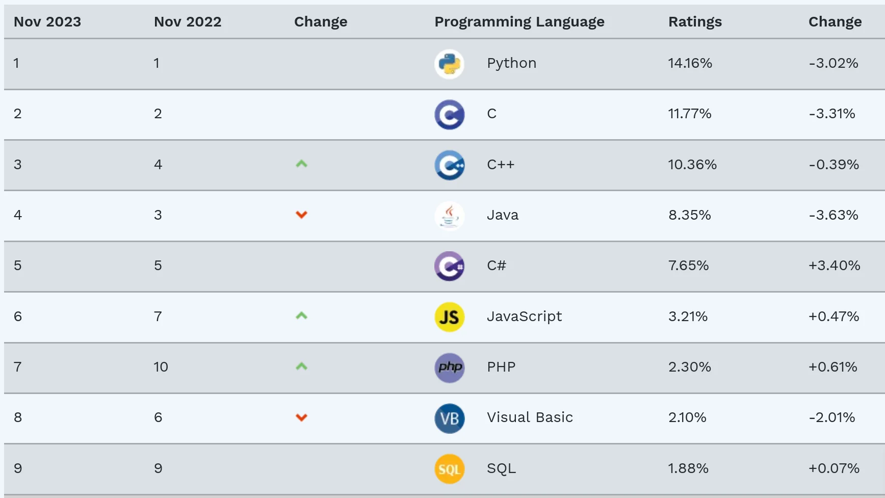
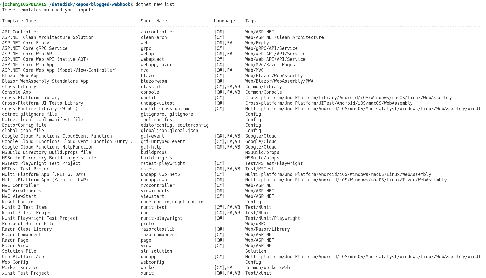
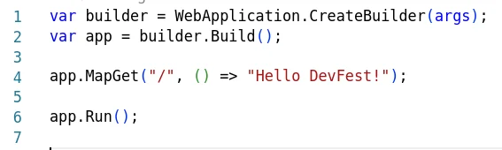
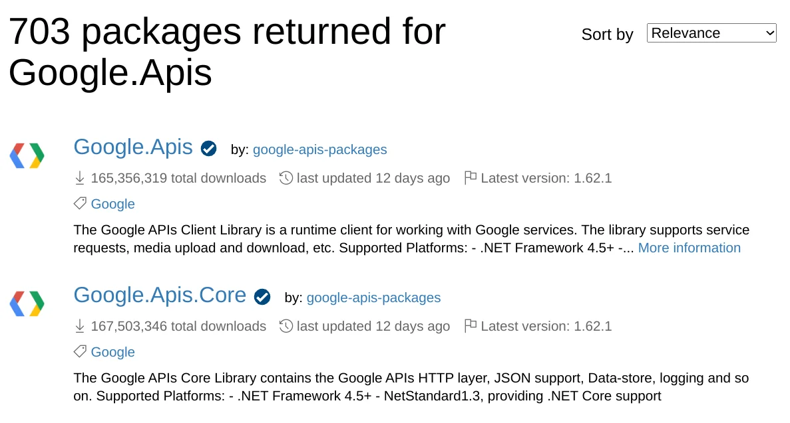
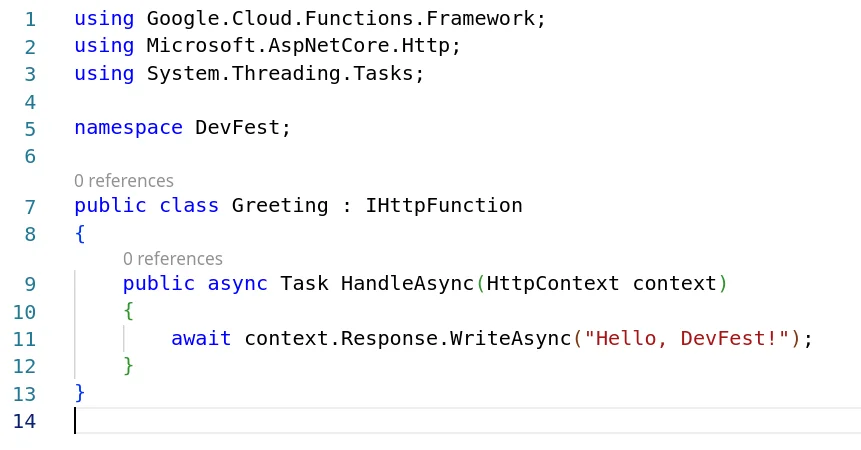
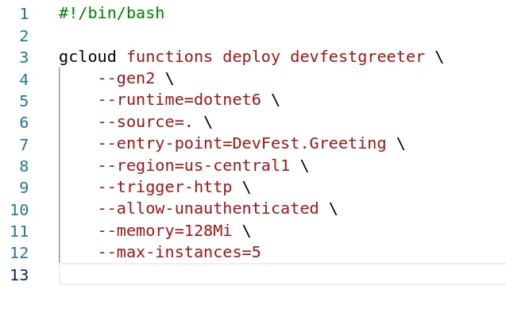
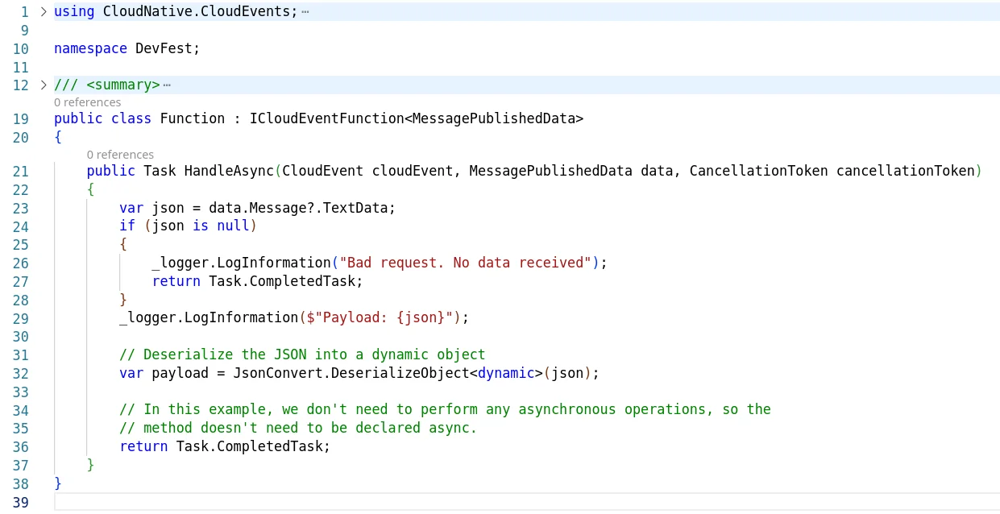

Ahead of the Google I/O Connect event in Amsterdam there had been exchange with the organisers of GDG Cloud Munich. Thankfully, they accepted a proposal to speak. Why Munich, you ask. It's quite far from Amsterdam.

Given the circumstances that I had to do some of my annual health check-ups and examinations in Germany I cramped a couple of activities into a single trip to Europe. One of them required to stop for a couple of days in Munich. As I was looking for community events around the same time I noticed that the GDG Cloud chapter might have something coming up.

Hence I reached out to Yevgen to see whether there would be a possibility of a meetup around that time, and in case there could be interest in a certain topic. Turns out that both requests aligned nicely and in consequence I was invited to speak at their hybrid event in June.

The topic was "State of GCP: .NET Edition" which covers a range of products and services offered by Google Cloud Platform (GCP) that can be used in combination with Microsoft .NET technology stack, in particular with C#.

Hang on, C# and Google?  
Yup, actually it works pretty well and there are numerous reasons to consider a mature, extensible, open source, and enterprise-battled eco-system for your cloud-based implementations. According to the [TIOBE index](https://www.tiobe.com/tiobe-index/) C# had the largest growth rate compared to other programming languages.



Personally, it allows me to leverage my existing knowledge and doesn't require me to dig deeper into other programming languages like JavaScript, Go, Python, and so forth, in order to benefit from Google Cloud, and it also shows that one isn't locked in to cloud computing provided by Microsoft Azure while using C# applications. Bearing this in mind, it's actually a solid way to build so-called cross-cloud or multi-cloud solutions.

I was given approximately one hour to present about .NET. After setting up the system and being introduced by Yevgen to the in-person and online audience I started to address a couple of potential misconcpetions regarding Microsoft .NET and C#. The majority of the audience had never used C# before and I was curious about some of the reasons. This then allowed me to go with the flow and clarify some statements. I added up a few practical examples from my experience and then spanned the arc to Google Cloud services that can be used as part of the solution. Again sharing some of the obstacles and pitfalls observed and handled in the process.

Some of the questions asked indicated that there is quite some work to do removing a slightly negative reputation of the Microsoft .NET eco-system, simply because it's Microsoft (maybe its past?), whereas other questions looked behind that facade and brought up comparison to other existing approaches like backend development with Node.js and Express, and how C# could be useful for such backend services.

To begin with .NET development I explained the *dotnet* CLI tool and how project templates get you started.



When I launched the terminal in Visual Studio Code and started to show how a sample API application is developed in C#, using minimal API, the interest level in the audience rose instantly. I showed the generated source code and how easy it is to get going right away. Some remarks where like "hey, that really looks like Express", "Oh, are those arrow functions?" (meaning anonymous delegates), and "that looks neat and clean".



Next, I ventured into the NuGet package management and how developers can integrate any package into their project easily. Especially showing the over 700 NuGet packages available to use Google APIs for all kind of services and functionalities.



Also mentioning that the package management is less space-consuming and easier to maintain compared to node modules.

Lastly, it was time to deploy to Google Cloud. All this time I stayed in VS Code and never had to switch focus to another application. The Google Cloud extension for VS Code provides you access to your resources in the cloud, and using the gcloud CLI tool does the rest of the job. Deploying the just created API service to App Engine Flexible was done quickly.

What about serverless? Let's do it. I explained that the dotnet CLI tool can be extended with project templates and showed that there are project templates targetting Google Cloud Functions.

First, I created a new Google Cloud function using the HTTP endpoint trigger, showed the source code and the necessary implementation of the interface, and how to deploy it using the gcloud CLI tool.



A matter of roughly 5 minutes from start to finish.



Then, I did the same using the project template for an event-triggered Google Cloud function, and explained the flexibility of the type-induced interface to create functions handling different types of data loads.



And thanks to the Google Cloud functions emulator you can launch, test and debug your local code before deploying it to Google Cloud.

```bash
$ dotnet run
```

Gratefully, with every piece of source code shown and sharing my experience of combining C# implementation using NuGet packages and how to deploy it to GCP there were more and more questions in the audience. Finally, I was indicated by the team of GDG Cloud Munich that we are out of time, and I wrapped it up quickly with my opinionated conclusion of using C# together with the rich .NET eco-system in order to develop scalable, enterprise-ready, and cloud-native solutions using Google Cloud Platform.

I was humbled by the audience's interest to know more and the numerous follow-up questions regarding the talk and the live demos showed. Thanks!

My heart-felt thanks and best wishes to the organising team of GDG Cloud Munich, namely Yevgen Batovskyi and Spyros Kyriazatis, for this opportunity to talk and share my passion. It was an amazing evening at the Google office in Munich.

PS: Apart from the announcement screen the whole talk was a *no slide deck presentation* purely based on me talking about the history, the evolution, the current state of C# and .NET, and how it fares together with GCP based on my experience.

<small>Picture credits: Mary Jane Kirstätter and Inna Zaytseva</small>