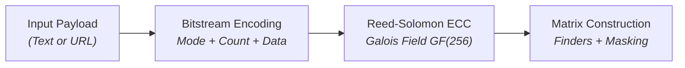

Open any modern web browser on your desktop and look closely at the address bar or context menu. Google Chrome provides a built-in [*Create QR Code for this page* tool](https://support.google.com/chrome/answer/9430554), complete with its pixelated offline dinosaur mascot sitting proudly in the middle. Microsoft Edge features a dedicated sharing flyout that renders a quick square matrix, and mobile Safari integrates URL sharing directly into the system Share Sheet.

These browser-native features work well for ad-hoc personal transfers when sending a tab to your phone. However, when building a publishing engine, an interactive web application, or an automated static site pipeline, relying on manual browser menus falls short. You cannot customise the branding, you cannot automate social preview card generation in CI/CD, and you cannot serve dynamic QR codes programmatically to external consumers.

Back in 2023, I explored this challenge in <xref:generate-qr-codes-gcf>, comparing Google's deprecated Charts API, local scripting with the `qrcode` Python library and `QRCoder` NuGet package, and deploying serverless Google Cloud Functions. 

Three years later, our architecture has evolved significantly. Instead of managing external web services or deploying heavy runtimes for static content, we built clean, lightweight QR code engines across three distinct tiers: headless build-time matrix calculation in Python, client-side in-browser canvas rendering in JavaScript, and a high-performance Minimal API microservice in C# on .NET 10.

Here is the engineering journey behind implementing the [ISO/IEC 18004 standard](https://www.iso.org/standard/62021.html), mastering Galois field mathematics, and compositing elegant frosted-glass badges.

---

## 1. Under the Hood: The Mathematics of ISO/IEC 18004

Invented in 1994 by [Denso Wave](https://www.qrcode.com/en/technology/), a QR (Quick Response) code is far more than a monochrome checkerboard. It is a mathematically resilient two-dimensional matrix engineered to survive severe optical distortion, tearing, and occlusion. Generating one requires four distinct mathematical and structural stages:



### Galois Field $GF(256)$ Arithmetic
Standard integer arithmetic does not work for finite field error correction because division can yield non-integers. QR codes operate over the Galois Field $GF(2^8)$ or $GF(256)$, defined by the primitive polynomial:

$$P(x) = x^8 + x^4 + x^3 + x^2 + 1 \quad (0x11D \text{ or } 285)$$

In $GF(256)$, addition and subtraction are identical to bitwise XOR (`^`). Multiplication is performed by expressing non-zero elements as powers of a primitive root $\alpha=2$. By precomputing log and exponent tables during startup, polynomial multiplication reduces to table lookups:

```python
# Galois Field GF(256) tables with primitive polynomial 0x11D (285)
GF_EXP = [0] * 512
GF_LOG = [0] * 256
_x = 1
for _i in range(255):
    GF_EXP[_i] = _x
    GF_LOG[_x] = _i
    _x <<= 1
    if _x >= 256:
        _x ^= 0x11D
for _i in range(255, 512):
    GF_EXP[_i] = GF_EXP[_i - 255]

def gf_mul(a: int, b: int) -> int:
    """Multiplies two numbers in GF(256) using precomputed lookup tables."""
    if a == 0 or b == 0:
        return 0
    return GF_EXP[GF_LOG[a] + GF_LOG[b]]
```

### Reed-Solomon Error Correction (Level H)
The ISO/IEC 18004 specification defines four Error Correction Code (ECC) levels:
- **Level L**: Recovers up to ~7% damaged data.
- **Level M**: Recovers up to ~15% damaged data.
- **Level Q**: Recovers up to ~25% damaged data.
- **Level H**: Recovers up to ~30% damaged data.

> [!NOTE]
> To safely embed custom logos, site favicons, or brand emblems into the centre of a QR code without rendering the symbol unreadable, configuring **Error Correction Level H** is mandatory.

Error correction codewords are computed using polynomial synthetic division. The data codewords represent coefficients of a message polynomial $M(x)$, which is multiplied by $x^{num\_ec}$ and divided by a generator polynomial $G(x)$:

$$G(x) = \prod_{i=0}^{num\_ec - 1} (x - \alpha^i)$$

The remainder of this polynomial division represents the Reed-Solomon parity codewords appended directly after the data stream.

### Bitstream Assembly and Padding
Before error correction, the payload string is encoded into an 8-bit byte mode bitstream:
1. **Mode Indicator**: 4-bit header (`0100` for 8-bit byte mode).
2. **Character Count Indicator**: 8-bit (Versions 1 to 9) or 16-bit (Versions 10 to 14) binary integer specifying the payload length.
3. **Data Bits**: Raw UTF-8 bytes.
4. **Terminator & Alignment**: Up to 4 zero bits, padded to the nearest 8-bit byte boundary.
5. **Codeword Padding**: Alternating bytes of `0xEC` (`236`) and `0x11` (`17`) until the version data capacity is completely filled.

### Matrix Assembly and Masking
Once data and parity blocks are interleaved, the matrix is constructed:
- **Finder Patterns**: $7 \times 7$ nested concentric squares placed at the top-left, top-right, and bottom-left corners, separated by a 1-module quiet zone.
- **Alignment Patterns**: $5 \times 5$ grids placed at deterministic coordinates for Version 2 and above.
- **Timing Patterns**: Alternating dark and light modules running horizontally and vertically along row 6 and column 6.
- **Data Placement**: Codewords placed in 2-column zig-zag upward and downward tracks, skipping reserved functional modules.
- **Format Information**: 15-bit sequence encoding the ECC level and mask pattern, protected by $BCH(15, 5)$ error correction and XORed with the mask `0x5412`.

---

## 2. The Centre Element: Use, Flexibility, and Constraints

Embedding an icon, brand mark, or site favicon inside a QR code elevates a generic barcode into a polished visual asset. However, visual design must never compromise scanner decodability.

<div style="text-align: center; margin: 2rem 0;">
  
  <p><small>Level H QR code with centred brand favicon and protective backing plate.</small></p>
</div>

### Mathematical Safety Margin
Because Level H error correction recovers up to **30%** of obscured or corrupted codewords, an overlay occupying the geometric centre is interpreted by scanners as localised surface damage. 

To maintain robust scannability across low-quality smartphone cameras and angled lighting:
- **The 24% Golden Rule**: Restrict the centre badge diameter to at most **20% to 25%** (ideally **24%**) of the total QR code width and height.
- **Surface Area Proportion**: A badge scaled to 24% of the matrix width occupies only $(0.24)^2 \approx 5.76\%$ of the overall surface area. This leaves over 24% of Level H's recovery budget available for physical print wear, lens glare, or perspective skew.

### Clearance and Visual Contrast
Never place a transparent PNG icon directly over the raw QR modules. High-frequency black modules showing through semi-transparent icon pixels confuse optical recognition algorithms.

Two visual elements ensure 100% scanning reliability:
1. **Solid Backing Badge**: Render a solid white (`#ffffff`) plate behind the logo, expanded with padding equal to 10% to 15% of the logo size.
2. **Soft Depth Shadow**: Apply a subtle Gaussian drop shadow (`radius: 3px`, alpha: ~18%) behind the white badge. This cleanly separates the foreground emblem from the surrounding black modules.

### Optical Safety & Real-World Constraints
- **The 4-Module Quiet Zone**: The ISO standard mandates a clear margin of 4 empty modules around the matrix perimeter. While modern neural camera scanners tolerate narrower margins, maintaining adequate contrast around the edges is vital when embedding QR codes into decorative cards.
- **Version Payload Thresholds**: Using extension-less canonical URLs (e.g. `https://jochen.kirstaetter.name/slug`) keeps payloads within Version 3 to 5 ($29 \times 29$ to $37 \times 37$ modules), ensuring each data module remains large and sharp on mobile screens.

### Real-World Matrix Variations in Production

To demonstrate how custom colourways and centre badges behave under Error Correction Level H, here are four real-world variations generated across our publishing pipeline. Each variant maintains strict optical scannability while aligning with specific content categories:

<div style="display: grid; grid-template-columns: repeat(auto-fit, minmax(260px, 1fr)); gap: 1.5rem; margin: 2rem 0 2.5rem 0;">

  <!-- Card 1: Slate-900 Monochrome with Favicon -->
  <div style="background: var(--color-bg-subtle, #f8fafc); border: 1px solid var(--color-border, #e2e8f0); border-radius: 12px; padding: 1.25rem; display: flex; flex-direction: column; justify-content: space-between; box-shadow: 0 2px 8px rgba(0,0,0,0.04);">
    <div style="text-align: center; margin-bottom: 1rem;">
      
    </div>
    <div>
      <h4 style="margin: 0 0 0.5rem 0; font-size: 1.05rem;">1. Slate Monochrome &amp; Favicon</h4>
      <p style="font-size: 0.875rem; margin-bottom: 0.75rem; line-height: 1.45;">
        <strong>Colour:</strong> Slate-900 (<code>#111827</code>) on Pure White (<code>#ffffff</code>)<br />
        <strong>Contrast Ratio:</strong> 16.5:1 (WCAG AAA)<br />
        <strong>Badge Configuration:</strong> 24% centre brand favicon on a solid white rounded plate with 3px Gaussian shadow.
      </p>
      <p style="font-size: 0.875rem; margin: 0; line-height: 1.45;">
        <strong>Target Article:</strong> <xref:generate-qr-codes-gcf><br />
        <small style="color: var(--color-text-muted, #64748b);">Default profile used for automated Open Graph social cards and standard article sharing modals.</small>
      </p>
    </div>
  </div>

  <!-- Card 2: Royal Indigo Raw Matrix -->
  <div style="background: var(--color-bg-subtle, #f8fafc); border: 1px solid var(--color-border, #e2e8f0); border-radius: 12px; padding: 1.25rem; display: flex; flex-direction: column; justify-content: space-between; box-shadow: 0 2px 8px rgba(0,0,0,0.04);">
    <div style="text-align: center; margin-bottom: 1rem;">
      
    </div>
    <div>
      <h4 style="margin: 0 0 0.5rem 0; font-size: 1.05rem;">2. Royal Indigo Raw Matrix</h4>
      <p style="font-size: 0.875rem; margin-bottom: 0.75rem; line-height: 1.45;">
        <strong>Colour:</strong> Royal Indigo (<code>#1e40af</code>) on Slate-50 (<code>#f8fafc</code>)<br />
        <strong>Contrast Ratio:</strong> 8.2:1 (WCAG AAA)<br />
        <strong>Badge Configuration:</strong> Raw modules without centre emblem (100% data payload visibility; 0% occlusion).
      </p>
      <p style="font-size: 0.875rem; margin: 0; line-height: 1.45;">
        <strong>Target Article:</strong> <xref:portless-with-firebase-emulators><br />
        <small style="color: var(--color-text-muted, #64748b);">Optimised for high-density payloads, technical documentation sheets, and minimal print layouts.</small>
      </p>
    </div>
  </div>

  <!-- Card 3: Deep Emerald with Favicon -->
  <div style="background: var(--color-bg-subtle, #f8fafc); border: 1px solid var(--color-border, #e2e8f0); border-radius: 12px; padding: 1.25rem; display: flex; flex-direction: column; justify-content: space-between; box-shadow: 0 2px 8px rgba(0,0,0,0.04);">
    <div style="text-align: center; margin-bottom: 1rem;">
      
    </div>
    <div>
      <h4 style="margin: 0 0 0.5rem 0; font-size: 1.05rem;">3. Deep Emerald &amp; Favicon</h4>
      <p style="font-size: 0.875rem; margin-bottom: 0.75rem; line-height: 1.45;">
        <strong>Colour:</strong> Deep Emerald (<code>#065f46</code>) on Pure White (<code>#ffffff</code>)<br />
        <strong>Contrast Ratio:</strong> 7.5:1 (WCAG AAA)<br />
        <strong>Badge Configuration:</strong> 24% centre brand favicon on a solid white plate with protective quiet margins.
      </p>
      <p style="font-size: 0.875rem; margin: 0; line-height: 1.45;">
        <strong>Target Article:</strong> <xref:sql-server-on-gcp><br />
        <small style="color: var(--color-text-muted, #64748b);">Tailored for database architecture, Google Cloud platform guides, and infrastructure articles.</small>
      </p>
    </div>
  </div>

  <!-- Card 4: Warm Crimson with Favicon -->
  <div style="background: var(--color-bg-subtle, #f8fafc); border: 1px solid var(--color-border, #e2e8f0); border-radius: 12px; padding: 1.25rem; display: flex; flex-direction: column; justify-content: space-between; box-shadow: 0 2px 8px rgba(0,0,0,0.04);">
    <div style="text-align: center; margin-bottom: 1rem;">
      
    </div>
    <div>
      <h4 style="margin: 0 0 0.5rem 0; font-size: 1.05rem;">4. Warm Crimson &amp; Favicon</h4>
      <p style="font-size: 0.875rem; margin-bottom: 0.75rem; line-height: 1.45;">
        <strong>Colour:</strong> Warm Crimson (<code>#9f1239</code>) on Pure White (<code>#ffffff</code>)<br />
        <strong>Contrast Ratio:</strong> 6.8:1 (WCAG AAA)<br />
        <strong>Badge Configuration:</strong> 22% centre brand favicon with subtle background isolation.
      </p>
      <p style="font-size: 0.875rem; margin: 0; line-height: 1.45;">
        <strong>Target Article:</strong> <xref:using-antigravity-remote-control><br />
        <small style="color: var(--color-text-muted, #64748b);">Designed for multi-agent workflows, AI remote tooling, and systems architecture topics.</small>
      </p>
    </div>
  </div>

</div>

---

## 3. Accessibility and WCAG: Designing Inclusive QR Experiences

QR codes are often viewed purely as marketing shortcuts or convenience tools for mobile camera users. When implemented thoughtfully, however, they serve as powerful bridges for assistive technology and digital accessibility (a11y). At the same time, visual 2D matrices introduce distinct user experience challenges that require strict adherence to the [W3C Web Content Accessibility Guidelines (WCAG 2.2)](https://www.w3.org/WAI/standards-guidelines/wcag/).

### Assistive Technology and Cognitive Benefits
1. **Cross-Device Assistive Bridge**: Users reading technical articles or dense documentation on desktop screens frequently rely on mobile-specific accessibility tools, such as Apple VoiceOver, Android TalkBack, haptic feedback, spoken text, or handheld digital magnifiers. Scanning a QR code provides a convenient physical bridge to their primary assistive device without manual typing or email self-forwarding.
2. **Desktop Screen Reader Reality**: For blind users operating desktop screen readers (e.g. NVDA or JAWS), pointing a physical phone camera at an unseen LCD screen is impractical without specialised tactile markers (such as NaviLens BidiCodes). On desktop viewports, accessibility is achieved not by the matrix itself, but by providing an immediate, selectable plain-text URL display (`#qr-modal-url-display`) with single-click keyboard copying.
3. **Eliminating Motor and Cognitive Strain**: Manually typing long, hyphenated URLs or technical parameters is error-prone and exhausting for users with motor impairments, tremors, Parkinson's disease, dyslexia, or dyscalculia. A single physical camera scan bypasses keyboard input entirely.
4. **Physical-to-Digital Accessibility Transition**: On physical conference slides, printed handouts, or hardware nameplates, QR codes allow low-vision attendees to transition to accessible web pages where font sizing, semantic screen reader headings, and custom high-contrast CSS can be applied.

### Security and "Quishing" Defence
With the rise of **QR phishing (Quishing)**, where malicious actors overlay deceitful barcodes or obfuscate redirect URLs, implementing transparent safeguards is essential:
- **Canonical Extension-less URL Display**: Always render the plain-text destination domain alongside the matrix so users can verify the HTTPS target before scanning.
- **Same-Origin Asset Protection**: Ensure embedded favicons and logos are served from trusted same-origin sources with strict CORS headers to prevent canvas tainting and visual spoofing.

### The Developer's WCAG Compliance Checklist for QR Codes
When incorporating QR codes into web interfaces, developers must observe four fundamental WCAG criteria:

1. **Non-Text Content Fallback ([WCAG 1.1.1 - Level A](https://www.w3.org/WAI/WCAG22/Understanding/non-text-content.html))**:
   - A QR code is an image and must never be rendered in isolation without meaningful alternative text.
   - The DOM must provide a descriptive `aria-label` or `alt` text explicitly stating the destination (e.g. `aria-label="Scan QR code to open article at https://jochen.kirstaetter.name/slug"`).
   - **Visible Plain Text URL**: Always display the full target URL in selectable, copyable plain text alongside the graphic (as implemented in our modal with `#qr-modal-url-display`).
2. **Non-Text Contrast ([WCAG 1.4.11 - Level AA](https://www.w3.org/WAI/WCAG22/Understanding/non-text-contrast.html))**:
   - The contrast ratio between foreground QR modules and the background surface must exceed **3.0:1** for graphical user interface components, and ideally **7.0:1** (WCAG AAA) for enhanced optical and visual clarity.
3. **Keyboard Accessibility and Focus Management ([WCAG 2.1.1 & 2.1.2 - Level A](https://www.w3.org/WAI/WCAG22/Understanding/keyboard.html))**:
   - Any button triggering a QR modal must be reachable and operable via keyboard (`Tab`, `Enter`, `Space`).
   - The modal must trap focus while active, support `Esc` light-dismiss, and return focus to the triggering element upon closing.
4. **Target Size and Touch Comfort ([WCAG 2.5.8 - Level AA](https://www.w3.org/WAI/WCAG22/Understanding/target-size-minimum.html))**:
   - Interactive triggers for displaying QR codes, copying URLs, or initiating system shares must maintain a minimum touch target area of at least $24 \times 24\text{ px}$ ($44 \times 44\text{ px}$ for Level AAA mobile comfort).

---

## 4. Architectural Evaluation: Client-Side vs Microservice vs Static Build

When architecting a solution, choosing where to generate QR codes involves clear trade-offs across latency, offline capabilities, infrastructure costs, and integration requirements:

```mermaid
flowchart TD
    subgraph Client["Client-Side Viewport"]
        Modal["Interactive Modal<br/><i>HTML5 dialog</i>"] --> Canvas["Canvas 2D Renderer<br/><i>posts/ghostfx/public/js/qrcode.min.js</i>"]
        Canvas --> Share["Web Share API<br/><i>navigator.share() / Clipboard</i>"]
    end

    subgraph Microservice["Serverless Microservice"]
        API["ASP.NET Core Minimal API<br/><i>GET /api/qr?url=...</i>"] --> Cache["In-Memory Logo Cache<br/><i>IBrandedLogoCache Singleton</i>"]
        Cache --> Skia["SkiaSharp Compositor<br/><i>24% Badge + Level H ECC</i>"]
    end

    subgraph Pipeline["Headless Build Automation"]
        PreBuild["scripts/localize-assets.py"] --> MatrixPy["scripts/qr_generator.py<br/><i>GF(256) Synthetic Division</i>"]
        MatrixPy --> OGCard["Open Graph Cards (1200x630)<br/><i>42% Frosted Glass Plate</i>"]
    end
```



| Dimension | Client-Side (Browser JS) | Serverless Microservice (GCF / Cloud Run / .NET 10) | Headless Static Build (Python) |
| :--- | :--- | :--- | :--- |
| **Response Latency** | Instant ($0\text{ ms}$ network) | $50\text{ ms} - 250\text{ ms}$ HTTP roundtrip | Pre-rendered ($0\text{ ms}$ runtime) |
| **Offline Resilience** | Works fully offline via Service Worker | Requires active internet connection | Statically cached |
| **URL Rewriting & Analytics** | Static to active page URL | Dynamic URL rewriting, click tracking, shortlinks | Baked into compiled HTML |
| **External Client Support** | Browser viewport only | Google Sheets (`=IMAGE()`), transactional emails, PDFs, thermal printers | Social metadata cards (Open Graph) |
| **Hosting Cost** | \$0.00 (Client compute) | Pay-per-invocation serverless compute | \$0.00 (CI/CD build pipeline) |
| **Privacy & Security** | 100% private (URL never leaves client) | Server logs incoming query strings | Internal pipeline only |

### When to Choose Which?

1. **Client-Side In-Browser Generation**: Best for web applications and blogs where users share the active page URL directly to a mobile device. It incurs zero cloud hosting costs, executes instantly with zero network latency, and functions when users are completely offline.
2. **Serverless Microservice**: Remains highly appealing whenever you need flexible URL parameter handling, dynamic shortlinks, server-side click tracking, or direct integration with third-party consumers like spreadsheets, email dispatchers, and IoT receipt printers.
3. **Build-Time Static Automation**: Ideal for static site generation (SSG) pipelines where high-resolution social preview cards must be generated deterministically before deployment.

---

## 5. Implementation Across Three Tiers

To see how these concepts translate into real code, explore the implementations across three pragmatic deployment tiers: lightweight Python scripts, an interactive canvas renderer in JavaScript, and a high-throughput [ASP.NET Core Minimal API](https://learn.microsoft.com/en-us/aspnet/core/fundamentals/minimal-apis) on .NET 10:

# [Python](#tab/python)
```python
# ---------------------------------------------------------------------------
# The Pragmatic Approach: Standard Library Scripting
# ---------------------------------------------------------------------------
# pip install qrcode[pil]

import qrcode
from PIL import Image

def generate_qr_simple(url: str, logo_path: str = "favicon.png", output_file: str = "qrcode.png"):
    """Pragmatic QR generator using standard tooling with Level H ECC and logo badge."""
    qr = qrcode.QRCode(
        version=None,  # Automatically determines smallest version accommodating payload
        error_correction=qrcode.constants.ERROR_CORRECT_H,
        box_size=10,
        border=4,
    )
    qr.add_data(url)
    qr.make(fit=True)

    img = qr.make_image(fill_color="#111827", back_color="#ffffff").convert("RGBA")

    # Overlay centre logo adhering to the 24% Golden Rule
    if logo_path:
        logo = Image.open(logo_path).convert("RGBA")
        logo_size = int(img.size[0] * 0.24)
        logo = logo.resize((logo_size, logo_size), Image.Resampling.LANCZOS)
        
        pos = ((img.size[0] - logo_size) // 2, (img.size[1] - logo_size) // 2)
        img.paste(logo, pos, mask=logo)

    img.save(output_file)
```

# [Python (self)](#tab/python-self)
```python
# ---------------------------------------------------------------------------
# The Algorithmic Engine: Self-Contained Matrix & Headless Compositor
# ---------------------------------------------------------------------------
# scripts/qr_generator.py - Self-contained ISO/IEC 18004 Galois Field matrix generator

from pathlib import Path
from typing import List, Tuple, Optional
from PIL import Image, ImageDraw, ImageFilter

# Galois Field GF(256) Arithmetic & Synthetic Polynomial Division
def gf_mul(a: int, b: int) -> int:
    return 0 if (a == 0 or b == 0) else GF_EXP[GF_LOG[a] + GF_LOG[b]]

def poly_mul(p1: List[int], p2: List[int]) -> List[int]:
    res = [0] * (len(p1) + len(p2) - 1)
    for i, c1 in enumerate(p1):
        for j, c2 in enumerate(p2):
            res[i + j] ^= gf_mul(c1, c2)
    return res

def rs_encode(data: List[int], num_ec: int) -> List[int]:
    """Computes Reed-Solomon parity codewords via synthetic polynomial division."""
    gen = [1]
    for i in range(num_ec):
        gen = poly_mul(gen, [1, GF_EXP[i]])
    msg = list(data) + [0] * num_ec
    for i in range(len(data)):
        lead = msg[i]
        if lead != 0:
            for j in range(len(gen)):
                msg[i + j] ^= gf_mul(gen[j], lead)
    return msg[len(data):]

# Headless Pillow Compositor for Open Graph Cards (<slug>-og.webp)
def generate_qr_image(
    text: str,
    box_size: int = 4,
    border: int = 2,
    fg_color: Tuple[int, int, int, int] = (17, 24, 39, 255),
    bg_color: Tuple[int, int, int, int] = (255, 255, 255, 255),
    logo_path: Optional[str] = None,
    logo_size_ratio: float = 0.24
) -> Image.Image:
    """Renders a PIL RGBA image of the QR Code with Level H error correction and centre badge."""
    matrix = generate_qr_matrix(text)  # Level H pure Python matrix engine
    size = len(matrix)
    img_size = (size + border * 2) * box_size
    img = Image.new("RGBA", (img_size, img_size), bg_color)
    pixels = img.load()

    # Draw QR code modules
    for r in range(size):
        for c in range(size):
            if matrix[r][c] == 1:
                x_start = (c + border) * box_size
                y_start = (r + border) * box_size
                for dy in range(box_size):
                    for dx in range(box_size):
                        pixels[x_start + dx, y_start + dy] = fg_color

    # Embed centre badge with soft shadow
    if logo_path and Path(logo_path).exists():
        logo = Image.open(logo_path).convert("RGBA")
        l_size = int(img_size * logo_size_ratio)
        lx = (img_size - l_size) // 2
        ly = (img_size - l_size) // 2
        pad = max(3, int(l_size * 0.12))
        
        # White rounded backing plate
        badge = Image.new("RGBA", (img_size, img_size), (0, 0, 0, 0))
        b_draw = ImageDraw.Draw(badge)
        b_draw.rounded_rectangle(
            [(lx - pad, ly - pad), (lx + l_size + pad, ly + l_size + pad)],
            radius=int(pad * 1.5),
            fill=(255, 255, 255, 255),
            outline=(226, 232, 240, 255),
            width=1
        )
        
        # Soft shadow
        b_shadow = Image.new("RGBA", (img_size, img_size), (0, 0, 0, 0))
        bs_draw = ImageDraw.Draw(b_shadow)
        bs_draw.rounded_rectangle(
            [(lx - pad + 1, ly - pad + 2), (lx + l_size + pad + 1, ly + l_size + pad + 3)],
            radius=int(pad * 1.5),
            fill=(0, 0, 0, 45)
        )
        b_shadow = b_shadow.filter(ImageFilter.GaussianBlur(radius=3))
        
        img = Image.alpha_composite(img, b_shadow)
        img = Image.alpha_composite(img, badge)
        
        resized_logo = logo.resize((l_size, l_size), Image.Resampling.LANCZOS)
        img.paste(resized_logo, (lx, ly), resized_logo)

    return img
```
*Source reference: [scripts/qr_generator.py#L330-L392](https://github.com/jochenkirstaetter/getblogged/blob/main/scripts/qr_generator.py#L330-L392)*

# [JavaScript](#tab/javascript)
```javascript
// posts/ghostfx/public/js/qrcode.min.js & qr-modal.tmpl.partial
// Client-side HTML5 Canvas QR rendering with logo badge overlay & Web Share

function renderQrCodeToCanvas(containerElement, options) {
    const text = options.text;
    const size = options.width || 180;
    const logoUrl = options.logoUrl || '/favicon.png';
    const logoRatio = options.logoSize || 0.24;

    const qr = new QRCodeModel(-1, QRErrorCorrectLevel.H);
    qr.addData(text);
    qr.make();

    const canvas = document.createElement('canvas');
    canvas.width = size;
    canvas.height = size;
    canvas.setAttribute('role', 'img');
    canvas.setAttribute('aria-label', `QR Code linking to ${text}`);

    const ctx = canvas.getContext('2d', { willReadFrequently: false });
    const moduleCount = qr.getModuleCount();
    const tileW = size / moduleCount;
    const tileH = size / moduleCount;

    // Render modules
    for (let row = 0; row < moduleCount; row++) {
        for (let col = 0; col < moduleCount; col++) {
            ctx.fillStyle = qr.isDark(row, col) ? '#111827' : '#ffffff';
            ctx.fillRect(
                Math.round(col * tileW),
                Math.round(row * tileH),
                Math.ceil(tileW),
                Math.ceil(tileH)
            );
        }
    }

    // Embed centre favicon badge
    if (logoUrl) {
        const img = new Image();
        img.crossOrigin = 'anonymous'; // Prevents canvas tainting
        img.onload = () => {
            const lSize = size * logoRatio;
            const lx = (size - lSize) / 2;
            const ly = (size - lSize) / 2;
            const pad = Math.max(3, lSize * 0.12);

            // Draw white rounded plate using Canvas roundRect() API
            ctx.save();
            ctx.fillStyle = '#ffffff';
            ctx.shadowColor = 'rgba(0, 0, 0, 0.18)';
            ctx.shadowBlur = 6;
            ctx.shadowOffsetY = 2;
            
            ctx.beginPath();
            ctx.roundRect(lx - pad, ly - pad, lSize + pad * 2, lSize + pad * 2, pad * 1.2);
            ctx.fill();

            // Subtle border
            ctx.shadowColor = 'transparent';
            ctx.lineWidth = 1;
            ctx.strokeStyle = '#e2e8f0';
            ctx.stroke();

            // Draw logo
            ctx.drawImage(img, lx, ly, lSize, lSize);
            ctx.restore();
        };
        img.src = logoUrl;
    }

    containerElement.replaceChildren(canvas);
}
```
*Source reference: [posts/ghostfx/partials/qr-modal.tmpl.partial#L53-L123](https://github.com/jochenkirstaetter/getblogged/blob/main/posts/ghostfx/partials/qr-modal.tmpl.partial#L53-L123)*

# [C# (.NET 10)](#tab/csharp)
```csharp
// Program.cs - Production-Grade ASP.NET Core Minimal API Microservice
// Target: .NET 10 (C# 14 records & spans; forward-compatible with .NET 11)
// Packages: QRCoder (>= 1.6.0), SkiaSharp (>= 3.116.1)

using System.Security.Cryptography;
using Microsoft.AspNetCore.Http.HttpResults;
using QRCoder;
using SkiaSharp;

var builder = WebApplication.CreateBuilder(args);

// Pre-cache logo asset as singleton to guarantee zero disk I/O on hot path
builder.Services.AddSingleton<IBrandedLogoCache>(sp =>
{
    var env = sp.GetRequiredService<IWebHostEnvironment>();
    var logoPath = Path.Combine(env.WebRootPath ?? AppContext.BaseDirectory, "favicon.png");
    return new BrandedLogoCache(logoPath);
});

var app = builder.Build();

app.MapGet("/api/qr", Results<FileContentHttpResult, BadRequest<string>> (
    string url,
    int? size,
    bool? badge,
    IBrandedLogoCache logoCache,
    HttpContext context) =>
{
    if (string.IsNullOrWhiteSpace(url) || !Uri.TryCreate(url, UriKind.Absolute, out _))
    {
        return TypedResults.BadRequest("A valid absolute URI is required.");
    }

    int pixelsPerModule = Math.Clamp(size ?? 12, 4, 40);
    bool embedBadge = badge ?? true;

    // 1. Generate QR Code Matrix with Level H Error Correction
    using var qrGenerator = new QRCodeGenerator();
    using var qrData = qrGenerator.CreateQrCode(url, QRCodeGenerator.ECCLevel.H);
    using var qrCode = new PngByteQRCode(qrData);
    byte[] baseQrBytes = qrCode.GetGraphic(pixelsPerModule);

    byte[] finalPngBytes;

    if (embedBadge && logoCache.HasLogo)
    {
        // 2. Composite Centre Logo Badge using SkiaSharp
        using var baseBitmap = SKBitmap.Decode(baseQrBytes);
        using var canvas = new SKCanvas(baseBitmap);

        float width = baseBitmap.Width;
        float logoSize = width * 0.24f; // 24% Golden Rule for Level H ECC
        float lx = (width - logoSize) / 2f;
        float ly = (width - logoSize) / 2f;
        float pad = Math.Max(4f, logoSize * 0.12f);

        var badgeRect = new SKRoundRect(
            new SKRect(lx - pad, ly - pad, lx + logoSize + pad, ly + logoSize + pad),
            pad * 1.5f
        );

        // Soft drop shadow
        using var shadowPaint = new SKPaint
        {
            Color = new SKColor(0, 0, 0, 45),
            MaskFilter = SKMaskFilter.CreateBlur(SKBlurStyle.Normal, 3f),
            IsAntialias = true
        };
        canvas.DrawRoundRect(badgeRect, shadowPaint);

        // Solid white protective plate with 1px border
        using var platePaint = new SKPaint { Color = SKColors.White, IsAntialias = true };
        using var borderPaint = new SKPaint
        {
            Color = new SKColor(226, 232, 240),
            Style = SKPaintStyle.Stroke,
            StrokeWidth = 1f,
            IsAntialias = true
        };
        canvas.DrawRoundRect(badgeRect, platePaint);
        canvas.DrawRoundRect(badgeRect, borderPaint);

        // Draw in-memory cached logo bitmap
        var destRect = new SKRect(lx, ly, lx + logoSize, ly + logoSize);
        using var sampling = new SKSamplingOptions(SKFilterMode.Linear, SKMipmapMode.Linear);
        canvas.DrawImage(logoCache.LogoImage, destRect, sampling);

        using var surfaceImage = SKImage.FromBitmap(baseBitmap);
        using var encodedData = surfaceImage.Encode(SKEncodedImageFormat.Png, 100);
        finalPngBytes = encodedData.ToArray();
    }
    else
    {
        finalPngBytes = baseQrBytes;
    }

    // 3. Apply HTTP caching headers and deterministic ETag
    string etagHash = Convert.ToHexString(SHA256.HashData(finalPngBytes))[..16];
    context.Response.Headers.ETag = $"\"{etagHash}\"";
    context.Response.Headers.CacheControl = "public, max-age=604800, immutable";

    return TypedResults.Bytes(finalPngBytes, "image/png");
});

app.Run();

public interface IBrandedLogoCache
{
    bool HasLogo { get; }
    SKImage? LogoImage { get; }
}

public sealed class BrandedLogoCache : IBrandedLogoCache, IDisposable
{
    public bool HasLogo => LogoImage is not null;
    public SKImage? LogoImage { get; }

    public BrandedLogoCache(string filePath)
    {
        if (File.Exists(filePath))
        {
            using var rawBitmap = SKBitmap.Decode(filePath);
            if (rawBitmap is not null)
            {
                LogoImage = SKImage.FromBitmap(rawBitmap);
            }
        }
    }

    public void Dispose() => LogoImage?.Dispose();
}
```
***

---

## 6. Real-World GhostFx Integrations

In `ghostfx`, we combine both client-side and build-time zero-dependency QR engines to deliver a seamless publishing workflow.

> [!NOTE]
> **GhostFx vs. `ghostfx`**:
> - **[GhostFx](https://github.com/jochenkirstaetter/ghostfx)** refers to the open-source static site converter project designed to bridge Ghost themes with DocFX.
> - **`ghostfx`** (lowercase code formatting) designates the local DocFX template directory and theme asset bundle ([`posts/ghostfx/`](https://github.com/jochenkirstaetter/getblogged/tree/main/posts/ghostfx)) powering this blog's layouts, partials, and interactive modals.

### 1. The Interactive Share Modal
Visitors clicking the QR icon in the article header trigger an [HTML5 `<dialog>` component](https://developer.mozilla.org/en-US/docs/Web/HTML/Element/dialog) powered by [`posts/ghostfx/public/js/qrcode.min.js`](https://github.com/jochenkirstaetter/getblogged/blob/main/posts/ghostfx/public/js/qrcode.min.js).

```html
<dialog id="qr-code-dialog" class="media-lightbox qr-dialog" closedby="any" aria-label="Share and QR Code">
    <div class="media-lightbox-content qr-dialog-content">
        <div class="qr-modal-container">
            <div class="qr-modal-header">
                <span class="qr-modal-badge">QR Code &amp; Share</span>
                <h3 class="qr-modal-title" id="qr-modal-article-title">Article Title</h3>
            </div>
            <div class="qr-modal-body">
                <div id="qr-code-graphic" class="qr-code-graphic"></div>
                <div id="qr-modal-url-display" class="qr-url-text"></div>
            </div>
        </div>
    </div>
</dialog>
```

The script automatically strips `.html` extensions to produce clean, extension-less canonical URLs (e.g. `https://jochen.kirstaetter.name/mastering-the-matrix-qr-code-generation`), renders the QR code with the brand favicon, and connects to the [Web Share API (`navigator.share()`)](https://developer.mozilla.org/en-US/docs/Web/API/Navigator/share) on mobile devices.

### 2. The Automated Open Graph Social Card Pipeline
During site compilation, [`scripts/localize-assets.py`](https://github.com/jochenkirstaetter/getblogged/blob/main/scripts/localize-assets.py#L250-L298) invokes our pure Python generator [`scripts/qr_generator.py`](https://github.com/jochenkirstaetter/getblogged/blob/main/scripts/qr_generator.py) to build $1200 \times 630\text{ px}$ Open Graph social cards (`<slug>-og.webp`).

The pipeline composites:
1. A depth-blurred hero image backdrop.
2. A 42% translucent frosted-glass title plate with balanced typography.
3. An author attribution plate with domain metadata.
4. A crisp, scannable QR code card in the bottom-right corner linking directly to the extension-less post URL.

```python
# scripts/localize-assets.py
clean_app_url = app_url.rstrip('/')
post_url = f'{clean_app_url}/{slug}'  # Extension-less URL
favicon_path = str(POSTS_DIR / "favicon.png")

qr_img = generate_qr_image(
    post_url,
    box_size=4,
    border=1,
    fg_color=(17, 24, 39, 255),
    bg_color=(255, 255, 255, 255),
    logo_path=favicon_path,
    logo_size_ratio=0.24
)
```

---

## 7. Key Takeaways and Editorial Summary

- **Pragmatic Architecture over Dogma**: Balance zero-dependency algorithmic purity with battle-tested community tooling. In Python, the standard `qrcode` library (`qrcode[pil]`) delivers immediate, robust results for rapid scripting, whereas custom Galois field matrix engines excel in zero-dependency build-time automation pipelines. In .NET, pairing `QRCoder` with `SkiaSharp` on ASP.NET Core yields enterprise-grade microservice throughput, in-memory caching, and cross-platform compositing without reinventing matrix mathematics.
- **Level H is Mandatory for Centre Badges**: Always configure Error Correction Level H when overlaying logos, and cap the badge dimensions at 24% of the total matrix width.
- **Prioritise Inclusivity with WCAG**: Provide descriptive `aria-label` text, selectable plain-text URLs, keyboard-accessible modals, and high-contrast colourways.
- **Select the Right Execution Tier**: Pair client-side generation for zero-latency user sharing with headless build-time automation for social media card generation.

What approaches have you taken when integrating QR codes into your web apps or static site generators? Connect and share your thoughts on [X (@JKirstaetter)](https://x.com/JKirstaetter), [Bluesky (@jochen.kirstaetter.name)](https://bsky.app/profile/jochen.kirstaetter.name), [Mastodon (@JKirstaetter)](https://mastodon.social/@JKirstaetter), or subscribe via our [RSS feed](https://jochen.kirstaetter.name/rss.xml).

---

<small>Acknowledgements and References: Denso Wave (ISO/IEC 18004), Kazuhiko Arase (<code>qrcode.js</code>), and Thonky's QR Code Specification Guide.</small><br />
<small>Picture credits: Gemini 3.1 Flash Image - "An artistic, high-tech isometric illustration of glowing mathematical Galois field formulas transforming into sleek, scannable QR codes with frosted glass layers and embedded brand icons in a modern developer workspace aesthetic."</small>
