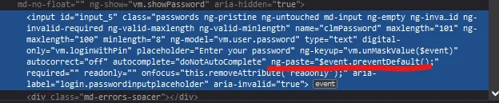

Dear Mauritius Telecom - what's the business decision behind keeping your customers from using password management applications? Blocking to paste a value into your input field(s) isn't considered smart but simply annoying UX/UI principle.

In case that "security" is an argument take note that web scrapers use key inputs and not paste to enter values into an input element. However, these restrictions come at a significant cost. They make the website less usable and more annoying for users. They also drive users to either select poor passwords (which may be more susceptible to password-guessing attacks) or to write down their passwords (potentially enabling roommates and family members to learn the password, leaving everyone back where we started). For users who do trust everyone else who has physical access to their computer, these restrictions strictly decrease security. Perhaps some advice from the National Cyber Security Centre of the UK could help you: https://www.ncsc.gov.uk/blog-post/let-them-paste-passwords or internationally renowned security expert Troy Hunt: https://www.troyhunt.com/the-cobra-effect-that-is-disabling/

It's getting even worse! When you enter, read: type, your password and you know you mistyped something... Surprise! Hitting the Backspace button deletes the complete value previously entered and you are allowed to start from the beginning. Which effectively leads to the situation that your visitors will surely activate the "Show password" option in order to see what they are entering and most probably is going to lead to shorter and easier to type choices of passwords. That's a glorious anti-pattern and decreases security!