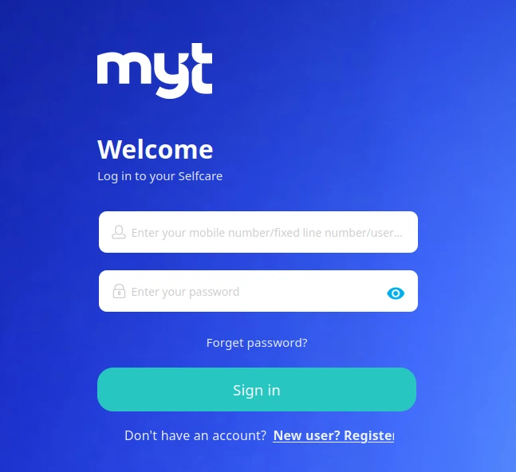
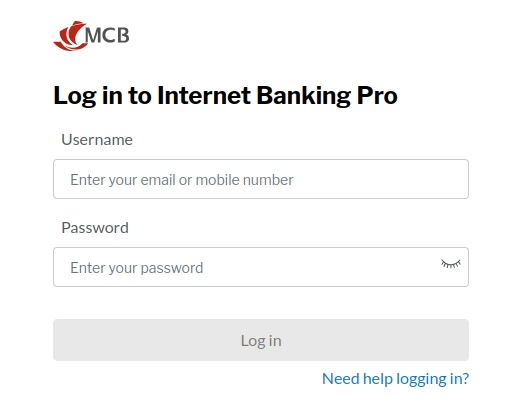

Dear Mauritius Telecom: what was the business decision behind actively preventing your customers from using password management applications? Why disable the paste functionality for password entry?

Blocking users from pasting values into an authentication input field is not an elite security measure. It is a profoundly irritating UX anti-pattern that achieves the exact opposite of its intended goal.

Oh, sorry my dear readers: What am I actually talking about? It's about the [Selfcare portal by Mauritius Telecom](https://selfcare.telecom.mu/)



Unfortunately, the **Enter your password** entry field is blocked to paste in anything. While using a password manager suite, you can simply forget it in this case.

## The Evidence: Anatomy of an Anti-Pattern

Opening browser DevTools on the telecom portal revealed the precise implementation responsible for the friction:


Slightly formatted to improve the readability, and it looks like this:

```html
<!-- The password input on Selfcare portal by Mauritius Telecom -->
<input id="input_5" 
       class="passwords ng-pristine ng-untouched md-input ng-empty ng-invalid" 
       name="clmPassword" 
       maxlength="101" 
       minlength="8" 
       ng-model="vm.user.password" 
       type="text" 
       placeholder="Enter your password" 
       ng-keyup="vm.unMaskValue($event)" 
       autocorrect="off" 
       autocomplete="doNotAutoComplete" 
       ng-paste="$event.preventDefault();" 
       required="" 
       readonly="" 
       onfocus="this.removeAttribute('readonly');" 
       aria-label="login.passwordinputplaceholder">
```

Examining this snippet reveals several layers of defensive over-engineering:

1. **`ng-paste="$event.preventDefault();"`**: The explicit directive that suppresses the browser paste event, dead-ending any attempt to paste from the clipboard or a password manager.
2. **`autocomplete="doNotAutoComplete"`**: A fabricated, non-standard attribute intended to confound browser autofill algorithms.
3. **`readonly="" onfocus="this.removeAttribute('readonly');"`**: A fragile legacy hack that temporarily marks the element read-only until focused, attempting to bypass credential autofill mechanisms.

Rather than using standard web semantics, the form goes out of its way to prevent password managers from doing their job.

## The Backspace Wipe Farce

As if disabling paste were not hostile enough, the portal coupled this restriction with an even more baffling behaviour.

Imagine attempting to type a complex, 24-character generated passphrase by hand. You make a single typo on character 18. Naturally, you tap the `Backspace` key to correct the error.

### Surprise!

The custom keyup handler (`vm.unMaskValue($event)`) completely wipes the entire field. You are forced to start typing again from scratch.

Faced with this punishment, users react in entirely predictable ways:

- They immediately toggle the *"Show password"* control to expose their credentials in plaintext on screen, inviting shoulder-surfing in offices, coffee shops, or shared spaces.
- They abandon complex, high-entropy passphrases entirely in favour of short, predictable words that are easy to type without making typos.

This is a textbook security downgrade caused entirely by hostile interface design.

## The Enterprise Defence: What Architects Think They Are Protecting

To be fair to the engineers who implement these restrictions, blocking paste is rarely done out of pure malice. It usually stems from an instinct toward **pseudo-protection** - the illusion that creating client-side obstacles equates to genuine security.

In corporate committees, this pseudo-protection usually leans on three flawed justifications:

1. **The Shared Workstation / Clipboard Persistence Myth**: The theory goes that on shared family laptops or internet cafe terminals, a password copied to the operating system clipboard remains in memory. If the user forgets to clear the clipboard, the next user can press `Ctrl+V` and retrieve it.
2. **The Rogue Extension Bogeyman**: Concerns that malicious browser extensions or third-party background scripts might read the clipboard buffer during an active browsing session.
3. **The Compliance Checkbox**: Compliance audits or legacy penetration testing checklists that misinterpret "prevent automated credential stuffing" as a mandate to disable client-side clipboard events.

While the concern for shared workstations is understandable, attempting to resolve it in a web form by disabling paste is a fundamentally broken architecture:

- Modern operating systems and mobile devices implement aggressive clipboard timeouts, sandboxing, and explicit user-permission prompts for clipboard access (`navigator.clipboard.readText()`).
- Dedicated password managers bypass the general system clipboard entirely when autofilling, or securely purge the clipboard item after 30 seconds.
- Most importantly, if a workstation is actively infected with host-level malware spying on shared memory, the machine is already completely compromised. Disabling web paste does nothing to prevent memory scrapers, keyloggers, or process injectors from capturing the credentials the moment they are typed.

### The Kiosk Irony: Restaurant Tablets and Leaked Email Addresses

The irony of enterprise architects obsessing over "shared workstation clipboard caching" becomes painfully evident when you examine how actual shared devices are managed in everyday life.

Consider a familiar scene across restaurants and cafes: a waiter hands you a tablet to collect customer feedback, ratings, or a loyalty newsletter signup. You tap into the `Email` or `Phone` input field. 

### What happens?

Instantly, the browser displays a convenient dropdown suggestion list revealing the personal email addresses of the last twenty patrons who dined at that table. 

Why does this happen? Because the application developers failed to include the standard `autocomplete="off"` attribute to prevent input history caching, and the venue neglected to run the browser in an ephemeral kiosk or incognito session. That is a genuine, daily privacy leak exposing personal contact details to complete strangers.

Here lies the grand paradox of web security priorities:

- **Where a real shared hardware privacy threat exists** (public restaurant tablets passed from hand to hand), developers omit basic hygiene like `autocomplete="off"`, allowing the browser to cache and broadcast customer emails to every subsequent diner.
- **Where a user is sitting at home on their private personal laptop** logging into their telecom account, enterprise developers invent fabricated junk like `autocomplete="doNotAutoComplete"` and sabotage password managers under the delusional pretence of "protecting shared kiosks".

Pseudo-protection gives organisations a false sense of accomplishment. They spend billable developer hours writing fragile JavaScript event listeners and non-standard HTML attributes, convincing themselves they have fortified their application. In reality, they have merely erected a toll booth that taxes their most security-conscious customers while providing zero defence against actual threats.

## Beyond Mauritius Telecom: A Pervasive Syndrome

While Mauritius Telecom's customer Selfcare portal provided the immediate catalyst for this investigation, let us not pretend MT stands alone in the digital pillory.

This pseudo-protection syndrome is widespread across our local enterprise landscape. Consider another prominent Mauritian institution: the **Mauritius Commercial Bank (MCB)** and their corporate banking portal, **[Internet Banking Pro](https://ibpro.mcb.mu)**.



Where Mauritius Telecom opted for the brute-force sledgehammer, MCB employs a more subtle, yet equally frustrating form of friction. Inspect the DOM on their corporate login screen:

```html
<!-- The password input on MCB Internet Banking Pro -->
<input id="password-field" 
       name="password-field" 
       type="password" 
       autocomplete="off" 
       class="form-control password-input login__input" 
       tabindex="2" 
       placeholder="Enter your password">
```

First, the password input explicitly enforces `autocomplete="off"`: the classic kiosk directive declaring that the machine is shared and untrusted. Why a corporate financial officer sitting at their dedicated company workstation should have their password manager suppressed under the guise of public kiosk security remains unexplained. Meanwhile, the username field omits `autocomplete="username"` altogether, leaving password managers guessing whether it is an email address, phone number, or user handle.

Second, delve into the portal scripts (`common.js`) to observe how form validation is handled:

```javascript
function disableBtn(form, allInputs, btn) {
    form.addEventListener('keyup', function(e) {
        let disabled = false;
        allInputs.forEach(function(input) {
            if (input.value === '' || !input.value.replace(/\s/g, '').length) {
                disabled = true;
            }
        });
        if (disabled) {
            btn.setAttribute('disabled', 'disabled');
        } else {
            btn.removeAttribute('disabled');
        }
    });
}
```

Notice the fatal flaw: the button state validator listens *exclusively* to the keyboard `keyup` event. It does not monitor the standard DOM `input` or `change` events. 

When a finance manager uses Bitwarden, 1Password, KeePass, or Apple Keychain to autofill their corporate credentials, or when they paste the password via the clipboard, **no `keyup` event fires**. The "Log In" button remains completely dead and disabled. The user is forced to click inside the box and tap an arbitrary key (such as space followed by backspace) purely to awaken the JavaScript validator and unlock the submit button.

Internationally, institutions like PayPal, British Airways, and numerous high-street banks spent years battling customer backlash before finally stripping these restrictions from their login forms. Yet here in Mauritius, whether paying an internet bill or managing corporate treasury accounts, customers still find themselves wrestling with portals that treat standard password management software as hostile intrusions.

## The Threat Model Myth: Automated Attackers Do Not Paste

Let us dismantle the security argument from a technical perspective. Why do some teams believe blocking paste stops attackers?

The underlying rationale often cited by enterprise compliance checklists is that disabling paste prevents automated bots and credential-stuffing tools from rapidly inserting compromised password dictionaries.

This assumption betrays a fundamental misunderstanding of automated tooling:

- **Automated bots do not use the clipboard**: Modern scraping and credential-stuffing tools (built on [Puppeteer](https://pptr.dev/), [Playwright](https://playwright.dev/), [Selenium](https://www.selenium.dev/), or [headless Chromium](https://developer.chrome.com/docs/chromium/headless)) do not simulate human `Ctrl+V` shortcuts via operating system clipboards. They inject values directly into DOM properties (`input.value = "secret"`) or dispatch synthetic programmatic events. Disabling the DOM paste event does not deter automated abuse in the slightest.
- **`preventDefault()` stops humans, not scripts**: A simple JavaScript evaluation in headless Chrome bypasses client-side event listeners completely. The event listener only runs when the DOM `paste` event is fired; it does nothing to prevent direct value assignment.

The only demographic actively impeded by `ng-paste="$event.preventDefault()"` is legitimate, security-conscious human beings trying to use password managers.

## The Cobra Effect in Authentication

The British government in colonial India once sought to reduce the population of venomous cobras in Delhi. They offered a cash bounty for every dead cobra delivered to officials. Initially, the strategy succeeded. Soon, however, enterprising locals realised they could breed cobras in captivity solely to kill them and collect bounties. When authorities discovered the scheme and cancelled the reward, breeders released the now-worthless snakes into the wild, resulting in a higher cobra population than when the initiative began.

In economics and systems design, this phenomenon is celebrated as the **Cobra Effect**: an attempted solution that makes the original problem drastically worse due to unintended incentives.

Disabling paste is the digital equivalent of breeding cobras:

- **Users select weaker passwords**: Humans cannot reliably type and memorise 30 characters of pseudo-random entropy across dozens of personal accounts. Denied paste, users default to short, familiar phrases (e.g. `Password2022!`).
- **Users reuse passwords**: If an account requires manual typing every single session, users reuse the identical password they have already memorised for other services. A credential leak on one platform promptly compromises the rest.
- **Users write passwords down**: Frustrated users resort to physical sticky notes attached to monitors or unencrypted plaintext files saved to the desktop.

In attempting to "protect" users from non-existent paste threats, developers actively coerce them into adopting genuinely dangerous security habits.

## The Industry Consensus: Let Them Paste

The recommendation across the global cybersecurity industry is unanimous: allow paste on all authentication fields.

### NIST Special Publication 800-63B
The United States National Institute of Standards and Technology (NIST) explicitly addresses paste functionality in [Special Publication 800-63B: Digital Identity Guidelines (Section 5.1.1.2)](https://pages.nist.gov/800-63-3/sp800-63b.html#memsecretver):

> *"Verifiers SHOULD permit claimants to use 'paste' functionality when entering a password. This facilitates the use of password managers, which are widely accepted to improve password security by enabling users to establish and use higher-entropy passwords."*

### UK National Cyber Security Centre (NCSC)
The UK National Cyber Security Centre published definitive guidance titled [Let Them Paste Passwords](https://www.ncsc.gov.uk/blog-post/let-them-paste-passwords):

> *"Password managers can generate, store, and automatically input long, complex passwords. Blocking paste breaks password managers, encouraging people to write passwords down or reuse simple ones. Sites that prevent pasting are effectively weakening their users' security."*

### Troy Hunt
Renowned security researcher Troy Hunt explored this exact friction in his landmark critique, [The 'Cobra Effect' That Is Disabling Paste on Password Fields](https://www.troyhunt.com/the-cobra-effect-that-is-disabling/):

> *"When you prevent paste, you penalise the very users who are trying to do the right thing by using a password manager. It is security theatre of the highest order."*

### OWASP ASVS & Authentication Guidelines
The Open Web Application Security Project (OWASP) cements this principle as an explicit verification requirement in the [OWASP Application Security Verification Standard (ASVS v4.0, Requirement 2.1.11)](https://github.com/OWASP/ASVS/blob/v4.0.3/5.0/en/0x11-V2-Authentication.md#v21-password-security):

> *"Verify that 'paste' functionality, browser password helpers, and external password managers are permitted."*

Furthermore, the [OWASP Authentication Cheat Sheet](https://cheatsheetseries.owasp.org/cheatsheets/Authentication_Cheat_Sheet.html#password-managers) reinforces this mandate in its guidance on password managers:

> *"Allow users to paste into the username, password, and MFA fields. Some poorly designed security practices attempt to disable copy-and-paste or right-clicking, which interferes with password managers and actually degrades overall security by forcing users to choose weaker, memorable passwords."*

And I'm confident there are many more resources out there on the web telling you similar practices.
## The Modern Fix: Getting Out of the User's Way

Solving this problem requires **writing less code, not more**. For over a decade, frontend engineering suffered from an impulse to micromanage every facet of the user interface with bespoke event handlers. When it comes to authentication, however, the most secure and delightful engineering decision a team can make is simply to step aside and let the browser platform do its job.


On one side, we build an obstacle course of fragile scripts, blocked clipboards, and scattered sticky notes. On the other, clean markup lets the browser and your password manager do what they do best: log you in securely within seconds.

Trust the process!

### The Power of Semantic HTML

Modern browsers are far more sophisticated than the simple document viewers of the 1990s. Today, user agents ship with deeply integrated credential management suites, phishing protection engines, and hardware-backed cryptographic passkey authenticators. 

When developers clutter inputs with non-standard hacks such as `autocomplete="doNotAutoComplete"` or `readonly="" onfocus="this.removeAttribute('readonly');"`, they sever the communication bridge between the browser and these assistive technologies. 

A clean, standards-compliant password input requires remarkably little markup:

```html
<!-- Clean, semantic, accessible login field -->
<label for="current-password">Password</label>
<input type="password" 
       id="current-password" 
       name="password" 
       autocomplete="current-password" 
       required>
```

Behind these few lines of declarative HTML lies a wealth of native browser functionality:

1. **Accessible Association**: The explicit `<label>` tag guarantees that screen readers announce the input accurately and expands the clickable tap target for mobile users.
2. **Explicit Semantic Context**: The `autocomplete="current-password"` attribute signals directly to password managers that this field expects existing account credentials. This eliminates guesswork and enables instant one-tap credential selection menus in Bitwarden, 1Password, Apple Keychain, and Google Password Manager.
3. **Hardware Biometric Integration**: On mobile devices and modern laptops, semantic password inputs enable browsers to offer immediate biometric autofill (Face ID, Touch ID, or fingerprint authentication) without requiring users to type a single character.

### Core Principles for Modern Authentication Forms

To build login interfaces that respect both security and human dignity, frontend engineering teams should adhere to five fundamental principles:

1. **Never Suppress Native Clipboard Events**:  
   Strip all `onpaste`, `ng-paste`, or `preventDefault()` listeners from password, username, and one-time passcode fields. Pasting is not an attack vector; it is the primary bridge through which security-conscious users transfer high-entropy passwords from encrypted vaults into your application.

2. **Use Standard Autocomplete Tokens**:  
   Abandon invented attributes. HTML5 provides an unambiguous, standardised vocabulary for credential fields:
   - Use `autocomplete="username"` on email, phone, and username inputs.
   - Use `autocomplete="current-password"` on sign-in screens.
   - Use `autocomplete="new-password"` on account creation and password-reset forms (which triggers password managers to generate robust random secrets automatically).
   - Use `autocomplete="one-time-code"` on two-factor authentication (2FA) inputs so mobile operating systems can automatically extract SMS or authenticator codes directly into the input.  
   If you are legitimately deploying a shared terminal, public feedback tablet, or ephemeral guest screen, use standard `autocomplete="off"` to instruct the browser not to cache personal data, rather than inventing non-standard junk tokens.

3. **Listen to DOM `input` Events, Not Keyboard `keyup`**:  
   As demonstrated by the MCB Internet Banking Pro investigation, form validation that listens solely to keyboard events (`keyup` or `keydown`) breaks credential managers and clipboard paste. Always bind validation logic to the standard `input` and `change` events. The `input` event fires reliably regardless of whether data arrives via mechanical keystrokes, programmatic autofill, mouse right-click paste, or mobile dictation.

4. **Respect User Edits Without Wholesale Reset**:  
   Never bind destructive JavaScript handlers to editing keys. A user who taps `Backspace` or `Delete` is attempting to correct a typographical slip, not request a total purge of their input string. Forcing an entire re-entry on a single misplaced character breeds profound user resentment.

5. **Permit Generous Password Lengths**:  
   Ensure that frontend `maxlength` attributes and backend database fields permit generous string lengths (at least 128 characters, and ideally 256 or more). Passphrases composed of multiple random words or generated strings from security suites frequently exceed arbitrary legacy limits of 16 or 20 characters. Truncating or rejecting long passwords actively penalises customers who adopt superior security hygiene.

## Key Takeaways

- Disabling paste does not impede credential-stuffing bots; it exclusively penalises legitimate users.
- Forcing users to type credentials manually drives them directly toward weak passwords, password reuse, and insecure storage.
- Password managers represent the single most effective consumer security habit; web applications must work with them, not against them.
- Good security and good user experience are not opposing forces. Eliminating friction in authentication yields stronger security for everyone.

## An Open Appeal to Mauritius Telecom

This brings us full circle to the argument that opened this article.

Mauritius Telecom powers the digital backbone of our island nation. Through residential fibre, mobile infrastructure, and enterprise connectivity, you enable thousands of businesses, families, and developers to participate in the modern digital economy. Your customer Selfcare portal should reflect that same standard of engineering excellence.

To the digital leadership, product teams, and web developers at Mauritius Telecom: please review your Selfcare authentication architecture. 

Retiring these friction-heavy client-side roadblocks requires writing less code, not more:

- **Strip `ng-paste="$event.preventDefault();"`**: Allow your customers to use their password managers freely and securely.
- **Drop `autocomplete="doNotAutoComplete"`**: Replace fabricated, non-standard attributes with standard web tokens (`autocomplete="current-password"`).
- **Remove the `Backspace` field wipe**: Stop punishing customers for correcting an accidental typo.
- **Ditch the `readonly` focus toggle**: Let modern browsers and password manager extensions identify credentials natively without fragile DOM workarounds.

True security is never achieved by making life difficult for the human beings attempting to access their own accounts. Genuine security lives in resilient backend architecture: robust server-side rate limiting, multi-factor authentication (MFA), anomaly detection, and modern passkey support. 

Let the Selfcare portal lead by example in Mauritius by embracing modern web standards and treating password managers as essential allies rather than hostile intrusions. Your customers - and their password managers - will thank you.

---

## Join the Conversation

Have you encountered websites or banking portals that still insist on blocking paste or wiping inputs on typos? What is the most frustrating authentication anti-pattern you have had to battle? Let me know on [X (@JKirstaetter)](https://x.com/JKirstaetter), [BlueSky (@jochen.kirstaetter.name)](https://bsky.app/profile/jochen.kirstaetter.name), or [Mastodon (@JKirstaetter)](https://mastodon.social/@JKirstaetter)!

<small>Picture credits: Generated with Nano Banana 2 / Google Antigravity.</small>