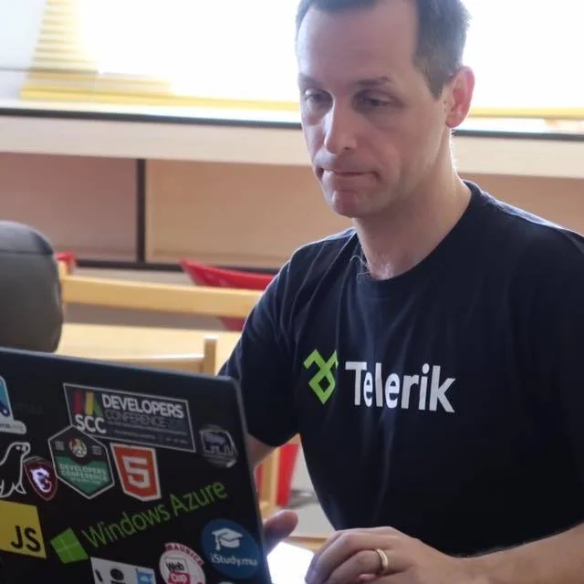
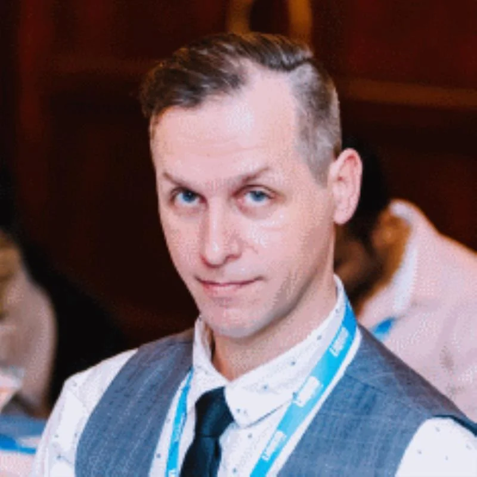

> "The only frontiers are in your mind"

Hi, my name is Jochen Kirstätter, also known as "JoKi". I'm a [senior software crafter](https://github.com/jochenkirstaetter), [blogger](https://jochen.kirstaetter.name), [community founder](xref:mscc), and [speaker](xref:speaking). I have been awarded as [Microsoft Most Valuable Professional](https://mvp.microsoft.com/en-US/MVP/profile/53d40e60-fe70-490e-8e73-2185b648f26f) (MVP) for Developer Technologies and as [Google Developer Expert (GDE) for Cloud and AI](https://g.dev/jkirstaetter). These awards are a recognition of my community contributions, my passion to share knowledge, and my activities to engage with their respective services and products over years.

## Bio

Although living on a tropical island, Jochen Kirstätter is a business owner and entrepreneur in different industry sectors. Mainly operating in the development of tailor-made software solutions since more than 20 years, he is also venturing into the world of cloud computing. You can either meet him at the regular meetups of the [Mauritius Software Craftsmanship Community](https://www.mscc.mu) or reach him easily on X (prev. Twitter) [@JKirstaetter](https://x.com/jkirstaetter), BlueSky [@jochen.kirstaetter.name](https://bsky.app/profile/jochen.kirstaetter.name), and Mastodon [@JKirstaetter](https://mastodon.social/@jkirstaetter).

Jochen is a Google Developer Expert (GDE) for Google Cloud and AI; he is also a Microsoft MVP for Developer Technologies for several years. He founded the now largest IT community in Mauritius, and organises the annual Developers Conference. Following his interest in cross-platform technologies he is also an organiser of the Google Developer Group (GDG) Mauritius.

## Headshot Photo

## Mauritius Software Craftsmanship Community

The [MSCC](xref:mscc) was founded back in May 2013 when my daily job as well as my private life allowed me to have a bit of spare time, and my passion to share knowledge and information with like-minded geeks came together. Since then the community has grown as the largest and most active user group in Mauritius. We organise the [annual Developers Conference](https://conference.mscc.mu/), run monthly [meetings on various topics](https://meetup.com/MauritiusSoftwareCraftsmanshipCommunity/), and constantly encourage young and old people to venture into the world of information technology.

## Google Developer Group Mauritius

The [GDG Mauritius](https://gdg.community.dev/gdg-mauritius/) was an idea that kept me thinking about since 2015. During the first annual Developers Conference I was hoping that there would be other Google geeks to probably kick off a local GDG chapter. Unfortunately, it do not happen back then. Back in June 2017 I applied for and founded the GDG Mauritius given that my interest in Google technologies was ever increasing and I felt the need to balance the emphasis on Microsoft technologies.

## Ways of Contact

I would love it if you would subscribe to [my blog's RSS feed](https://jochen.kirstaetter.name/rss/). I'm also on [X](https://x.com/jkirstaetter), [BlueSky](https://bsky.app/profile/jochen.kirstaetter.name), [Mastodon](https://mastodon.social/@jkirstaetter), [LinkedIn](https://www.linkedin.com/in/jochenkirstaetter/), and [Facebook](https://www.facebook.com/jochen.kirstaetter).

If you just want to email me, go ahead send an email to [jochen@kirstaetter.name]() but be nice and make sure you questioned the interweb a bit before you do.