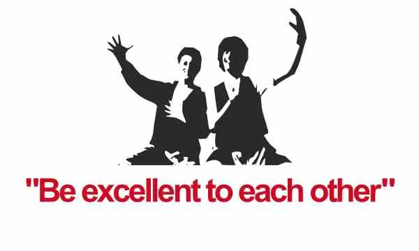
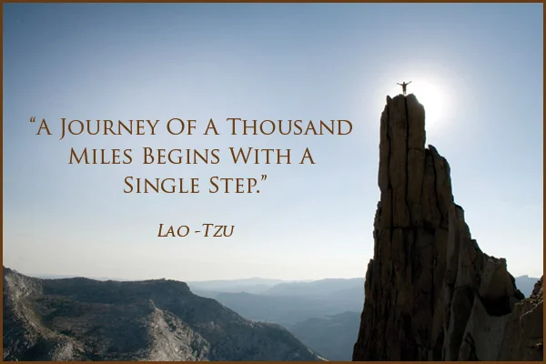
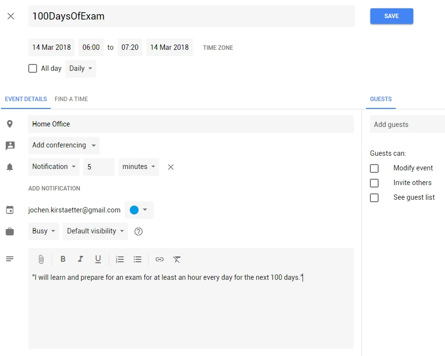

A new adventure is on its way: [#100DaysOfExam](https://www.100daysofexam.com/) which has been inspired by two factors. First, my personal 30-day challenges I did in the past and the concept of [100 Days of Code](http://100daysofcode.com/) by [Alexander Kallaway](https://x.com/ka11away).

Much to my dislike I noticed during the last couple of months (or even years) that there are fewer challenges than in previous times. For example Microsoft's "Know It, Prove It" (KiPi) campaign isn't alive anymore. The KiPi challenge was about watching a curated list of online videos in order to learn (more) about a certain development stack or Microsoft technology. I really enjoyed that challenge several times, and managed to complete them within the given period of 30 days.

## Available resources

Some years back I purchased an annual subscription with Pluralsight given their outstanding course material. Thanks to my active Microsoft MVP award this has been extended generously. Despite easy access to their library of 5,000+ courses I noticed that my visits were irregular and uncoordinated. Most of the time I searched through the video courses because I was looking for a specific technology I was working on.

The Microsoft Virtual Academy (MVA) as well as Microsoft's Channel 9 websites offer a great range of learning material on various topics. Again, I only took advantage of this treasure trove when I needed certain information.

My readers surely have different backgrounds and interest in technologies, and there are so many other great learning platforms available online. Recently, I started to be more active on [edX](https://www.edx.org/). Mainly to educate myself on matters of data science, business intelligence and machine learning. It's great that edX runs a dual approach - accessing the course modules for free and offering the possibility to opt-in for a paid certificate, if needed.

What are the (e)Learning platforms that you are using? It would be great to get a broader overview of what is available and at the same time your recommendations and comments on your suggested resources.

Please use the comment section at the bottom. Much appreciated.

## Add a purpose

I am not sure about your motivation of watching an online video course, for me it is always about to get a better understanding of a selected topic or technology. Most of the time this is induced by the circumstances that I am currently working on some project or have an upcoming requirement. Briefly, it is usually because of professional reasons.

So far, this kind of browsing material has been kind of *chaotic*. Either it happened on short notice or it had a short lifetime expectancy. Nonetheless I gained more knowledge about a technology and I was able to get the job done. Though I have to admit that it didn't feel right this way. It was more like a cliffhanger. Leaving an empty space of information that could have been filled on the one hand, and missing the opportunity to test the acquired knowledge on the other hand.

That's exactly where [#100DaysOfExam](https://www.100daysofexam.com/) comes into play. Here's the core statement of the challenge:

> "I will learn and prepare for an exam for at least an hour every day for the next 100 days."

Define your goal and commit yourself to the challenge. Do some research on the exam topics, collect and bookmark new resources, get your hands wet with some cool tips and tricks. And do it daily.

## "Feel" the challenge

From the first day on you are going to tweet about your progress daily. Using the hashtag [#100DaysOfExam](https://x.com/hashtag/100daysofexam) you are going to report about your activities during the day to others. This way, over time, there will be more participation in this challenge. Perhaps you might find someone else with same or similar goals, and you both team up in a regular learning group.

Even then use Twitter connection between you and other participations to pay it forward. Encourage others, give them feedback where needed, share your resources and knowledge for the greater good. But remember:

  
*Be polite and excellent to each other.*

Recently, I signed up for the [#BlogMore](https://x.com/hashtag/blogmore) section of the [#CNC2018](https://x.com/hashtag/cnc2018) challenge in order to commit myself to write more regularly on this and other blogs. Yes, it was tough at the beginning. Not to ponder about possible topics but simply to find the motivation and actually start typing the content.

The #BlogMore challenge got me in touch with other bloggers via Twitter and a designated group on Facebook. It felt great to read about the musings of others, and to receive the comments of other readers regarding your ideas and experience. After all, it felt good and right to write more...

## How to get started?

Well, I can't tell you...

- You got an exam coming soon?
- You want to dive into a new field of information?
- You always wanted to dig deeper into a certain topic?
- You need motivation through others to stick to the plan?

If there is at least one "Yes" among the answers I would say you are already one third on your way into this challenge.

Now, move over to the [#100DaysOfExam repository on GitHub](https://github.com/jochenkirstaetter/100-days-of-exam/) - either sign up for an account or log in, if you have one - and hit the `Fork` button at the top right, not far from your profile image.

After the repository has been created, navigate to the `Log` file, i.e. mine is here: [https://github.com/jochenkirstaetter/100-days-of-exam/blob/master/log.md](https://github.com/jochenkirstaetter/100-days-of-exam/blob/master/log.md) and then click on the small pencil to `Edit this file`.

Don't be scared, the text syntax is using a technology called [Markdown](https://help.github.com/articles/basic-writing-and-formatting-syntax/) and the syntax isn't too hard to learn. It's just a text-based formatting syntax within the actual content. An application like LibreOffice Writer or Microsoft Word would hide that syntax from you.

Then change the header line and replace `[Your exam goal]` with your own outcome you are looking for. Next, you could either delete the rest of the content in the file, or choose one of the existing *day templates* to start logging your daily progress. To complete the process you would `Commit changes` with a short note and hit the button to save it. And that's it for your first day. Come again tomorrow and report about your learning steps of the day.

## And now?

Stay committed! Check out the [Rules](https://www.100daysofexam.com/rules/) of the #100DaysOfExam challenge and prepare yourself for at least one hour each day for your exam. Block a certain time period in your calendar - make an appointment with yourself!

The notification acts like a daily alarm, too. Just don't ignore it. Need motivation? Browse the hashtag on Twitter... just not for too long. ;-)

And while talking about calendar entries why not fix your exam date already. Give it a special place with highlighted colour.

## Stick to the challenge

I may repeat myself here but that's hopefully okay. Keep your goal in eyesight, stick to the challenge and tweet about your progress. Response from others is likely a reward for you, too. Show yourself (and maybe others) that you are committed to your own personal growth. Prepare for your exam and document your progress.

## You can do this!

I'm really looking forward to see your tweets popping up on my timeline, and I'm going to place my likes from time to time. Guaranteed!

Last but not least: **Sharing is caring!**  
Spread the word about the [#100DaysOfExam](https://www.100daysofexam.com/) challenge even though you might not participate or prepare yourself to pass an exam. Thanks, much appreciated!