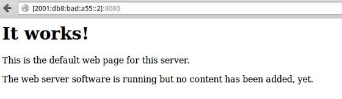

Being able to [run your systems on IPv6](xref:configure-ipv6-on-ubuntu), have [automatic address assignment](xref:dhcpv6-ipv6-in-your-local-network) and the ability to [resolve host names](xref:enabling-dns-for-ipv6-infrastructure) are the necessary building blocks in your IPv6 network infrastructure. Now, that everything is in place it is about time that we are going to enable another service to respond to IPv6 requests. The following article will guide through the steps on how to enable Apache2 httpd to listen and respond to incoming IPv6 requests.

This is the fourth article in a series on IPv6 configuration:

- [Configure IPv6 on your Linux system](xref:configure-ipv6-on-ubuntu)
- [DHCPv6: Provide IPv6 information in your local network](xref:dhcpv6-ipv6-in-your-local-network)
- [Enabling DNS for IPv6 infrastructure](xref:enabling-dns-for-ipv6-infrastructure)
- [Accessing your web server via IPv6](xref:accessing-apache2-web-server-via-ipv6)

**Piece of advice**: This is based on my findings on the internet while reading other people's helpful articles and going through a couple of man-pages on my local system.

## Surfing the web - IPv6 style

Enabling IPv6 connections in Apache 2 is fairly simply. But first let's check whether your system has a running instance of Apache2 or not. You can check this like so:

```
$ service apache2 status 
Apache2 is running (pid 2680).
```

In case that you got a 'service unknown' you have to install Apache to proceed with the following steps:

```
$ sudo apt-get install apache2
```

Out of the box, Apache binds to all your available network interfaces and listens to TCP port 80. To check this, run the following command:

```
$ sudo netstat -lnptu | grep "apache2\W*$"
tcp6       0      0 :::80                   :::*                    LISTEN      28306/apache2
```

In this case Apache2 is already binding to IPv6 (and implicitly to IPv4). If you only got a `tcp` output, then your HTTPd is not yet IPv6 enabled.

Check your Listen directive, depending on your system this might be in a different location than the default in Ubuntu.

```
$ sudo nano /etc/apache2/ports.conf

# If you just change the port or add more ports here, you will likely also
# have to change the VirtualHost statement in
# /etc/apache2/sites-enabled/000-default
# This is also true if you have upgraded from before 2.2.9-3 (i.e. from
# Debian etch). See /usr/share/doc/apache2.2-common/NEWS.Debian.gz and
# README.Debian.gz

NameVirtualHost *:80
Listen 80

<IfModule mod_ssl.c>
    # If you add NameVirtualHost *:443 here, you will also have to change
    # the VirtualHost statement in /etc/apache2/sites-available/default-ssl
    # to <VirtualHost *:443>
    # Server Name Indication for SSL named virtual hosts is currently not
    # supported by MSIE on Windows XP.
    Listen 443
</IfModule>
<IfModule mod_gnutls.c>
    Listen 443
</IfModule>
```

Just in case that you don't have a `ports.conf` file, look for it like so:

```
$ cd /etc/apache2/
$ fgrep -r -i 'listen' ./*
```

And modify the related file instead of the ports.conf. Which most probably might be either `apache2.conf` or `httpd.conf` anyways.

Okay, please bear in mind that Apache can only bind once on the same interface and port. So, eventually, you might be interested to add another port which explicitly listens to IPv6 only. In that case, you would add the following in your configuration file:

```
Listen 80
Listen [2001:db8:bad:a55::2]:8080
```

But this is completely optional...  
Anyways, just to complete all steps, you save the file, and then check the syntax like so:

```
$ sudo apache2ctl configtest
Syntax OK
```

Let's apply the modifications to our running Apache2 instances:

```
$ sudo service apache2 reload
 * Reloading web server config apache2
 ...done.

$ sudo netstat -lnptu | grep "apache2\W*$"
tcp6       0      0 2001:db8:bad:a55:::8080 :::*                    LISTEN      5922/apache2
tcp6       0      0 :::80                   :::*                    LISTEN      5922/apache2
```

There we have two daemons running and listening to different TCP ports.

Now that the basics are in place, it's time to prepare any website to respond to incoming requests on the IPv6 address. Open up any configuration file you have below your sites-enabled folder.

```
$ ls -al /etc/apache2/sites-enabled/
...
$ sudo nano /etc/apache2/sites-enabled/000-default

<VirtualHost *:80 [2001:db8:bad:a55::2]:8080>
        ServerAdmin webmaster@ios.mu
        ServerName server.ios.mu
        ServerAlias server
```

Here, we have to check and modify the VirtualHost directive and enable it to respond to the IPv6 address and port our web server is listening to. Save your changes, run the configuration test and reload Apache2 in order to apply your modifications. After successful steps you can launch your favourite browser and navigate to your IPv6 enabled web server.

  
*Accessing an IPv6 address in the browser*

That looks like a successful surgery to me...

**Note**: In case that you received a timeout, check whether your client is operating on IPv6, too.