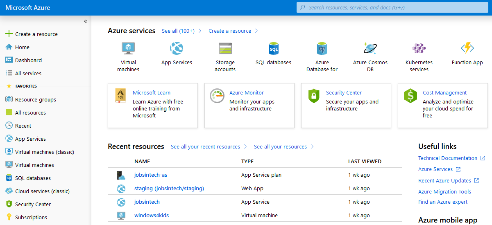
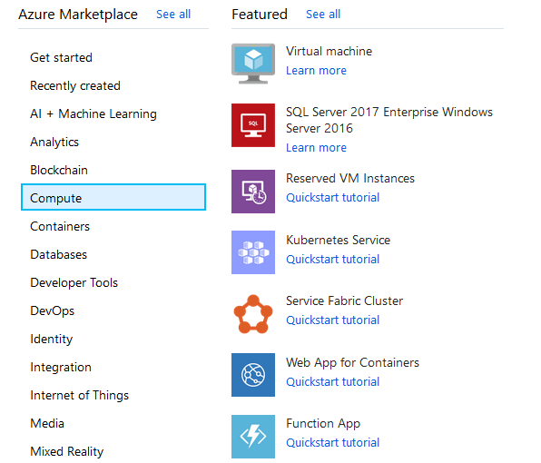
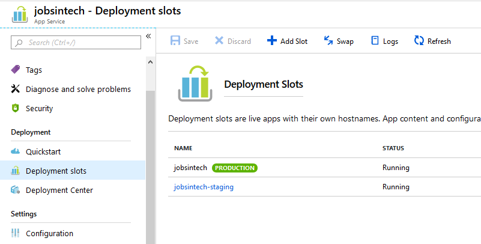

As an active member in the IT communities of Mauritius it seizes to amaze me to see the increasing number of events and activities happening. Some of the local universities started to look out for guest lecturers to share their professional experience with their students.

Mid of August I received an email from the [African Leadership University](https://www.alueducation.com/campuses/alc-mauritius/) to participate as a guest speaker in their adult training program called [Africa Industrial Internet Programme (AIIP)](https://www.alueducation.com/aiip/). Particularly, to talk during one of their webinar intensives.

> This is a year-long post-graduate programme developed by ALU and powered by GE to address the demand for a digital-savvy workforce in the increasingly data-driven industrial organisations through offering modules in machine learning, big data analytics, the Industrial Internet of Things (IIoT) and cloud-based application development.

That webinar is for the scholars who are going to [start the Application Development module](https://www.opportunitiesforafricans.com/ge-africa-alu-africa-industrial-internet-program-2019/). The students will have to use the skills they have learned in Machine Learning and Big Data to build applications. The targeted cloud computing platform would be Microsoft Azure.

These intensives are usually 90 mins long and highly interactive. My session was centred around the following topic:

- Application Development - deploying machine learning, development on Cloud platforms such as Azure, DevOps etc.

Wonderful, and surely an area to share quite some information with the attendees.

## Running the webinar

Unfortunately due to a little misunderstanding on my side, I initially drove to the African Leadership Campus (ALC) where we hosted the DevFest Mauritius 2018. But I was expected at the premises of the university that resides in the former facilities of a sugar cane factory. Luckily, both locations are less than 2 minutes drive away from each other and we could start the session within the academic quarter.

The AIIP uses Zoom to run their webinar intensives. Good, I have already attended a few sessions on Zoom, mainly as attendee, and with the client application installed I managed to quickly join. Shivanand introduced me quickly to the approximately 35 participants and after a few questions to the audience I launched into [Microsoft Azure](https://azure.microsoft.com/). As it turned out most attendees did not have access to Azure (yet) I showed them briefly the sign up process for the free account.

Then, I logged into the [Azure portal](https://portal.azure.com/) using my credentials and gave a short tour of the Home page and the Dashboard area. One or two questions came up in regards to the customisation and management of the dashboard which is very flexible and adjustable.

Next, I moved forward to `Create a resource` from the sidebar navigation and showed the various options in the `Compute` section of the Azure Marketplace, as shown below.

By searching the Marketplace I made it obvious that there are way more possibilities offered than just the featured ones.

Starting with a familiar approach of running a virtualized environment in Azure I guided the attendees through the steps of creating a VM with an OS of their choice. Of course, the VM had to be located in the newly available region South Africa North. However, I also explained that certain capacities, sizes of VMs, or other enhanced features can have regional restrictions. Those limits are bound to the capabilities the selected data centre(s) are able to offer.

Speaking of VM size we clicked on `Change size` to open the blade with the table of potential options. I also mentioned that the family of a VM defines the ratio between vCPUs, RAM and data disks. More details on the estimated monthly cost can be found in the [pricing calculator](https://azure.microsoft.com/pricing/calculator/) of Azure products.

While the new VM was provisioned I used the waiting time to show some additional configuration settings of an existing VM. Here, I explained that it is probably better to allocate a DNS name to the VM. Using a DNS name makes it easier to access the instance, like ie. via Remote Desktop Protocol (RDP) or HTTP/S if a web server is running.

The activation of the auto-shutdown feature is highly recommended in case that you would run a VM only for a few hours. One of my VMs is specifically configured to [give my children easy access to Microsoft Office](https://jochen.kirstaetter.name/azure-for-school/) and Paint.net from their Linux-based laptop. That VM is configured to shutdown automatically at 19:00 hrs every day because of dinner time, and to avoid cutting a whole into my wallet.

A VM in the cloud might be easiest option to start with but moving forward I explained the participants the advantages of using an Azure App Service as Platform-as-a-Service (PaaS) to deploy an application. App Service has different technology stacks and corresponding runtime versions to choose from.

Using an existing app service I covered the general settings and answered a few questions. Then I explained the ability to set up own custom domains for an app service. Following some questions regarding scaling we had a look at the App Service plan and how both options - Scale up and Scale out - can be handled. Next, I demonstrated the use of Deployment slots and how easy it is to have multiple variants of the same application at your finger tips.

As I was about to move on to the next option of application development on Azure we got surprised by power outage in the building, interestingly the Wi-Fi and internet connection remained active, followed by fire alarm. Luckily, it was a false alarm but somehow the flow of the webinar had been interrupted harshly.

The webinar attendees had some more questions on the Azure services and features shown so far, and we decided to elaborate a little bit more in those areas.

## More options to deploy to Azure

The following options were not part of the webinar but I promised the attendees that I would write them down in this blog article. Azure has more than 100 services in the Marketplace. In regards to application development, deployment of machine learning, cognitive services, DevOps, and so on I am going to give a small selection here:

- [Logic App](https://docs.microsoft.com/en-us/azure/logic-apps/quickstart-create-first-logic-app-workflow)
- [Azure Functions](https://docs.microsoft.com/en-us/azure/azure-functions/)
- [Azure Kubernetes Service (AKS)](https://docs.microsoft.com/en-us/azure/aks/kubernetes-walkthrough-portal)
- [DevOps Project](https://docs.microsoft.com/en-us/azure/devops/deploy-azure/index?view=azure-devops)
- [Azure Bot Service](https://docs.microsoft.com/en-us/azure/bot-service/abs-quickstart?view=azure-bot-service-4.0)
- [Language Understanding (LUIS)](https://docs.microsoft.com/en-us/azure/cognitive-services/luis/)

Talking about all those services within a 90-minute webinar isn't sufficient. Each individual service has enough material to talk about and run demos for days.

I would assume that it was more important to the webinar attendees to have a chance to ask their questions on everything Azure at this stage than to get a detailed insight of a particular service.

## Additional learning resources

To wrap up this article and the AIIP webinar on application development on Azure I would like to mention the following platforms. They provide free access to products and services by Microsoft which will be handy for the current module:

[Visual Studio Essentials](https://visualstudio.microsoft.com/dev-essentials/) provides you with downloads of latest versions Visual Studio and Visual Studio Code as well as few other perks after you signed up with your Microsoft account.

[Azure DevOps](https://dev.azure.com/) gives you access to a full-featured source code version control system (based on git including private repositories), the ability to track your work with modern project management options like Kanban boards, backlogs, team dashboards, etc., an open platform for continuous integration and continuous deployment (CI/CD) of your applications, and free minutes for automatic test plans.

[Microsoft Learn](https://docs.microsoft.com/en-us/learn/) has free online training courses on Azure to offer. There are various Azure learning paths available. The content on Learn is also focused towards the new role-based certifications on Azure.

[Free Pluralsight courses](https://www.pluralsight.com/partners/microsoft/azure) in partnership with Microsoft. Using this offer gives you access to over 40 high quality video courses on Pluralsight. This specialised subscription is valid until end of 2024. And the recently added Role IQ assessments are a good preparation for all role-based Azure certifications.

[Microsoft Hands-on Labs](https://www.microsoft.com/handsonlabs/selfpacedlabs) lists over 150 self-paced labs to explore and practice with. Acquire the cloud skills you need, at your own pace. Enjoy hands-on learning on your schedule with our free, self-paced labs, and keep your cloud knowledge fresh.

<small>Image credit: Headway</small>
