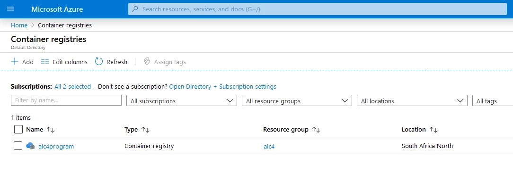
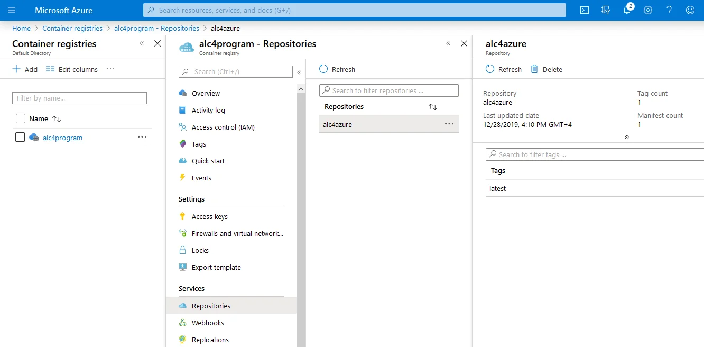
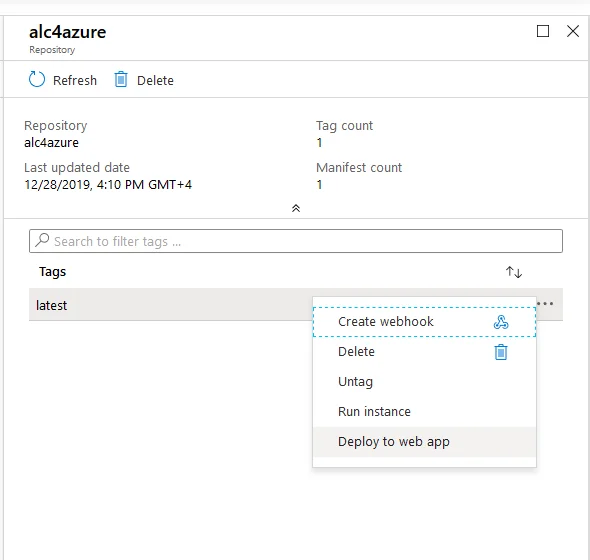
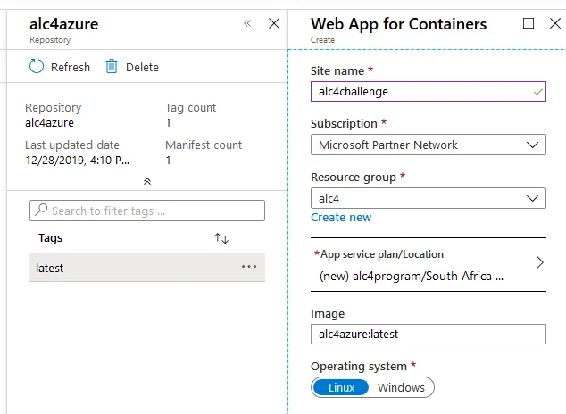
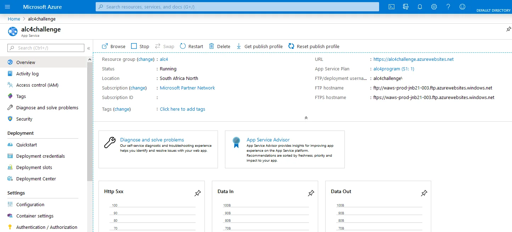
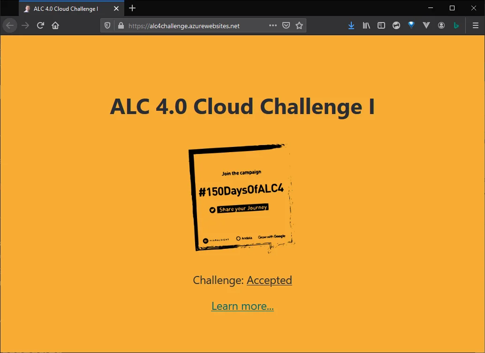

After completing a challenge to create a React application and experimenting with different ways on how to deploy and operate it on the Google Cloud Platform (GCP) I was wondering about how this would possibly work on Microsoft Azure.

The following article describes how to take the same React application as discussed in [Create React App (ALC 4.0 Cloud Challenge I)](xref:alc4-cloud-react) and to deploy it as an App Service on Microsoft Azure using a Docker image. You are going to build a new container and push it to the Azure Container Registry (ACR).

First, if applicable, log into your Azure account.

```
> az login
```

To keep the Azure subscription nice and tidy you should create a new resource group for all resources created as described below. Run the following command to create a new group called `alc4` in the location of South Africa.

```
> az group create -l southafricanorth -n alc4
```

You might choose a location closer to you or even use an existing resource group at all. The choice is yours.

## Create the Azure Container Registry

Now, you create an [Azure Container Registry](https://azure.microsoft.com/services/container-registry/) (ACR) to push your Docker images to.

> A registry of Docker and Open Container Initiative (OCI) images, with support for all OCI artifacts.

The following command creates an ACR called `alc4program` and associates it with the newly created resource group from the previous step.

```
> az acr create --name alc4program --resource-group alc4 --sku standard --admin-enabled true
```

**Note:** The registry name must be unique within Azure, and contain 5-50 alphanumeric characters.

Perhaps you should check the features and differences of the various [Azure Container Registry SKUs](https://docs.microsoft.com/azure/container-registry/container-registry-skus) and adjust the above command accordingly. Also, for pricing information on each of the Azure Container Registry SKUs, see [Container Registry pricing](https://azure.microsoft.com/pricing/details/container-registry/).



You find a lot more information about the [Azure Container Registry](https://azure.microsoft.com/services/container-registry/) in the [official documentation](https://docs.microsoft.com/azure/container-registry/).

## Build an image (of React app)

With the container registry in place you run the `az acr build` command to build an image of the existing React application. After successful completion the image is pushed to the registry.

```
> az acr build --file .\Dockerfile --registry alc4program --image alc4azure .
```

**Note:** The `.` at the end of the command is essential and sets the location to the current directory.

Building the image for Azure Container Registry is somehow identical to [Working with Cloud Build](xref:alc4-cloud-build) on the Google Cloud Platform. One command that does all the hard work for you.



It takes a few minutes to complete the build and push it to the ACR. Maybe time for a little tea break.

## Deploy to web app

Navigate to your Container registry on Azure and choose `Services` &gt; `Repositories` to access the newly created Docker image. Select the image to open the details blade.

In the extended dropdown menu choose the entry `Deploy to web app` to create a new app service using the container of the React application, as shown below.



This opens the blade `Web App for Containers` and you specify a few attributes, like site name, resource group, location and operating system, etc., about how to deploy the container as an app service in Azure.



Click on the `Create` button and wait until the web app has been commissioned. A notification is going to inform you as soon as the web app has been fully deployed and accessible via the internet.

Open the App Service resource and check the `Overview` information. The `Status` field indicates the current state of your web application.



Click on the link provided in the `URL` field to open a new browser tab and visit your recently created web application.



The Azure App Service is comparable to the features of the Google Cloud App Engine environments. Whether it's Standard or Flex would mainly depend on your choice of runtime.

However, given above described simplicity of deploying the container image as a web application it feels a bit more like [Using Google Cloud Run](xref:alc4-cloud-run) compared to App Engine.

## Azure App Service has HTTPS built-in

Just like Cloud Run, each Azure App Service gets an out-of-the-box stable HTTPS endpoint, with TLS termination handled for you.

## Using your own domain

You might have seen that the auto-generated URL App Service allocates to your service isn't the most user-friendly. Conveniently, App Service offers custom domains out-of-the-box.

<small>Image credit: Xavier Coiffic</small>
