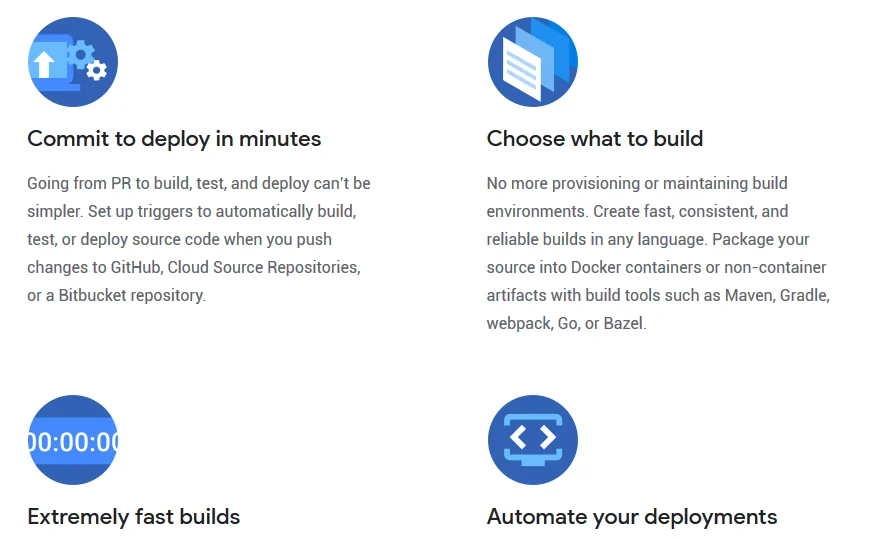
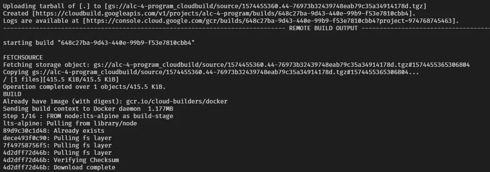
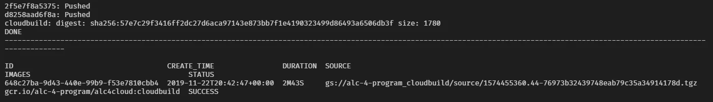
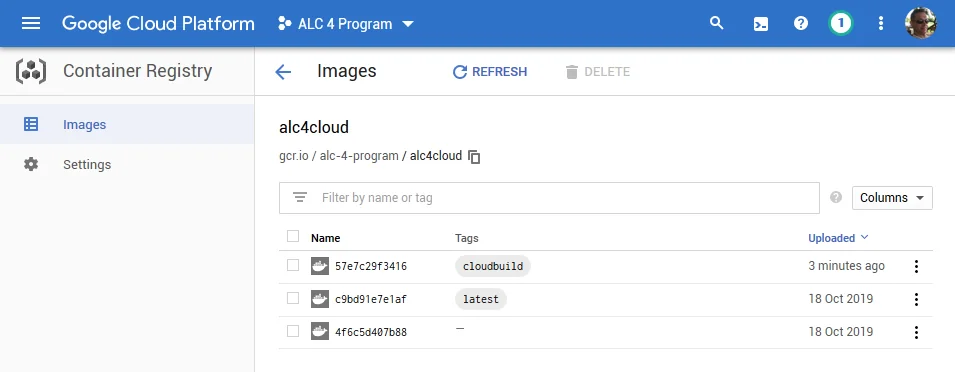
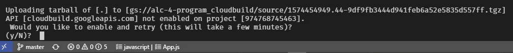
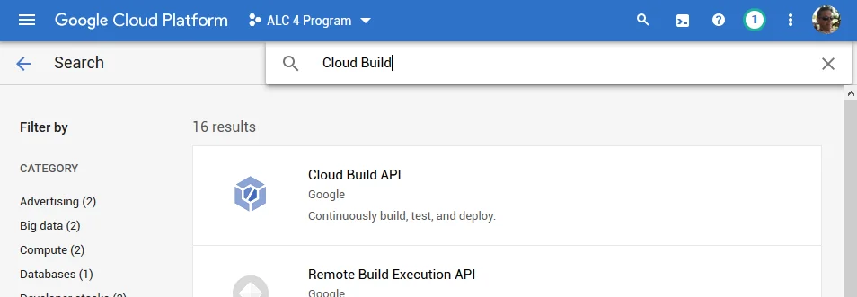
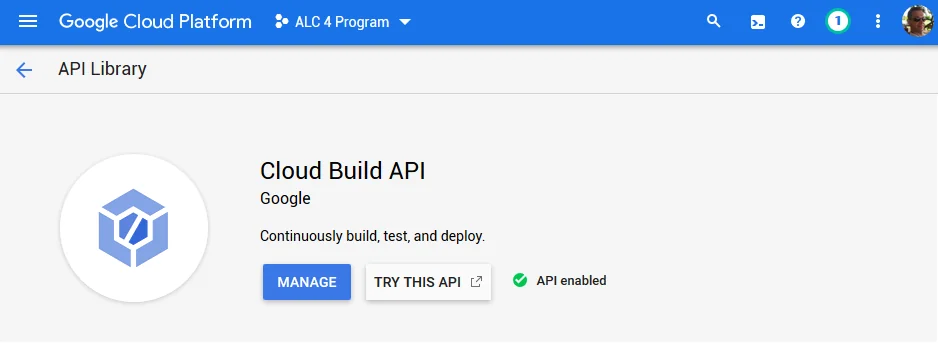
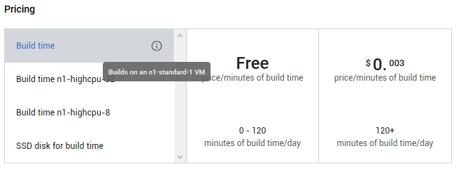

This article has been inspired by a number of conversations in the ALC 4.0 program about the problems some scholars were facing while trying to build the Docker image of the React app on their local machine.

Particularly learners that are still running a machine on either Windows 7, Windows 8.x or the Home edition of Windows 10 seem to have trouble using Docker. The latest Docker Desktop requires to run on Windows 10 Professional, if I'm not completely mistaken. Older versions of Windows would need Docker Toolbox which isn't maintained well anymore.

Some suggested to use Google Cloud Shell for development, for building and deployment of the image to a container registry. Which works nicely. However it requires to be online. This might incur unwanted cost based on bandwidth and data transfer volume.

Using Google Cloud Build seems to be a perfect fit to reduce the cost of being online and being independent of own hardware constraints.



## Google Cloud Build

Cloud Build is a service on the Google Cloud Platform that offers you to continuously build, test, and deploy. And best of all, it also works on-demand. Here's the official description.

> Cloud Build, Google Cloud’s continuous integration (CI) and continuous delivery (CD) platform, lets you build software quickly across all languages. Get complete control over defining custom workflows for building, testing, and deploying across multiple environments such as VMs, serverless, Kubernetes, or Firebase.

Get more information about [Cloud Build](https://cloud.google.com/cloud-build/?hl=en_GB&_ga=2.235677953.-1649613044.1542902327) on their website.

## Submit to Cloud Build

All steps to prepare the local development environment to create a Docker image are identical to the instructions described in [Working with Docker (ALC 4.0 Cloud Challenge I)](xref:alc4-cloud-docker).

But instead of building the docker image locally or in Cloud Shell you would submit your work to Cloud Build with the following command.

```
> gcloud builds submit -t gcr.io/alc-4-program/alc4cloud:cloudbuild .
```

That's it...

The `gcloud builds submit` command looks a bit like a combination of `docker build` and `docker tag` as used in the referred blog article:

```
> docker build -t alc4cloud .
> docker tag alc4cloud gcr.io/alc-4-program/alc4cloud
```

The command syntax is thoroughly described in the reference section on [gcloud builds submit](https://cloud.google.com/sdk/gcloud/reference/builds/submit).

As soon as you submit your work to Cloud Build you should see the following output, of course project ID and build IDs will be different.



The submission process is dependent on the complexity of your `Dockerfile` build instructions and your mileage may vary. The image build of the React app takes approximately one minute. At the end you should see a few lines ending in `Pushed` and a summary of the Docker image being uploaded to Container Registry.



## Congrats!
You successfully submitted the React project.

Navigate to Container Registry &gt; Images in the Cloud Console and have a look at the details of the image. You should a similar overview like below.



Now, your docker image is ready to use in Kubernetes or App Engine Flex environment. Continue the journey and deploy to [Google Kubernetes Engine](xref:alc4-cloud-k8s).

Don't forget to check out the [Cloud Build documentation](https://cloud.google.com/cloud-build/docs/) for more how-to guides and concepts.

## Enable Cloud Build API

Take note that the Cloud Build API is not enabled by default in your GCP project. If you get the following response on execution of the `gcloud builds submit` command the API is not enabled.



Confirm the question with `Y` and wait as instructed to retry the submission.

Otherwise, you can enable the API yourself in Cloud Console as described below. However, before you enable the API for Cloud Build make sure that billing is enabled for your Google Cloud Platform project.

Navigate to APIs & Service &gt; Library in the sidebar menu. Then search for `Cloud Build` and review the results shown.



Chose `Cloud Build API` and then enable the API in the following screen. After a short while of waiting you should see the following status.



Now, retry the submission and watch the docker image being generated and pushed to Container Registry.

## Pricing of Cloud Build

Google Cloud Platform provides a generous free tier to work with Cloud Build.



> Say goodbye to managing your own build servers with 120 free build-minutes per day and up to 10 concurrent builds included.

Working on a small project like the React app it seems to be a no-brainer to use Google Cloud Build to *outsource* the image building process completely. Let the machines do the hard work and save yourself CPU time on your computer.

Let me know in the comments below how smart you are using Cloud Build, and maybe share some build recipes with other readers.

<small>Image credit: Chitto Cancio</small>