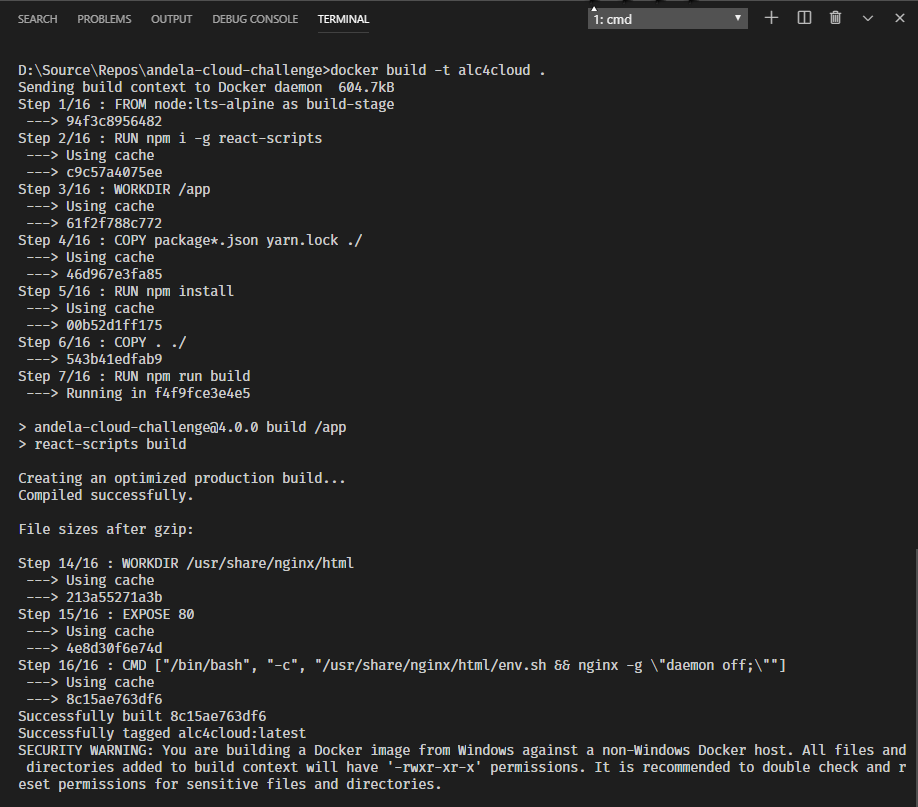
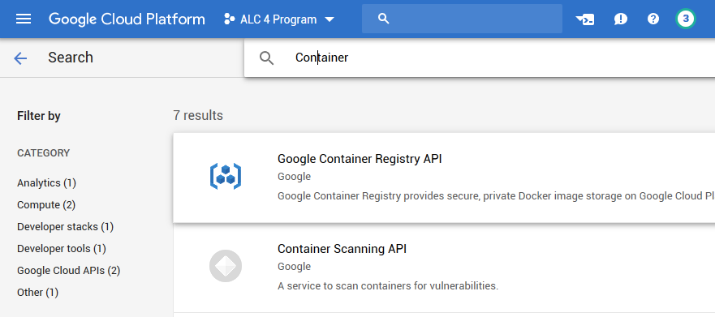
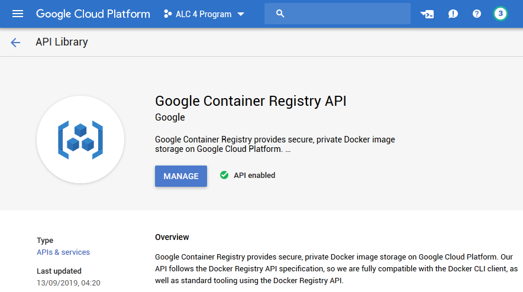
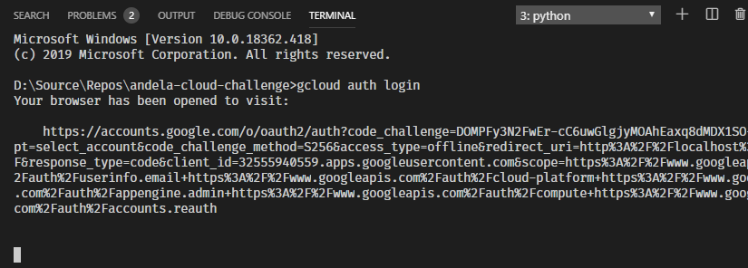
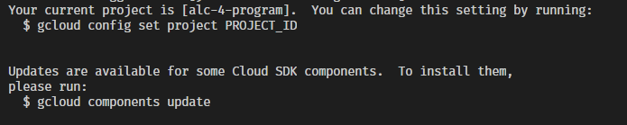
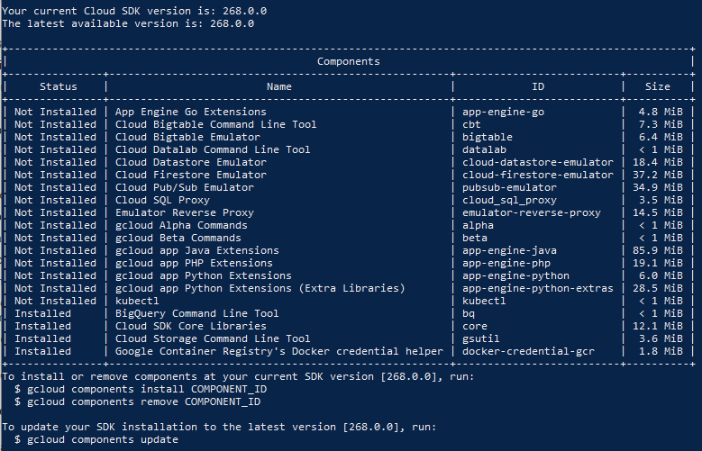
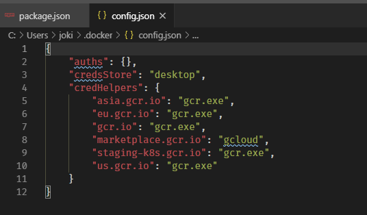
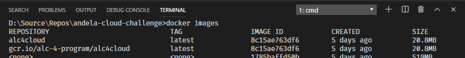
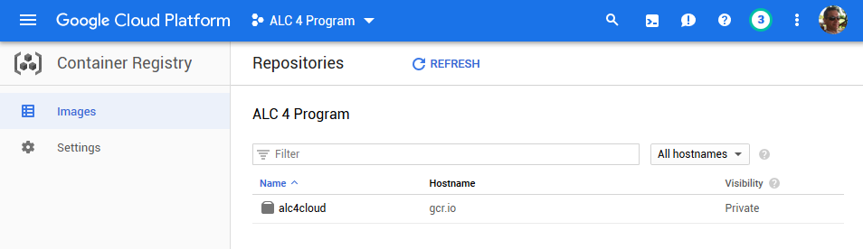
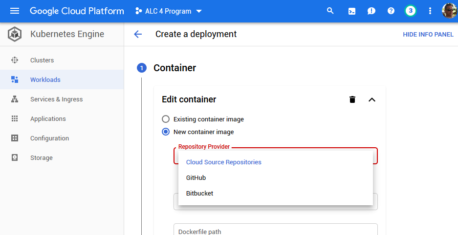

Containerising and pushing a previously created React application is the second part of the ALC 4.0 Cloud Challenge I.

The following instructions are agnostic to the referred web application however probably you might like to have a read about how to [Create an React App](https://jochen.kirstaetter.name/alc4-cloud-react/), if you're not familiar with the React app.

## Pre-requisites #1 - Docker

Depending on your hardware and operating system you need to have virtualisation enabled and a recent version of [Docker](https://www.docker.com/) installed.

> Docker provides a way to run applications securely isolated in a container, packaged with all its dependencies and libraries.

### Windows

I'm using Windows 10 Professional and therefore [Docker Desktop for Windows](https://www.docker.com/products/docker-desktop) but the instructions shall work on Linux and macOS the same way. You can check for the installed version of Docker in PowerShell or command prompt like this:

```
> docker -v
Docker version 19.03.4, build 9013bf5
```

Most probably your version information might be different. Full installation guide on Windows can be found in the official Docker Documentation: [Install Docker Desktop on Windows](https://docs.docker.com/docker-for-windows/install/).

### Linux

The Docker extension for Visual Studio Code has a nice piece of advice: On Linux, you must also follow the steps in “Manage Docker as a non-root user” from [Post-installation steps for Linux](https://aka.ms/AA37yk6) because VS Code runs as a non-root user.

There are other interesting sections in the above linked URL. Surely worth to visit the page and make some adjustments to your Linux system running Docker.

## Create Dockerfile

Now, back to Visual Studio Code and the existing React app. In the root folder of the project you create a new file called `Dockerfile`. Add the following content to it:

```
# build stage
FROM node:lts-alpine as build-stage
WORKDIR /app
COPY package*.json yarn.lock ./
RUN npm install
COPY . ./
RUN npm run build

# production stage
FROM nginx:stable-alpine as production-stage
COPY --from=build-stage /app/build /usr/share/nginx/html

EXPOSE 80

CMD ["nginx", "-g", "daemon off;"]
```

This `Dockerfile` defines a multi-stage build which uses two individual images, we call them *stages* here. The first stage, called `build-stage` is exclusively used to create a fresh environment from scratch for the React application whereas the `production-stage` defines the actual Docker image we are going to use later in Kubernetes.

### The build-stage

The build stage pulls an [existing image from docker hub](https://hub.docker.com/_/node/) that is specialised for the execution of Node.js code. Here, a long-term support (LTS) version of [Alpine Linux](https://alpinelinux.org/) with minimal Linux environment is used.

The build stage is divided into two steps - installation of dependencies and the actual project build. This is similar to the process of creating the React app and then generating a production version.

First, we copy the `package.json` and the `yarn.lock` from our React project folder to the file system inside the Docker image. Then we resolve all necessary dependencies for the React app by calling the `npm install` command.

Second, we transfer all remaining files from the React project folder into the image and then trigger the production build of our React app by calling `npm run build` to complete the build stage.

### The production-stage

For this stage we choose another docker image with built-in web server `nginx` to deliver our React app. Because all generated artefacts from the `npm run build` are found in the build-stage we are now copying the content of the newly created folder `build` into this image. The target folder `/usr/share/nginx/html` is the default location specified in the nginx web configuration.

We open port 80 (HTTP) on the Docker image for external access. Maybe think of it like a minimal firewall. And finally, we instruct the production stage to execute the nginx web server and listen to incoming connections on the exposed port 80.

Consult the Docker Documentation for more information about the syntax and features of [Dockerfile](https://docs.docker.com/engine/reference/builder/).

## Use of .dockerignore

To make your build context as small as possible add a `.dockerignore` file to your root directory of the React folder and copy the following into it. This helps to avoid unnecessarily sending large or sensitive files and directories to the Docker daemon and potentially adding them to images.

```
.git
node_modules
build
```

Obviously, we do not want to have all information about the git repository inside the image. And as explained in the previous paragraph the React app is always build from scratch. Hence, we can exclude all node modules that `npm install` takes care of, and the build folder is newly generated on each run of the `npm run build` statement.

Refer to the official documentation to learn more about [.dockerignore](https://docs.docker.com/v17.09/engine/reference/builder/#dockerignore-file).

## ‍Build docker image

Now, the setup is ready to actually build a Docker image of the React app. Execute the following command in the root directory of the project.

```
> docker build -t alc4cloud .
```

This might take a while depending on your machine. Maybe time to have a break.

The switch `-t` gives the image a name and optionally a tag, using the format `name:tag`. In our case we specify a name only. In absence of a tag value Docker automatically uses `latest` as tag.



Other command switches and more details are described in the Docker reference documentation: [Build an image from a Dockerfile](https://docs.docker.com/engine/reference/commandline/build/).

## Minor troubleshooting on Docker for Windows...

A word of caution. I was not able to complete the build-stage due to failed execution of the RUN statements, particularly `react-scripts` couldn't be found. In case you run into same trouble you need to install react-scripts globally to resolve this issue.

Modify the `Dockerfile` by adding the installation into the build-stage right after you pulled the image from the repository.

```
# build stage
FROM node:lts-alpine as build-stage
RUN npm i -g react-scripts
WORKDIR /app
COPY package*.json yarn.lock ./
RUN npm install
COPY . ./
RUN npm run build
```

This worked for me. The production-stage remains unchanged.

## Run docker image

After successful execution of `docker build` you should spin up the generated image locally to verify that it works as expected.

```
> docker run -p 8080:80 --name alc4_localtest alc4cloud
```

This is going to run the generated production-stage with the name:tag that you specified in the build command earlier, here `alc4cloud`. The additional switches allow you map the exposed port 80 of the docker image to an unprivileged port, here 8080 on your host machine. Meaning, that you can open your browser and navigate to the following URL.

```
http://localhost:8080
```

The command option `--name` assigns a name to your container instead of getting a randomly generated one.

See reference entry [Run a command in a new container](https://docs.docker.com/engine/reference/commandline/run/) in the Docker documentation for more details.

### Other practical Docker commands

To see a list of available images on your machine or any repository ([docker images](https://docs.docker.com/engine/reference/commandline/images/)).

```
> docker images
```

List the containers running on your host system ([docker ps](https://docs.docker.com/engine/reference/commandline/ps/)).

```
> docker ps
```

You can add the option `-a` to see all containers, not just running ones.

And to stop one or more running containers ([docker stop](https://docs.docker.com/engine/reference/commandline/stop/)).

```
> docker stop alc4_localtest
```

If you are happy with the outcome of the container it is time to push the React image to an online repository.

## Pre-requisites #2 - Google Cloud Platform

Install the [Google Cloud SDK](https://cloud.google.com/sdk/) on your machine to be able to interact with Google Cloud Platform through the command-line interface (CLI). The Cloud SDK is the professional way to use [Google Cloud Platform (GCP)](https://console.cloud.google.com/) and it is essential to run repetitive and automated tasks.

For the following steps log into the [Google Cloud Console](https://console.cloud.google.com/).

### Enable billing

If not already done, make sure that Billing is enabled in your account. This is needed to use certain services like Google Kubernetes Engine.

### Create a project

Optionally, you can create a designated project in your GCP account used for the containerised deployment of the React app. It is good practice to keep resources isolated from each other instead of having to deal with a little *pool of chaos*.

### Enable Google Container Registry API

The API for the Container Registry is not enabled by default. In the main menu choose `APIs & Services` &gt; `Library` and search for `Container`.



On the next page make sure that the right GCP project is active and click on `Enable`.



With the Google Container Registry API enabled you can now use the Docker CLI client to manage your images on GCP.

## Connect to Google Cloud Platform

The ALC 4.0 Cloud Challenge I specification mentions to use Docker Hub.

First, I do not have an account on Docker Hub and I'm (currently) not interested to create one either. And second, this whole study track is all about Google Cloud Platform. So, let's use the Google Container Registry (GCR) instead.

Either you open the built-in terminal in Visual Studio Code or you use a terminal / command prompt for the next commands. To use the command-line interface for Google Cloud Platform products and services you have to authenticate yourself first.

```
> gcloud auth login
```



This opens your browser and you should log into your Google Cloud account. Confirm the consent dialog to grant certain permissions to the Google Cloud SDK and click on `Allow`.



Review the currently active project and maybe change project context, if needed.

```
> gcloud config set project alc-4-program
```

Also keep an eye for any other information. Above you can see that updates for some Cloud SDK components are available and how to update them locally.

Next, we need to configure access to the Google Container Registry. There are multiple [Authentication methods](https://cloud.google.com/container-registry/docs/advanced-authentication) available. Following are two options described. For the remaining instructions in this article we are going to use the standalone Docker credential helper.

### gcloud as a Docker credential helper

To authenticate to Container Registry, use `gcloud` as a Docker credential helper. To do so, run the following command:

```
> gcloud auth configure-docker
```

You need to run this command once to authenticate to Container Registry.

### Standalone Docker credential helper

Docker needs access to Container Registry to push and pull images. You can use the standalone Docker credential helper tool, `docker-credential-gcr`, to configure your Container Registry credentials for use with Docker.

The credential helper fetches your Container Registry credentials—either automatically, or from a location specified using its `--token-source`flag—then writes them to Docker's configuration file. This way, you can use Docker's command-line tool, `docker`, to interact directly with Container Registry.

Check which gcloud components are already installed on your machine.

```
> gcloud components list
```



If the Docker credential helper is not installed already, run the following command.

```
> gcloud components install docker-credential-gcr
```

Then, configure Docker to use your Container Registry credentials when interacting with Container Registry (you are only required to do this once):

```
> docker-credential-gcr configure-docker
```

This is going to add relevant entries of Google Container Registry to your local Docker configuration file, located at `%UserProfile%\.docker\config.json`. After successful completion your JSON file should have the credentials helper and several entries of gcr.io domains.



**Great!**  
Your machine is ready to rumble the container registry.

## Push image to Container Registry

Now it's finally time to upload the Docker image to Container Registry.

First, we create a tag with the following pattern that refers to the local source image: `[HOSTNAME]/[PROJECT-ID]/[IMAGE][:[TAG]]` with

```
> docker tag alc4cloud gcr.io/alc-4-program/alc4cloud
```

Container Registry expects those values.

- `[HOSTNAME]` as listed under **Location** in the Cloud console. Available options are `gcr.io`, `us.gcr.io`, `eu.gcr.io`, or `asia.gcr.io`.
- `[PROJECT-ID]` is your Google Cloud Platform Console [project ID](https://cloud.google.com/resource-manager/docs/creating-managing-projects#identifying_projects).
- `[IMAGE]` is the image's name in Container Registry.
- `[TAG]` is optional. Latest is used as default.

The resulting list of images should look like this.



More information on how to create a tag can be found in the [Docker reference](https://docs.docker.com/engine/reference/commandline/tag/). You can also use the ID to tag a local image.

Then share your image to Container Registry.

```
> docker push gcr.io/alc-4-program/alc4cloud
```

In the Cloud Console go to `Container Registry` &gt; `Images` to verify your image has been uploaded correctly.



**Note:** Images stored in Container Registry can be [deployed to the App Engine flexible environment](https://cloud.google.com/container-registry/docs/using-with-google-cloud-platform#flexible_environment).

## Using another container registry

The ALC 4.0 Cloud Challenge specified to share the image to Docker Hub originally. However, you can use any other repository provider available in Google Kubernetes Engine.



The choice is yours.

### Docker Hub

If you prefer to use [Docker Hub](https://hub.docker.com/) you would tag your local image using a different pattern: `[USERNAME]/[IMAGE][:[TAG]]`.

```
> docker tag alc4cloud u12345678/alc4cloud
```

Log into Docker from the console and then push the tagged image.

```
> docker login
> docker push u12345678/alc4cloud
```

### GitHub

Fellow ALC 4.0 scholar [George Udosen](https://twitter.com/udoyen) wrote a nice piece about how to share an image to [GitHub and then using it in Kubernetes Engine](https://medium.com/@udoyen_aba/alc-4-phase-ii-cloud-challenge-using-google-sources-repository-e98f91cf1915).

**Splendid!**  
Our React app has been containerised using Docker and published to Container Registry. In the third part of this series we are going to [deploy it to Google Kubernetes Engine (GKE)](https://jochen.kirstaetter.name/alc4-cloud-k8s/).
