During the third part of the series we are covering the steps needed to deploy the previously created Docker image in Google Kubernetes Engine (GKE).

Whether you are going to use Cloud Console or Cloud Shell with `gcloud` command is totally up to your personal preference. I'm trying to cover both ways in the following paragraphs.

## Quickstart

For the real impatient among you, here are the essential commands to get started with the creation of a Kubernetes cluster and the deployment of the React app.

There might be a few output warnings which are informative and can be ignored. It takes roughly a minute or so until the external IP address of the service is available publicly.

```
$ gcloud config set project alc-4-program
$ gcloud config set compute/zone us-central1-a
$ gcloud container clusters create alc4challenge-cluster
$ gcloud container clusters get-credentials alc4challenge-cluster
$ kubectl create deployment alc4challenge \
  --image=gcr.io/alc-4-program/alc4cloud:latest
$ kubectl expose deployment alc4challenge \
  --type LoadBalancer \
  --port 80 \
  --target-port 80
```

You need to adjust values to your *project-id*, *zone*, *cluster name*, and *deployment name*.

More details on each step in the following paragraphs.

## Prepare Kubernetes deployment

First, let's quickly check that we have the image to deploy available in the container registry. On the GCP you would check the Container Registry for an entry.

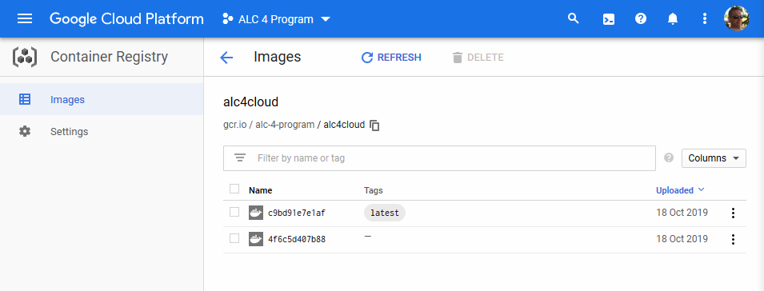

In case that you're using an external registry make sure that access to your image is granted. Otherwise, you might not be able to pull it into your cluster.

## Create Kubernetes cluster

Although it might an obvious choice to opt-in for the `Create cluster` option in Kubernetes Engine for this tutorial it is recommended to keep things easy and click on `Deploy container`. You might skip to the next paragraph then.

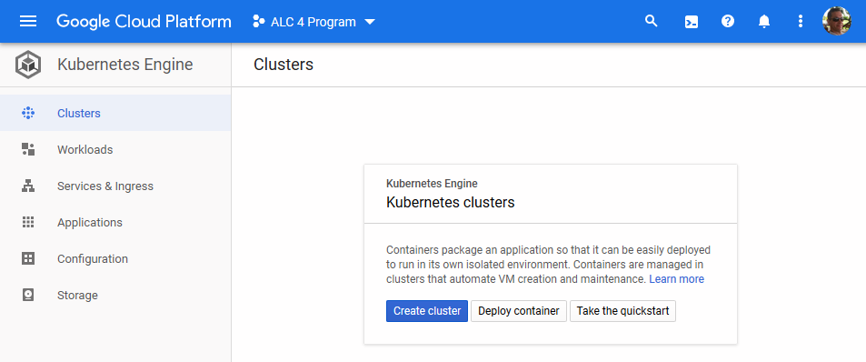

The amount of options and detailed control over the cluster might be overwhelming and distracting at this stage. However, the brave reader might go ahead and create the cluster using an existing template now...

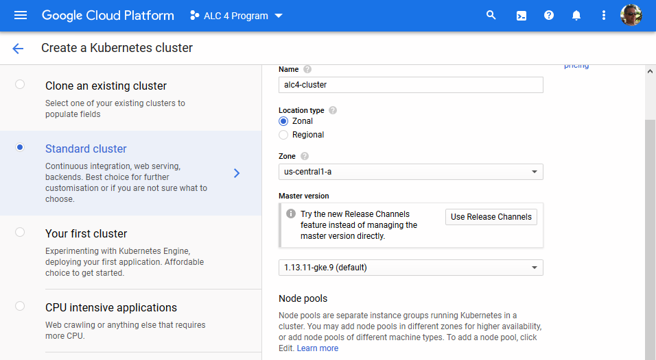

In case you prefer Cloud Shell, you could run the following command and options to create your cluster.

```
$ gcloud container clusters create "alc4-cluster" \
 --project "alc-4-program" \
 --zone "us-central1-a" \
 --num-nodes "3" \
 --machine-type "n1-standard-1" \
 --disk-size "10" \
 --disk-type "pd-standard" \
 --enable-autoscaling --min-nodes "1" --max-nodes "5" \
 --enable-autorepair
```

This should generate a similar output to this. You can also query your cluster with the following command `gcloud container clusters list`.

```
Creating cluster alc4-cluster in us-central1-a... Cluster is being health-checked (master is healthy)...done.
Created [https://container.googleapis.com/v1/projects/alc-4-program/zones/us-central1-a/clusters/alc4-cluster].
To inspect the contents of your cluster, go to: https://console.cloud.google.com/kubernetes/workload_/gcloud/us-central1-a/alc4-cluster?project=alc-4-program
kubeconfig entry generated for alc4-cluster.
NAME          LOCATION       MASTER_VERSION  MASTER_IP     MACHINE_TYPE   NODE_VERSION   NUM_NODES  STATUS
alc4-cluster  us-central1-a  1.13.11-gke.9   34.66.143.71  n1-standard-1  1.13.11-gke.9  3          RUNNING
```

All details and other configurations are explained in [Create a cluster](https://cloud.google.com/kubernetes-engine/docs/how-to/creating-a-cluster) in the documentation of Kubernetes Engine.

Keep in mind that those computing resources are going to cost you money. You might consider to start with a single node only instead of the default value of three nodes.

## Create Kubernetes workload

If you choose to `Deploy container` or you navigate to `Workloads` and click on `Deploy` you will be guided by a deployment wizard through every single step.

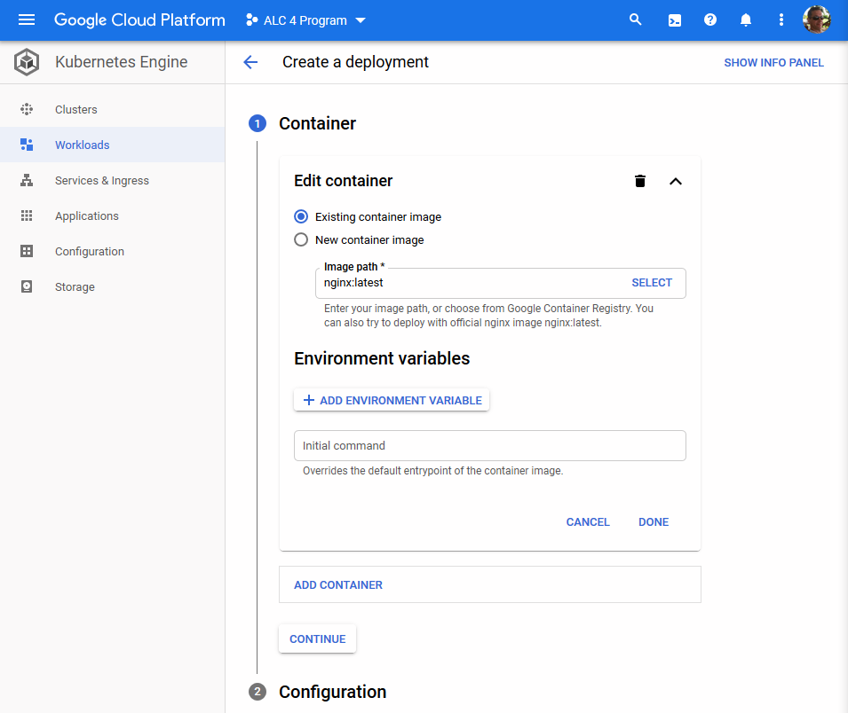

Keep the pre-selected option of `Existing container image` and click on `Select` to navigate to your Docker image in the Container Registry.

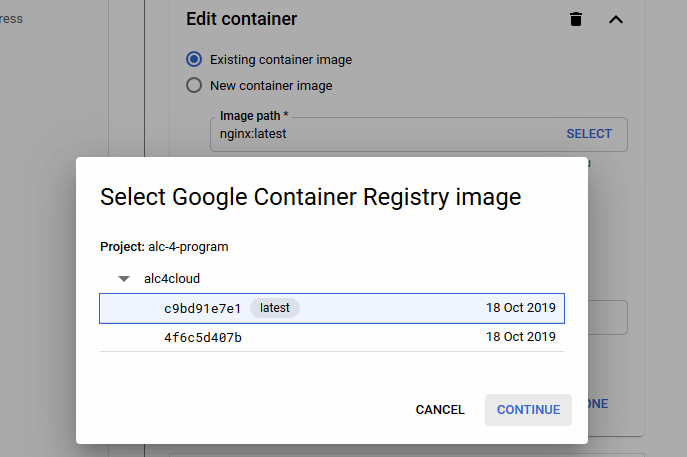

When you use an image that is located in an external registry like on Docker you would specify the value of `Image path` with the tag you used previously, like we used `u12345678/alc4cloud` to tag the image on Docker.

Optionally, you could define environment variables or add another container to the cluster. For this deployment we can ignore those options and hit `Continue`.

## Deploy cluster

Next, you enter a few values for the configuration of your deployment. Give it a unique application name and perhaps a label in the process.

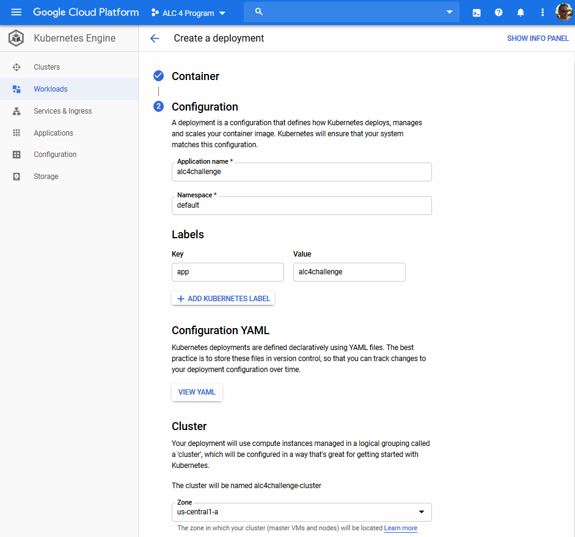

You should be sure to set the Zone to `us-central1-a`. The free tier of using Google Cloud Platform gives you certain quota for resources for free per month. Would be positive to take advantage of this perk.

If you want to keep track of your configuration for other use then you might like to keep a copy of the YAML declaration.

```
---
apiVersion: "apps/v1"
kind: "Deployment"
metadata:
  name: "alc4challenge"
  namespace: "default"
  labels:
    app: "alc4challenge"
spec:
  replicas: 3
  selector:
    matchLabels:
      app: "alc4challenge"
  template:
    metadata:
      labels:
        app: "alc4challenge"
    spec:
      containers:
      - name: "alc4cloud-sha256"
        image: "gcr.io/alc-4-program/alc4cloud@sha256:c9bd91e7e1af2babbfd6e19d01e158c58fe1ceabda7ece59dc9bb8b63a436445"
---
apiVersion: "autoscaling/v2beta1"
kind: "HorizontalPodAutoscaler"
metadata:
  name: "alc4challenge-hpa"
  namespace: "default"
  labels:
    app: "alc4challenge"
spec:
  scaleTargetRef:
    kind: "Deployment"
    name: "alc4challenge"
    apiVersion: "apps/v1"
  minReplicas: 1
  maxReplicas: 5
  metrics:
  - type: "Resource"
    resource:
      name: "cpu"
      targetAverageUtilization: 80
```

You might save this as `deployment.yaml` file. And deploy it in Cloud Shell with the following command.

```
$ kubectl apply -f deployment.yaml
```

Finally, hit the `Deploy` button and watch the progress of deployment.

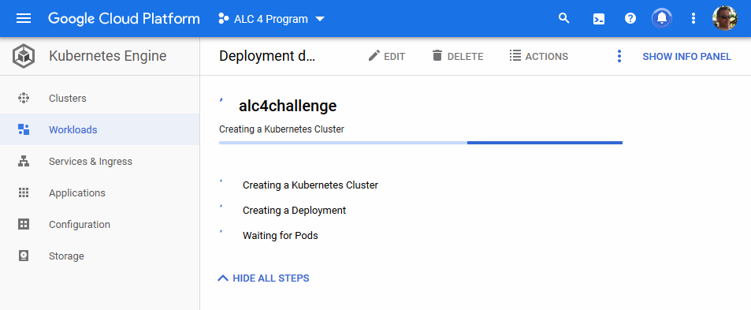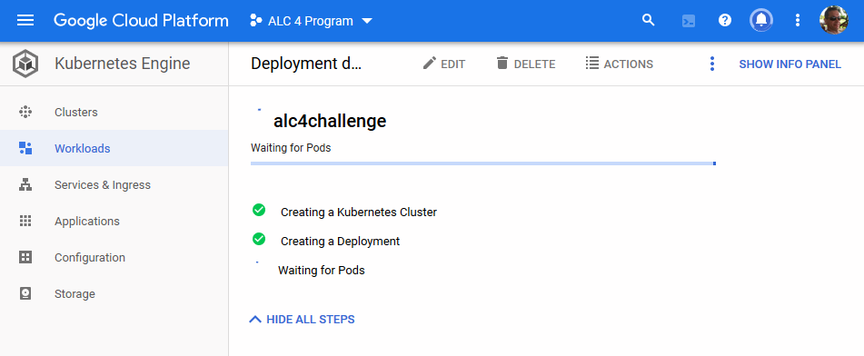

Maybe it's time for another cup of tea or a light snack to stretch your legs. The deployment of the cluster is going to take a few minutes at least.

In case that you created the cluster using Cloud Console or on a different machine you might not have the right `kubeconfig`. We need to fetch information about cluster endpoint and authentication to continue using Cloud Shell.

```
$ gcloud container clusters get-credentials alc4challenge-cluster --zone us-central1-a --project alc-4-program
Fetching cluster endpoint and auth data.
kubeconfig entry generated for alc4challenge-cluster.
```

The command creates the `.kube` folder and allows us to continue working with `kubectl` command. Should you get a connection refused response on your commands like below you forget to retrieve the cluster endpoint.

```
$ kubectl get pods
The connection to the server localhost:8080 was refused - did you specify the right host or port?
```

Afterwards, you can query and configure your cluster using `kubectl` like so.

```
$ kubectl get pods
NAME                             READY   STATUS    RESTARTS   AGE
alc4challenge-79bbd4c9f9-9km4n   1/1     Running   0          7m36s
```

You can read more about [Configuring cluster access for kubectl](https://cloud.google.com/kubernetes-engine/docs/how-to/cluster-access-for-kubectl) in the official documentation.

## Create load balancer

After completion of deployment you are going to be greeted by the `Deployment details`. Verify that all details are as expected.

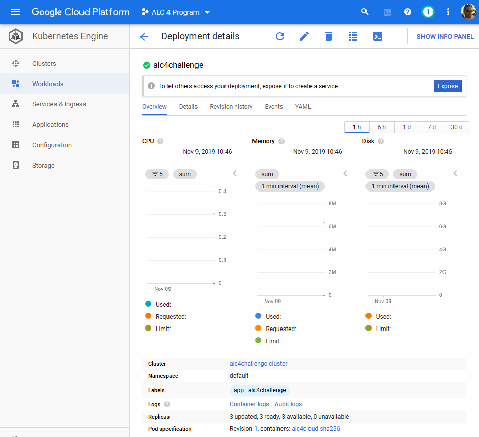

At the top you'll see a notification bar suggesting to create a service to `Expose` your cluster in order to let others access it.

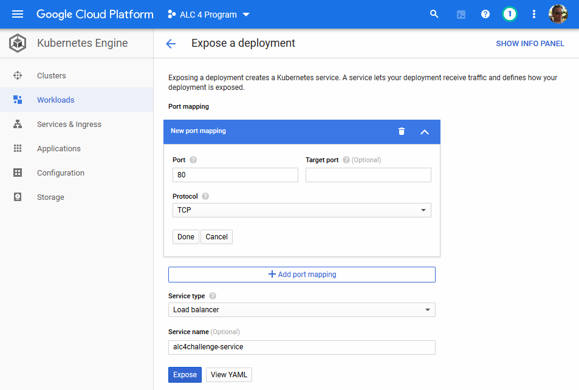

Our React app is exposed on TCP port 80 by default and we use that same port on the load balancer. No further changes needed in the above configuration. Click on `Expose` and wait until the service has been deployed completely.

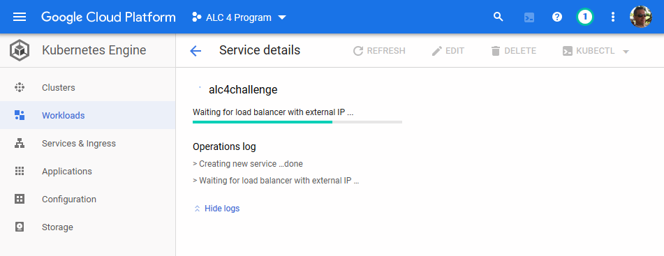

The YAML declaration can be stored as `service.yaml` file for further reference.

```
---
apiVersion: "v1"
kind: "Service"
metadata:
  name: "alc4challenge-service"
  namespace: "default"
  labels:
    app: "alc4challenge"
spec:
  ports:
  - protocol: "TCP"
    port: 80
  selector:
    app: "alc4challenge"
  type: "LoadBalancer"
  loadBalancerIP: ""
```

Like previously you deploy the load balancer service in Cloud Shell like so.

```
$ kubectl apply -f service.yaml
```

Give it a minute or so to complete.

## Get public IP address

Approximately one minute later you should see the `Service details` like shown below.

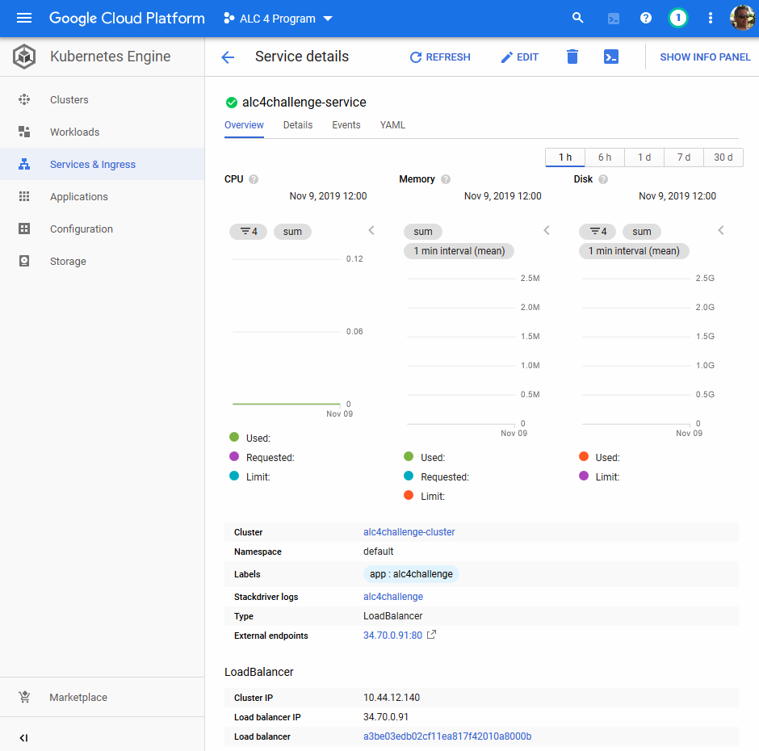

Under `External endpoints` you can see the external IP address that has been assigned to the load balancer service.

If you prefer to work with `kubectl` you can query the status of your services like this.

```
$ kubectl get services
NAME                    TYPE           CLUSTER-IP   EXTERNAL-IP     PORT(S)        AGE
alc4challenge-service   LoadBalancer   10.0.10.53   34.70.0.91   80:32094/TCP   10m
kubernetes              ClusterIP      10.0.0.1     <none>          443/TCP        12m
```

Here it is 34.70.0.91. Let's have a look at our deployed React app running as Docker image in a cluster on a Google Kubernetes Engine.

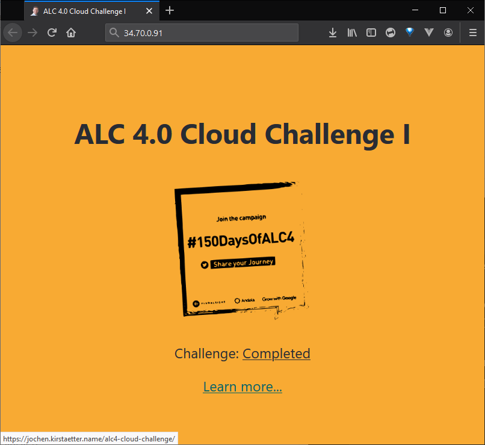

**Congratulations!**  
The Cloud Challenge has been completed successfully.

In the fourth and last part of this series I'm adding a few aspects to think about when deploying a web application into production environment. Find out more here: [Considerations for production readiness (ALC 4.0 Cloud Challenge I)](xref:alc4-cloud-ready).
