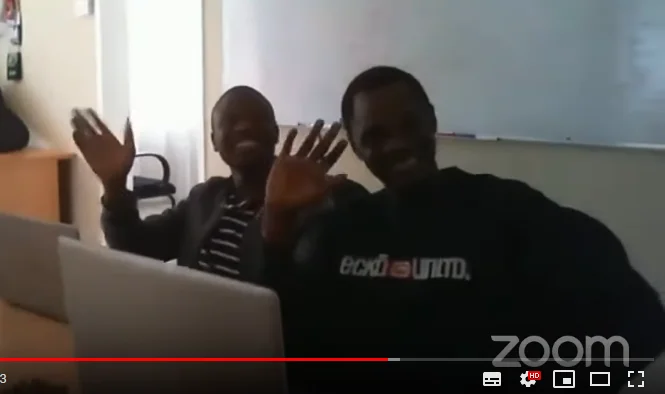
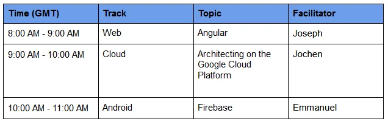
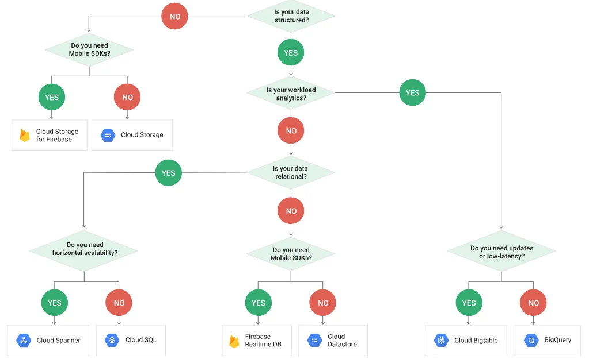
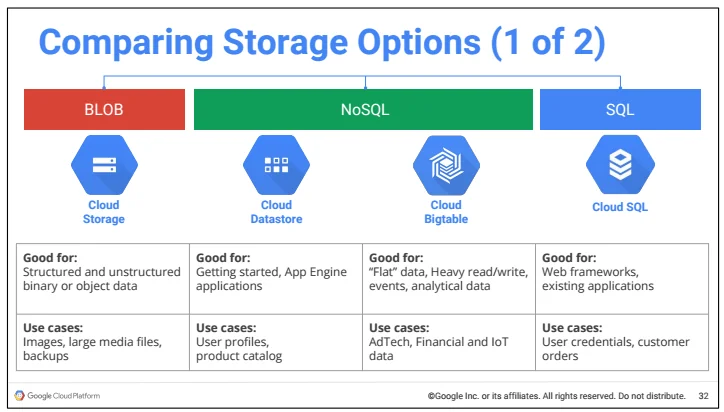
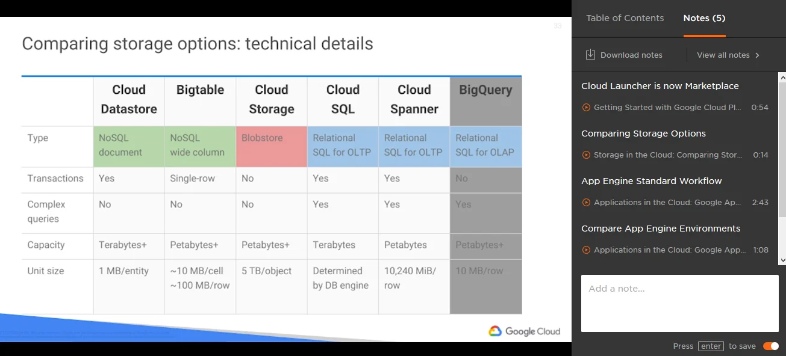
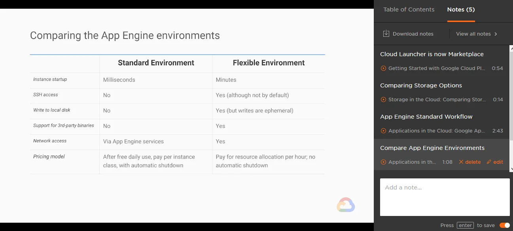
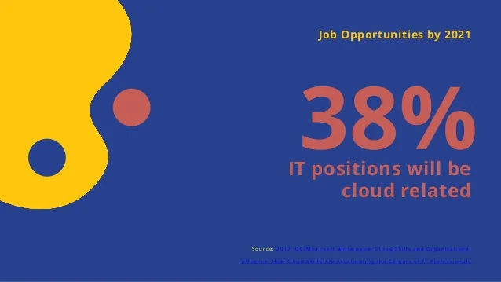

With Phase 2 being kicked off a few days ago, there have been some changes communicated by the program admins of the Andela Learning Community (ALC). One of those improvements is that there are going to be regular meetings - offline and online - to assist all learners in their endeavour.

In preparation of the first online meetup aka. Google Africa Developer Scholarship Online Meetup, ALC admins contacted me to run a session being a Learning Community Ambassador (LCA). Great stuff I thought given that I'm in the 4.0 program as an LCA for mobile web development. However, to my astounishment, I was elected as LCA for the **Cloud** track. Uhm...

Not sure what has happened there because as I wrote in my other blog [Share your journey - #150DaysOfALC4](xref:share-your-journey-150daysofalc4) I only started with the Google Cloud Platform (GCP) thanks to this program. Meaning, I'm definitely not an expert in GCP, not even remote. Nonetheless I agreed to speak for approximately an hour given that I had a few aspects and tips on my mind that I wanted to share with my fellow study buddies.

## Non-Andelan Location Study Group

At the same time there had been several requests from engaged learners and LCAs in various non-Andelan countries / locations whether it would be possible to host an offline meeting on own merits. Given the schedule for phase 2 it seems to be a great opportunity to bring learners from all three tracks together.

I volunteered to provide premises, internet connectivity and light catering for learners in Mauritius at my business office in Quatre Bornes. And thanks to the help and effort by the program managers about ten learners placed their RSVP to come and join me on the 31st August.

As usual on a Saturday, I have my children with me, and they gave me a helping hand to arrange the venue a little in preparation for our guests.

Despite the *confirmed* RSVPs two learners from the Android track actually came. We had good conversations about the ALC 4.0 program in general, the challenges during phase 1, and about the targets they want to achieve. Most interestingly, both are from abroad and they are currently studying for their masters at a local university.

## Google Africa Developer Scholarship Online Meetup

The projected time came and the meeting started as scheduled on Zoom plus additional live streaming on Youtube.

With the web track starting we used the first hour to talk about our expectations for phase 2, and how tough it might get to stay in the program for the upcoming project period. Remember, the current number of 11,000 participants is going to be reduced to roughly 4,000 only.

### Architecting on the Google Cloud Platform

Of course, we kept an eye on the web session of Joseph irrespective our own program tracks. He gave some nice demos and thankfully stayed within the one hour slot allocated to him. Next, it was my turn to explore the rich topic of *Architecting on the Google Cloud Platform*. As the topic itself is quite broad and rich on content I tried to bring out the essential parts that would be most relevant for Cloud learners in the current ALC 4.0 program and how to probably add a few more resources to the available ones.

After a quick introduction of myself, as partly described in [ALC 4.0 Cloud - Slack questions](xref:alc4-slack-questions) - I went through the first batch of questions that have been posted on Sli.do ahead of the meeting. The full list of questions can be found here: [Phase II Global Meetup 1.0](https://app.sli.do/event/zs5omfti/live/questions)

The interesting questions were about whether one should sign up for the Google Cloud Free Trial or create an account on Qwiklabs. If you are considering to be a future professional in cloud computing on the Google Cloud Platform... then absolutely yes, you should do so.

To keep the cost for those accounts low watch out for any kind of promotions or competitions online that might give you credits on those platforms to use instead of spending your well-earned money.

## All the links...

In regards to the learning paths available to us on Pluralsight have a look on their official help page about [What courses do I have access to with the ALC 4.0 program?](https://help.pluralsight.com/help/andela-4-0-courses) Additionally, keep an eye on the Pluralsight author [Google Cloud](https://app.pluralsight.com/profile/author/google-cloud). Best might be to follow in order to receive notifications when new material has been published.

Next, I reviewed some new questions like this one:

> Qwiklabs links are limited to very specific tasks, and any misuse will lead to a ban, Moreover the labs provide limited time. A good approach would be to open a personal account and use the trial, but the problem is personally I don't have a visa to register for the free account, and therefore unable to do most of the labs in Pluralsight. I really want to use a free account, as this will provide an easier method to practice. The question is how can I achieve this?

Yes, that is correct.  
Already during phase 1 I came across another initiative by Google that would be of help in accessing more Qwiklabs for free. Until the end of September there is a [12-week certification challenge](https://g.co/cloud/getcertified) going on to get Google Cloud Certified. Despite the limitation to 25 countries to receive an exam voucher one can still sign up, and receive 30 days sponsored access to Qwiklabs.

Then I shifted the focus to the official documentation of the Google Cloud certifications over at [https://cloud.google.com/certification/](https://cloud.google.com/certification/) which not only gives you an overview of the available certifications but provides all the details about what topics are going to be covered during the exam. The outcome of the ALC 4.0 program is to register for the Associate Cloud Engineer (ACE). To be well prepared one should go through the details of the [Exam guide](https://cloud.google.com/certification/guides/cloud-engineer/) and familiarize yourself with the format by using the [Practice exam](https://cloud.google.com/certification/practice-exam/cloud-engineer/).

After the associate level of Google Cloud certifications one might like to go further and confirm knowledge at the Professional level, like the [Professional Cloud Architect](https://cloud.google.com/certification/cloud-architect), the [Professional Data Engineer](https://cloud.google.com/certification/data-engineer/) or the [Professional Cloud Developer](https://cloud.google.com/certification/cloud-developer/). But that's beyond the scope of the ALC 4.0 program.

For that, one might like to look into the course objectives of [Architecting with Google Compute Engine](https://google.qwiklabs.com/courses/844) on Qwiklabs for orientation. Additionally, there is a [Challenge: GCP Architecture](https://google.qwiklabs.com/quests/47) with several hands-on-lab modules. In case that you sign up on Qwiklabs you could enroll yourself for this quest.

Next, you need to be proficient on the various service options that cloud computing has to offer. These are the various *X*aaS abbreviations that you come across very often. You need to be sure what Infrastructure-as-a-Service is all about, compared to Platform-as-a-Service, or newer topics like Function-as-a-Service. My recommendation is to read Paul Kerrison's excellent article [Pizza as a Service 2.0](https://www.paulkerrison.co.uk/random/pizza-as-a-service-2-0) as an analogy to the different cloud computing options.

In case you prefer to watch more videos compared to reading documentation I suggest that you have a look at the official channels of [Google Cloud](https://www.youtube.com/channel/UCTMRxtyHoE3LPcrl-kT4AQQ) and explicitly their playlist called [Google Cloud Certification](https://www.youtube.com/playlist?list=PLBgogxgQVM9vKlU1BId8xvHIhJMCjm3jr). Plus, there is a dedicated channel on [Google Cloud Platform](https://www.youtube.com/channel/UCJS9pqu9BzkAMNTmzNMNhvg). And here in particular you should check out their [Google Cloud Platform Essentials](https://www.youtube.com/playlist?list=PLIivdWyY5sqKh1gDR0WpP9iIOY00IE0xL) playlist.

If you are more into the practical exercises I recommend that you have a look the various [Codelabs](https://codelabs.developers.google.com/cloud/) provided by [Google Developers](https://codelabs.developers.google.com/). Those hands-on-labs can be filtered by Cloud services so that you get the most out of it.

Next, it was about time to actually talk about architectural decisions using Google Cloud Platform. Let's start with the following flow chart regarding the multiple options to store data on GCP.

After another sessions of questions, see below, I continued to cover a few more aspects of storage options.

Wilson Mar wrote an excellent article about what he calls [GCP (Google Compute Platform/Google Certified Professional)](https://wilsonmar.github.io/gcp/). That article is an invaluable resource of information. If there is only one take away from this session then it shall be Wilson's article.

After storage options we had a closer look into the available Compute options on the Google Cloud Platform. Most probably you might like to read the article [Choosing the right compute option in GCP: a decision tree](https://cloud.google.com/blog/products/gcp/choosing-the-right-compute-option-in-gcp-a-decision-tree) to make the right and informed choice for your computing environment. The article offers another flow chart with a few questions to move you into the right directions.

Back to Pluralsight, I showed how to use *Notes* in order to bookmark certain information in a video course.

This gives you a quick and easy access to key aspects of cloud services or features. Or any other type of specific information that you would consider important.

## A few more questions to consider

From the questions during the live session I picked a few on Google Cloud, on the exam preparation for the Associate Cloud Engineer, and on Pluralsight.

> What's the prospects for those who complete the course and pass the exams - Professional Cloud Architect

With a successful pass of either the Associate Cloud Engineer or perhaps the Professional Cloud Architect you confirm your knowledge of the Google Cloud Platform. Those exams are standardized on a global level. Meaning, that you will have to provide the right answers on the same level of difficulty like anyone else on the planet. Those exams do not have regional or cultural difference. By passing one of those exams you are in an equal position to someone from any other country including any of the industrialised countries. There is a whole job market looking for certified professionals.

Maybe you like to watch my presentation [Switch Conference Talk by Jochen Kirstätter: Confirm your knowledge with a certification](https://www.youtube.com/watch?v=z79SfE7fLag) on Youtube were I provide more background information on the importance of professional exams and industry certifications.

> So in order to pass the phase 2 for cloud track we have to go through the 12 weeks challenge on Qwiklab?

No, as explained in the recording the 12-week certification challenge is a completely different program offered by Google directly compared to the ALC 4.0 program offered by Andela with partners. It is an additional resource to get free of charge access to more Qwiklabs. You get access to all Qwiklabs for a period of 30 days at no extra cost.

> Google cloud certificate if valid for how many years?

In the following Cloud On Air recording - [Why Certify? Everything you need to know about Google Cloud Certification](https://cloudonair.withgoogle.com/events/americas/watch?talk=why-certify) - Anna Baird and Carl Tanner give you an insight about the certification periods. Personally, I appreciate that the Google Cloud certificates have an expiration after two years. In general, technology changes quickly in IT, especially in fields like Cloud Computing. Your knowledge of now might have little to no value in the near future... who knows? Having to renew certifications shows that you are constantly in touch with the current trends and technology available, and that you are not resting in the past.

> What's your take on old videos PS which doesn't correspond on new GCP?

That it clearly confirms the quick development in cloud computing. Take the Pluralsight video courses on Cloud Functions. They have been recorded back in 2017 and 2018 when Functions on GCP were still in beta state. Since then Cloud Functions have reached general availability. And the implementation can be realised in Node.js, Go and Python instead of node.js only. Nonetheless the courses are solid material to prepare yourself for the ACE exam.

> Where do I find the IQ assessment link for phase 2 on Pluralsight?

Log into your Pluralsight account and then navigate to the [Skill Assessments](https://app.pluralsight.com/score) page. There you will probably get a list of retakes available and a number of other Skill IQ assessments.

In case of doubt you might consider to reach out to the support team of Pluralsight. Perhaps they can assist to take a Skill IQ assessment again.

## My takeaway from this meeting

Doing the session live on Zoom was actually good fun and it worked out nicely with two cameras and the screen sharing option. Maybe I'm going to explore that kind of distribution of information more by the end of the year.

Regarding the actual topic of the session, *Architecting on GCP*, it is important to gain the necessary knowledge in order to make an informed decision about which cloud services and functionalities to choose and use. The above shown flow charts on Compute and Storage options on the Google Cloud Platform already provide a good fundament to start with.

Phase 2 of the Cloud track has more than 115 hours of video content to offer on Pluralsight. That's quite a lot on one side but there are also courses that go beyond the actual target on this program: **Preparation for the Associate Cloud Engineer exam**. To avoid being overwhelmed with the additional material one shall regularly review the official Exam guide for the actual certification.

Stay focused on target: Associate Cloud Engineer exam

## Complete recording on Youtube

Thanks for reading this far. In case that you missed the live session on Zoom perhaps you like to watch the recording on Youtube. As per agenda of the Google Africa Developer Scholarship Online Meetup there are three parts.

<iframe width="560" height="315" src="https://www.youtube.com/embed/_TT4YmEb8ZA?start=3742" frameborder="0" allow="accelerometer; autoplay; encrypted-media; gyroscope; picture-in-picture" allowfullscreen=""></iframe>

The Cloud content covered in this article starts at the 1:02:22 mark and runs till the 2:03:40 mark. Just a little bit more than the allocated 1 hour. Which I'm very happy about.

Last but not least, feel free to write any feedback, comments or questions in the comment section below. And you can reach out to me either on the ALC 4 Phase II Slack workspace or preferable on Twitter: [@JKirstaetter](https://x.com/jkirstaetter)

<small>Image credit: Google Cloud Platform</small>
