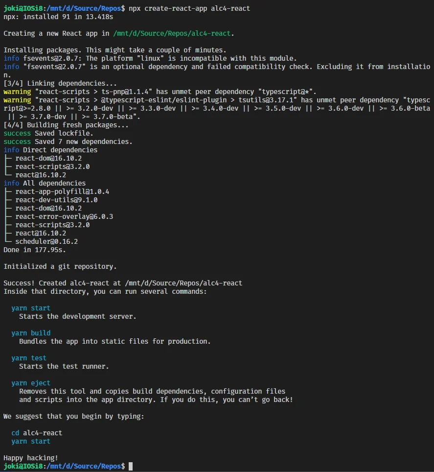
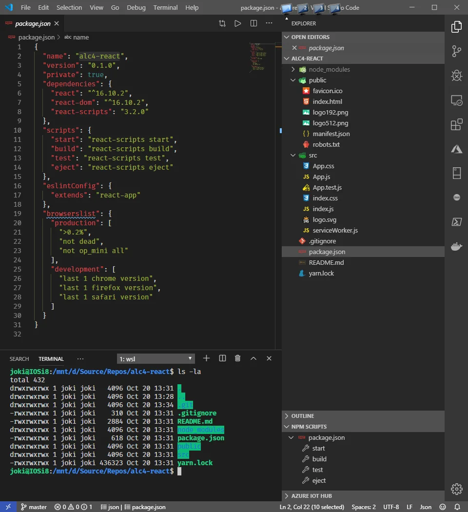
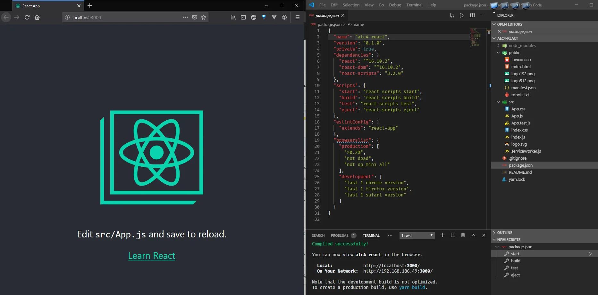
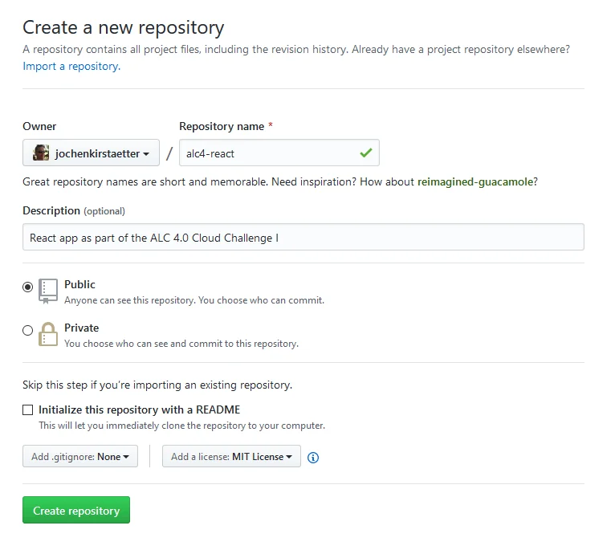
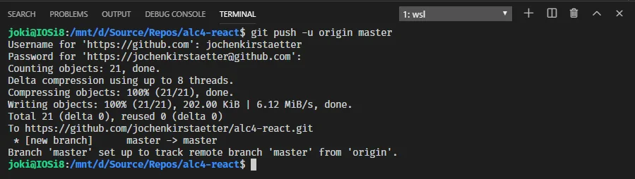
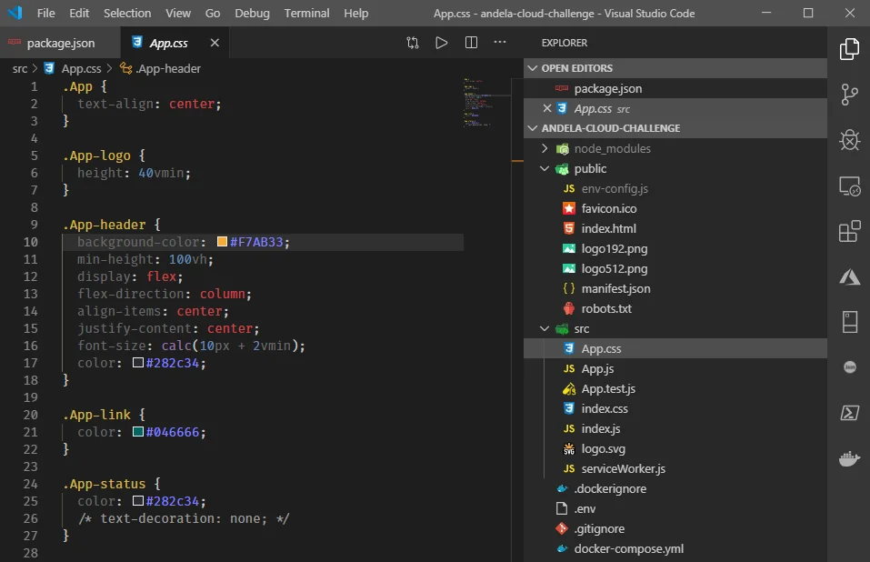
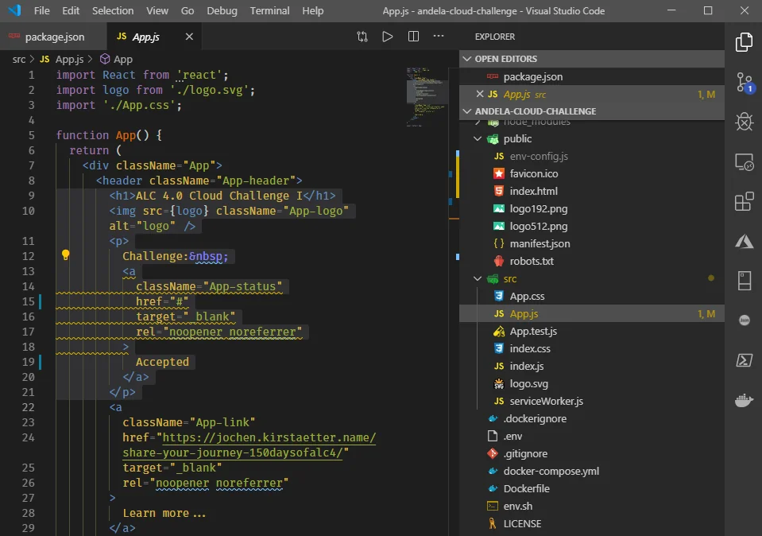
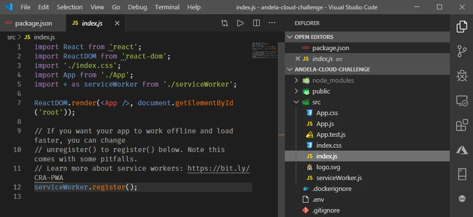
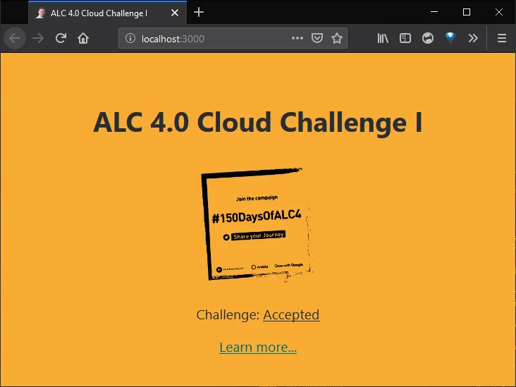

Creating a React application marks the first part of the ALC 4.0 Cloud Challenge I given to scholars.

That process is well-described in the [Getting Started](https://create-react-app.dev/docs/getting-started/) page of official website of [Create React App](https://create-react-app.dev/) and I'm going to add a few remarks below only.

## Pre-requisites

The following steps are dependent on the availability of Node.js on your machine. Hence, you should verify that you have a recent version of Node.js installed. You can check this by opening a terminal or command prompt and run the following command:

```
$ node -version
v11.15.0
```

Of course, the returned version information might vary on your system. If you don't have Node.js installed, get the latest version from the [Downloads](https://nodejs.org/en/download/) section.

## Create the app

Now, let's come up with a name, like `alc4-react`, and create the application with the following command executed in either terminal or command prompt:

```
$ npx create-react-app alc4-react
```

The Create React App template engine generates a new React application with the provided name, here `alc4-react` in a sub-folder of the same name. This will take a few minutes to fetch the necessary node modules and create the application structure. You might grab a cup of coffee/tea until the process has been completed successfully.



After completion, change into the new created folder

```
$ cd alc4-react
```

and inspect the project files with your favourite text editor. Mine is Visual Studio Code.

```
$ code .
```



To check whether everything is as expected you should run the following command to launch a local development server:

```
$ npm start
```



## Well done!
You created and launched a new React app on your local machine.

Hit `CTRL+c` to stop the local development server.

## Local git repository

During the generation process of the React app the template already initialises a git repository locally. Additionally, a `.gitignore` file is also created to skip certain files and folders to be committed to the repository.

In case that you're familiar with `git` you might like to check and optionally set a few configuration settings.

```
$ git config --list
...
$ git config user.name "Jochen Kirstätter"
```

Adjust them according to your needs.

## Create repository online on GitHub

As a good practice it is recommended that any local source code should be replicated / backed up to an online resource. Whether this is GitHub, Azure DevOps, GitLab, Bitbucket, etc. is completely your personal choice. Exposing your source code online also enables you to invite other software developers to have a look. This may provide you with suggestions and perhaps pull requests with improvements.

In this tutorial we are going to use GitHub. Navigate over to the GitHub web site, log into your account or create a new, free one, and create a new repository for the freshly generated React app.



Keep the checkbox `Initialize this repository with a README` unchecked. We already have this file and it would create a conflict situation. Do not add a `.gitignore` file for same reason.

Optionally, consider to choose a license for your repository. I'm comfortable with the MIT License. You might like to explore other options.

Next, hit that green `Create repository` button to complete this step.

## Add GitHub remote

With the remote repository available on GitHub it is now time to connect it to the local one as `origin` entry.

```
$ git remote add origin https://github.com/jochenkirstaetter/alc4-react.git
```

You can check the remotes with the following command:

```
$ git remote -v
origin  https://github.com/jochenkirstaetter/alc4-react.git (fetch)
origin  https://github.com/jochenkirstaetter/alc4-react.git (push)
```

Multiple remotes are possible given unique names. That's mainly interesting when you fork from another online repository and you would like to keep track of an `upstream` of changes and to be able to update your forked repository from time to time.

## Push to master

Finally, push your local repository to the new created remote one with the following command:

```
git push -u origin master
```

‍The output is going to look similar to the following.



## Congratulations!
You added your React app to an online repository successfully.

**Note**: The chosen name for the git repository was for demonstration purpose only. Here, you can find my [actual code repository on GitHub](https://github.com/jochenkirstaetter/andela-cloud-challenge).

## Code...

Now, with a safety net for any code adjustments in place it is time to start tweaking the files and source code of the React application.

First, I exchanged a few files in the `public` folder completely. I copied an existing `favicon.ico` to replace the React one. I also used the *Share your Journey* image of the ALC 4.0 program to replace `logo192.png` and `logo512.png`.

Note: The background image shown while running the React app is based on the SVG image `logo.svg` located under the `src` folder. I used one of the many "PNG-to-SVG" services online to create an SVG version of the ALC 4.0 campaign image.

Then I changed the content in the file `manifest.json` to be more specific about the purpose of this application:

```
{
  "short_name": "ALC 4.0 Cloud",
  "name": "ALC 4.0 Cloud Challenge I",
  "icons": [
    {
      "src": "favicon.ico",
      "sizes": "64x64 32x32 24x24 16x16",
      "type": "image/x-icon"
    },
    {
      "src": "logo192.png",
      "type": "image/png",
      "sizes": "192x192"
    },
    {
      "src": "logo512.png",
      "type": "image/png",
      "sizes": "512x512"
    }
  ],
  "start_url": ".",
  "display": "standalone",
  "theme_color": "#000000",
  "background_color": "#F7AB33"
}
```

See new value of `short_name`, `name` and `background_color` attributes. The remaining key/value pairs stayed untouched.

Still in the public folder, you might like to review and adjust the &lt;title&gt; tag in the `index.html` file to your likings.

```
<title>ALC 4.0 Cloud Challenge I</title>
```

When done, commit your changes with a descriptive comment and push to your GitHub repository.

### Update README.md

Here, I simply copied the content of the original Google Docs online resource and converted it to Markdown syntax. This allows me to have a record of the challenge and I don't have to keep a bookmark to Google Doc (which could be pulled at any time). With my own copy I can amend the information to my gusto, and lastly it helps other developers to have a brief overview of what the source code in the repository is actually about.

### Personalise the React application

There are more artefacts in the default React app that you might like to inspect and amend. Open the `package.json` file in the root folder of the project and give a few more details, like a proper name and description.

```
{
  "name": "andela-cloud-challenge",
  "version": "4.0.0",
  "description": "ALC 4.0 Cloud Challenge",
  "repository": {
    "url": "https://github.com/jochenkirstaetter/andela-cloud-challenge.git"
  },
  "readme": "README.md",
  "license": "MIT",
  "private": true,
  "dependencies": {
...
  }
}
```

Maybe you like to add information about your GitHub repository, *Read me* instructions and which license your application is using.

### Review UI and CSS

Right now, the React app is still in its original state of visual appearance. The choice of fonts, colours, etc. might not be your personal preference. Perhaps... ;-)

All styling is found in the file `App.css` under the `src` folder. I didn't like the default background colour and changed it.



I also added another CSS class for an additional status indicator of my application (more on that later).



### Activate service worker

With all modifications in place I wanted to make sure that my React app is PWA-ready. PWA stands for [Progressive Web Application](https://developers.google.com/web/progressive-web-apps/) and provides some cool features like better reliability, working offline, faster loading, background synchronisation, caching, and others.

Open the file `src/index.js` and follow the instructions given at the end.



It also enables that your web site can be added to the home screen on mobile devices, and recently on desktop systems.

## Test local environment

While working on all those modifications described above you could have kept the local development server running in the background. The React app is instantly reloaded on saving any change.

Let's run the local environment again, in case it's not active, with the following command:

```
$ npm start
```

The expected result looks like this. Yours might be different, of course.



See the icon and title of the browser tab among other modifications done.

## Awesome!
This is the first part of a series regarding the completion of the ALC 4.0 Cloud Challenge I. The article describes the creation and customisation of a React app and how to secure all modifications using an online repository on GitHub.

In the next article we are going to [pack the React app as a Docker image and push it to the Google Container Registry (GCR)](xref:alc4-cloud-docker) for further use.