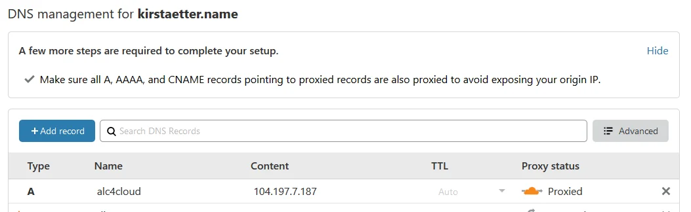
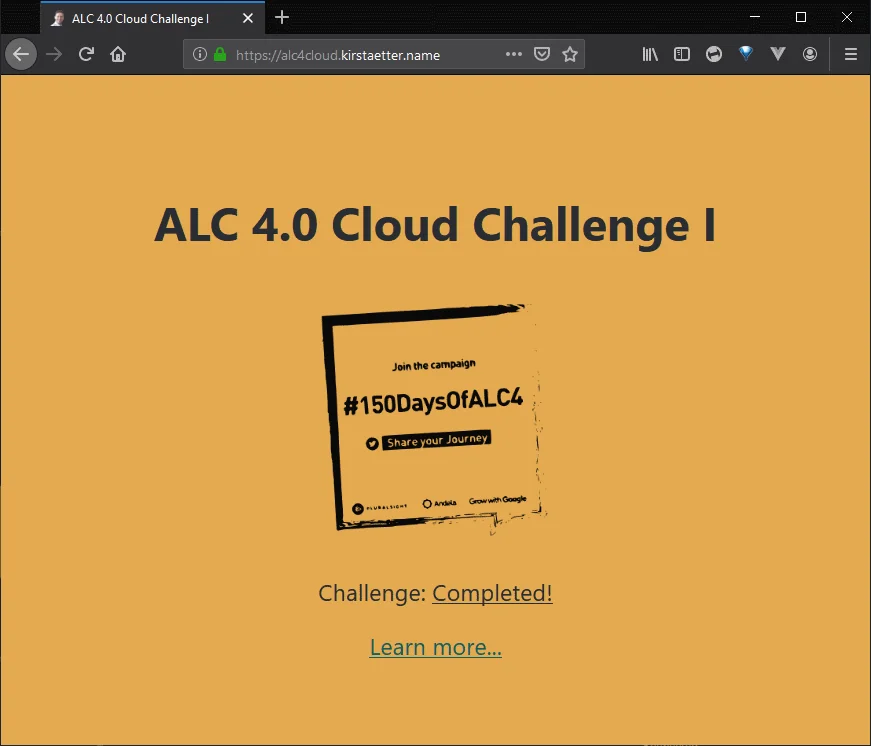
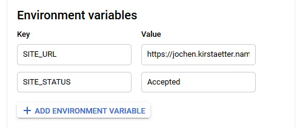
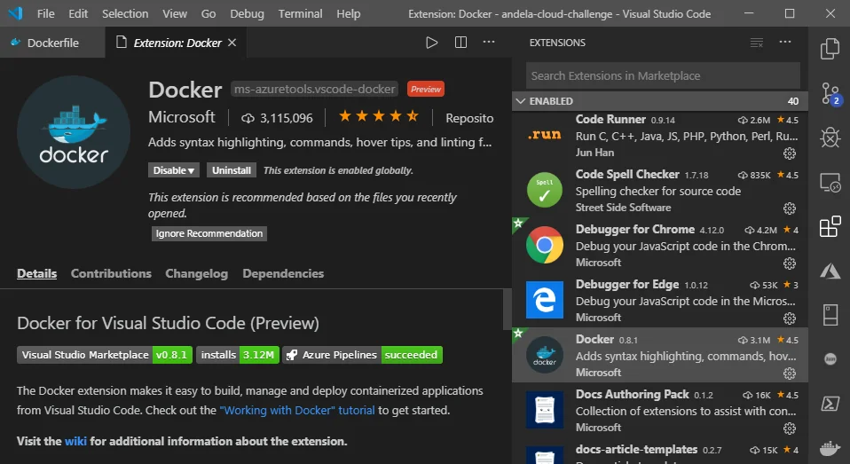

The mandatory steps to finish the challenge are now behind us and we have time for a few thoughts and considerations when working with containerized web applications.

## Configure DNS to ease access

After creating the LoadBalancer service in Google Kubernetes Engine we got an external IP address that let others access the React application over the internet. That's good.

However, it is more common to have a domain name in place instead of using an IP address. A domain name would also allow us to decouple the deployed app from having to use a fixed address.

Apart from checking out Google Cloud DNS to purchase a new domain it might be more likely that either you or your company already has an existing domain name. This enables us to create a subdomain for the cluster.



I'm using Cloudflare to configure DNS records for one of my domains. I created an A record for the public IP address of my cluster, i.e. alc4cloud.kirstaetter.name which is also proxied by Cloudflare.

## Enable HTTPS only

Using Cloudflare comes with SSL certificate free of charge. And it's flipping a switch only.


Any request to the HTTP-based URL of the React app will be redirected automatically to the secure HTTPS-based address. No further set up needed.



## Update README

During the process of building the Docker image I stumbled over a small issue with the base image used in the build-stage. Hence, I updated the `README.md` file accordingly and pushed it to my [repository on GitHub](https://github.com/jochenkirstaetter/andela-cloud-challenge).

While build the Docker image on Windows the process terminated with an error stating that `react-scripts` command would not be available to complete the build of the React app. Hence, `react-scripts` are installed globally during the build-stage.

```
RUN npm i -g react-scripts
```

## Clean install of app dependencies

Still in the build-stage of the `Dockerfile` we used an `npm` command to install all dependencies and libraries needed for the React app. However to be sure to start over with a fresh, clean environment and to avoid changes to the `packages.json` file it is recommend to [Use npm ci instead of npm install](https://docs.npmjs.com/cli/ci).

```
# build stage
FROM node:lts-alpine as build-stage
RUN npm i -g react-scripts
WORKDIR /app
COPY package*.json yarn.lock ./
RUN npm ci
COPY . ./
RUN npm run build
```

This recommendation applies for any kind of automatic build process, i.e. using a continuous integration/development (CI/CD) platform like Maven, Jenkins or Azure DevOps.

## Add runtime environment variables

Perhaps you already noticed it on the different screenshots of my React application that the status and the linked URL of said status changed, depending on progress or stage - Accepted, In Progress and Completed.

I wanted to add a little bit of flexible to the React app, i.e. reading and using environment variables. To achieve this I added a `<script>` tag into the HEAD section the file `index.html` to load an external JavaScript file `env-config.js`.

```
...
    <link rel="manifest" href="%PUBLIC_URL%/manifest.json" />
    <title>ALC 4.0 Cloud Challenge I</title>
    <script src="%PUBLIC_URL%/env-config.js"></script>
  </head>
```

That JavaScript file has the following values which have been dynamically created (more on this below).

```
window._env_ = {
  SITE_URL: "#",
  SITE_STATUS: "Accepted",
}
```

Which creates an object named `_env_` in the browser window after the application has been loaded.

This enables us to extend the core functionality of the React app in the file `App.js` and add the following literals.

```
...
        <h1>ALC 4.0 Cloud Challenge I</h1>
        
        <p>
          Challenge:&nbsp;
          <a
            className="App-status"
            href={window._env_.SITE_URL}
            target="_blank"
            rel="noopener noreferrer"
          >
            {window._env_.SITE_STATUS}
          </a>
        </p>
...
```

As you can see, this setup allows us to use environmental information inside our application using the `window._env_` object in JavaScript.

Now, to be able to feed the React app with the current information given by the environment we use a shell script that reads the Node.js `.env` file and generates the content of the referred `env-config.js` file for the app.

```
#!/bin/bash

# Recreate config file
rm -rf ./env-config.js
touch ./env-config.js

# Add assignment 
echo "window._env_ = {" >> ./env-config.js

# Read each line in .env file
# Each line represents key=value pairs
while read -r line || [[ -n "$line" ]];
do
  # Split env variables by character `=`
  if printf '%s\n' "$line" | grep -q -e '='; then
    varname=$(printf '%s\n' "$line" | sed -e 's/=.*//')
    varvalue=$(printf '%s\n' "$line" | sed -e 's/^[^=]*=//')
  fi

  # Read value of current variable if exists as Environment variable
  value=$(printf '%s\n' "${!varname}")
  # Otherwise use value from .env file
  [[ -z $value ]] && value=${varvalue}
  
  # Append configuration property to JS file
  echo "  $varname: \"$value\"," >> ./env-config.js
done < .env

echo "}" >> ./env-config.js
```

For our local development we would provide a dummy `.env` file with the following content.

```
SITE_URL=#
SITE_STATUS=Accepted
```

Next, we add another entry `dev` under the `scripts` configuration in the file `package.json`, like this.

```
...
  "scripts": {
    "start": "react-scripts start",
    "build": "react-scripts build",
    "test": "react-scripts test",
    "eject": "react-scripts eject",
    "dev": "chmod +x ./env.sh && ./env.sh && mv env-config.js ./public/ && react-scripts start"
  },
...
```

And from now on, we would launch our local development server with this command

```
$ npm run dev
```

instead of the previously used `npm run start`. That script entry executes the `env.sh` bash script to freshly generate the file `env-config.js` and copies it into the `public` folder of the React app where the `index.html` picks it up.

Finally, we amend the launching command statement of the production-stage in the `Dockerfile`.

```
...
EXPOSE 80

# CMD ["nginx", "-g", "daemon off;"]
CMD ["/bin/bash", "-c", "/usr/share/nginx/html/env.sh && nginx -g \"daemon off;\""]
```

This way we generate environmental information into the `window._env_` JavaScript object in our React app each time the image is launched, and before nginx web server is executed.

In Google Kubernetes Engine we are offered to specify Environment variables for use in the cluster.



Changing any value of a environmental variable does not require a full build and deploy circle anymore but a mere termination and start of the pod running the React app.

## Play with docker-compose

While working on the implementation of using environmental variables I played a little with `composer` and created a `docker-compose.yml` file. However, this didn't give me the expected outcome and the file is abandoned in the repository. If you have any hints how this could be an useful approach let me know in the comment section below the article.

## Visual Studio Code and Docker

Last but least, a few recommendations to extend Visual Studio Code with some tools to ease your work using Docker, YAML files and probably remote environments:

- [Docker](https://marketplace.visualstudio.com/items?itemName=ms-azuretools.vscode-docker) - see screenshot below
- [docs-yaml](https://marketplace.visualstudio.com/items?itemName=docsmsft.docs-yaml) or
- [YAML](https://marketplace.visualstudio.com/items?itemName=redhat.vscode-yaml) with built-in Kubernetes syntax support
- [Remote Development](https://marketplace.visualstudio.com/items?itemName=ms-vscode-remote.vscode-remote-extensionpack) - a meta package for three extensions



## GitHub repository

Okay, one last one...

All information and instructions steps, all files inclusive changes over time are available in the repository [Google Africa Developer Scholarship Phase II - Google Cloud Challenge I](https://github.com/jochenkirstaetter/andela-cloud-challenge) on GitHub.

You're most welcome to fork/clone the repository and apply your personal touch to the React app.

Thanks for reading that far. Kindly leave a comment or response.

<small>Image credit: Alex Motoc</small>
