Google Cloud Platform offers another service to operate containers called Cloud Run. It brings the idea of serverless computing to your containers.

Instead of being limited to the available support for languages, libraries and code restrictions in Cloud Functions you can create and run your own container in a similar, serverless fashion. Compared to Kubernetes Engine, Cloud Run abstracts the overhead of administration and enables you to deploy your application almost instantly.

> Cloud Run is a managed compute platform that automatically scales your stateless containers. Cloud Run is serverless: it abstracts away all infrastructure management, so you can focus on what matters most — building great applications.

Find out more information about [Cloud Run](https://cloud.google.com/run/).

## Taking the React app to Cloud Run

Similar to the deployment to [Google Kubernetes Engine (ALC 4.0 Cloud Challenge I)](xref:alc4-cloud-k8s) you would want to deploy [the existing React app](xref:alc4-cloud-react) to Cloud Run.

The following command allows you to use any of the available containers in Container Registry (or Docker) and launch it on Cloud Run.

```
> gcloud run deploy --image gcr.io/alc-4-program/alc4cloud:cloudbuild
```

If you do not specify a *service name*, *platform*, *region*, or *access mode* the command is going to prompt you for the missing information.

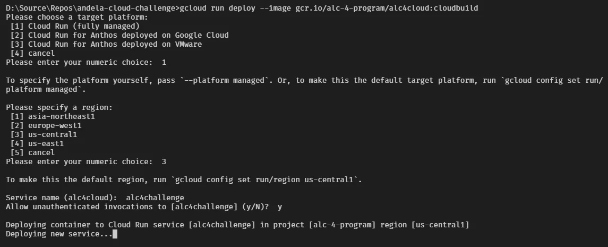

Here is the complete command with all mandatory switches for easier handling.

```
> gcloud run deploy alc4cloud \
  --image gcr.io/alc-4-program/alc4cloud:cloudbuild \
  --platform=managed \
  --region=us-central1 \
  --allow-unauthenticated
```

After a short while the command output is most probably going to respond with the following information.

```
...
Deployment failed
ERROR: (gcloud.run.deploy) Cloud Run error: Container failed to start. Failed to start and then listen on the port defined by the PORT environment variable. Logs for this revision might contain more information.
```

Oh, what happened here?  
Your container is in perfectly good shape but still Cloud Run rejects the deployment due to the inability to *listen on the port defined by the PORT environment variable*.

## RTFM - Read The Fine Manual

According to the documentation on [Building Containers](https://cloud.google.com/run/docs/building/containers) for Cloud Run container images are accepted as long as they respect the container contract.

> In particular, your code must listen for HTTP requests on the port defined by the `PORT` environment variable.

Okay, then let's have a look.

To learn more about the contract your containers must respect to be deployed to Cloud Run, see [Container Contract](https://cloud.google.com/run/docs/reference/container-contract).

> In Cloud Run container instances, the `PORT` environment variable is always set to `8080`, but for portability reasons, your code should not hardcode this value.

How is this related to your container running the React app?

Following the article [Working with Docker (ALC 4.0 Cloud Challenge I)](xref:alc4-cloud-docker) you wrote a `Dockerfile` to build containers using nginx webserver. Using the default configuration and listening on port 80.

That's a violation to the container contract as per specification and you have to change the implementation of the Docker image.

## Modifying the container

In order to respect the container contract for Cloud Run you need to amend the existing `Dockerfile` slightly. There are two changes needed.

First, you have to change the `Listen` directive in the default configuration of nginx. An elegant approach would be to use `sed` - the stream editor for filtering and transforming text - in the Linux system used to run the React app.

Add the following `RUN` statement to the production-stage in the `Dockerfile`.

```
RUN sed -i 's/80/8080/g' /etc/nginx/conf.d/default.conf
```

Next, you have to change the exposed port of the container to grant access to it from external sources. Change the `EXPOSE` line like so.

```
EXPOSE 8080
```

The adjusted `Dockerfile` should have the following content.

```
# build stage
FROM node:lts-alpine as build-stage
RUN npm i -g react-scripts
WORKDIR /app
COPY package*.json yarn.lock ./
RUN npm ci
COPY . ./
RUN npm run build

# production stage
FROM nginx:stable-alpine as production-stage
RUN apk add --no-cache bash
COPY --from=build-stage /app/build /usr/share/nginx/html

COPY env.sh /usr/share/nginx/html
COPY .env /usr/share/nginx/html
RUN chmod +x /usr/share/nginx/html/env.sh
WORKDIR /usr/share/nginx/html

# Cloud Run requires port 8080. Let's change nginx...
RUN sed -i 's/80/8080/g' /etc/nginx/conf.d/default.conf
EXPOSE 8080

CMD ["/bin/bash", "-c", "/usr/share/nginx/html/env.sh && nginx -g \"daemon off;\""]
```

Now, your local source is ready for Cloud Run.

## Submit and Run

Either you would go forward to create the new container on your local system according to the article [Working with Docker](xref:alc4-cloud-docker) or you might like to send the sources as described in [Working with Cloud Build](xref:alc4-cloud-build).

Being smart you submit to Cloud Build using this command.

```
> gcloud builds submit -t gcr.io/alc-4-program/alc4cloud:cloudrun .
```

Although it is the same React app you should give the container image a new tag, here `cloudrun` to differentiate it a little bit from the previously created images.

**Note:** I put a file called `Dockerfile.Cloudrun` into [my repository on GitHub](https://github.com/jochenkirstaetter/andela-cloud-challenge) for reference. Unfortunately, you cannot specify a different file when submitting to Cloud Build. You might have to rearrange the files if you want to use it.

After successful submission to Cloud Build your Container Registry might look a little like the following.

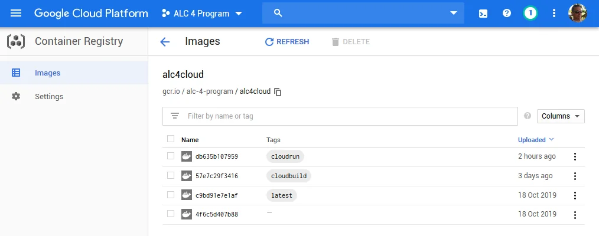

Reflecting all tagged images built so far.

With the containerized image available in the registry it's now time to deploy to Cloud Run using the `gcloud run` command.

```
> gcloud run deploy alc4cloud \
  --image gcr.io/alc-4-program/alc4cloud:cloudrun \
  --platform=managed \
  --region=us-central1 \
  --allow-unauthenticated \
  --set-env-vars=SITE_URL="https://jochen.kirstaetter.name",SITE_STATUS="Cloud Run"
```

**Note**: Amend the tag value according to the image you built. Setting the environment variables might not be necessary depending on your implementation.

The deployment is going to take a few minutes. Maybe you like to stretch your legs, grab a glass of water, and have a cereal bar to re-energize yourself while waiting.

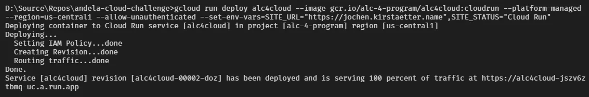

Cloud Run will respond with a simple `Done.` and provides you with the URL to run your stateless container on the web.

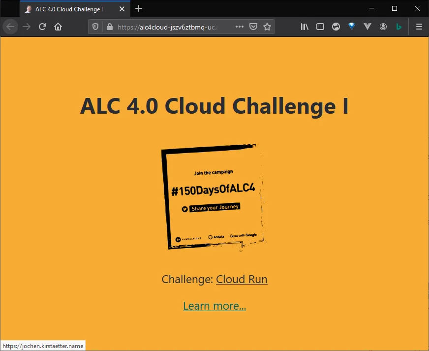

## Awesome, well done!
You have managed to adjust the Docker image to listen to port 8080 and deployed the container to Cloud Run.

## Same steps in Cloud Console

In case that you feel more comfortable in Cloud Console than typing commands in the terminal, you can navigate to Cloud Run in the sidebar menu. There you click on `Create Service` to set up a new service operating on Cloud Run.

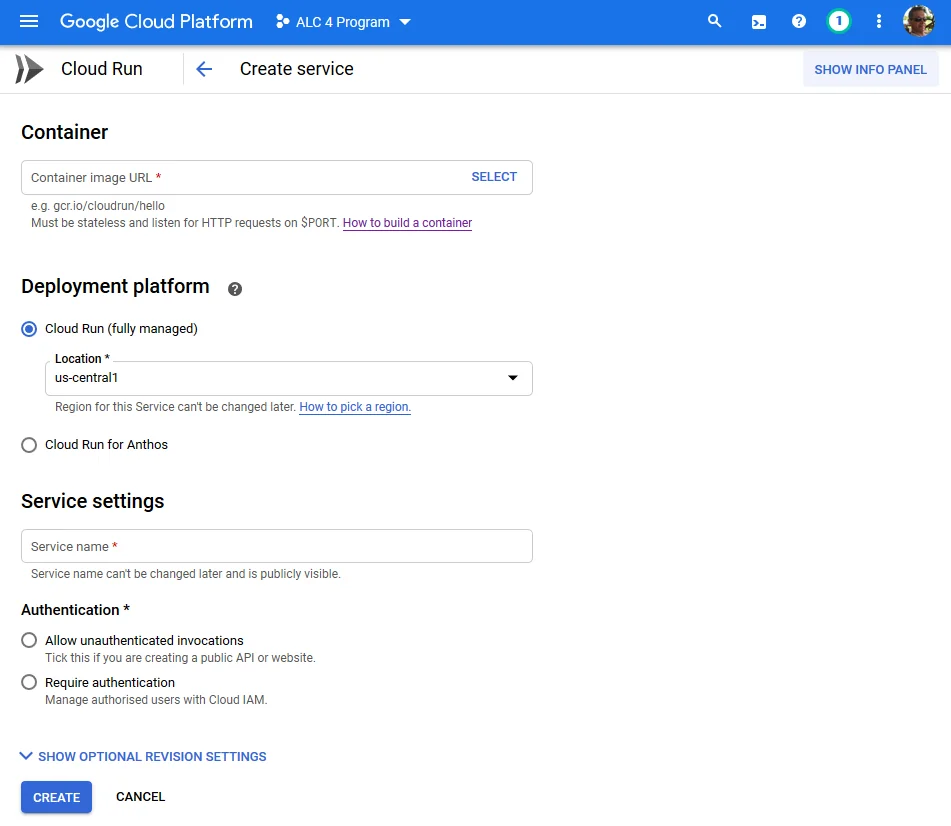

Similar to the `gcloud` command you specify the container image, the preferred platform to deploy inclusive a location, give the service a name and choose the authentication mode.

Then you hit the `Create` button and wait until the service has been created.

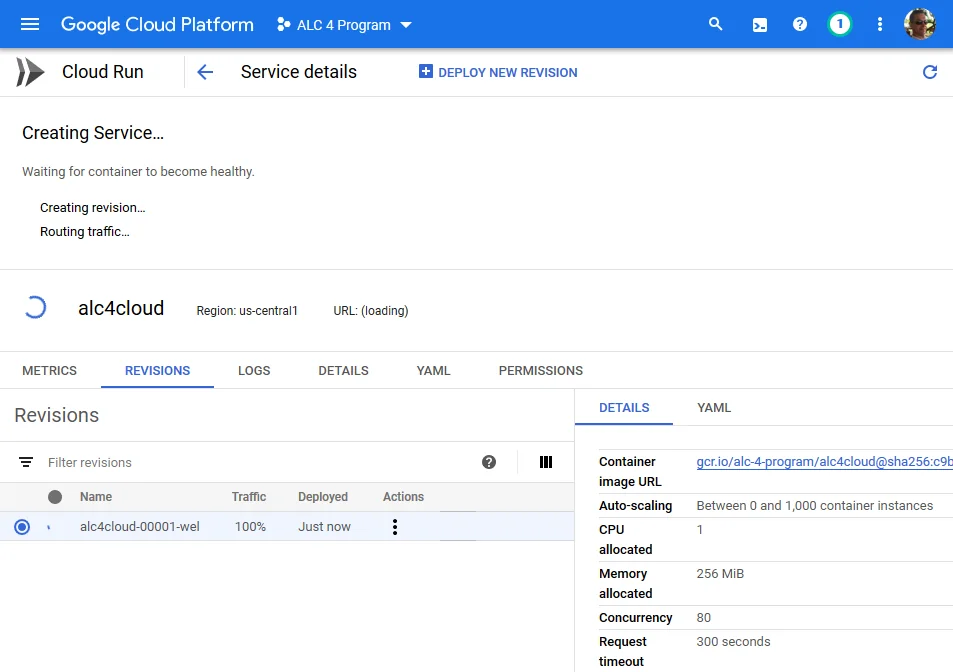

Shortly after the endpoint will be accessible via exposed URL and the service metrics are shown in Cloud Console.

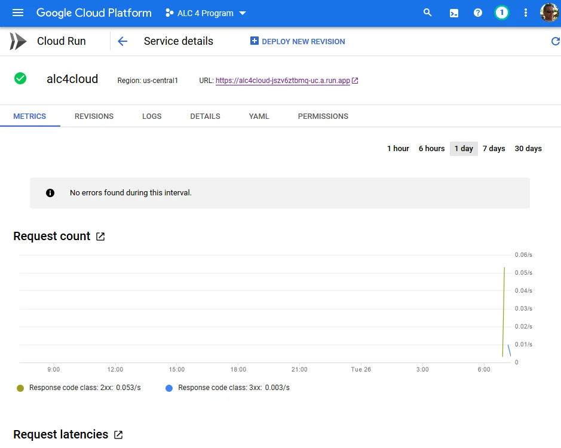

The choice is yours. Remember that the container image has to respect the container contract and listen to port 8080. Otherwise, deployment is going to fail.

## Pricing of Cloud Run

At the time of writing the following price structure applies to Cloud Run.

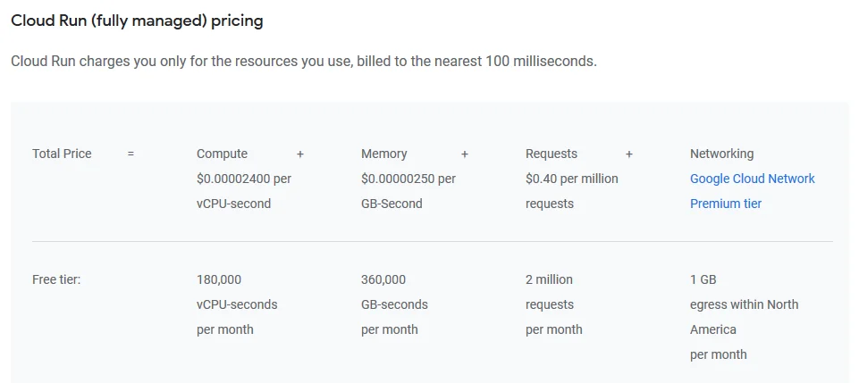

A small project like the React app could be an interesting candidate to deploy and run on Cloud Run. Depending on the number of visitors and hence invocations per month it might be very affordable, too.

## Cloud Run has HTTPS built-in

Each Cloud Run service gets an out-of-the-box stable HTTPS endpoint, with TLS termination handled for you.

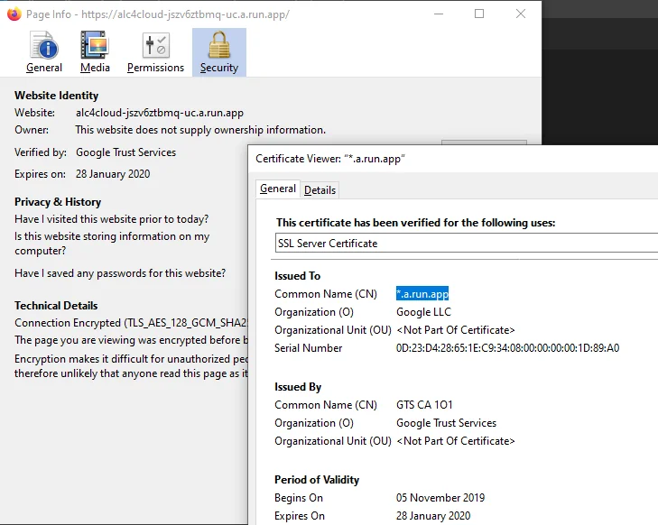

## Using your own domain

You might have seen that the auto-generated URL Cloud Run allocates to your service isn't the most user-friendly. Conveniently, Cloud Run offers custom domains out-of-the-box.

On the Cloud Run service overview click on the triple dot button and select `Manage Custom Domains` to map your own domain for your service.

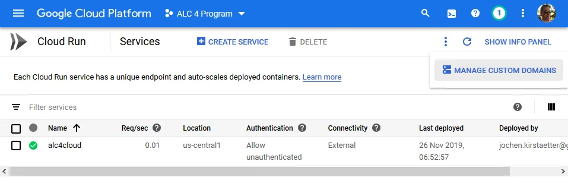

Next, click on `Add Mapping` in case that you are not greeted by the Add mapping dialog already.


In case that your domain is not listed as a verified domain you are offered to do it on the spot.

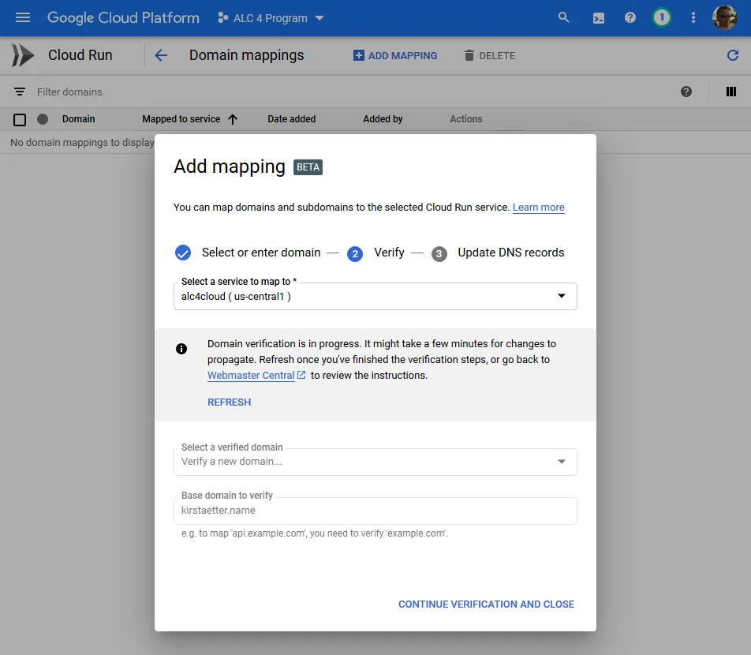

Wait until the verification process has been completed successfully and then specify the domain to use.

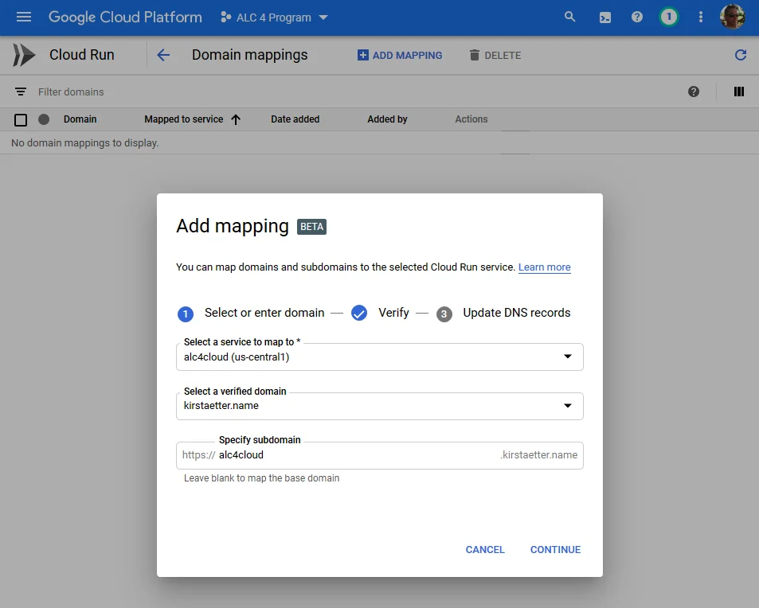

Cloud Run is able to map your service to the base domain as well as to a subdomain record.

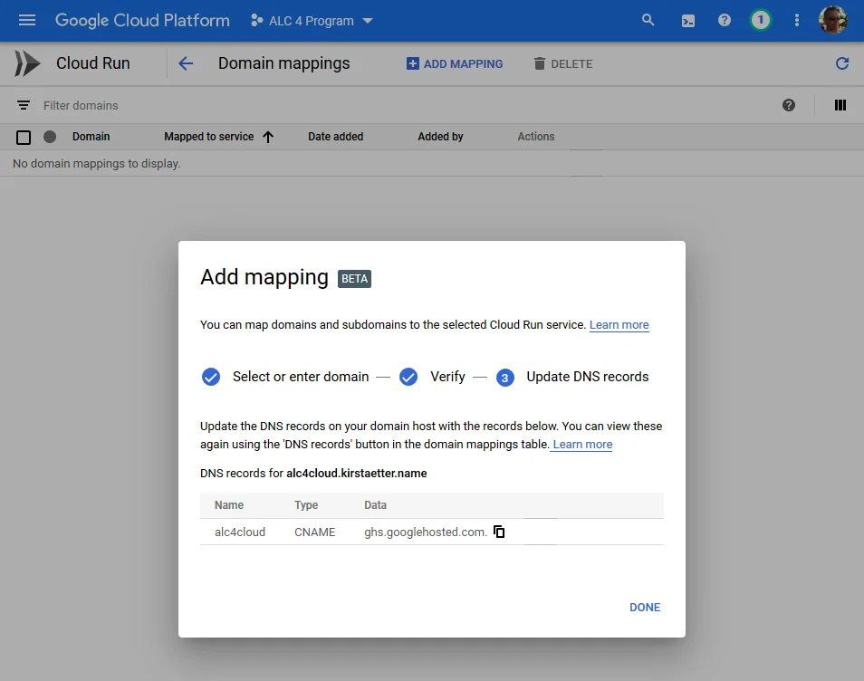

Finally, Cloud Run gives you details on how to update the DNS records of your custom domain. This step completes the mapping to your service.

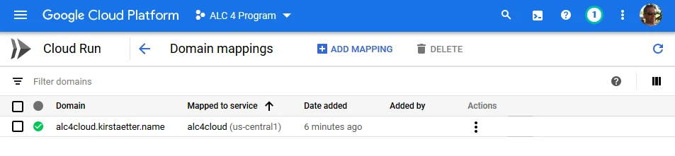

It takes about five to six minutes until the domain mapping is done. However, give it some more time until the Cloud Run service responds to your custom domain as expected. See for yourself here: [https://alc4cloud.kirstaetter.name/](https://alc4cloud.kirstaetter.name/)

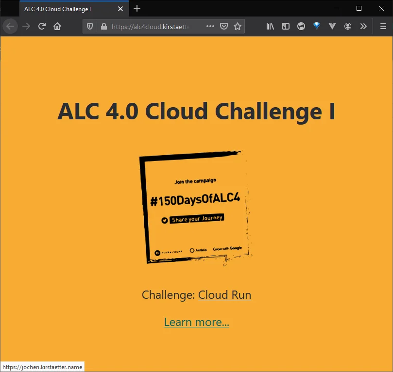

And you're done, again.

Check out the documentation on [Mapping custom domains](https://cloud.google.com/run/docs/mapping-custom-domains) for more details and background information on this matter.

## Enable Cloud Run API

The Cloud Run API is not enabled by default in your GCP project. The `gcloud` command will prompt you accordingly and allows you to activate it.

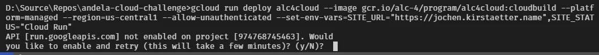

Confirm the question with `Y` and wait as instructed to retry the submission.

Of course, you could also navigate around in APIs & Service &gt; Library in the Cloud Console. [Enable both Cloud Build and Cloud Run APIs](https://console.cloud.google.com/flows/enableapi?apiid=cloudbuild.googleapis.com,run.googleapis.com&redirect=https://console.cloud.google.com&_ga=2.4915251.-1649613044.1542902327).

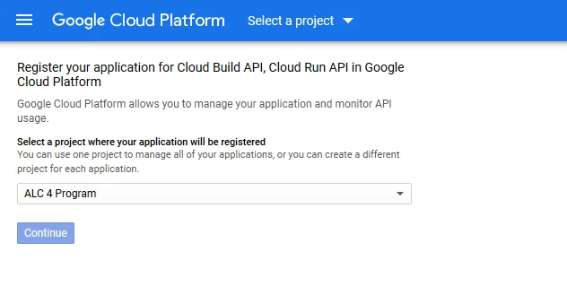

Using Cloud Run as a substitute for Kubernetes Engine has its charm. It offers a faster path to develop, deploy and operate with less administrative overhead. Additionally, Cloud Run provides a richer environment for your applications based on your custom-made stateless container compared to the pre-defined language runtime provided by Cloud Functions.

Apart from adjusting the container to listen to the default port 8080 as per container contract and optionally mapping a custom domain it is an almost effortless workflow to deploy a container image to Cloud Run and make it publicly accessible.

What do you think? Do you have use-cases where Cloud Run is the right choice for you? Leave a comment below and start the conversation with me and other readers.

<small>Image credit: Fitsum Admasu</small>