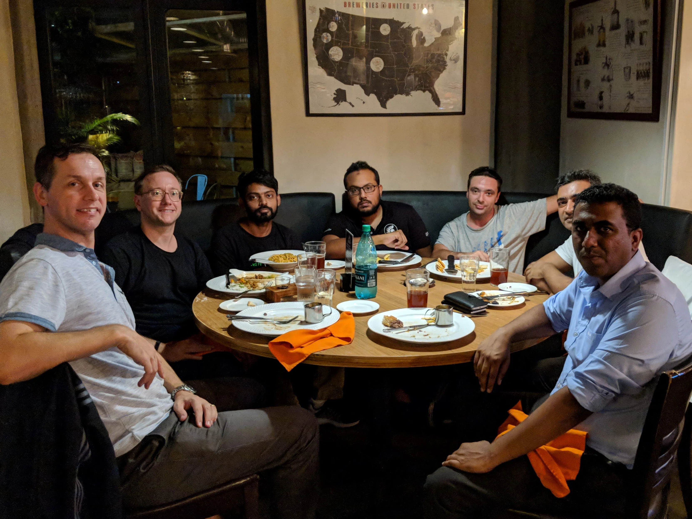
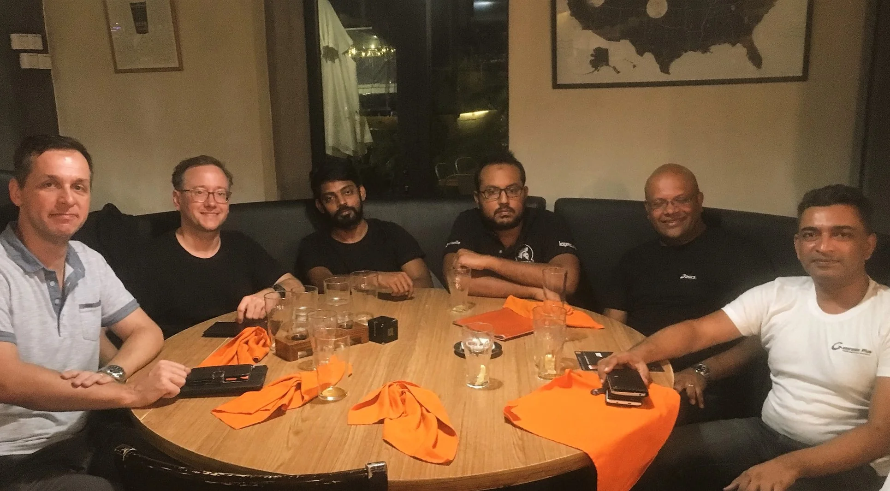

While exchanging with the nice GDG folks over at Google Nigeria about the possibility to get Google interested to assist during the annual [Developers Conference](https://conference.mscc.mu/) of the [MSCC](https://www.mscc.mu/), some magic happened again.

In an email response with my GDG leads at Google, Aniedi came up with an information that Andy Volk would be in Mauritius from 6th to 8th of March for a Google-led event. Hence he suggested *to meet with Andy over dinner and share your experience, insights, challenges and opportunities for developers in Mauritius.* Of course, you don't have to ask me twice for such an opportunity.

A few days and emails later it was set to have dinner with [Andy Volk](https://x.com/downtempo), Google Developer Relations, Sub-Saharan Africa. Generously, Andy asked to get hooked up with a few other community organisers to learn about the developer ecosystem and entrepreneurship landscape in Mauritius.

Given this outstanding opportunity I reached out to some folks and after a few days of communication the following list was set for the dinner evening at Flying Dodo:

- [Yovan Fowdar](https://x.com/YovanFowdar) (Mauritius Maker Community)
- [Chervine Bhiwoo](https://x.com/chervinebhiwoo) (PASS)
- [Sandeep Ramgolam](https://x.com/__Sun__) (Front-End Developers)
- [Vincent Pollet](https://x.com/ictioMU) (Founder of ict.io)
- [Yusuf Satar](https://x.com/__fluxy__) (Linux User Group of Mauritius)
- [Logan Velvindron](https://x.com/loganaden_42) (hackers.mu)
- and me, [Jochen Kirstätter](https://x.com/JKirstaetter) (GDG Mauritius and MSCC)

That line-up changed slightly. Unfortunately, Logan couldn't attend due to some health issues and [Avinash Meetoo](https://x.com/AvinashMeetoo), Senior Advisor to the Minister of Technology, Communication and Innovation, joined us at a later stage.

At agreed time, Yovan was already expecting us and Andy joined us a bit later as he had to attend a rehearsal session for the [Africa Internet Academy](https://x.com/search?q=%23AfricaInternetAcademy) happening during the next few days.

Andy introduced himself and gave us an overview of his activities and involvements in Africa, and that he'd interested to get to know a bit more about the software development and  
entrepreneur scenery in Mauritius. It was rally interesting to hear about the [Launchpad Africa](https://developers.google.com/programs/launchpad/regional/) acceleration program for the region, how the game development scene in South Africa has evolved and contributes to the country's GDP.

Those two hours went too quickly, and it would have been a pleasure to listen more to Andy's activities in the Sub-Saharan Africa region. I'm hooked up for more content and engagement with Google during the coming months. Simply because I love the cross-platform experience and I'd like to broaden my options as a [professional software developer](http://www.ios.mu).