The aOS Community - aOS stands for Azure, Office 365 and SharePoint - organised their first full-day event in Mauritius. A team of international speakers came to talk about the advantages of an integrated platform using Microsoft's platform.

[The event](https://www.eventbrite.fr/e/billets-aos-maurice-24-octobre-2017-37332397205#) was organised with local partners Aerow ECM World Ltd. and LinkByNet Indian Ocean. Among the international speakers were a few Microsoft MVPs, namely [Patrick Guimonet](https://mvp.microsoft.com/en-us/PublicProfile/4029252) ([@patricg](https://x.com/patricg/)), [Michael Noel](https://mvp.microsoft.com/en-us/PublicProfile/4027190) ([@michaeltnoel](https://x.com/michaeltnoel/)), [Sebastian Paulet](https://fr.linkedin.com/in/sebpaulet) ([@SP_twit](https://x.com/SP_twit/)), [Prabhjot Bakshi](https://mvp.microsoft.com/en-us/PublicProfile/5001371) ([@prabhjotbakshi](https://x.com/prabhjotbakshi/)), [Tracy Van der Schyff](https://www.mvp.microsoft.com/en-us/PublicProfile/5002097) ([@tracyvds](https://x.com/tracyvds/)), and of course [Chervine Bhiwoo](https://mvp.microsoft.com/en-us/PublicProfile/5001628) ([@chervinebhiwoo](https://x.com/chervinebhiwoo/)). It was really good to meet and exchange with these folks. More on that later...

## A different venue than usual

The Labourdonnais Waterfront Hotel isn't the usual destination where we IT guys in Mauritius go to. Driving up to Port Louis in the morning was less painful than anticipated and despite having had a bit of traffic I arrived in time and was among the first attendees actually.

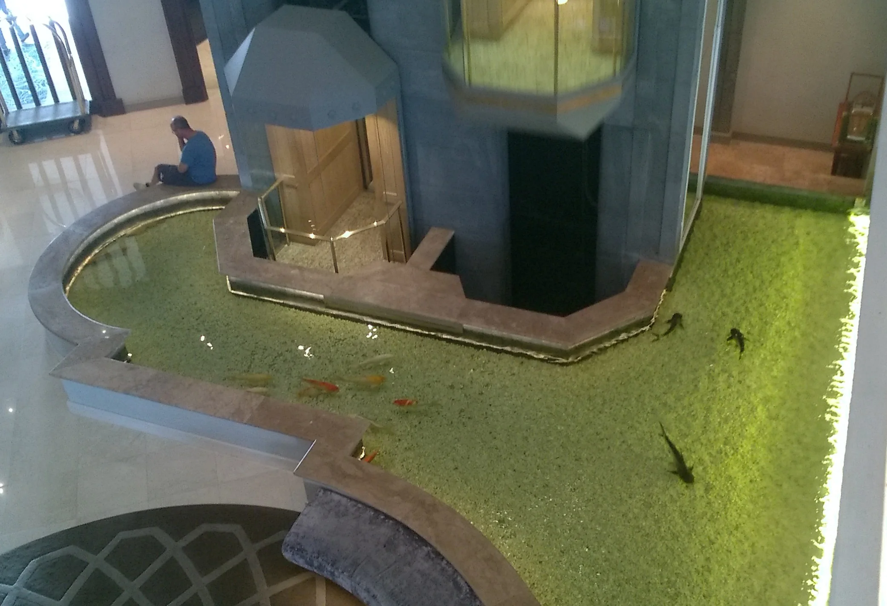

Reaching first floor I immediately ran into Patrick. And although we exchanged on Twitter and Facebook only until this very day, it felt like a reunion of longtime friends that haven't seen each other for ages. Guess, that's what online community spirit is about: Meeting offline and in person.

There was a nice breakfast arrangement and while sipping a glass of freshly-squeezed orange juice, Patrick introduced me to fellow MVPs Michael and Sebastian. Next, I met with Shyam who was on the startup team which I mentored during the [MIT Global Startup Labs](xref:mentor-mitgsl) earlier this year. He gave me a brief update on their progress and future activities. Right now, they are looking for a tech guy who could take care of some of the implementation specific to Mauritian schools.

Slowly, more attendees came and the conversations got more engaged. It was great to hear about other people's jobs, their responsibilities, and involvement in IT. After a short while Prabhjot also arrived and we had good laughs about the experience in India back in April when I spoke at the [annual conference of C# Corner](http://conference.c-sharpcorner.com/). Was only Chervine missing to complete the dream team.

A few minutes before the opening keynote I met Vanessa and her husband Dannisen. We exchanged on the latest updates regarding our upcoming [Developer Conference 2018](https://conference.mscc.mu/), and then it was time to get seated.

## Interesting sessions

The schedule already looked promising and despite the combination of sessions in English and French there was enough material advertised for me to have a great time.

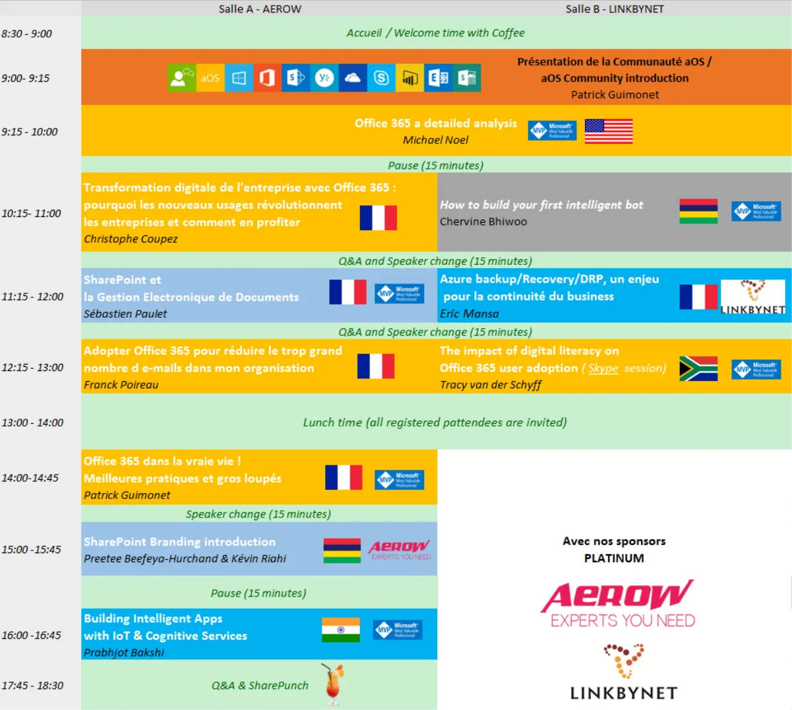

In classic style Patrick officially opened the conference day with his *Introduction of the aOS Community*. I was surprised to hear that they only started back in 2016, and have already progressed so much to travel around the world and to advocate on an international level. Well done!  
With the right funding everything seems to be easier. Something we have to improve within the MSCC for sure. Not the part of international activities but surely on the funding.

Next, Michael went into a *Detailed analysis of Office 365*, and talked about all the applications and services available. Further more, he elaborated on the pricing plans and explained to the audience which features should be considered essential and worth the money to spend compared to some nice-to-have aspects. During his presentation on PowerPoint he run an add-in called [Presentation Translator](https://translator.microsoft.com/help/presentation-translator/).

It's a Microsoft Garage project that "*breaks down the language barrier by allowing users to offer live, subtitled presentations straight from PowerPoint. As you speak, the add-in powered by the Microsoft Translator live feature, allows you to display subtitles directly on your PowerPoint presentation in any one of more than 60 supported text languages. This feature can also be used for audiences who are deaf or hard of hearing.*"

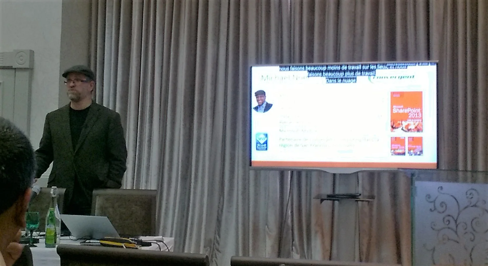

So, while Michael spoke in (US) English, the Presentation Translator displayed the subtitles in French. And surprisingly with acceptable accuracy. Cool, I'm going to try this myself!

After that huge journey through everything Office 365 I stayed in the room to listen to Christophe's reasoning and arguments for a *Digital Transformation in today's companies* and how they could benefit from services offered in Office 365.

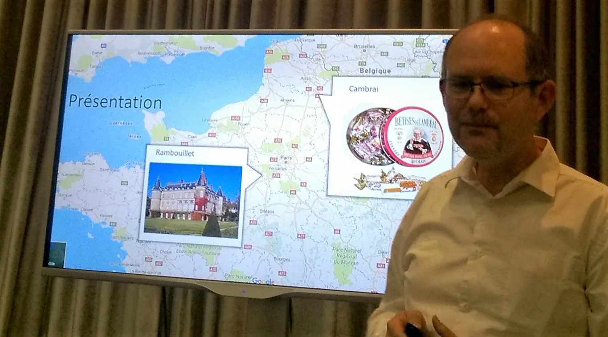

Luckily, it was an easy decision for me as I already knew about Chervine's session on *building an intelligent bot* from previous occasions.

Then it was time to move to the other room. Here, Eric Mansa from LinkByNet Indian Ocean took on the *necessity of Azure Backup*. He gave us a solid overview of what are the available options in Azure Backup, how recovery is done, and what kind of pricing to expect.

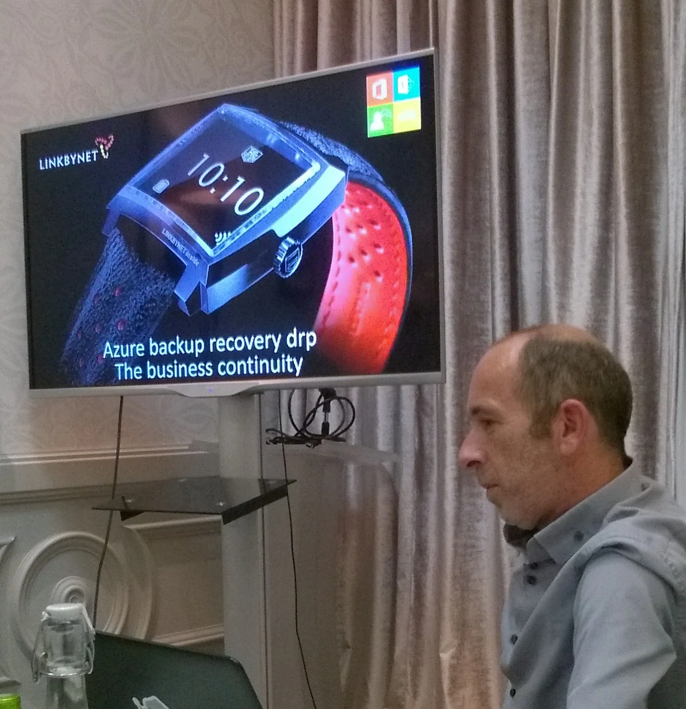

Overall a great session in French and I could follow his explanations.

Surprise! The session about the *Impact of Digital Literacy on Office 365 user adaption* was completely remote using Skype.

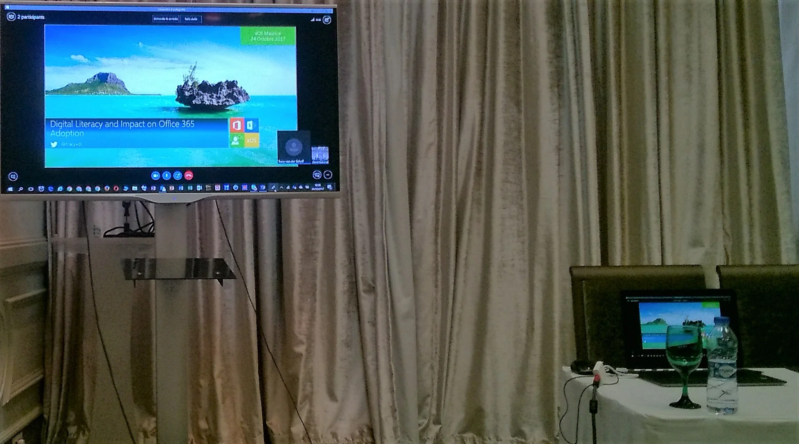

Despite the weird, read: unusual, scenario to sit in a room half full of attendees but without a speaker and still listening to the shared screen on Skype together, Tracy made it an absolutely enjoyable experience. Given her experience in training of computer users she gave a good number of arguments and solutions on how an improved digital literacy would almost automatically lead to an improved user adaption among Office 365 users.

During the breaks I enjoyed the chats with other attendees.

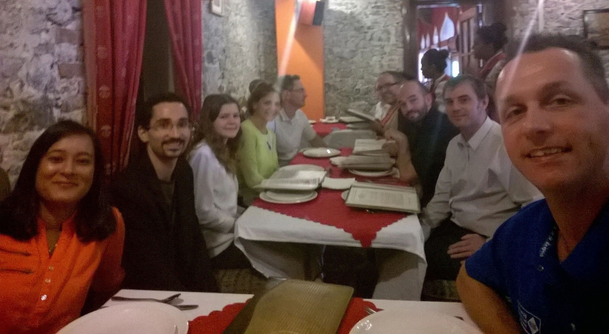

And the conversation at lunch was kind of amusing, too.

From own experience I can tell that the first session after lunch break is a tough one. Attendees are busy with food digestion and ready for a nap instead of paying attention to the talk.

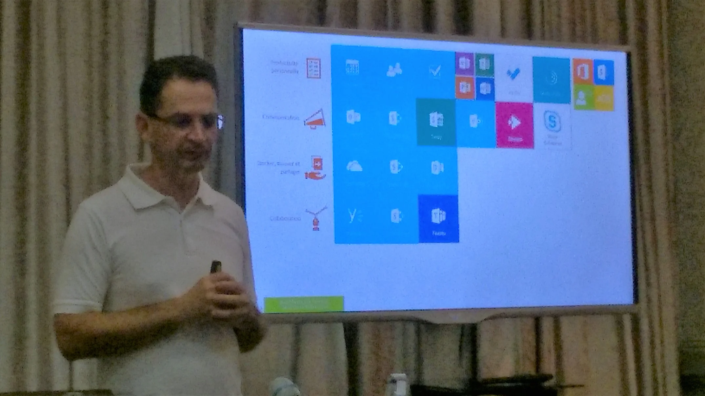

Nonetheless, Patrick went easy on us and shared his experience and knowledge about *Using Office 365 in real-life examples*. He talked about best practices and which pitfalls to avoid. Although, all information was surely relevant I had the impression that a large chunk of his talk was a repetition of some of the morning sessions.

Next, local fellows Preetee and Kevin of Aerow gave a brief overview about the different levels of *SharePoint branding and customisation*. Depending on your customers needs, budget and technical understanding they came forward with three types of branding.

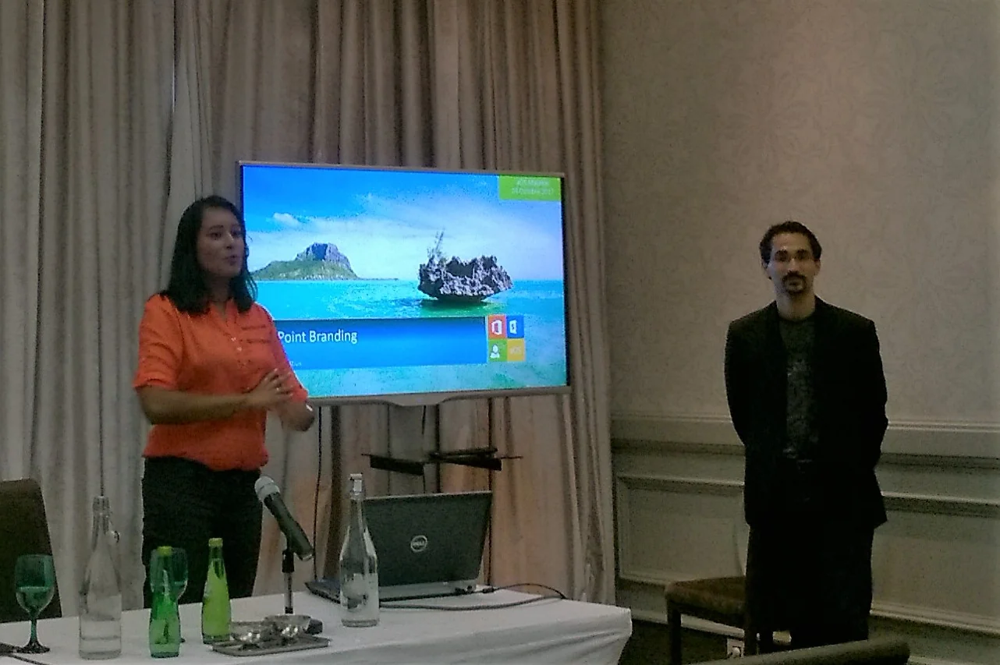

For each level they gave good examples on how it might look like and gave their opinion on best practices. *Stick to the default and don't go too fancy with your SharePoint customisation.*

Last but not least, Prabhjot took the stage and shared his use cases of *Building intelligent apps with Internet of Things devices* and how the generated data could be fed into Machine Learning and Cognitive Services in order to provide better analysis and prediction models.

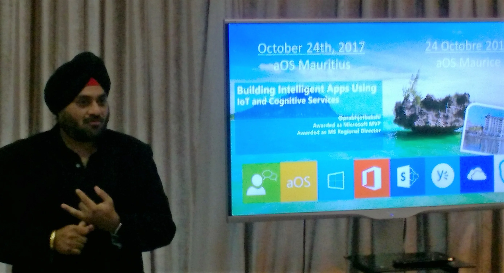

I've seen this talk already during the visit at the GLA University in Mathura back in April but it's still impressive to see how companies are shifting their business model.

## Meeting with other Microsoft MVPs

I have to admit that just the appearance of other Microsoft MVPs in Mauritius was already enough for me to decide to attend the aOS Community event. Given that our island is a bit remote it was a no-brainer to use this opportunity to meet with them.

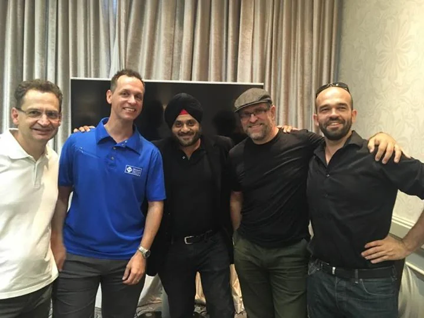  
*Left to right: Patrick, Jochen, Prabhjot, Michael and Sebastien*

Chervine left right after lunch break. He still had to get his stuff ready for the upcoming aOS La Reunion meeting. Unfortunately because of that he isn't in the shot above. Surely, we have to repeat that for next year. Would be great to welcome Tracy then as well.

## What other aOS attendees are saying...

The technical topics of the aOS Mauritius sessions were quite specific. There is interest in or maybe better said curiousity towards Azure, Office 365 and SharePoint among IT geeks in Mauritius. Close to the end, we got all together for a nice photo shooting.

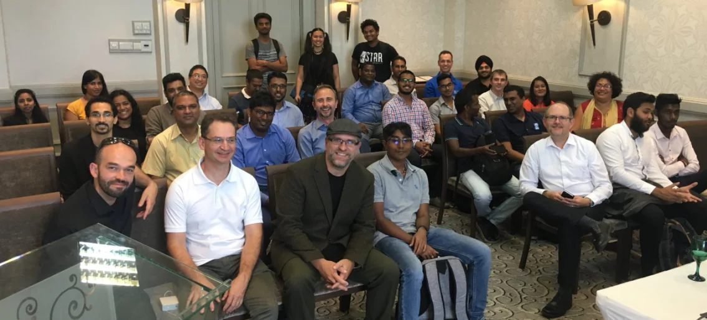  
*Smile everyone!*

With more IT activities like this happening these days there is also a growing number of blog articles being published on the interweb. If you're interested to know more about the first aOS Mauritius event from others, please check out the following blogs:

- [aOS Mauritius meeting](http://semi-colon.azurewebsites.net/2017/10/25/aos/) by Varun
- [aOS Maurice 24 Octobre 2017](https://www.nythiennzo.codes/blog/2017/10/25/aos-maurice-24-octobre-2017/) by Nythiennzo

I'd be happy to receive some feedback from you down in the comments. Are you an active Azure, Office 365 or SharePoint user or maybe even a developer in that area? Did you attend and why? Why didn't you come to attend this unique opportunity?

## Resources

Thankfully, the aOS Community made their presentations / slide decks available online. Check out their web site on [aos.community](http://aos.community) and [the various decks on SlideShare](https://www.slideshare.net/aOSCommunity/).

Following is a collection from the sessions I attended:

- [2017 10-24 aOS présentation - aOS Mauritius](https://www.slideshare.net/aOSCommunity/2017-1024-aos-prsentation-aos-mauritius?qid=6455d52f-91d1-4525-a6d9-838a79c39883)
- [SharePoint et la Gestion électronique de documents - Sébastien Paulet](https://fr.slideshare.net/SbastienPaulet/gestion-des-documents-sous-o365/1)
- [Transformation digitale de l’entreprise avec Office 365 - Christophe Coupez](https://www.slideshare.net/aOSCommunity/transformation-digitale-de-lentreprise-avec-office-365-christophe-coupez)
- [Digital Literacy and impact on Office 365 user adaption - Tracy Van der Schyff](https://www.slideshare.net/TracyVanDerSchyff/aos-mauritius-24-october-2017/1)
- [Bonnes pratiques pour votre espace de travail numérique Office 365 - Patrick Guimonet](https://www.slideshare.net/aOSCommunity/bonnes-pratiques-pour-votre-espace-de-travail-numrique-office-365-patrick-guimonet)

Thanks to Patrick, Patricia and aOS team for organising!  
Kudos to Aerow ECM World and LinkByNet for supporting!