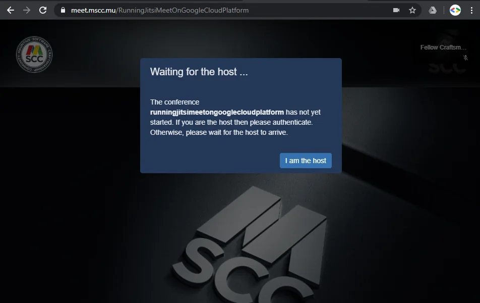
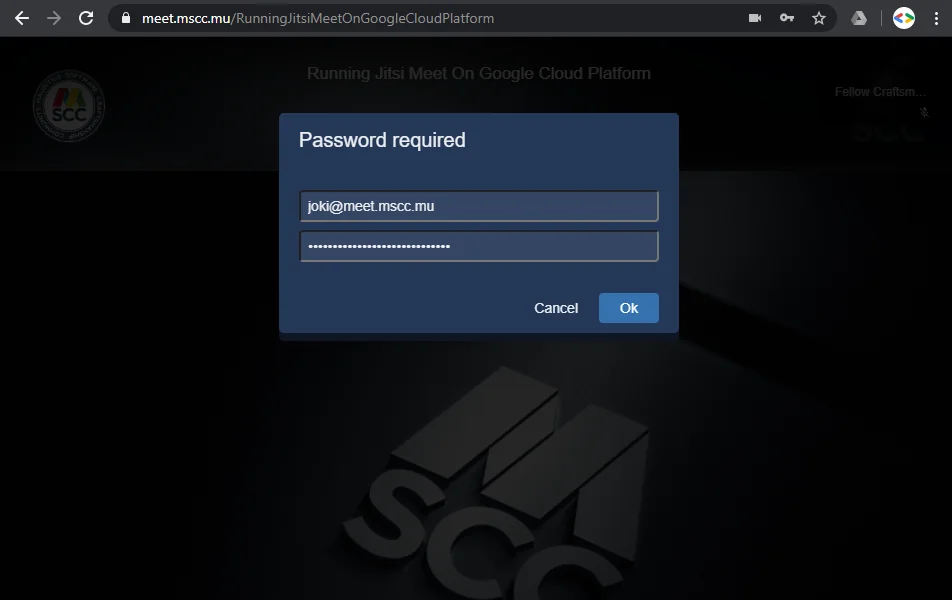
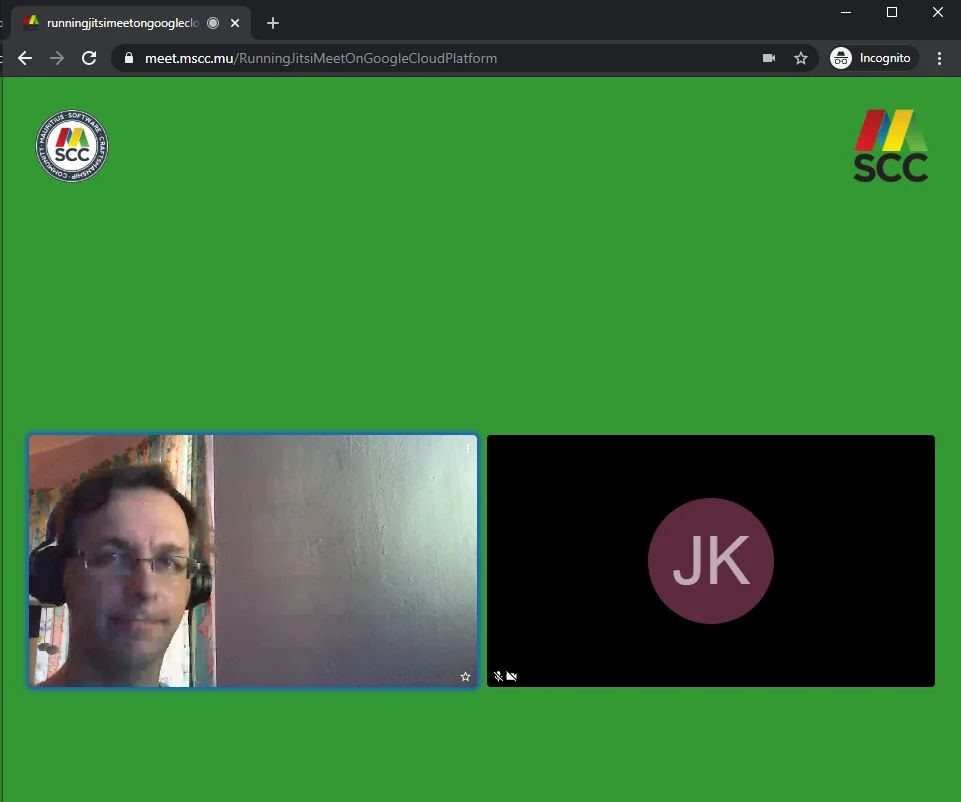
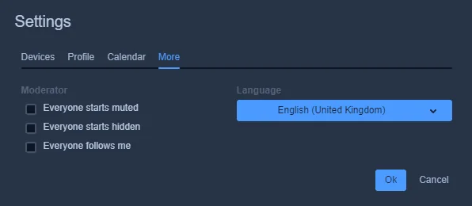
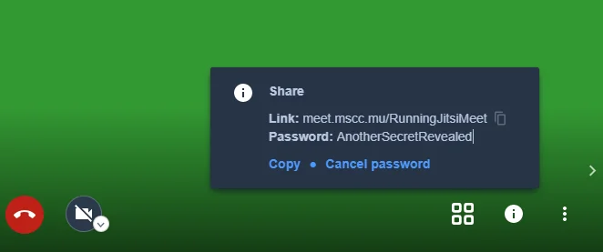

A basic installation of Jitsi Meet gets you up and running within shortest time, probably in less than 15 minutes. There are hardly any configuration changes necessary. Most important information is a fully qualified domain name (FQDN), and that's it.

However such a default installation of Jitsi Meet is open. Meaning, that anyone knowing the URL of your server can create a new meeting room and start to have video conferences using your instance and probably causing additional cost.

In this second article on Jitsi Meet we are going to enable authentication to avoid any misuse from public users. Please read [Install Jitsi Meet on Compute Engine (GCP)](xref:install-jitsi-meet-on-gcp) in case you have not created your own instance yet.

Securing your instance of Jitsi Meet requires three configuration changes plus the creation of user accounts with permission to host conference calls.

Let's have a look at the architecture of Jitsi Meet to get a better understanding.

](../content/images/2020/04/image-22.webp)

It is possible to allow only authenticated users for creating new conference rooms. Whenever a new room is about to be created Jitsi Meet will prompt for user name and password. After the room is created others will still be able to join from an anonymous domain.

## Extend the Prosody configuration

The central component of Jitsi Meet is the Prosody XMPP server which is responsible for user management among other tasks, like authentication.

Open the configuration file of your domain with your preferred text editor.

```
nano /etc/prosody/conf.d/$(hostname -f).cfg.lua
```

Here you change the current value of *authentication* from `anonymous` to `internal_hashed` like so.

```
VirtualHost "meet.mscc.mu"
        -- enabled = false -- Remove this line to enable this host
        -- authentication = "anonymous"
        authentication = "internal_hashed"
...
```

Additionally, you add a new virtual host definition at the end of the same file.

```
...
VirtualHost "guest.meet.mscc.mu"
    authentication = "anonymous"
    c2s_require_encryption = false
```

Save the file to confirm the modifications**.**

**Note:** The domain of the guest VirtualHost is internal only. It does not require any DNS record or SSL certificate.

The outcome is now that the primary VirtualHost of your Jitsi instance would require any kind of authentication to create a conference meeting room whereas the VirtualHost for guests still grants access to anonymous users.

## Add guest domain to Jitsi Meet frontend

After adding the guest domain to the XMPP server component, you need to add this VirtualHost to the configuration object in the web frontend.

Open the config file with a text editor.

```
nano /etc/jitsi/meet/$(hostname -f)-config.js
```

Then you add the directive `anonymousdomain` into your `hosts` object.

```
    hosts: {
        // XMPP domain.
        domain: 'meet.mscc.mu',

        // When using authentication, domain for guest users.
        // anonymousdomain: 'guest.example.com',
        anonymousdomain: 'guest.meet.mscc.mu',
...
```

Save and close the configuration file to confirm your modifications.

As you might see in the comment in the hosts sections, it already stipulates that your instance is going to use the new domain for guest users.

## Change Jitsi Conference Focus

Next, you have to configure the [Jitsi Conference Focus (jicofo)](https://github.com/jitsi/jicofo) component to allow requests from an authenticated domain only. For that you need to add the protected URL to the properties files. Open it with a text editor.

```
nano /etc/jitsi/jicofo/sip-communicator.properties
```

Add the key-value pair `org.jitsi.jicofo.auth.URL=XMPP:<domain>` at the end of the file, and save it.

```
...
org.jitsi.jicofo.auth.URL=XMPP:meet.mscc.mu
```

## Restart all Jitsi services involved

With all changes mentioned above you need to restart the services to apply all modifications. Run the following commands or restart your VM instance completely.

```
service prosody restart
service jicofo restart
service jitsi-videobridge2 restart
service nginx restart
```

## Check the log files

Should you come across some unexpected issues always have a look at the log files first. Here is a brief overview of where to check.

```
# Prosody
tail -f /var/log/prosody/prosody.log

# Jicofo
tail -f /var/log/jitsi/jicofo.log

# Jitsi video bridge
tail -f /var/log/jitsi/jvb.log

# nginx
tail -f /var/log/nginx/error.log
```

## Create your moderators

For the last step, now that authentication is active, you need to create at least one user which is going to have permissions to create meeting rooms.

According to the architecture it is the Prosody component which is responsible for this part. The command `prosodyctl` helps you to manage your XMPP server and therefore your user base.

You can add and enable a user with the following command.

```
prosodyctl register joki $(hostname -f) VerySecretPassword
```

The syntax is described here.

```
prosodyctl register --help
Usage: /usr/bin/prosodyctl register USER HOST [PASSWORD]
 Register a user on the server, with the given password
```

Unfortunately, this is ***not* GDPR-compliant**, because “enabling users to set their password without the admin knowing it” is a basic and unavoidable security measure.

**Congratulations!**  
You completed all necessary steps to enable authentication in your instance of Jitsi Meet. All steps described above are mainly based on the official guide to [Secure domain on GitHub](https://github.com/jitsi/jicofo#secure-domain).

Let's try it...

## Authenticate against your instance of Jitsi Meet

Open a browser and navigate to your URL of Jitsi Meet. The site should load as before and there are no obvious changes visible. Authentication is bound to the creation of a meeting room only.

Either you choose an existing meeting room or you enter a new name and click on `GO` to start the video conference session. If you are not authenticated the site will now place you in some kind of virtual lobby until a moderator or host arrives.



In case that you are the host of the meeting click on `I am the host` and you will be asked to enter your credentials. You can either enter just the user name without your domain or the fully qualified user name including the domain - both approaches will work.



Enter your passphrase and click `OK`. With successful authentication against Prosody the Jitsi Meet component will grant you access to the meeting room and assign moderator permissions to your account.

Public access is still possible as soon as a moderator (host) is present in the meeting room.



As a moderator you will get additional options under Settings &gt; More which allow you to control what should happen when someone enters the meeting room, e.g. being automatically muted or not being visible to other participants.



Enjoy your next, secure video conference.

## Consider to set password per meeting room

An additional level of protection against "[Zoom-bombing](https://en.wikipedia.org/wiki/Zoombombing)" or unwanted intrusion into a video conference would be to activate the password of the meeting room.

Click on the `i` circle in the bottom right area and click on `Add password` in the popup dialog.



Enter your room-specific password and hit `Enter` to confirm your choice.

**Note:** The password of a meeting room is not persistent and needs to set each time that you would join / start a conference call. You cannot launch a meeting room with an initial password already set.

## What's Next?

Perhaps you noticed that the visual appearance of the Jitsi Meet instance running for MSCC looks slightly different to the default installation.

The next article in this series is going to dive deeper into the possibilities to customise the look of your instance of Jitsi Meet.
