In a previous article on [Create NuGet packages with Visual Studio / Visual Studio Code](xref:create-nuget-packages-vs-code) the software development lifecycle (SDLC) from build, pack, and deployment is done manually. Which can be quite time-consuming, tedious and tends to be error-prone given human interaction necessary. How about automating that process completely using Google Build?

## What's Google Build?

Shortly said, [Cloud Build](https://cloud.google.com/build) is a service that executes your builds on Google Cloud. Or perhaps more precisely.

> Cloud Build, Google Cloud’s continuous integration (CI) and continuous delivery (CD) platform, lets you build software quickly across all languages.

There are various machine types available and you can create a private pool for specific machine configurations or requirements.

The interesting part for single developers and probably small(er) teams is that Google Build offers a free tier which includes 2,500 build-minutes (at the time of writing) which can be used to automate quite some tasks.

Learn more about [Google Cloud Build Pricing](https://cloud.google.com/build/pricing).

## How to get started?

Navigate to Google Cloud Console, select your project and then enable the Google Build API for that project (and associated billing account).

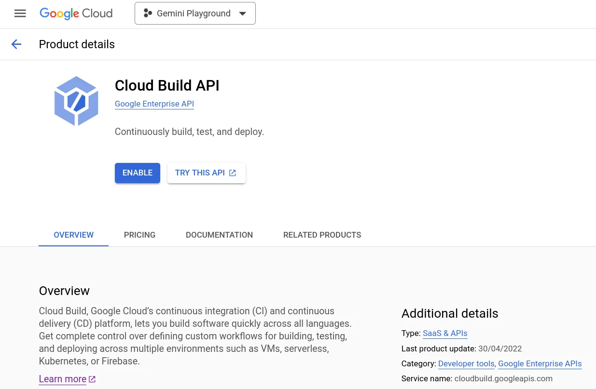

Or if you prefer to use the `gcloud` CLI tool run the following command.

```bash
gcloud services enable cloudbuild.googleapis.com
```

If you are prompted to authorize the gcloud CLI, enter your credentials. Once the API is enabled, you can use the gcloud CLI to manage your builds. For example, to create a build, run the following command:

```bash
gcloud builds submit --config cloudbuild.yaml	
```

Which gives us the next glue. We need a build configuration file that instructs Google Build what to do. A basic build configuration file is described in the documentation: [Create a build configuration file](https://cloud.google.com/build/docs/configuring-builds/create-basic-configuration).

## Use build configuration file

Writing such a build configuration file from scratch manually would be quite time consuming and probably a journey of trials and errors. Let Duet AI do the boring parts for us.

> How to use Google Build to automate the build process?

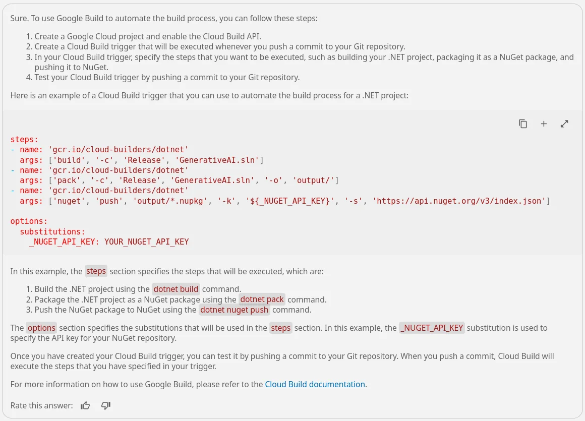

### Build, pack and push

```yaml
steps:
- name: 'gcr.io/cloud-builders/dotnet'
  args: ['build', '-c', 'Release', 'src/Mscc.GenerativeAI.csproj']
- name: 'gcr.io/cloud-builders/dotnet'
  args: ['pack', '-c', 'Release', 'src/Mscc.GenerativeAI.csproj', '-o', 'output/']
- name: 'gcr.io/cloud-builders/dotnet'
  args: ['nuget', 'push', 'output/*.nupkg', '-k', '${_NUGET_API_KEY}', '-s', 'https://api.nuget.org/v3/index.json']

options:
  substitutions:
    _NUGET_API_KEY: YOUR_NUGET_API_KEY
```

The generated `cloudbuild.yaml` file located in the project's root folder

Those are exactly the steps we did manually previously.

1. Build the .NET solution in `Release` configuration
2. Pack and put the assembly into the `output` folder
3. Push the generated package to NuGet using an API key

That's a solid fundament and I didn't have to look up the name of the [cloud builder](https://cloud.google.com/build/docs/cloud-builders). Cloud builders are [container images](https://cloud.google.com/containers) with common languages and tools installed in them.

Meaning, we are effectively pulling a Docker image by its container name from Google's Container Registry and use it to execute the arguments specified. The source code for these builders is available in the [cloud builders GitHub repository](https://github.com/GoogleCloudPlatform/cloud-builders). The Cloud Build developer community provides additional [open-source builders](https://github.com/GoogleCloudPlatform/cloud-builders-community) that you can use to execute your tasks. And lastly, you can create your own custom builder for use in your builds.

### A few options

As part of the `options` section you could also specify the `machineType` used to run those steps. The [default machine type](https://cloud.google.com/build/pricing) is `e2-standard-2` with 2 CPUs. Which should be sufficient for the majority of build tasks and is also covered by the free tier of Google Build mentioned at the beginning.

Now, the final part of the build config file is the value of the NuGet API key, and how it can be *injected* into the build process. [Substituting variable values](https://cloud.google.com/build/docs/configuring-builds/substitute-variable-values) can be achieved in different ways. There is a list of default substitutions, the possibility to work with user-defined substitutions, and even dynamic substitutions which are evaluated during the building process.

## Submit to Google Build

Again, asking Duet AI.

> How do I submit this configuration to Google Build with substitutions?

To submit your build configuration file to Google Build, you can use the `gcloud builds submit` command. The following command will submit the build configuration file that you have provided to Google Build:

```bash
gcloud builds submit --config cloudbuild.yaml --substitutions _NUGET_API_KEY=YOUR_NUGET_API_KEY
```

This command will start a build using the configuration that you have provided, with the substitution `_NUGET_API_KEY` set to the value `YOUR_NUGET_API_KEY`. You can track the progress of your build by using the `gcloud builds list` command. Here's an interesting part of the build process.

```bash
Starting Step #1
Step #1: Already have image (with digest): gcr.io/cloud-builders/dotnet
Step #1: Microsoft (R) Build Engine version 16.2.37902+b5aaefc9f for .NET Core
Step #1: Copyright (C) Microsoft Corporation. All rights reserved.
Step #1: 
Step #1:   Restore completed in 322.89 ms for /workspace/src/Mscc.GenerativeAI.csproj.
Step #1: /usr/share/dotnet/sdk/2.1.818/Microsoft.Common.CurrentVersion.targets(1175,5): error MSB3644: The reference assemblies for .NETFramework,Version=v4.7.2 were not found. To resolve this, install the Developer Pack (SDK/Targeting Pack) for this framework version or retarget your application. You can download .NET Framework Developer Packs at https://aka.ms/msbuild/developerpacks [/workspace/src/Mscc.GenerativeAI.csproj]
Finished Step #1
ERROR
ERROR: build step 1 "gcr.io/cloud-builders/dotnet" failed: step exited with non-zero status: 1
```

Given the .NET versions used the default container image is going to fail. Why?

Because it is based on the SDK for .NET Core 2.1! See [GitHub](https://github.com/GoogleCloudPlatform/cloud-builders/tree/master/dotnet)

The project used targets newer .NET versions, and so we need a newer Docker image that we can retrieve from the Microsoft Container Registry (MCR). So, to migrate to the official `dotnet` image, make the following changes to your `cloudbuild.yaml`:

```yaml
- name: 'gcr.io/cloud-builders/dotnet'
+ name: 'mcr.microsoft.com/dotnet/sdk:8.0'
+ entrypoint: 'dotnet'
```

Use the official .NET 8.0 SDK Docker image

Remove the original cloud builder provided by Google Container Registry (GCR) and add the most recent Docker image with .NET 8.0 SDK from the MCR.

The updated build config file looks like so.

```yaml
steps:
# Build the project
- name: 'mcr.microsoft.com/dotnet/sdk:8.0'
  entrypoint: 'dotnet'
  args: ['build', '-c', 'Release', 'src/Mscc.GenerativeAI.csproj']
# Pack the NuGet package
- name: 'mcr.microsoft.com/dotnet/sdk:8.0'
  entrypoint: 'dotnet'

... skipped for brevity
```

Updated choice of Docker container from the MCR

Which returns the expected outcome.

```bash
... skipped for brevity
Step #0:   Mscc.GenerativeAI -> /workspace/src/bin/Release/net8.0/Mscc.GenerativeAI.dll
Step #0:   Successfully created package '/workspace/src/bin/Release/Mscc.GenerativeAI.0.4.4.nupkg'.
Step #0: 
Step #0: Build succeeded.
Step #0: 

... skipped for brevity

Step #0:     142 Warning(s)
Step #0:     0 Error(s)
Step #0: 
Step #0: Time Elapsed 00:00:20.87
Finished Step #0
Starting Step #1
Step #1: Already have image (with digest): mcr.microsoft.com/dotnet/sdk:8.0
Step #1: MSBuild version 17.9.4+90725d08d for .NET
Step #1:   Determining projects to restore...
Step #1:   All projects are up-to-date for restore.
Step #1:   Successfully created package '/workspace/output/Mscc.GenerativeAI.0.4.4.nupkg'.
Finished Step #1
Starting Step #2
Step #2: Already have image (with digest): mcr.microsoft.com/dotnet/sdk:8.0
Step #2: Pushing Mscc.GenerativeAI.0.4.4.nupkg to 'https://www.nuget.org/api/v2/package'...
Step #2:   PUT https://www.nuget.org/api/v2/package/
Step #2:   Created https://www.nuget.org/api/v2/package/ 742ms
Step #2: Your package was pushed.
Finished Step #2
PUSH
DONE
```

A successfully completed build, pack and push of the NuGet package.

## Tune the build config file

While using the `dotnet` Docker image to build, pack and push the NuGet package we might want to reduce the generated output a little bit. In particular regarding the first time experience and telemetry opt-out. Therefore, add the following `env` block into the `options`.

```yaml
options:
  env:
  - 'DOTNET_CLI_TELEMETRY_OPTOUT=true'
  - 'DOTNET_SKIP_FIRST_TIME_EXPERIENCE=true'
```

The resulting build configuration file should look similar to this.

```yaml
# outline the steps to build a .NET project, pack it as Nuget package and push it to Nuget source feed
steps:
# Build the project
- name: 'mcr.microsoft.com/dotnet/sdk:8.0'
  entrypoint: 'dotnet'
  args: ['build', '-c', 'Release', 'src/Mscc.GenerativeAI.csproj']
# Pack the NuGet package
- name: 'mcr.microsoft.com/dotnet/sdk:8.0'
  entrypoint: 'dotnet'
  args: ['pack', '-c', 'Release', 'src/Mscc.GenerativeAI.csproj', '-o', 'output/']
# Push the package to NuGet source feed
- name: 'mcr.microsoft.com/dotnet/sdk:8.0'
  entrypoint: 'dotnet'
  args: ['nuget', 'push', 'output/*.nupkg', '-k', '${_NUGET_API_KEY}', '-s', 'https://api.nuget.org/v3/index.json']

options:
  substitutionOption: 'ALLOW_LOOSE'
  env:
  - 'DOTNET_CLI_TELEMETRY_OPTOUT=true'
  - 'DOTNET_SKIP_FIRST_TIME_EXPERIENCE=true'
substitutions:
  _NUGET_API_KEY: YOUR_NUGET_API_KEY
```

Eventually, it is considerable to use a separate API key for NuGet specifically used for the Google Build submission compared to the one used while doing it manually. I have several API keys in place.

## Where's the actual automation?

Up till now, we have reduced manual labour by using a scripted approach. However, there is no automated process, at least not yet. To achieve an automated publication of a NuGet package we need a trigger. A trigger would initiate the Google Build submission based on a specific interaction, like say pushing a commit to the repository, merging a pull request, or perhaps run at a certain time every day.

> Cloud Build uses build triggers to enable CI/CD automation. You can configure triggers to listen for incoming events, such as when a new commit is pushed to a repository or when a pull request is initiated, and then automatically execute a build when new events come in.

Create a [Cloud Trigger](https://cloud.google.com/build/docs/triggers) to start an automated Cloud Build whenever there are changes to the source code. For that, we need to know where the code repository is located and establish a connection in Cloud Build. Your repositories in Cloud Source Repositories are connected to Cloud Build by default. If you are connecting an external repository, such as one hosted on GitHub or Bitbucket, you will need admin-level permissions on the repository to initially connect your repository to Cloud Build.

Learn more about [Create and manage build triggers](https://cloud.google.com/build/docs/automating-builds/create-manage-triggers#gcloud).

### Connect a GitHub repository

The sample source code is hosted on GitHub. This gives us two options, either we add a new remote to our local workspace and mirror the source code, or we create a trigger with a connection to the GitHub repository. Let's go for the connection.

Open the Triggers section of Cloud Build in the Google Cloud Console.

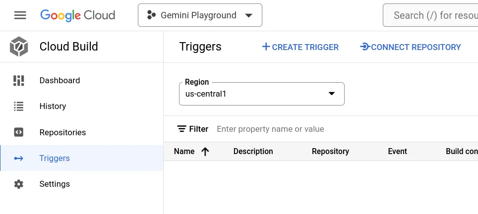

Click on Connect Repository in the top area and complete the connection.

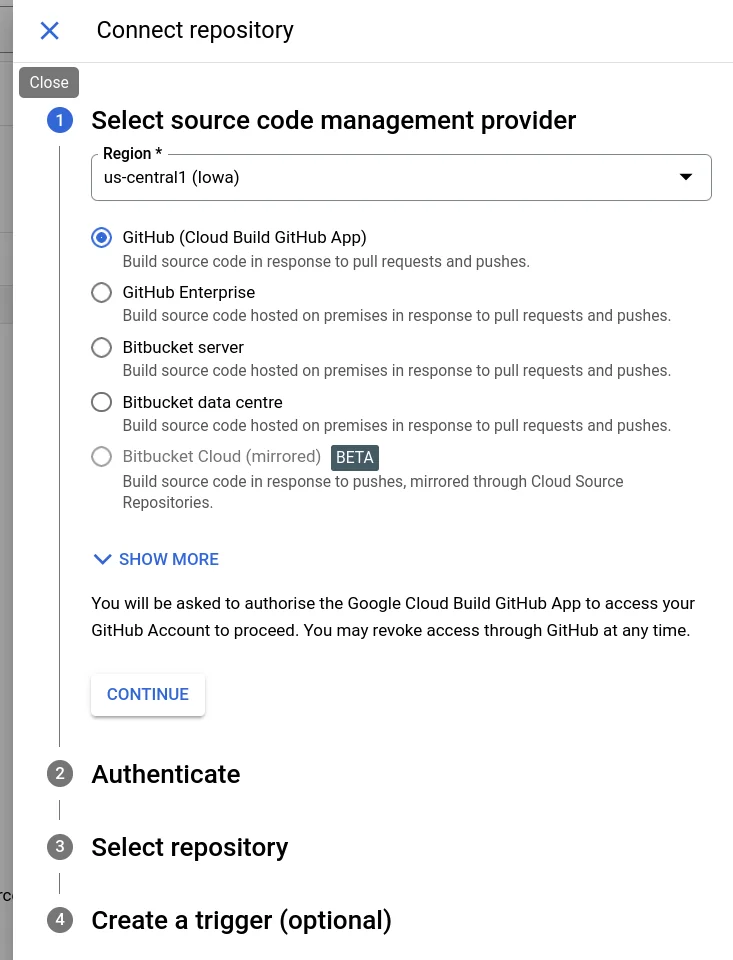

In case of first connection, GitHub asks for your consent to authorize Google Cloud Build to access your repositories.

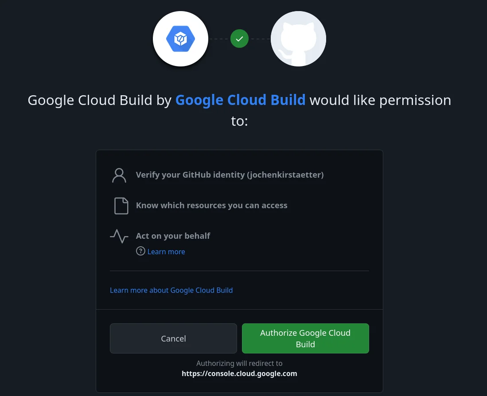

Eventually, the list of repositories on GitHub might be incomplete.

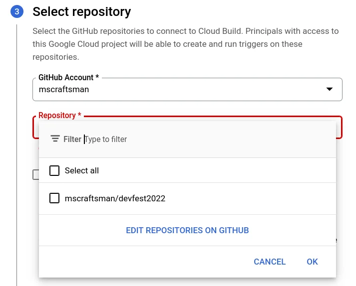

Click on Edit repositories on GitHub to extend the Repository access.

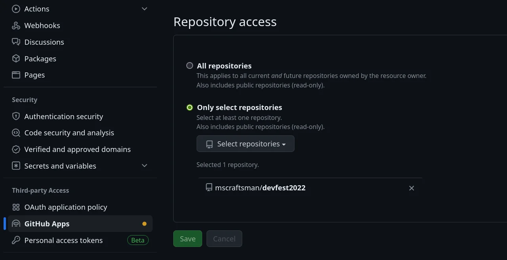

After adding the target repository, we can establish the connection to use in Cloud Build.

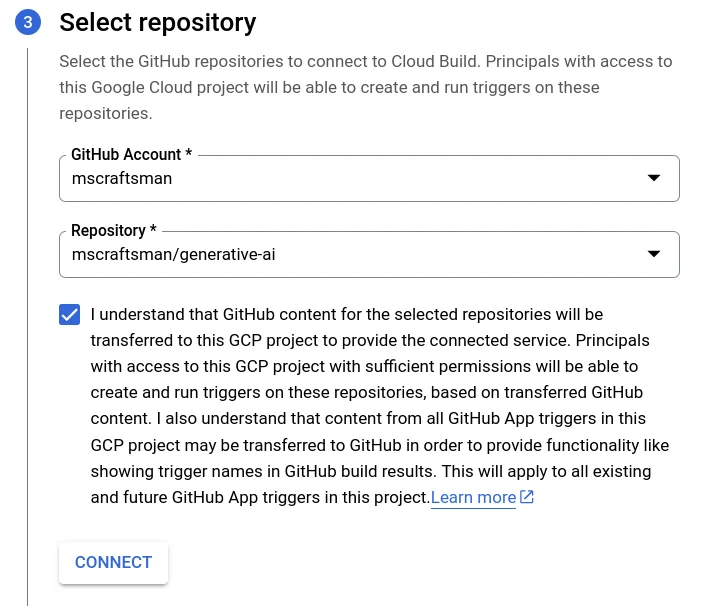

### Create a Cloud Trigger

Last, we create a trigger using the connection. You can accept the suggested one at the end of the connection or create a new trigger.

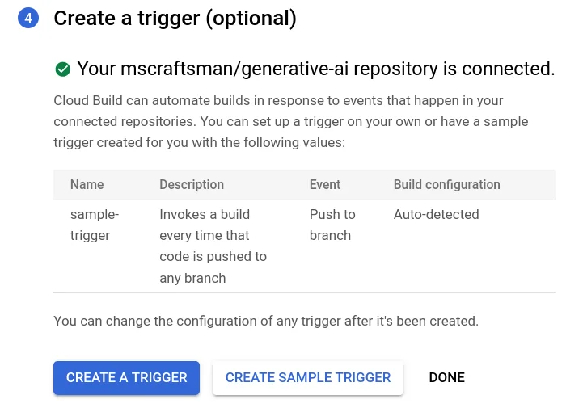

Click on Create sample trigger and you are done.

Out of laziness I created the sample trigger but I'm going to edit it directly afterwards. Why? Because I don't like the suggested name, the suggested description, I don't want the trigger to monitor every branch but the `main`, and most importantly the substitution variables are missing.

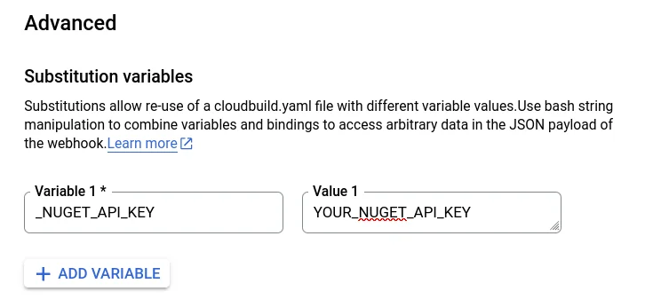

The following `gcloud` command creates the same trigger including the user-defined substitutions.

```bash
    gcloud builds triggers create github \
    --name="nuget-build-push" \
    --description="Build, pack and push to NuGet on main branch" \
    --region="us-central1" \
    --repo-name="generative-ai" \
    --repo-owner="mscraftsman" \
    --branch-pattern="^main$" \
    --build-config="cloudbuild.yaml" \
    --substitutions="_NUGET_API_KEY=YOUR_NUGET_API_KEY"
```

The result should look like this.

```bash
Created [https://cloudbuild.googleapis.com/v1/projects/...].
NAME              CREATE_TIME                STATUS
nuget-build-push  2024-03-03T06:44:22+00:00
```

Learn more about [Create and manage build triggers](https://cloud.google.com/build/docs/automating-builds/create-manage-triggers#gcloud).

## Showtime!

I made some changes to my source code and I'm about to push those commits.

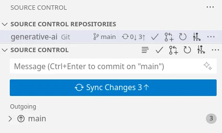

After click on Sync Changes, I open the History section of Cloud Build to check the status.

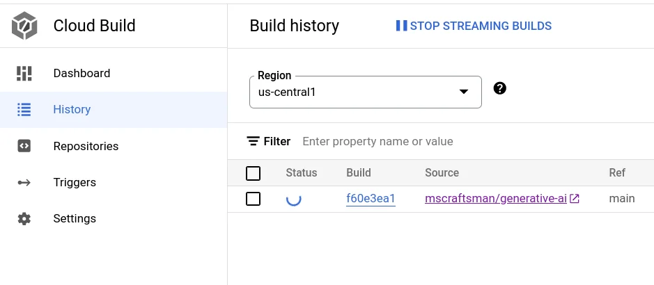

You can directly observe the build steps and see the result of each in the details of a build.

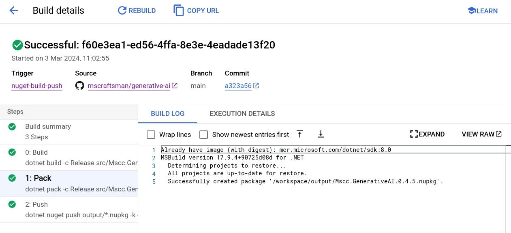

The substitution variables, here the NuGet API key, have been applied and the package has been pushed to nuget.org successfully.

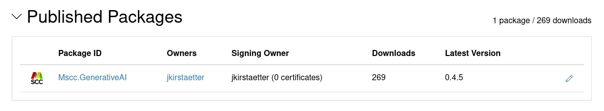

Now with a complete, working CI/CD pipeline using Google Cloud Build, I can concentrate on the source code and the implementation of new features. Gone are the boring and error-prone, manual steps to build, pack and push a new version of the NuGet package.

What a breeze!

But there is more...

## Avoid too many builds

There are reasons you don't want to trigger a new build automatically, like i.e. fixing a typo, amending the documentation, or adding a new test, etc. Any kind of changes to the repository that would not justify / satisfy the deployment of a new version of a NuGet package.

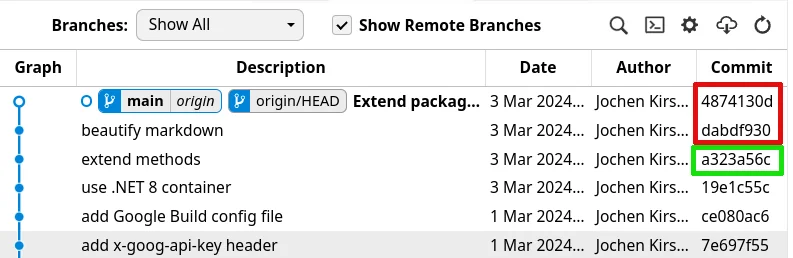

Triggers in Cloud Build provide at least two ways to reduce unnecessary builds and avoid wasting valuable build-minutes in your billing account.

### Use files filter

In such case, you can either specify an `Included files filter` or an `Ignored files filter` using [glob strings](https://en.wikipedia.org/wiki/Glob_%28programming%29) to define which files need to be affected or shall be ignored to trigger a build.

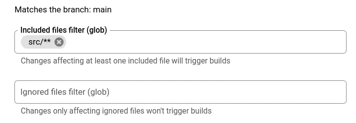

The corresponding `gcloud` options are called `--included-files` and `ignored-files` to manage when a build is triggered or not.

The structure of my public GitHub [generative-ai](https://github.com/mscraftsman/generative-ai) used here in the article, has a folder called `src` that contains the source code of the actual NuGet package. With an included files filter of `src/**` I define that only changes affecting at least one included file will trigger a build.

**Note:** *`**` is a recursive version of `*` which matches all files and directories in the selected directory and its subdirectories.*

### Skipping a build trigger

Additionally, there is the ability to skip a build trigger based on a single commit message. In such scenarios, you can include `[skip ci]` or `[ci skip]` in the commit message, and a build will not be invoked.

If you want to run a build on that commit later, use the **Run trigger** button in the [Triggers](https://console.cloud.google.com/cloud-build/triggers) page.

Learn more about [Cloud Build triggers](https://cloud.google.com/build/docs/automating-builds/create-manage-triggers).

<small>Image credit: Gemini using prompt "an image showing the creation of packages"</small>