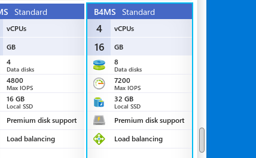
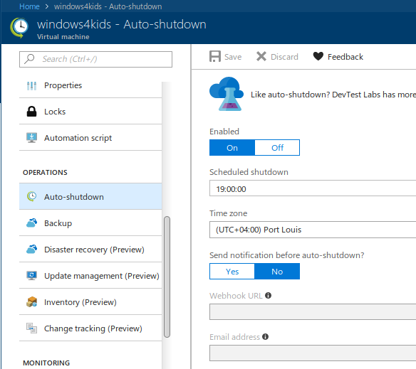
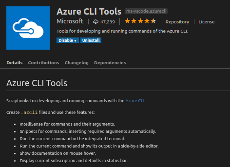
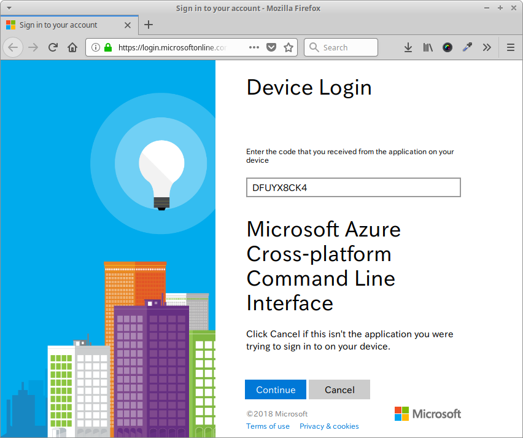
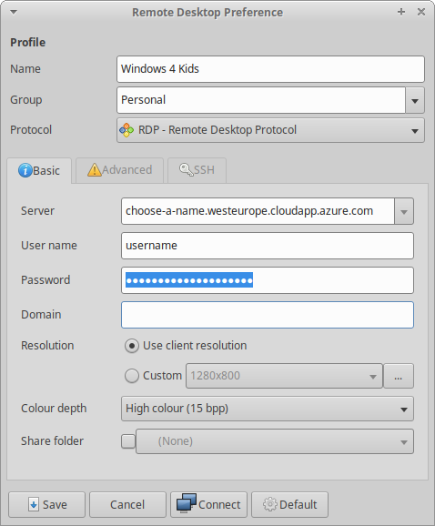

Our children have computer lectures at their primary school since this year. In general, it's a great idea that students are exposed to computer literacy at an early stage. But sometimes it comes with small hiccups. Like in our case...

## Curriculum, literature and exercise book

Although our children have access to computers at home since a while already it is the curriculum of their primary school in regards to IT literacy that lead to this blog article.

The title "Let's Learn ICT Skills" by the [Mauritius Institute of Education (MIE)](http://www.mie.ac.mu/) introduces Computer Fundamentals and Operations to young learners at primary school level. The textbook is divided into six units and covers first steps into the world of ICT.

Starting with an orientation in Windows the title discusses the essential use of typical desktop applications to handle word processing, to introduce simple graphics and presentation skills, to cover basic functionality in spreadsheets and to venture into the unknown areas of the interweb.

Each chapter has different learning objectives and introduces elementary skills in various applications. To keep matters easy the textbook is focused on Windows operating system and the Microsoft Office suite. Which is in general okay for the majority of primary school students.

Well, most students... ;-)

## Our situation to start with - Linux

As a parent it is not easy to trust a full-fledged computer into the hands of your youngster(s) without fearing the whole system might be infested by viruses, malware and ransomware in shortest time. Especially given recent reports on various problems.

Following my decision to provide our [kids with family-friendly and security-enhanced tablets running on Amazon's Fire OS](xref:children-happy-kindle-fire-hdx) compared to regular Android, it was only right to provide them a similar experience on the desktop. At least in my point of view.

Personally, it was important for me to have peace of mind knowing our children are using Linux based system. Don't get me wrong Microsoft has done a tremendous job to improve security over the last decade. It's just that I didn't want to purchase a new laptop for them and Linux runs just fine on older hardware.

Instead of upgrading the available HP laptop from Windows Vista Business to latest Windows 10 I decided to install [Xubuntu 17.04](https://xubuntu.org/) originally. Some weeks back, I then upgraded their machine to Bionic Beaver (version 18.04) already, and they can "beta-test" the upcoming Ubuntu LTS version.

After all, as more and more software is moved towards web applications it really doesn't matter anymore whether Firefox is run under Windows or Linux, does it? Additionally, they have access to LibreOffice, GIMP and other educational software packages like GCompris, and so forth.

Well, the children's exercise book is explicitly covering Windows, some applications of the Microsoft Office suite as well as Paint.net - software that isn't available on Linux out of the box.

## Various approaches are possible

Of course, there is no golden solution to this situation and multiple possibilities are given. All depending on circumstances, personal taste and eventual hardware constraints. Following, I would like to give you an overview of options - all of which I already used successfully in the past.

### Virtualisation

This might come first in someone's mind and I have to agree with that. Installing a virtualisation software like [Oracle VirtualBox](https://www.virtualbox.org/), VMware Workstation or even qemu can be done easily and the the actual experience can be seamless. In our situation though is the existing hardware with a previous generation CPU and 2 GB RAM only the limiting factor to this approach.

### Using wine or CodeWeavers CrossOver

Emulation software like [wine](https://www.winehq.org/) or [CodeWeavers CrossOver](https://www.codeweavers.com/) eliminate the necessity to install and run a complete virtualisation solution. The software provides an abstraction layer of native Windows API functionality and allows to [install and run Windows software](https://www.codeweavers.com/products/crossover-linux/features) like the Microsoft Office suite among others directly on a Linux machine. Luckily, the hardware wouldn't be the limiting factor but I have to confess that it is my laziness to opt-in for this viable approach. Also, the first chapter in the kids' literature - Getting familiar with Windows - wouldn't be possible for them using this approach.

### Remote access

Last but not least, providing remote access to an existing instance of a Windows system seems to be one of the easiest options. Here, the kids get to experience Windows directly and it doesn't need any resources on their Linux system. Using a software package like `rdesktop` or `remmina` enables a Linux user to connect to a Windows system via Remote Desktop Protocol (RDP). So far so good, but I'm not interested to provision a dedicated machine for this purpose at home. The system would be idle most of the time and consume a good chunk of electricity instead.

As mentioned earlier I have used all those approaches successfully, and it is good fun to tinker around with them. But those are most likely options for an adult and not really suitable for a child attending primary school.

## A solution - Cloud-based virtual machine

Taking the pro aspects of each of the approaches earlier I decided to provision a virtual machine running Windows 10 Professional in the cloud. Access to that machine is available using RDP and in regards to hardware constraints it requires an internet connection only.

Actually, this suits me very well as it gives me more control at various levels:

- Local network: I can control at any time whether the kids' laptop gets access to our WiFi network or the internet based on simple authentication and routing configuration.
- Operating times: A virtual machine in Azure is fully controlled through the Azure portal. I can decide when the VM is running and when not.
- Hardware on demand: Provisioning hardware to the VM on Azure is just a few clicks and a reboot away.
- Data exchange: Synchronisation of files between the local Linux laptop and the Windows machine in Azure is based on cloud storage providers like OneDrive, Google Drive, Dropbox, etc. Meaning backup of files is integrated and additional devices like their tablets can be added easily.

Later on, if the VM isn't needed anymore or in case the children totally messed it up I don't have to worry about anything. The VM gets decommissioned and can be provisioned again within minutes if needed.

## Azure configuration and fine-tuning

To start with this educational system for my children I went into the [Azure Portal](https://portal.azure.com/) and created a new virtual machine using the Windows 10 Pro image. To keep it nice and smooth I also created a designated resource group to isolate it from other business-related activities.

### Size of the VM

  
I chose a (hopefully) decent hardware setup running the virtual machine on a Standard B4MS (4 cores with 16 GB RAM) tier. This should be sufficient enough for Microsoft Office 2016, Paint.net and Firefox.

### Auto-shutdown

Also, I activated the auto-shutdown feature which restricts the use of the system until a specified time, and helps me to save a heap of money, too.  
  
The main purpose of that VM is to allow the children to follow the exercises and steps in their school book. At the given time the system simply shuts down, and it's dinner time in the off-line world.

### Starting the VM

Now that we know how to stop the VM we should have a look about how to start it. There are multiple choices available. Most obvious you can launch the virtual machine via the Azure Portal itself. Nothing surprising here.

Next, Microsoft offers the free [Azure mobile app](https://azure.microsoft.com/en-us/features/azure-portal/mobile-app/) for Android and iOS to stay connected to your Azure resources. This is quite neat to manage, monitor and operate Azure on the go.

And then there is `azure-cli` - [the Command-line tools for Azure](https://docs.microsoft.com/en-us/cli/azure/) - which gives you the *next generation multi-platform command line experience for Azure*.

```
$ az 

     /\
    /  \    _____   _ _  ___ _
   / /\ \  |_  / | | | \'__/ _\
  / ____ \  / /| |_| | | |  __/
 /_/    \_\/___|\__,_|_|  \___|


Welcome to the cool new Azure CLI!
```

Usually, I have Visual Studio Code open almost the whole day and starting the kids' virtual machine is done using the Azure CLI Tools extension.  


I'm currently using the following `.azcli` file to manage that VM:

```
# Logging into Azure
az login

# Starting kids' VM on Azure
az vm start -g Personal -n windows4kids

# Stopping kids' VM
az vm stop -g Personal -n windows4kids --no-wait
```

The `az login` triggers the device login on Azure and after entering a generated code to authenticate your machine you get access to your resources on Azure, like this:  


## Accessing the VM

Windows machines on Azure are accessed via RDP and Linux has a variety of client applications for that protocol. In the portal you should assign a static domain name to your VM as the public IP address is most likely to change between daily uses. The portal allows you to download the Connect parameters as a `.rdp` file that you can open in any text editor on Linux.

  
Using the details from the `.rdp` it is possible to set up a new connection in remmina for future use. I'm storing the password to keep it simple for the children to access their new Windows machine.

Now, `remmina` is configured to start automatically after they logged into their account and the Windows VM on Azure is easy accessible via shortcut from the system tray area.

## Give it a try - Azure free credit

Microsoft gives new sign-ups on [Azure](https://azure.microsoft.com/en-gb/) an initial credit that allows you to explore the various options and get yourself familiar with the available resources. Why don't you give it a try?
