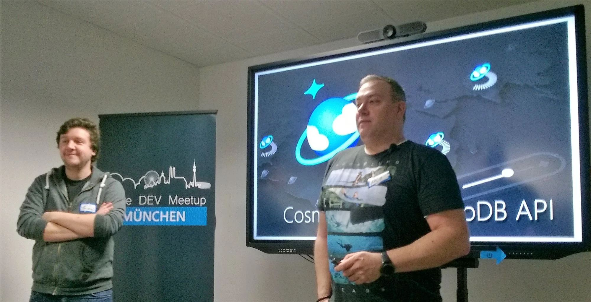
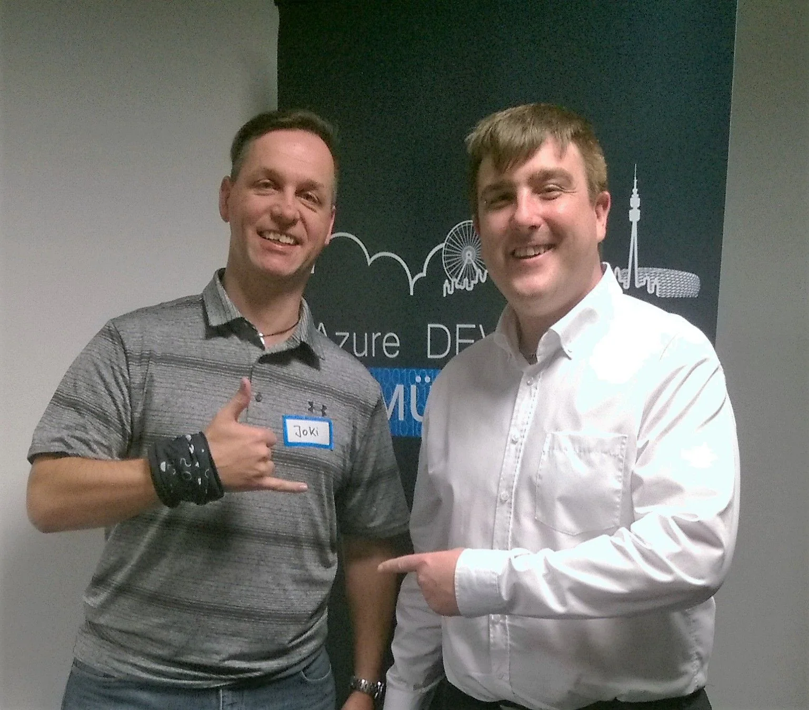
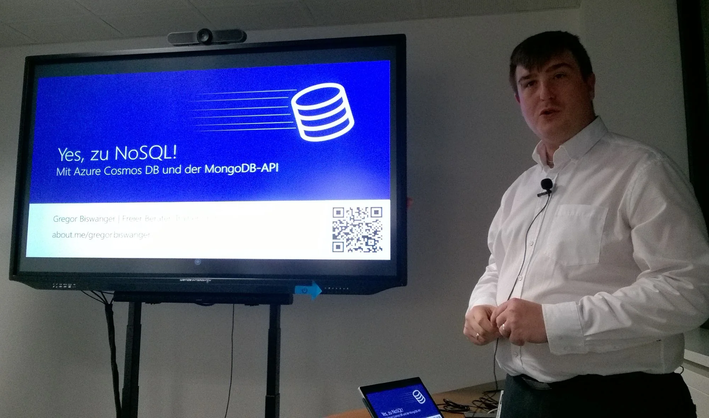

While I was on a business trip to Germany back in February I thought that it might be a good idea to check out some of the local user groups. During the day I would be at the customer's site but I wanted to use the evening hours to discover new opportunities.

Turned out that there are quite a number of active user groups in Munich. However their dates either didn't fit my schedule or the maximum limit of attendees had been reached already or I would have been too late to join the event because of distance and public transport.

Luckily, the [Azure DEV Meetup Munich](https://azuredev.org/) user group (@[AzureDevMuc](https://x.com/AzureDevMuc)) organised an evening event - [Azure Cosmos DB: Yes, zu NoSQL mit der MongoDB-API](https://www.meetup.com/Azure-DEV-Munich/events/268261753/) - suitable for my working hours, and it turned out that the venue wasn't that far from the hotel either. It took me less than 30 minutes to get there. I had to ride two lines of the U-Bahn and take a short stroll by foot from the station.

Actually, I arrived a few minutes after the official starting time, being slightly late. Shame on me? Well, luckily not really because the guest speaker for the night was still stuck in traffic. A few people were already there, enjoying fresh pizza and chilled drinks. Ranging from soft drinks and apple juice to various types of beer.

After being welcomed by one of the hosts, [Thomas Pentenrieder](https://x.com/th_p), I was asked to note down my name on the attendance sheet - on paper BTW -, and stick one of those fancy name tag badges you might know from the movies onto my chest.

](../content/images/2020/04/image-25.webp)

"Hi, my name is 'JoKi'"...

Cool, I really like those stickers and I'm going to source them for our future user group meetings back in Mauritius.

With the name being exposed on that sticker everyone felt at ease to initiate a conversation. It's definitely an icebreaker and helps to avoid those awkward questions about hearing a name properly or not.

It quickly turned out that Thomas is a Microsoft Windows Insider MVP like myself and we talked a little bit about the latest builds and the new features they are offering. And of course, we were looking forward to meet soon at the Microsoft MVP Summit, mid of March in Seattle. Well, that has been scraped...

While munching some slices of delicious pizza others got interested into my technical and professional background as well as how I ended up in Mauritius. Interestingly, some participants knew about Visual FoxPro but were surprised that it still in productive use. Oh yes, it is and it's paying the bills quite nicely too.

Inspired by the Aqualung branded T-shirt I finally engaged in a conversation with the other co-host of the evening, [Ralf Richter](https://x.com/rari2003). Turns out that he goes regularly diving in the nearby lakes in the surroundings of Munich, and that he had been to quite a number of dive spots worldwide. IIRC, Mauritius might be still on his list of 'wanna-go' destinations.

More people joined the meeting, and there had been tons of food and drinks made available. Roughly half an hour after our guest speaker, [Gregor Biswanger](https://about.me/gregor.biswanger) ([@BFreakout](https://x.com/BFreakout)), arrived. Given the community nature of the evening there was enough time to give Gregor a quick break to refresh and to taste some of those delicious pizza.

Funnily, it turned out that Gregor and I have several common friends. First and most remarkable, Markus and Marina.

They witnessed our wedding while they were on their honeymoon in Mauritius. I know both since my early days of working with VFP. Actually, Markus and I worked on the same project(s) back then, we met regularly at the annual dFPUG Entwicklerkonferenz (German FoxPro User Group Developer Conference), and we both run a regional user group of the dFPUG.

Turns out that Marina fixed up Gregor's computer at some stage and Markus got him into public speaking back then. Fascinating!

Our conversation could have lasted for hours. However it was time to get started with the technical topic of the evening.

## Yes, zu NoSQL!

The topic of the evening was about MongoDB and then Azure Cosmos DB. In particular about how to use the MongoDB-API of Azure Cosmos DB.

Do you know where the name MongoDB actually originates from?  
*(Answer at the end of the article)*

Gregor started with a journey of his own experience coming from relational database modelling, and how he started to embrace and love the advantages of NoSQL.

With permission, he showed the entity relationship model (ERM) of a database used for the storage of recipes. In 'classic' manner all data had been normalised and relationships gave information how that data was bound together to specify a recipe.

Using a decision matrix, he called it NoSQL Compass, Gregor went through the DB schema and how the data stored in its relations could be stored in NoSQL fashion. Well, after a few iterations we came to the conclusion that a recipe itself simply forms a document and therefore is a whole in itself. Absolutely no need to split it into whatever chunks.

But you might now say 'how would you query the data for a specific piece of information?' Nothing to worry about, the query syntax for NoSQL provides the needed flexibility. However, in case of a recipe application you would most likely be interested in the whole recipe and less in parts of it.

You'll find more details about that NoSQL Compass and how to use the decision matrix in the corresponding slide deck offered by Gregor *(see below for links)*.

## Live stream and recording

The technical part of the evening was live streamed and the recording is hosted on Youtube. Additionally, Gregor generously put his slide decks online and provided another conference recording of his talk on that topic.

Here are all the links:

- [Azure Dev Munich on Youtube](https://www.youtube.com/channel/UCXGAZBbNiyS00SmzEo3MIFQ)
- Video: [Azure Cosmos DB: Yes, zu NoSQL mit der MongoDB-API](https://www.youtube.com/watch?v=rp5RxFGnwb4)
- Slide deck: [Fachmodell-First - Einstieg in das NoSQL-Schema-Design](https://www.slideshare.net/BFreakout/fachmodellfirst-einstieg-in-das-nosqlschemadesign)
- Slide deck: [Yes zu NoSQL mit MongoDB - Für .NET-Entwickler](https://www.slideshare.net/BFreakout/yes-zu-nosql-mit-mongodb-fr-netentwickler)
- Video: [Yes zu NoSQL mit MongoDB für .NET-Entwickler!](%20https://youtu.be/yWg65GC8a54)

Most of the content is in German language. Perhaps you'll give it a try and then feel free to reach out to me for some translation or questions you might have on MongoDB or the MongoDB-API for Azure Cosmos DB.

## Electron.NET

It shall be noted that Gregor is also a maintainer of [Electron.NET](https://github.com/ElectronNET/Electron.NET) - Build cross platform desktop apps with ASP.NET Core.

I haven't tried that platform yet but made a note to myself to consider it for a future side project or viable assignment.

## The 'After-Party'...

That's when the real fun starts.

Usually after a hard day's work it's time to shake off the stress and tensions and move on to chill and relax. Similar happened after the meetup concluded. Most people gave their greetings and left to head back home.

However given that I had nothing really to do and Gregor wasn't tired enough to hit the sack immediately, we picked up the conversation from earlier and talked quite a lot about communities - in Germany and in Mauritius. I told him about the development here on the island over the past few years, and he seemed also interested to come and speak at our Developers Conference some day.

Of course, we also talked about the [Microsoft MVP program](https://mvp.microsoft.com/) and how it has changed over time. As we are both active MVPs we discussed on a few NDA related topics as well. Was really interesting to have this kind of offline exchange. And Gregor was a bit surprised that [I had been awarded](https://mvp.microsoft.com/en-US/MVP/profile/53d40e60-fe70-490e-8e73-2185b648f26f) earlier than [him](https://mvp.microsoft.com/en-us/PublicProfile/4029095). However he got more awards so far. ;-)

As the conversation went on we discovered more and more common friends and acquaintances, and it was really funny to explore those connections and how they are linked between each other.

It was a great community event and my decision to attend exceeded all kind of expectations. Kudos to Ralf and Thomas who organised the evening and all the best to run the Azure DEV Meetup Munich. Thanks to Gregor for the entertaining talk and demos on MongoDB and how to use Azure Cosmos DB with the MongoDB-API.

Answer: hu**mongo**us - meaning: huge, enormous, extremely large *([Merriam-Webster](https://www.merriam-webster.com/dictionary/humongous))*
