Recently I have been watching the travel documentary "James May, our man in India". One of the episodes, in particular #2, while he is visiting Delhi and Agra, it hit a chord in my memories. Time to write about my trip to India and speaking at the C# Corner Annual Conference 2017.

[C# Corner Annual Conference 2017](http://www.c-sharpcorner.com/news/c-sharp-corner-annual-conference-2017-official-recap), Delhi  
(the link might probably not work anymore)

It all started during 2016 when the founder of C# Corner [Mahesh Chand](https://www.linkedin.com/in/mchand) invited me to come to and speak at the conference in 2016 already. Unfortunately, it was a quite short-noticed call and I had bookings for business scheduled already. Then, about the end of December fellow MVP and MSCC community member [Chervine Bhiwoo](https://mu.linkedin.com/in/chervinebhiwoo) sent me an email to check my Inbox for a potential speaking engagement with C# Corner Conference 2017. And indeed in early January Praveen Kumar and I had some conversation about potential submissions. We quickly agreed on the title of the talk and the rest was all about travel preparations.

## Travelling to India

Whether you are Mauritian or not like in my case, India seems to ask quite a number of citizens to apply for a VISA to enter the country. The application process can be initiated online easily. For the actual VISA I went to the High Commission in Port Louis to pay the fees, drop off my passport and collect it after a week or so. The officer at the High Commission was very forth coming and friendly. Overall a pleasant experience to obtain a VISA for India.

*Note:* The fees for a VISA depend on your citizenship; Mauritians pay less than what I paid for.

For the arrangements for air travel there are multiple options available. Among them are flights on Air Mauritius, Air India, Emirates and others. I do not recall whether there is a direct flight between Delhi and Mauritius though. Probably yes but limited to certain days of the week only. Given the marginal difference in total travel time inclusive stop-over and the comfort offered by the airline, I booked my trip on Emirates with the usual short stop in Dubai. Otherwise, it would have been a stop-over in Chennai or Bangalore.

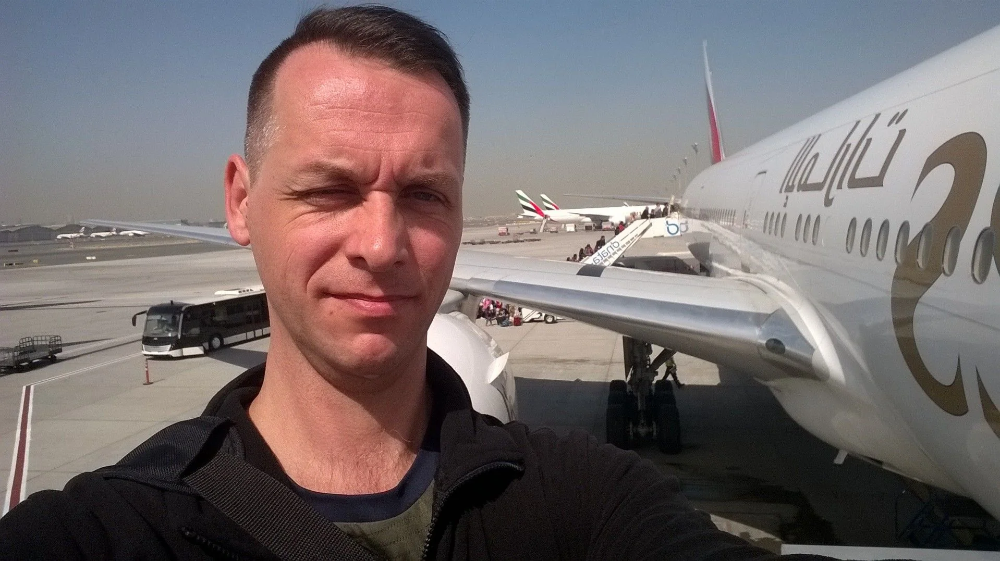

With the additional flexibility of multiple flights per day I opted for Emirates, again. And I even got a nice deal to upgrade to Business Class.

## First impressions

After two unspectacular flights I arrived safely in Delhi during the afternoon. And thanks to the organised airport transfer it was a breeze to experience the traffic first-hand. Whew, I mean driving in Mauritius can be an adventure sometimes in certain areas but this topped everything. It is scary and fascinating at the same time, not sure whether I can describe it using words only. A three-lane road has five to six vehicles of any kind next to each other, ranging from bicycles to auto-rickshaw - aka tuk tuk) to busses and heavyload lorries. And everyone is honking.

Thankfully Manish is used to all of this and we arrived at the hotel in adequate time just to discover another novelty for me. The hotel, or more likely any hotel, seems to be a miniature fortress I got the impression. Heavy fencing around the property, armed units with machine guns slung over their shoulder, car inspection with mirrors to check for explosives, X-ray security scanners for your luggage, and metal detectors for people. Never seen this before...

Anyway, there was a heartwarming reception procedure while waiting for the check-in process to be completed. A bit exhausted I happily reached the hotel room to stretch out and relax a bit. My community fellow and room-mate Chervine arrived a day earlier.

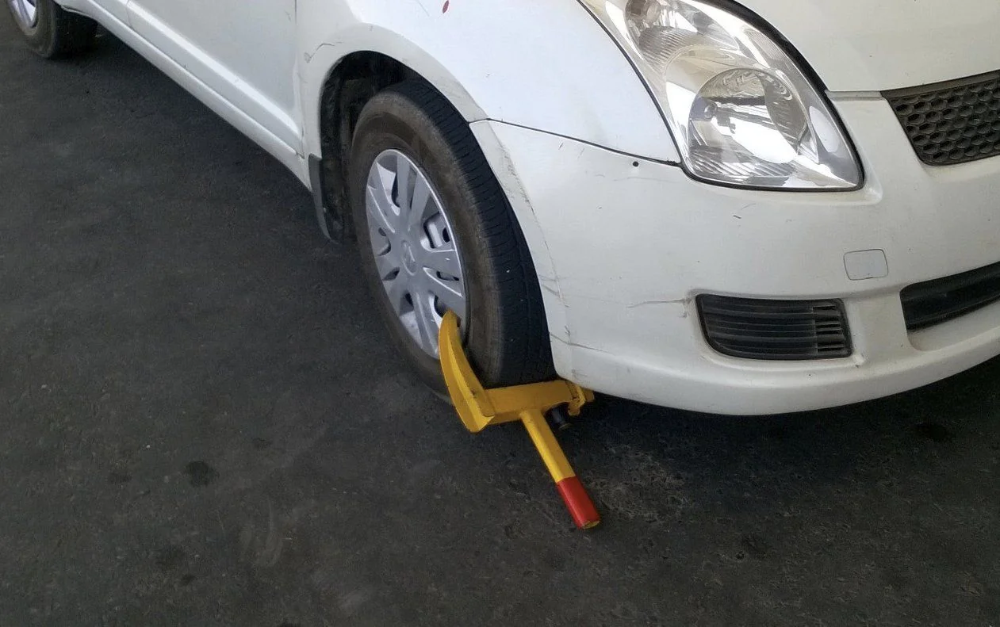

Later this evening, we met with [Dhananjay (DJ) Kumar](https://x.com/debug_mode) and we talked a bit about Mauritius, India, developer communities in general, and all kind of other interesting topics. Totally unexpected and surprising, DJ gifted me the book "The power of habit" by Charles Duhigg. Very much appreciated.

After a wonderful speakers dinner organised by C# Corner it was time to call it a day as there had been plans made for us the next day. This meant to catch some Zzzz's and then wake up earlier than usual.

## Road trip to Mathura

Guess what? It's Uber time! First time, riding on an Uber... It was booked by our hosts in order to meet other speakers for today's trip to Mathura. Speaking in front of CS students at one of the local universities. Initially the Uber trip started quite good, the driver came to the hotel in time and we were off for a quick 30 minutes drive to join the others. And then **he fell asleep** on the wheel...

After the second time grazing the wall in the middle of the highway, the traffic separation, we all urged the driver to stop the car instantly and we hauled another Uber to continue the trip safely. With quite some delay we met with a fellow from C# Corner and we were finally off to Mathura.

Interestingly, the [Yamuna Expressway](https://en.wikipedia.org/wiki/Yamuna_Expressway) passes along the [Buddh International Circuit](https://en.wikipedia.org/wiki/Buddh_International_Circuit) where the Indian Grand Prix in Formula One used to be. A track dominated by Sebastian Vettel during its short period on the F1 calendar. For the final stretch from the expressway to Mathura we drove on <u><em>regular roads</em></u>. We even had to take a diversion through the fields to reach the GLA University in Mathura.

Joining the other speakers and checking out the agenda of the day there was little perparations for my talk on "Advantages and Opportunities of Cross-Platform Development". During my session I explained to the students present the different options and tools available to dive into cross-platform development. Afterwards, there had been quite a number of questions regarding Cordova, Xamarin and Electron which I gladly answered to my best knowledge. I wasn't aware about certain customs, the whole at the university we have been treated with utterly importance. I felt as some kind of celebrity; just showing up and taking the stage to talk. Positive although unusual impressions.

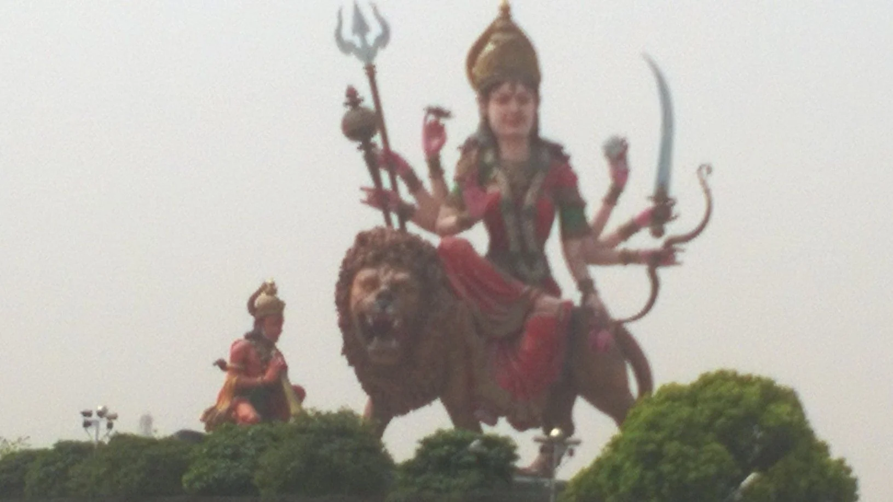

The trip back to Delhi got us into a bit of rush hour. I mean, it's not like there's no traffic all day long but around early evening it seems to intensify by a magnitude or two. Mind-boggling driving experience! Compared to that, driving in Mauritius is like secured road education for young learners at kindergarten. And I figured that the constant honking is just a way to say 'Hello, I'm doing great and I'm an active participant on the road'. Nothing special about that.

We rounded up the day with a speakers dinner back at the hotel. Some of the seasoned speakers shared their experience on delivering a great talk and offered their valuable advice to others. Again, it was a very pleasant activity and well received.

## The conference

Despite my session being scheduled during the early afternoon, I woke up quite early to seize the opportunity to explore the conference venue. There were multiple rooms for the tracks and a large exhibition area for vendors and partners of the event. Big style stuff and very much like any of the European conferences I attended in the past. The registration desks were already buzzing with people. Everyone being really excited about the big day.

As mentioned, there were multiple tracks in parallel and my session had been assigned to Track 1 which was occupying the main hall with the largest amount of seats. Whew, no pressure ;-)

Throughout the day it became appeared that we experienced an increasing delay regarding the starting times of the sessions. Well, nothing to worry about in India, and I have to admit that I was glad for some extra time to prepare myself for the talk. Quick hardware check and also verifying that all code samples and demos were working as expected and I was ready to rumble. It didn't go as smoothly as I hoped for but I had some source code to show on how to develop .NET Core applications on Linux. Back in the days I used Visual Studio Code and the `dotnet` CLI to convey the message to the audience.

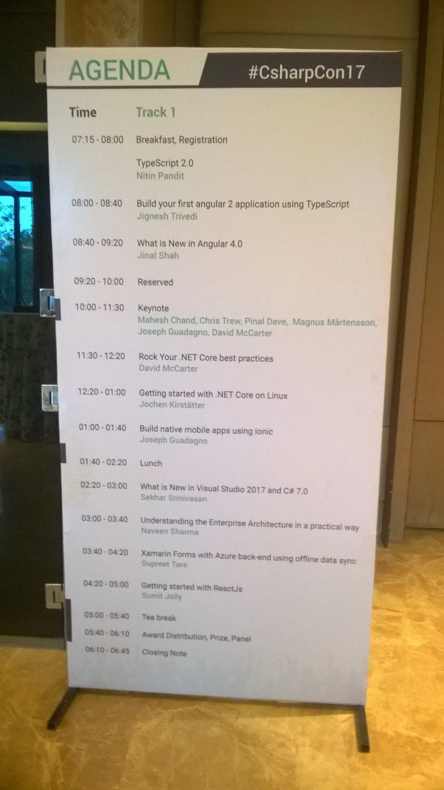

Afterwards, I had some great conversation with Joseph Guadagno about the Microsoft MVP program in general, and we cross-checked our list of MVP contacts. It was pretty amusing to exchange stories regarding some of the folks we both know. Later on, I chit-chatted a bit with [Magnus Mårtensson](https://se.linkedin.com/in/noopman), [David McCarter](https://www.linkedin.com/in/davidmccarter), [Pinal Dave](https://in.linkedin.com/in/pinaldave), and a couple more speakers about their activities related to .NET, SQL Server and of course the C# Corner community. The had been numerous nuggets of great advice for growing our community in Mauritius and I got some ideas for the annual Developers Conference in Mauritius, too.

Later that evening, all speakers and helpers of the conference were invited for a treat: Speakers dinner at a rooftop club in one of the suburbs of Delhi. Great fun I can tell you. And very interesting conversations, lots of jokes and laughter, and finally some great snacks to enjoy. Dunno when but it must have been after midnight that I dropped dead into my bed.

## Agra

A day to relax and go sight-seeing. Chervine came up with the idea of visiting places. First and foremost, the Taj Mahal.

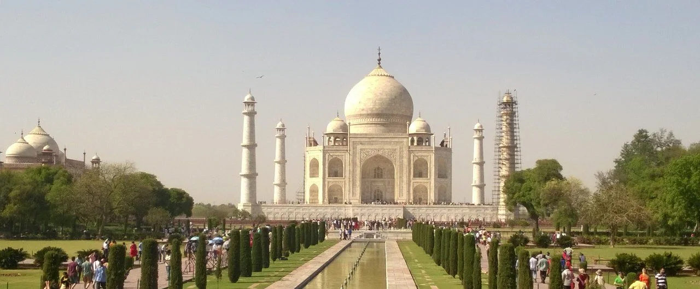

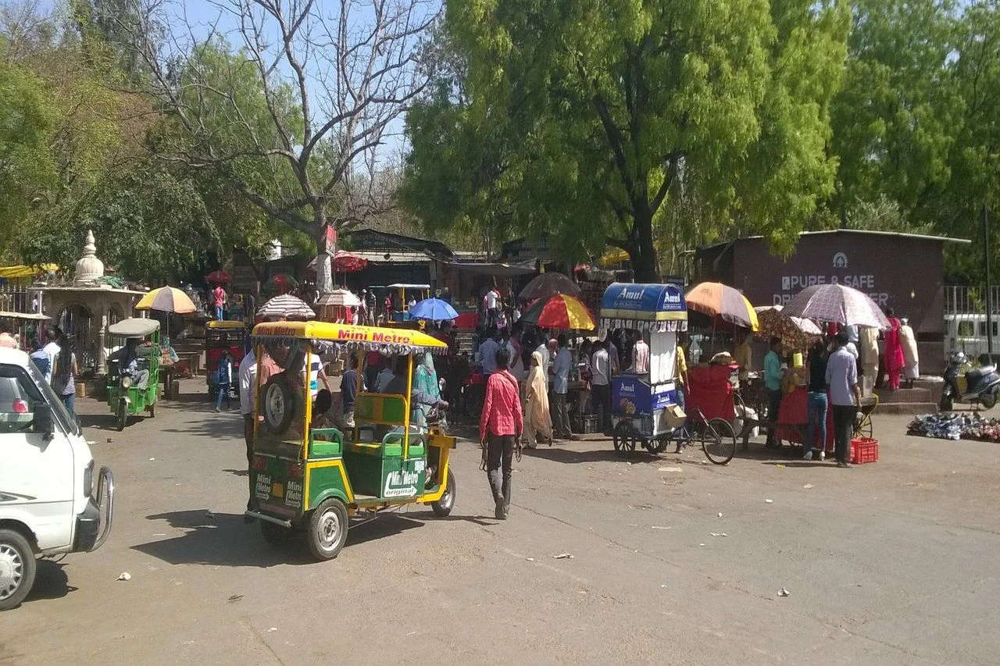

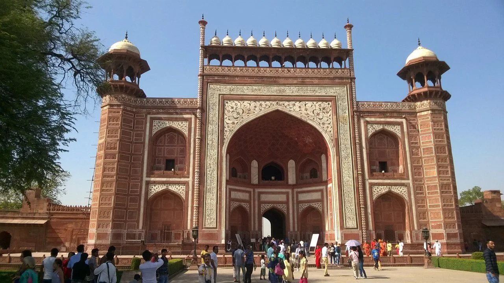

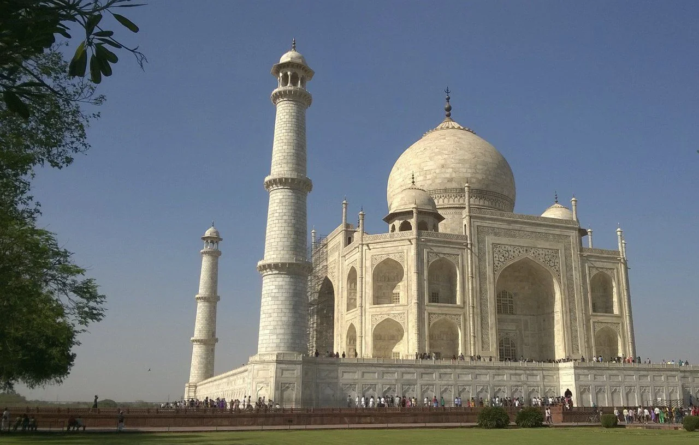

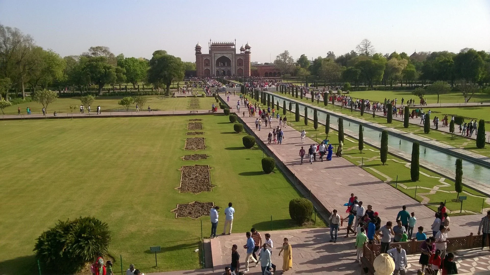

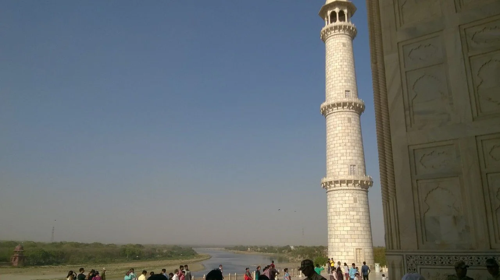

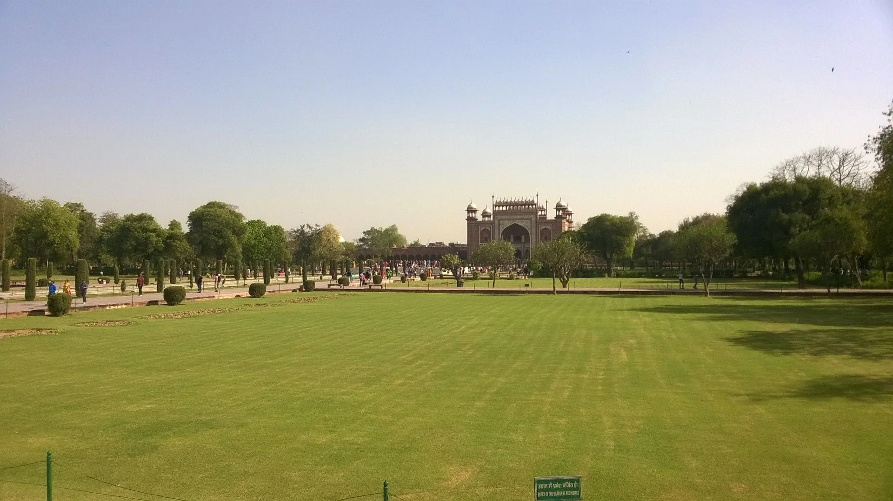

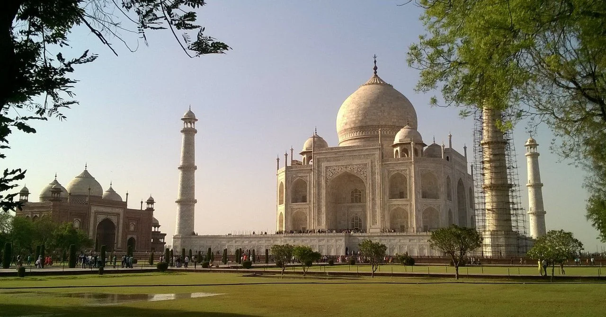

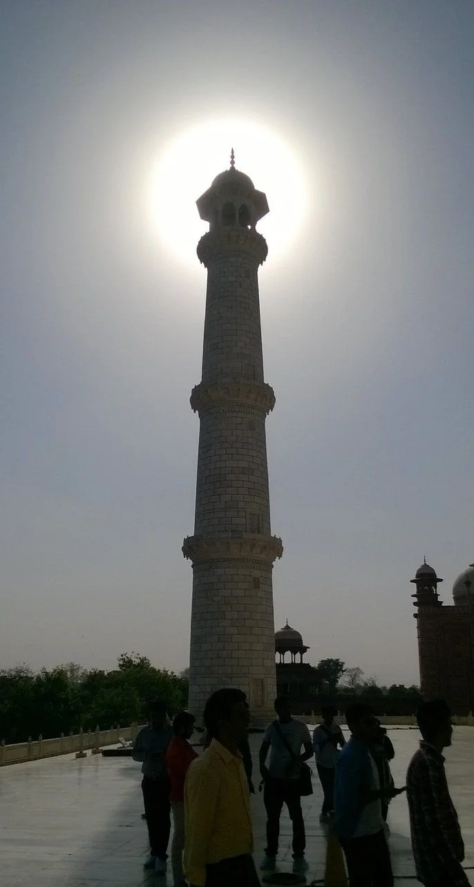

## Exploring Delhi

Last day in India for this trip and my flight is early in the evening. Hence, we decided to explore the city of Delhi. After a savvy breakfast Chervine and I were

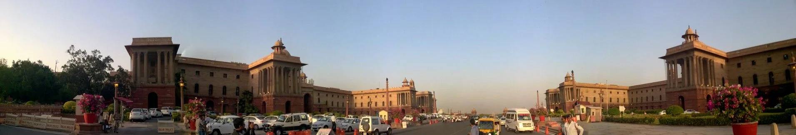

## Personal thoughts

It's quite difficult to express my experience and impressions of India, in particular due to the very short stay, into the right words. Let me say it like this:

It's overwhelming - in any sense and direction!

The first thing that hit me was the incredible amount of people nearly everywhere. Then there is the adventure of road traffic. Frankly, I wouldn't dare to drive around Delhi myself. Not because I don't know how to drive but probably regarding the level of interactions, the level of concentration, and the uncommon levels of sound (honk honk). It's too crowded, perhaps chaotic at certain stages but that's the beauty of it I would say.

Those few days in the state of Uttar Pradesh (UP) were really amazing and I had a great time mingling with other speakers and attendees of the C# Corner Annual Conference. The trips to Mathura and Agra gave me a small glimpse of the beauty of this humongous country called India. Walking through one of the many markets in Delhi and exploring the small shops surrounding it was mesmerising. Seeing the India Gate, the triumphal arch in Delhi, as well as Rashtrapati Bhavan with large park area was a nice treat at the end of my visit.

I'm hoping that this isn't my last trip to India. There are surely other cities like Darjeeling, Chennai, Bangalore, Mumbai, etc. worth a visit. Let's see what the future holds.

My thanks and gratitude to the community fellows at C# Corner. Keep shining!