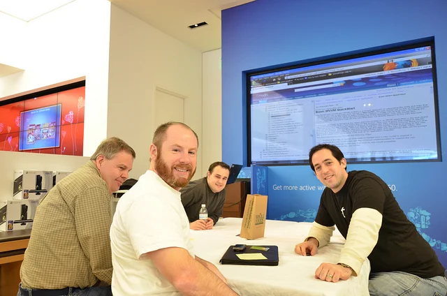

Communication with your environment is an essential part of everyone's life. And it doesn't matter whether you are actually living in a rural area in the middle of nowhere, within the pulsating heart of a big city, or in my case on a wonderful island in the Indian Ocean. The ability to exchange your thoughts, your experience and your worries with another person helps you to get different points of view and new ideas on how to resolve an issue you might be confronted with.

## Benefits of community work

What happens to be common sense in your daily life, also applies to your work environment. Working in IT, or ICT as it is called in Mauritius, requires a lot of reading and learning. Not only during your lectures at the university but with your colleagues in a project assignment and hopefully with 'unknown' pals in the universe of online communities. At least I can say that I learned quite a lot from other developers code, their responses in various forums, their numerous blog articles, and while attending local user group meetings.

When I started to work as a professional software developer (or engineer some may say) years ago I immediately checked the existence of communities on the programming language, the database technology and other vital information on software development in general. Luckily, it wasn't too difficult to find. My employer had a subscription of the monthly magazines and newsletters of a [national organisation](https://www.dfpug.de/ "deutschsprachige FoxPro User Group (dFPUG)") which also run the biggest forum in that area. Getting in touch with other developers and reading their common problems but also solutions was a huge benefit to my growth.

  
*Image courtesy of Michael Kappel (CC BY-NC 2.0)*

Active participation and regular contribution to this community gave me some nice advantages, too. Within three years I was listed as a conference speaker at the [annual developer's conference](https://devcon.dfpug.de/) and provided several sessions on different topics during consecutive years. Back in 2004, I took over the responsibility and management of the monthly meetings of a regional user group, and organised it for more than two years. Furthermore, I was invited to the newly-founded [community program of Microsoft Germany](https://www.microsoft.com/germany/community/programme/clip.mspx "community program of Microsoft Germany") (Community Leader/Insider Program - CLIP). My website on Active FoxPro Pages was nominated in the second batch of online communities. Due to my community work and providing advice to others, I had the honour to be awarded as [Microsoft Most Valuable Professional (MVP)](https://www.microsoft.com/mvp) - Visual Developer for Visual FoxPro in the years 2006 and 2007. It was a great experience to meet with other like-minded people and I'm really grateful for that. Just in case, more details are listed in my [Curriculum Vitae](xref:cv). But this all changed when I moved to Mauritius...

## Cyber island Mauritius?

During the first months in Mauritius I was way too busy to think about community activities at all. First of all, there was the new company that had to be set up, the new staff had to be trained and of course the communication work-flows and so on with the project managers back in Germany had to be sorted out, too. Second, I had to get a grip of my private matters like getting the basics for my new household or exploring the neighbourhood, and last but not least I needed a break from the hectic and intensive work prior to my departure. As soon as the sea literally calmed down, I started to have conversations with my colleagues about communities and user groups. Sadly, it turned out that there were none, or at least no one was aware of any at that time. Oh oh, what did I do?

Anyway, having this kind of background and very positive experience with off-line and on-line activities I decided for myself that some day I'm going to found a community in Mauritius for all kind of IT/ICT-related fields. The main focus might be on software development but not on a certain technology or methodology. It was clear to me that it should be an open infrastructure and anyone is welcome to join, to experience, to share and to contribute if they would like to. That was the idea at that time...

{loadposition content\_adsense}

Ok, fast-forward to recent events. At the end of October 2012 I was invited to an event called Open Days organised by Microsoft Indian Ocean Islands together with other local partners and resellers. There I got in touch with local Technical Evangelist Arnaud Meslier and we had a good conversation on communities during the breaks. Eventually, I left a good impression on him, as we are having chats on Facebook or Skype irregularly. Well, seeing that my personal and professional surroundings have been settled and running smooth, having that great exchange and contact with Microsoft IOI (again), and being really eager to re-animate my intentions from 2007, I recently founded a new community:

## Mauritius Software Craftsmanship Community - #MSCC

It took me a while to settle down with the name but it was obvious that the community should not be attached to one single technology, like ie. .NET user group, Oracle developers, or Joomla friends (these are fictitious names). There are several other reasons why I came up with 'Craftsmanship' as the core topic of this community. The expression of 'engineering' didn't feel right with the fields covered. Software development in all kind of facets is a craft, and therefore demands a lot of practice but also guidance from more experienced developers. It also includes the process of designing, modelling and drafting the ideas. Has to deal with various types of tests and test methodologies, and of course should be focused on flexible and agile ways of acting. In order to meet and to excel a customer's request for a solution.

Next, I was looking for an easy way to handle the organisation of events and meeting appointments. Using all kind of social media platforms like Google+, LinkedIn, Facebook, Xing, etc. I was never really confident about their features of event handling. More by chance I stumbled upon Meetup.com and in combination with the other entities (G+ Communities, FB Pages or in Groups) I am looking forward to advertise and manage all future activities here:

> [Mauritius Software Craftsmanship Community](https://www.meetup.com/MauritiusSoftwareCraftsmanshipCommunity/ "Mauritius Software Craftsmanship Community on Meetup.com")
>
> *This is a community for those who care and are proud of what they do.  
For those developers, regardless how experienced they are, who want to improve and master their craft.*
>
> *This is a community for those who believe that being average is just not good enough.*

I know, there are not many 'craftsmen' yet but it's a start... Let's see how it looks like by the end of the year.

There are free smartphone apps for Android and iOS from Meetup.com that allow you to keep track of meetings and to stay informed on latest updates. And last but not least, there will be a Trello workspace to collect and share ideas and provide downloads of slides, etc.

## Sharing is caring!

As mentioned, the #MSCC is present in various social media networks in order to cover as many people as possible here in Mauritius. Following is an overview of the current networks:

- [Twitter - Latest updates and quickies](https://x.com/MSCraftsman "Latest Tweets")
- [Google+ - Community channel](https://plus.google.com/communities/100173553632342721205)
- [Facebook - Community Page](https://www.facebook.com/MauritiusSoftwareCraftsmanshipCommunity)
- [LinkedIn - Community Group](https://www.linkedin.com/groups/Mauritius-Software-Craftsmanship-Community-5033639)
- [Trello - Collaboration workspace to share and develop ideas  
](https://trello.com/mauritiussoftwarecraftsmanshipcommunity "Trello")

Hopefully, this covers the majority of computer-related people in Mauritius. Please spread the word about the #MSCC between your colleagues, your friends and other interested 'geeks'.

## Your future looks bright

Running and participating in a user group or any kind of community usually provides quite a number of advantages for anyone. On the one side it is very joyful for me to organise appointments and get in touch with people that might be interested to present a little demo of their projects or their recent problems they had to tackle down, and on the other side there are lots of companies that have various support programs or sponsorships especially tailored for user groups. At the moment, I already have a couple of gimmicks that I would like to hand out in small contests or raffles during one of the upcoming meetings, and as said, companies provide all kind of goodies, books free of charge, or sometimes even licenses for communities.

Meeting other software developers or IT guys also opens up your point of view on the local market and there might be interesting projects or job offers available, too. A community like the Mauritius Software Craftsmanship Community is great for freelancers, self-employed, students and of course employees. Meetings will be organised on a regular basis, and I'm open to all kind of suggestions from you. Please leave a comment here in blog or join the conversations in the above mentioned social networks.

Let's get this community up and running, my fellow Mauritians!
