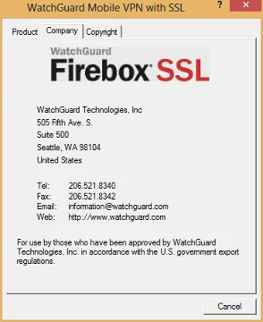
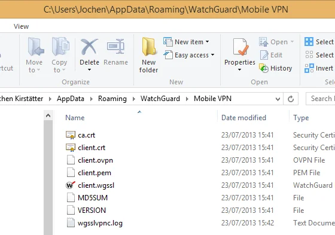
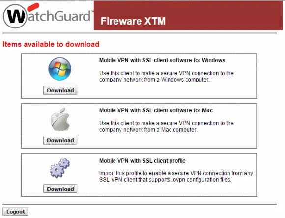
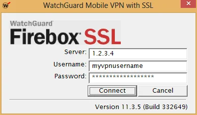
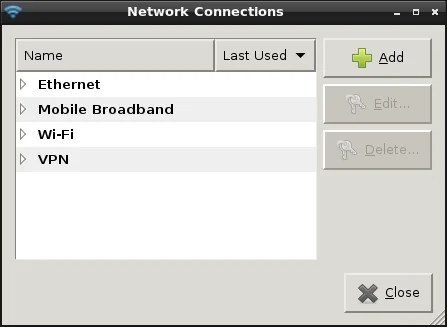
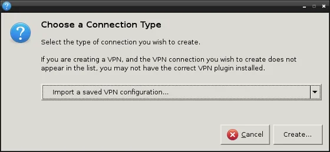

Recently, I got a new project assignment that requires to connect permanently to the customer's network through VPN. They are using a so-called SSL VPN. As I am using [OpenVPN](https://openvpn.net/ "OpenVPN") since more than 5 years within my company's network I was quite curious about their solution and how it would actually be different from OpenVPN. Well, short version: It is a disguised version of OpenVPN.

Unfortunately, the company only offers a client for Windows and Mac OS which shouldn't bother any Linux user after all. OpenVPN is part of every recent distribution and can be activated in a couple of minutes - both client as well as server (if necessary).

[](https://www.watchguard.com "WatchGuard Firebox SSL")  
*WatchGuard Firebox SSL - About dialog*

## []()Borrowing some files from a Windows client installation

Initially, I didn't know about the product, so therefore I went through the installation on Windows 8. No obstacles (and no restart despite installation of TAP device drivers!) here and the secured VPN channel was up and running in less than 2 minutes or so. Much appreciated from both parties - customer and me. Of course, this whole client package and my long year approved and stable installation ignited my interest to have a closer look at the WatchGuard client. Compared to the original OpenVPN client (okay, I have to admit this is years ago) this commercial product is smarter in terms of file locations during installation. You'll be able to access the configuration and key files below your roaming application data folder. To get there, simply enter

```
'%AppData%\WatchGuard\Mobile VPN'
```

in your Windows/File Explorer and confirm with Enter/Return. This will display the following files:

  
*Application folder below user profile with configuration and certificate files*

From there we are going to borrow four files, namely:

- ca.crt
- client.crt
- client.ovpn
- client.pem

and transfer them to the Linux system.

You might also be able to isolate those four files from a Mac OS client. Frankly, I'm just too lazy to run the WatchGuard client installation on a Mac mini only to find the folder location, and I'm going to describe why a little bit further down this article. I know that you can do that! Feedback in the comment section is appreciated.

### Update #1:

One of the reader (zer0Sum) provided the path information to retrieve the necessary files on a Mac OS system:

```
/Users/[user]/Library/WatchGuard/Mobile VPN/
```

Thanks!

### Update #2:

Retrieve the information directly from the WatchGuard Firebox as described in the next paragraph.

## []()Get the client configuration file from the WatchGuard Firebox

Due to a replacement unit at my customer, I had to update all the certificates here on the client side, too. And as I already changed my main machine I wouldn't like to install the Windows Client software on this computer. Actually, it is not necessary because the certificates can be downloaded from the appliance directly. In order to do this, open your web browser and enter the following URL:

```
https://1.2.3.4/sslvpn.html
```

**Note**: I changed the IP address of the remote directive above (which should be obvious, right?).

This will give you a login dialog like so:

  
*Login into the WatchGuard Firebox to get the Mobile VPN with SSL Client information*

Enter your credentials given by your network administrator and you will be able to download various client information.

This is the regular "Mobile VPN with SSL client" area:

  
*Download the Mobile VPN with SSL Client Profile directly from the WatchGuard appliance*

We simply ignore the software for Windows and Mac and choose to download the client profile. Save the provided file "client.ovpn" to a location on your computer.

Now, you can open it with a text editor like Notepad++. Interestingly, the different certificates are stored inside the OpenVPN client configuration file. So, either you leave it as-is or you might consider to cut the certificates from the file and store them as individual files. Both approaches will work.

Source: [WatchGuard System Manager Help - Use Mobile VPN with SSL with an OpenVPN Client](https://www.watchguard.com/help/docs/wsm/xtm_11/en-US/index.html#en-US/mvpn/ssl/mvpn_ssl_ovpn_profile_c.html%3FTocPath%3DMobile%20VPN%20with%20SSL|_____4)

## []()Configuration of OpenVPN (console)

Depending on your distribution the following steps might be a little different but in general you should be able to get the important information from it. I'm going to describe the steps in [Ubuntu](https://www.ubuntu.com/ "Ubuntu") 13.04 (Raring Ringtail). As usual, there are two possibilities to achieve your goal: console and UI. Let's what it is necessary to be done.

First of all, you should ensure that you have OpenVPN installed on your system. Open your favourite terminal application and run the following statement:

```
$ sudo apt-get install openvpn network-manager-openvpn network-manager-openvpn-gnome
```

Just to be on the safe side. The four above mentioned files from your Windows machine could be copied anywhere but either you place them below your own user directory or you put them (as root) below the default directory:

```
/etc/openvpn
```

At this stage you would be able to do a test run already. Just in case, run the following command and check the output (it's the similar information you would get from the 'View Logs...' context menu entry in Windows:

```
$ sudo openvpn --config client.ovpn
```

Pay attention to the correct path to your configuration and certificate files. OpenVPN will ask you to enter your Auth Username and Auth Password in order to establish the VPN connection, same as the Windows client.

  
*Remote server and user authentication to establish the VPN*

Please complete the test run and see whether all went well. You can disconnect pressing Ctrl+C.

## []()Simplify your life - use an authentication file

In my case, I actually set up the OpenVPN client on my gateway/router. This establishes a VPN channel between my network and my client's network and allows me to switch machines easily without having the necessity to install the WatchGuard client on each and every machine. That's also very handy for my various virtualised Windows machines. Anyway, as the client configuration, key and certificate files are located on a headless system somewhere under the roof, it is mandatory to have an automatic connection to the remote site.

For that you should first change the file extension '.ovpn' to '.conf' which is the default extension on Linux systems for OpenVPN, and then open the client configuration file in order to extend an existing line.

```
$ sudo mv client.ovpn client.conf
$ sudo nano client.conf
```

You should have a similar content to this one here:

```
dev tun
client
proto tcp-client
ca ca.crt
cert client.crt
key client.pem
;tls-remote "/O=WatchGuard_Technologies/OU=Fireware/CN=Fireware_SSLVPN_Server"
remote-cert-eku "TLS Web Server Authentication"
remote 1.2.3.4 443
persist-key
persist-tun
verb 3
mute 20
keepalive 10 60
cipher AES-256-CBC
auth SHA1
floatreneg-sec 3660
nobind
mute-replay-warnings
auth-user-pass auth.txt
;remember_connection 0
;auto_reconnect 1
```

**Note**: I changed the IP address of the remote directive above (which should be obvious, right?).

Anyway, the required change is marked in **red** and we have to create a new authentication file 'auth.txt'. You can give the directive 'auth-user-pass' any file name you'd like to.

### Update #3:

The OpenVPN directive `tls-remote` has been deprecated. In the above listed configuration I simply commented the line. The file client.ovpn doesn't have it at all.

Due to my existing OpenVPN infrastructure my setup differs completely from the above written content but for sake of simplicity I just keep it 'as-is'. Okay, let's create this file 'auth.txt'

```
$ sudo nano auth.txt
```

and just put two lines of information in it - username on the first, and password on the second line, like so:

```
myvpnusername
verysecretpassword
```

Store the file, change permissions, and call openvpn with your configuration file again:

```
$ sudo chmod 0600 auth.txt
$ sudo openvpn --config client.conf
```

This should now work without being prompted to enter username and password.

In case that you placed your files below the system-wide location /etc/openvpn you can operate your VPNs also via service command like so:

```
$ sudo service openvpn start client
$ sudo service openvpn stop client
```

## []()Using Network Manager

For newer Linux users or the ones with 'console-phobia' I'm going to describe now how to use Network Manager to setup the OpenVPN client. For this move your mouse to the systray area and click on Network Connections =&gt; VPN Connections =&gt; Configure VPNs... which opens your Network Connections dialog. Alternatively, use the HUD and enter 'Network Connections'.

  
*Network connections overview in Ubuntu*

Click on 'Add' button. On the next dialog select 'Import a saved VPN configuration...' from the dropdown list and click on 'Create...'

  
*Choose connection type to import VPN configuration*

Now you navigate to your folder where you put the client files from the Windows system and you open the 'client.ovpn' file. Next, on the tab 'VPN' proceed with the following steps (directives from the configuration file are referred):

- General
  - Check the IP address of Gateway ('remote' - we used 1.2.3.4 in this setup)
- Authentication
  - Change Type to 'Password with Certificates (TLS)' ('auth-pass-user')
  - Enter User name to access your client keys (Auth Name: myvpnusername)
  - Enter Password (Auth Password: verysecretpassword) and choose your password handling
  - Browse for your User Certificate ('cert' - should be pre-selected with client.crt)
  - Browse for your CA Certificate ('ca' - should be filled as ca.crt)
  - Specify your Private Key ('key' - here: client.pem)

Then click on the 'Advanced...' button and check the following values:

- Use custom gateway port: 443 (second value of 'remote' directive)
- Check the selected value of Cipher ('cipher')
- Check HMAC Authentication ('auth')
- Enter the Subject Match: /O=WatchGuard_Technologies/OU=Fireware/CN=Fireware_SSLVPN_Server ('tls-remote')

Finally, you have to confirm and close all dialogs. You should be able to establish your OpenVPN-WatchGuard connection via Network Manager. For that, click on the 'VPN Connections =&gt; client' entry on your Network Manager in the systray.

It is advised that you keep an eye on the syslog to see whether there are any problematic issues that would require some additional attention.

## []()Advanced topic: routing

As stated above, I'm running the 'WatchGuard client for Linux' on my head-less server, and since then I'm actually establishing a secure communication channel between two networks. In order to enable your network clients to get access to machines on the remote side there are two possibilities to enable that:

- Proper routing on both sides of the connection which enables both-direction access, or
- Network masquerading on the 'client side' of the connection

Following, I'm going to describe the second option a little bit more in detail. The Linux system that I'm using is already configured as a gateway to the internet. I won't explain the necessary steps to do that, and will only focus on the additional tweaks I had to do. You can find tons of very good instructions and tutorials on 'How to setup a Linux gateway/router' - just use Google.

OK, back to the actual modifications. First, we need to have some information about the network topology and IP address range used on the 'other' side. We can get this very easily from /var/log/syslog after we established the OpenVPN channel, like so:

```
$ sudo tail -n20 /var/log/syslog
```

Or if your system is quite busy with logging, like so:

```
$ sudo less /var/log/syslog | grep ovpn
```

The output should contain PUSH received message similar to the following one:

```
Jul 23 23:13:28 ios1 ovpn-client[789]: PUSH: Received control message: 'PUSH_REPLY,topology subnet,route 192.168.1.0 255.255.255.0,dhcp-option DOMAIN,route-gateway 192.168.6.1,topology subnet,ping 10,ping-restart 60,ifconfig 192.168.6.2 255.255.255.0'
```

The interesting part for us is the route command which I highlighted already in the sample PUSH_REPLY. Depending on your remote server there might be multiple networks defined (172.16.x.x and/or 10.x.x.x).  
**Important:** The IP address range on both sides of the connection has to be different, otherwise you will have to shuffle IPs or increase your the netmask.

After the VPN connection is established, we have to extend the rules for iptables in order to route and masquerade IP packets properly. I created a shell script to take care of those steps:

```
#!/bin/sh -e

IPTABLES=/sbin/iptables
DEV_LAN=eth0
DEV_VPNS=tun+
VPN=192.168.1.0/24

$IPTABLES -A FORWARD -i $DEV_LAN -o $DEV_VPNS -d $VPN -j ACCEPT
$IPTABLES -A FORWARD -i $DEV_VPNS -o $DEV_LAN -s $VPN -j ACCEPT
$IPTABLES -t nat -A POSTROUTING -o $DEV_VPNS -d $VPN -j MASQUERADE
```

I'm using the wildcard interface 'tun+' because I have multiple client configurations for OpenVPN on my server. In your case, it might be sufficient to specify device 'tun0' only.

## []()Simplifying your life - automatic connect on boot

Now, that the client connection works flawless, configuration of routing and iptables is okay, we might consider to add another 'laziness' factor into our setup. Due to kernel updates or other circumstances it might be necessary to reboot your system. Wouldn't it be nice that the VPN connections are established during the boot procedure? Yes, of course it would be. To achieve this, we have to configure OpenVPN to automatically start our VPNs via init script. Let's have a look at the responsible 'default' file and adjust the settings accordingly.

```
$ sudo nano /etc/default/openvpn
```

Which should have a similar content to this:

```
# This is the configuration file for /etc/init.d/openvpn

#
# Start only these VPNs automatically via init script.
# Allowed values are "all", "none" or space separated list of
# names of the VPNs. If empty, "all" is assumed.
# The VPN name refers to the VPN configutation file name
# i.e. "home" would be /etc/openvpn/home.conf
AUTOSTART="all"
#AUTOSTART="none"
#AUTOSTART="home office"
#
# ... more information which remains unmodified ...
```

With the OpenVPN client configuration as described above you would either set AUTOSTART to "all" or to "client" to enable automatic start of your VPN(s) during boot. You should also take care that your iptables commands are executed after the link has been established, too.

You can easily test this configuration without reboot, like so:

```
$ sudo service openvpn restart
```

Enjoy stable VPN connections between your Linux system(s) and a WatchGuard Firebox SSL remote server.

Cheers, JoKi