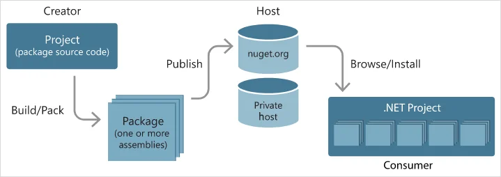
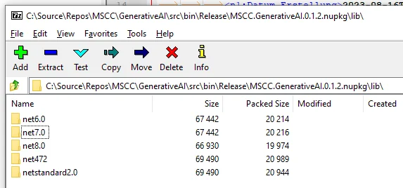

Using NuGet packages gives developers a great amount of flexibility and fast pace to implement their own ideas. Whether you are using packages from other authors or prefer to use your own ones. The following article summarises my findings in how to get started building NuGet packages with Visual Studio, Visual Studio Code, or even the command line only.

During one of the last assignments and more recently working on some Gemini AI related coding I came across the need for NuGet packages.

## What is NuGet?

An essential tool for any modern development platform is a mechanism through which developers can create, share, and consume useful code. Often such code is bundled into "packages" that contain compiled code (as DLLs) along with other content needed in the projects that consume these packages.

For more background information I highly recommend reading [Taking on DLL hell](https://blog.davidebbo.com/2011/01/nuget-versioning-part-1-taking-on-dll.html) and follow-up articles by David Ebbo.

For .NET (including .NET Core), the Microsoft-supported mechanism for sharing code is **NuGet**, which defines how packages for .NET are created, hosted, and consumed, and [provides the tools](https://learn.microsoft.com/en-us/nuget/install-nuget-client-tools) for each of those roles.

Following is the flow of NuGet package.



Learn more [about NuGet in the documentation](https://learn.microsoft.com/en-us/nuget/what-is-nuget).

Although there are multiple tools to handle NuGet packages this article is mainly focusing on the `dotnet` CLI tool.

## Creating a new project

Whether you start with a clean slate or converting/extending an existing project is nearly the same experience. For clarity I'm going to create a new `dotnet` project and guide you through the steps to add more functionality to the NuGet package.

```
dotnet new classlib
```

Despite having no functionality it is already possible to create a NuGet package using such an empty project.

```
dotnet pack
```

However, you would be stuck with the default values for the moment. Which we won't accept.

> "Don't accept the defaults!" – Abel Wang

The command output has the full path information to the generated `.nupkg` file. Which is a ZIP archive and can be inspected either using an archive manager or the built-in features of the file manager.

## Targeting a .NET version

While creating a new project you either use the target versions of .NET or the project template defines it for you. When you open a .NET project file, usually a `csproj` file for C# you might notice the XML element `TargetFramework`.

```
<Project Sdk="Microsoft.NET.Sdk"> 
  <PropertyGroup> 
    <TargetFramework>netstandard2.0</TargetFramework> 
  </PropertyGroup> 
</Project>
```

The allowed value of `TargetFramework` are .NET specific version moniker and instructs the compiler which version of .NET to target for your assembly.

## Multi-targeting .NET versions

You have seen it already with numerous other NuGet packages that are targetting multiple versions of .NET. Ranging from elderly versions of .NET Framework, and therefore Windows only, to the latest preview versions of .NET (Core). How is this done? Using .NET ability to allow targetting multiple versions using one single project.

Open your .NET project `.csproj` file and change the `TargetFramework` element to its plural version `TargetFrameworks` and add more [target framework monikers](https://learn.microsoft.com/en-us/nuget/reference/target-frameworks) (TFM) separated by semicolons, like so.

```
<Project Sdk="Microsoft.NET.Sdk"> 
  <PropertyGroup> 
    <TargetFrameworks>netstandard2.0;net8.0</TargetFrameworks> 
  </PropertyGroup> 
</Project>
```

Learn more about [multi-targetting for NuGet packages](https://learn.microsoft.com/en-us/nuget/create-packages/supporting-multiple-target-frameworks) and how to [support multiple .NET versions in your project file](https://learn.microsoft.com/en-us/nuget/create-packages/multiple-target-frameworks-project-file).

## Package attributes in your project file

There are a number of attributes for NuGet packages that can be added to the project file. Newer versions of Visual Studio (2022 and onwards) provide better options and most of those values can be configured in the IDE under the properties of the project.

As we are using MSBuild to pack the assembly and create the NuGet package, we use MSBuild properties to configure and describe the attributes of the package. Let's have a look at some essential MSBuild properties which might cover the majority of needs.

```
<Project Sdk="Microsoft.NET.Sdk"> 
  <PropertyGroup> 
    <TargetFramework>netstandard2.0</TargetFramework> 
    <PackageId>MSCC.GenerativeAI</PackageId> 
    <Version>0.5.42</Version> 
    <Description> 
      A simple package to integrate generative AI into an application. 
    </Description> 
   <PackageProjectUrl>https://mscraftsman.github.io/</PackageProjectUrl> 
    <RepositoryUrl>https://github.com/mscraftsman/generative-ai</RepositoryUrl> 
    <Authors>Jochen Kirstätter</Authors> 
    <Copyright>Copyright (c) Jochen Kirstätter</Copyright> 
    <PackageReadmeFile>README.md</PackageReadmeFile> 
    <PackageIcon>mscc-nuget.png</PackageIcon> 
    <PackageTags>genAI;Generative AI;Gemini;Vertex AI</PackageTags> 
    <PackageLicenseFile>LICENSE</PackageLicenseFile> 
    <PackageRequireLicenseAcceptance>False</PackageRequireLicenseAcceptance> 
    <PackageReleaseNotes>- Update README.md</PackageReleaseNotes> 
    <GeneratePackageOnBuild>True</GeneratePackageOnBuild> 
  <PropertyGroup> 
</Project>
```

The package identifier and the version number uniquely identify the exact code that's contained in the package. This is important to know. Once a package has been added to a NuGet source it cannot be modified anymore or replaced. Any changes to the source code or package properties require a new build and pack process. Hence, the package identifier and the version number uniquely identify the exact code that's contained in the package.

A list of all MSBuild properties is found in the reference section of the documentation: [NuGet pack and restore as MSBuild targets](https://learn.microsoft.com/en-us/nuget/reference/msbuild-targets).

After package creation you can still check and inspect the generated `.nupkg` file to see whether all intended content is present.

Note: *A NuGet package with the `.nupkg` extension is simply a ZIP file. To easily examine any package's contents, change the extension to `.zip` and expand its contents as usual. Just be sure to change the extension back to `.nupkg` before attempting to upload it to a host.*


This also allows you to quickly review the generated `.nuspec` file.



You can check all assets needed per targetted .NET version.

## Using a NuSpec file

In case that the available MSBuild properties are not sufficient enough to define all package atrributes, it is still possible to add a `.nuspec` file to the project with more details.

Learn more about [packing using a `.nuspec` file](https://learn.microsoft.com/en-us/nuget/reference/msbuild-targets#packing-using-a-nuspec-file).

## Deploy a NuGet package

After completing the `dotnet pack` command you can distribute the `.nupkg` file to a shared store or publish it to a NuGet source.

### Use a network drive

Because `pack` and `restore` are MSBuild targets, you can access them to enhance your workflow. For example, let's say you want to copy your package to a network share after packing it. You can do that by adding the following in your project file:

```
<Target Name="CopyPackage" AfterTargets="Pack"> 
  <Copy 
    SourceFiles="$(OutputPath)..\$(PackageId).$(PackageVersion).nupkg" 
    DestinationFolder="\\myshare\packageshare\" /> 
</Target>
```

### Azure Artifacts

Quite often there is a correlation between projects written in .NET and using Azure DevOps for continuous integration (CI) and continuous deployment (CD). One and more pipelines in Azure DevOps are used to create, pack, and deploy projects.

The resulting assemblies, or in this case, the NuGet package can then be pushed to Azure Artifacts and accessed by other developer that have access to that store.

Probably, it is an option to distribute NuGet packages among smaller teams of developers. More on this approach below.

### NuGet Gallery

If you are comfortable publishing your package to the rest of the world then the NuGet Gallery might be your first choice to spread your codes. Setting up an account is straight forward and a matter of seconds using a Microsoft account.

Then upload the `.nupkg` file to the nuget.org web portal and you are officially published as a NuGet package maintainer.

Alternatively, you can push the package using a command line. To push packages to nuget.org with a command line, you can use either `dotnet.exe` or `nuget.exe` v4.1.0 or above, which implement the required NuGet protocols.

All the necessary steps are largely described in [Push NuGet packages](https://learn.microsoft.com/en-us/nuget/nuget-org/publish-a-package) in the official documentation.

### Third party systems

There are other free and proprietary solutions to handle packages and source feeds within your organisation. In the past I used to work with the likes of ProGet and MyGet.

BTW, all that could be integrated into a CI/CD pipeline with minimal effort.

## Summary

Using NuGet packages whether in context of private, in-house development or public sets boundaries between different responsibilities, capabilities, and functionalities of an application. Furthermore, it allows that development can be done as independent units and provides more stability across multiple projects and therefore development teams. New versions of packages can be developed without having concerns to break existing projects by others that are incorporating that functionality. And with access to previous versions of a NuGet package software developers have peace of mind regarding their decision when to upgrade and more importantly that a rollback is possible anytime in case there might be breaking changes.

Access to pre-release versions of a NuGet package can easily be handled alongside the releases of stable versions.

<small>Image credit: Gemini using prompt "an image showing the creation of packages"</small>
