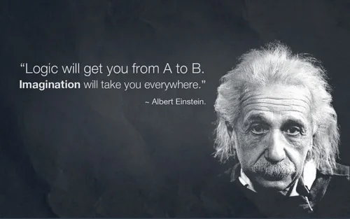
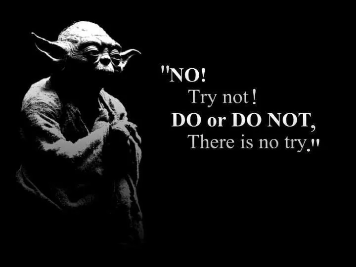

More of spontaneous coincidence than a planned activity I was contacted by [Dr. Tomi A. Pasanen](https://www.linkedin.com/in/dr-tomi-a-pasanen-497a2717/?ppe=1), Lecturer in Computer Science at the [Aberystwyth University, Mauritius Branch Campus](http://www.aber.mu/staff-list/tap7/), whether I'd be interested to give a talk on Computer Science (CS) career advice.

Having met Tomi already earlier this year during the [It's Just Angular](https://www.mscc.mu/its-just-angular/) meeting of the [MSCC](https://www.mscc.mu/), and knowing his genuine interest in the IT activities of local user groups in Mauritius, I agreed to come over on a very short notice.

We exchanged briefly about the general direction of the talk; which could be summarised like this: *"The point for students could be somehow to understand the value they get through studies. Computer Science is always never heard topic at schools and options after study are not clear. Many think that it is only hard programming but quite few students will actually do that for whole life."* and it was settled literally.

Today I went to the campus near Quartier Militaire, actually it's not far from my office in Quatre Bornes. Tomi welcomed me nicely and while CS students (together with others) were still occupied with other lecturers, we seized the opportunity to align our ideas and expectations of the career guidance talk over a cup of tea. Typical British style, even tough Tomi is Finnish. ;-)

During the break just before my talk he introduced me to [Dr Susan Busby](http://www.aber.mu/staff-list/sdb11/), Academic Campus Director and Lecturer in Business and Management, who was pleased about my appearance and assistance for the Aber Career Guidance day. She gave me a little insight into the demographics at the university, and emphasised the importance of an early exchange between students and real-world requirements in Computer Science.

A little bit after schedule we met in the Computer Lab 1 of the Aber university, and giving it some minutes for students to arrive.

Following are today's bullet points.

## Curiousity

Always stay hungry and explore new things. Watch, observe and learn from others. Eventually, we found common ground given the experience that the present CS students took apart tech-toys during their youth in order to figure out how this stuff might actually work. Sometimes with irreversible result...

## Creativity

Understanding requirements, solving problems and writing appropriate solutions in software demands creativity and eventually sparks of "genius". In fact, I'm convinced that working in Computer Science and related fields is mainly about **creating** source code, not typing.

Literally, one could say that writing source code is a certain type of art. Although, I wouldn't consider myself an artist after all.

## Passion

Studying CS at the university is (just) a stage to pass. It's an entrance into a professional career as a software developer, a cyber security researcher, or a data scientist. Get an understanding that your studies are the fundament of your career. Develop your interest and passion for IT and computer-related fields. Have this "feel good factor" while sitting or standing in front of your machine.

## Perseverance

No worries, there will be drawbacks and road bumps all the way through. A certain level of sturdiness and steady persistence will be a good trait in your career. Together with constant (and maybe daily) learning about new technologies, new techniques and practices it will help to develop your knowledge in Computer Science.

When it gets tough, keep on going...

## Craftsmanship

"Practice makes Perfect" - what matters for blue-collar jobs directly reflects on Computer Science, too. You learn to write (better) code by writing code. Actually, the majority of your time in software development might be reading and reviewing your own and other's source code. By literally breathing source code - practice, practice and practice more - you are going to constantly improve your skills and understanding of Computer Science. Understanding software development as a craft which requires regular practice is very close either to the habits of an actual craftsman (read: carpenter, welder, goldsmith, etc) or the katas of a martial arts fighter.

## Community

Get in touch with more experienced software developers and/or IT people in general as earliest as possible. Try to find a mentor in Computer Science who would be available for your questions, and might be able to guide you during your studies. Look out for local user groups and communities, like the [MSCC](https://www.mscc.mu/) or any other technology-focused group. Go out and meet others. The [advantage of networking, exchange of experience, and discussion](xref:community-exchange-and-discussion) with others will be a boost for you.

Eventually, every CS student should be exposed to [The Code Manifesto](http://codemanifesto.com/) on the first day of studies.

## Choose wisely and Master your tools

Last but not least, I shared my experience on choice of tools. Both, in regards to hardware like a proper mechnical keyboard, a decent high-performance mouse or eventually better a track ball, and an ergonomic chair, and towards the right software. Yes, you can write source code using a plain text editor but would it productive and a joy to do so?

Personally, I can't use a mouse over a longer period without suffering from muscle tensions in neck and shoulder. Hence I prefer to use a track ball device since more than 15 years.

Unfortunately, we ran a bit out of time, as I would have liked to talk about the following, too.

## Ethics

As a student in Computer Science you are thriving to have a career most likely as a software developer. Meaning your future salary will be based on the sales or licensing of the applications and products you'll work on. At this stage you won't be earning money, maybe it's the opposite actually as you have to pay for your education. Nevertheless, it's not an excuse to or reason to use pirated software on your computer.

There are so many alternatives available. Software companies usually have academic, personal use or student-only licenses at a smaller price or even for free. Check out their website, and if nothing is written get in touch with their sales department.

Look into [Free and Open Source Software (FOSS)](http://www.freeopensourcesoftware.org/). There is a whole universe waiting for you...