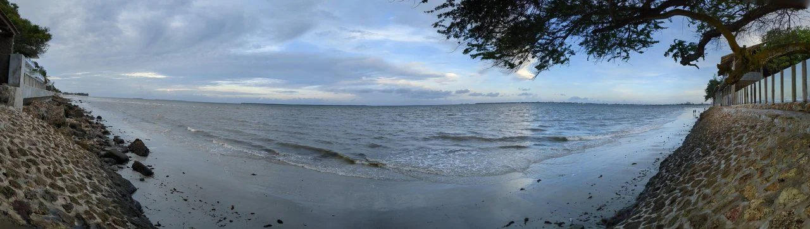
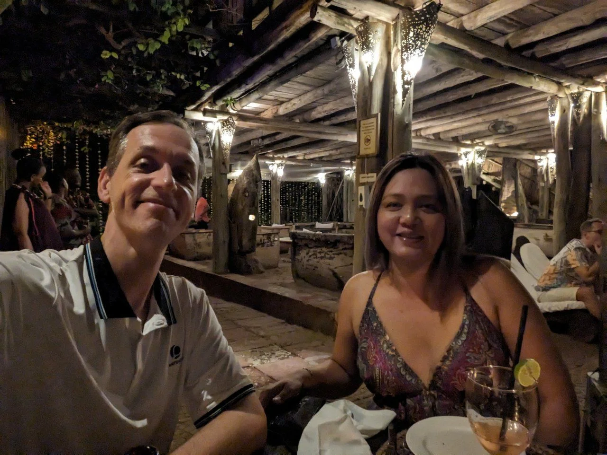
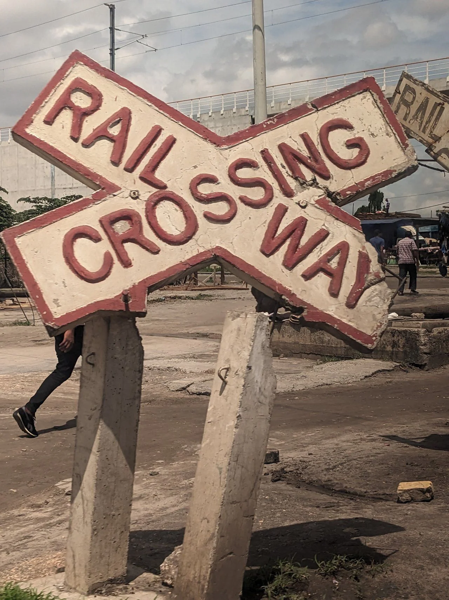
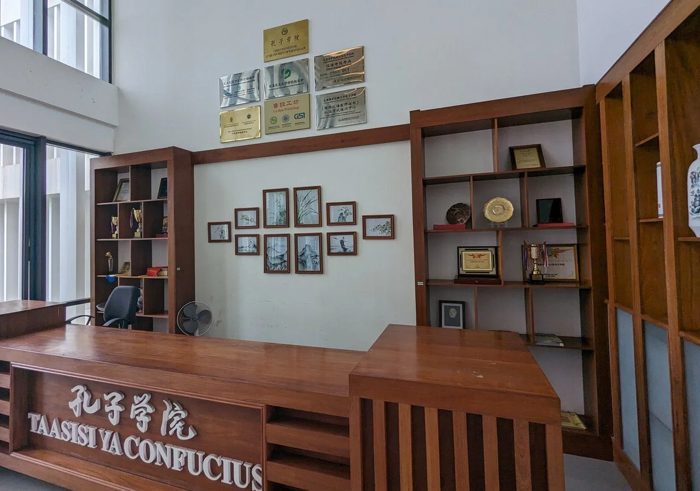
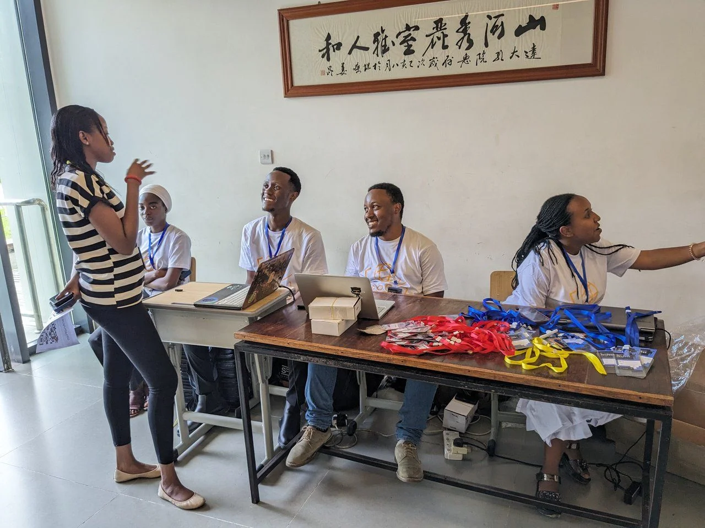
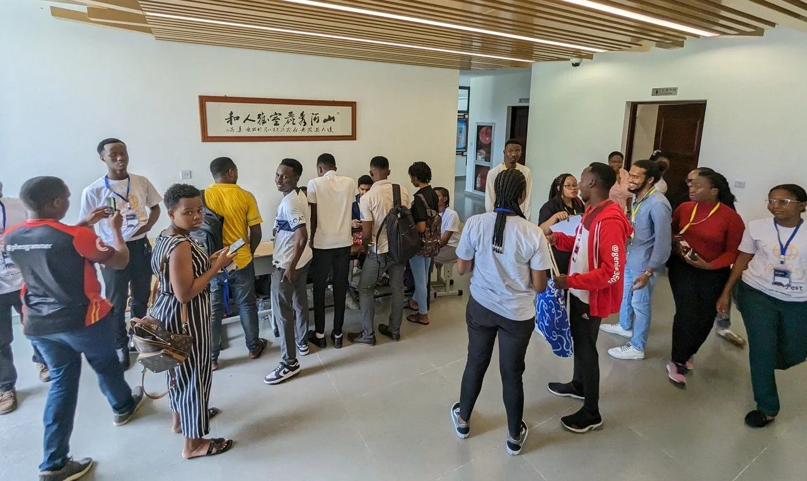
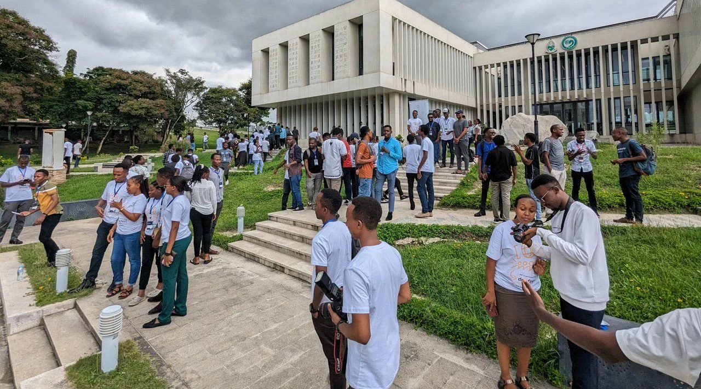
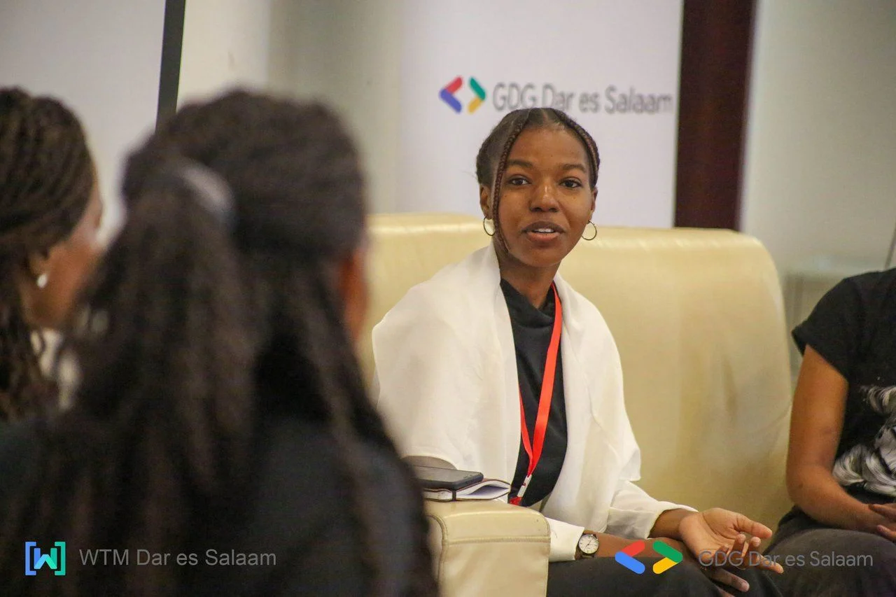
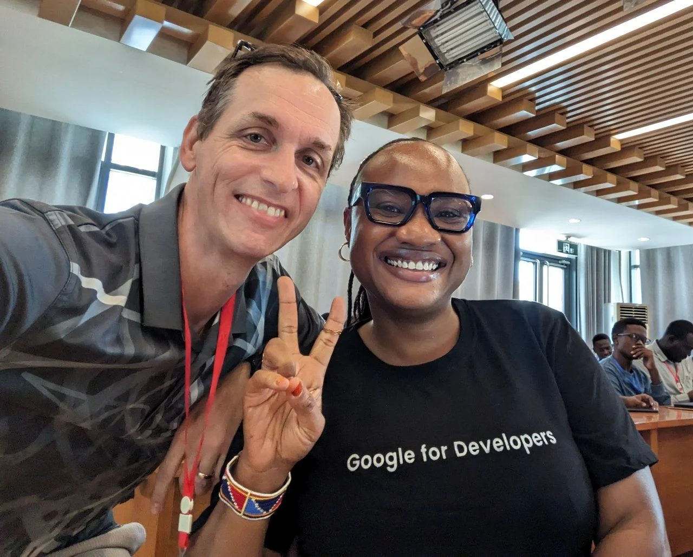
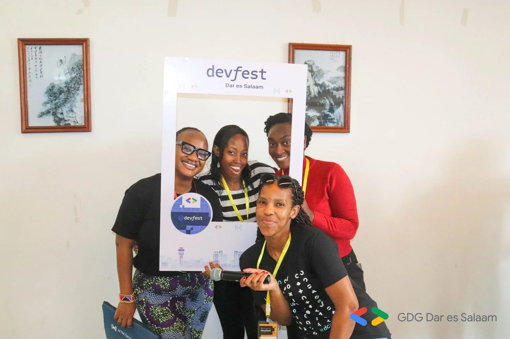

After speaking at DevFest Nairobi in 2022 (including a spontaneous keynote on Google Cloud) I got inspired to be more active and hopefully present in other potential locations across the Sub-Saharan Africa region. And if I'm not completely wrong I also had an exchange with [Georgia Rwechungura](https://x.com/georgearwechu) during the SSA Community Summit 2022 regarding the idea of coming to Tanzania, or more precisely to come to [GDG Dar es Salaam](https://gdg.community.dev/gdg-dar-es-salaam/) and speaking at their DevFest.

With an improving health and running a few workshops - in-house and remote - earlier this year I was getting more and more eager as well as excited about the idea to speak at other DevFest events than [Mauritius](xref:devfest-mauritius-2023). All went well at [DevFest Kigali](xref:devfest-kigali-2023) a few weeks earlier and so nothing could possibly stop me from going to Tanzania.

## Getting there and back?

Unfortunately, there are not many connections between Mauritius and African countries, or at least there could and should be many more than there are at the moment. Without a direct flight I had a look at the available options for airlines, airports and the associated stopover times. Here are a few routes I checked out:

- Johannesburg, South Africa
- Nairobi, Kenya
- Antananarivo, Madagascar
- Dubai, UAE
- Mahe, Seychelles
- St. Denis, La Reunion

It's really weird to travel in a yo-yo pattern like this. Meaning, you have to fly further than the actual destination and then "come back". A direct flight from Mauritius to Dar es Salaam would probably take less than three hours. Given the current possibilities it takes way more than twice the time.

Anyway, I chose to go with Kenya Airways and having a night stopover in Nairobi. With access to their Pride of Africa lounge it wasn't too bad after all.

### Choice of accommodation

Usually I try to find a hotel or guesthouse that's close to the DevFest venue and doesn't have the flair of a typical business trip. Thanks to [Naamini Yonazi](https://x.com/naaminiyonazi) I knew that DevFest would most likely be somewhere on the campus of the University of Dar es Salaam which lies North of the airport and the city centre. Traffic might be dense during morning hours and the suggestions provided on the GDE trip planning platform were too far away and most of them not to my liking.

Based on the positive experience I had with stays booked through the booking.com app in Europe I gave it a try for Tanzania. For those few days, I searched for an appropriate place to stay that is less than 30 minutes away from DevFest. Thanks to the ratings, great pictures, and other attributes like cost I actually found a hotel right on the beach.

Surprisingly, it was also offered on the GDE trip planner but outside the suggested radius. With minor adjustments I got it as an option and was able to book without any issues. Winning!

### Travel companion

Now, after seeing some pictures of the beach side, the pool, the rooms and the restaurants of the hotel my lovely BWE got very much interested in Tanzania. You might guess where this is heading to, don't you?

Following our wedding anniversary celebrations in September my BWE and I talked about the possibility to spend a long weekend together in Tanzania, and we decided that would be a pleasant experience.

Plus, Mary Jane already told me since a while that she would love to go there to check out tanzanite gemstones for a piece of jewelry she'd like to create.

### Getting around in Dar

Planning to go to a new location, whether it's a new city, a new country, or both, involves checking out the options to get around. First problem to solve, how to get from the airport to the guesthouse and back, then how to go to and from the DevFest venue, and lastly how to explore other sights of importance while being there.

Organising a ride from the airport to the guesthouse was the easiest. Thanks to the wonderful assistance of Naamini I had nothing to do. She arranged everything by asking her trusted driver to come to the airport to fetch us, and then drop us off at the guesthouse. She literally needed my flight details and destination only. Massive help and easy-peasy.

During conversations at the reception desk it became pretty clear that either Uber or Bolt might be the best option to book rides. The recommendation was to use Bolt as it seems to be less expensive and more flexible than Uber. So we gave it a try the next day in order to get from the guesthouse to the venue of DevFest. BTW, we booked a car rather than a tuk-tuk (auto rickshaw).

Later on, we felt more comfortable and went all in, either using Bolt rides or bargaining with the tuk-tuk drivers at their stand to agree on a fair. It was really good fun to discover places like this.

### Maasai Warriors

Already back at the guesthouse where we stayed but also throughout other places we noticed that there were Maasai warriors around. Some were there to do hotel services like bell boy, some did gardening, and others seemed to be security for single, female travellers. Maybe a reader from Tanzania could help me out here.

I found it really impressive!  
Stupidly, I forgot to ask to take a picture with at least one of them. Oh well, probably next time then. However I got myself a Maasai Shuka. Only need to learn and practice how to wear it though.

## The Venue: 孔子学院

Yup, that's the right place. Yes, I'm sure.

Honestly, I had no idea of what to expect when I saw the DevFest location first time. But hey,why not? It kind of makes sense that there is a Confucius Institute in Dar es Salaam, Tanzania. Given the importance of the port and international trade with China I seems quite helpful for students to have easy access to courses on Chinese language and culture. And while writing this blog I discovered there is a 孔子学院 in Mauritius, too. Who'd have known?

## What's on the agenda of DevFest?

Lots of amazing topics and sessions have been assembled by the GDG chapter in Dar es Salaam. Check out the [full agenda](https://sessionize.com/view/254byy8x/GridSmart?format=Embed_Styled_Html&isDark=False&title=DevFest%20Dar%20Es%20Salaam%202023) on Sessionize to get an overview. Also, there had been multiple tracks in parallel allowing more speakers to present and give attendees a choice following their interest.

### Networking everywhere

We managed to arrive a bit earlier than the times suggested on the agenda. This gave us time to get to know the team of GDG Dar a little bit, and to mingle with other attendees to get to know a bit more about their passions and activities. BTW, in one the rooms was even breakfast served. How cool is that?

### GDEs and a Googler

Oh yes, you read this right. GDG Dar es Salaam managed to invite [Khadija Juma](https://www.linkedin.com/in/khadija-%F0%9F%87%B0%F0%9F%87%AA-abdul-juma-26720143/) from Google. As she is based in Mombasa, Kenya it seemed an obvious opportunity and I was really happy to introduce Mary Jane to her.

As for GDEs, let me quickly list them in no particular order.

- [Ezekias Bokove](https://www.linkedin.com/in/ezekias-bokove/), GDE for Google Cloud
- [Maye Edwin](https://www.linkedin.com/in/mayeedwin), GDE for Web Technologies
- [Jochen Kirstätter](https://www.linkedin.com/in/jochenkirstaetter/), GDE for Google Cloud

The highlights of DevFest Dar were the ice-breaker game that was done at the beginning as well as the group photo outdoors.

The Confucius Institute is quite impressive and it was really good fun to spend the day with DevFest attendees.

## Thanks to GDG Dar es Salaam

My heart-felt thanks go out to [Naamini Yonazi](https://x.com/naaminiyonazi), [Georgia Rwechungura](https://x.com/georgearwechu), the crew at [GDG Dar es Salaam](https://gdg.community.dev/gdg-dar-es-salaam/), and all WTM ambassadors involved in the preparation and organisation of DevFest Dar es Salaam. You are the real reason we had a wonderful time in Tanzania. Your early assistance and guidance helped us to feel welcome and at ease in Dar es Salaam.

**Asante sana!**

PS: We, Mary Jane and I, kind of already decided to visit Zanzibar during 2024, and we'd love to combine it with a future engagement with GDG Dar es Salaam, and who knows, maybe GDG Pwani in Kenya...

*Photo credits*: Shared album on Pixieset by Sam Gidori, [GDG Dar es Salaam](https://gdg.community.dev/gdg-dar-es-salaam/).
