Uganda - a new destination to explore. My first time travelling to Uganda and it is for speaking at DevFest Jinja. Following the conversations with [Francis Akol](https://www.linkedin.com/in/francis-akol/) we arranged and got it approved that I would be able to travel as Google Developer Expert (GDE). A first for GDG Jinja.

During several past occasions I met Francis, [Fiona Nangobi](https://www.linkedin.com/in/fiona-nangobi/) (WTM ambassador in Jinja), and other community members from Uganda. Meaning, taking the trip to Jinja wouldn't be an adventure into the complete unknown but a welcoming experience with friends.

In preparation I had the [East Africa(n) Tourist Visa](https://immigration.go.ug/services/east-african-tourist-visa) (EATV) in my passport which would fast-track me at the immigration officer, or at least that's what I thought would be the case; more on that below, I found valuable resources online which described where the ATMs would be located in the airport, and where to purchase a Ugandan SIM card. I chose Airtel due to recommendations regarding network coverage and quality.

Like for my trip to Dar es Salaam two weeks ago, I decided to fly one or two earlier so that there be a chance for a bit of sightseeing. However this meant to be at the airport in the middle of the night, around 2:00 hrs in the morning catching the flight at 4:00 hrs then. As usual, the trip involved a stopover of approximately seven hours in Nairobi. While waiting in the Pride of Africa lounge I also seized the opportunity to clear a few issues I was facing with [Asante Rewards](https://asante.kenya-airways.com/), the frequent flyer loyalty program by Kenya Airways.

## To enter, or Not to enter

that is the question:  
Whether 'tis nobler in the mind to suffer  
The slings and arrows of outrageous fortune,  
Or to take Arms against a Sea of troubles,  
[...](https://en.wikipedia.org/wiki/To_be,_or_not_to_be)

It was not as dramatic as the opening speech of Prince Hamlet, however it was challenging nevertheless. Already back in Mauritius I was questioned about whether I had a VISA to enter Uganda, and again in Nairobi prior to boarding, I was quite surprised when I was told by the immigration officer that the EATV has expired. Hmm, hang on, I applied for it beginning of October and it's valid for 90 days, given multiple entry in either Rwanda, Kenya, or Uganda - so I thought.

Well, there is an important detail which can be overseen quite easily or misunderstood as in my case.

> The visa is valid for 90 days and is not renewable upon expiry or upon exit from the block (Kenya, Uganda, Rwanda).

The East Africa Tourist Visa (EATV) is an agreement between those three mentioned countries to ease transits between them for the given period. However the visa itself is single entry coming from any other country and (!) it expires as soon as you exit the defined realm.

***Ouch!***  
I totally didn't see that back in October and it wasn't mentioned by the immigration officer in Kigali, Rwanda. Either way it was my fault or at least responsibility. With all the forth and back between immigration officer at the counter, direct supervisor, moving to the immigration offices at the back, and then speaking to the head supervisor about the situation, it crossed my mind that this could be a potential episode of Border Security.

This is Africa, and there is always a way. Given my passport of European origin I was offered to apply for a new visa on arrival. Which I gratefully accepted. I mean paying USD $50 for my misunderstanding, read: the visa to enter Uganda, is a fair deal after all. Definitely better than sitting on the next plane back home.

## Let the real adventure begin

After withdrawing some cash from one of the ATM and purchasing the Airtel SIM card I was ready for my first experience in Uganda. And what better to receive a hearty welcome by GDG fellow [Asa Lugada](https://x.com/AsaLugada) and his friend Arnold. My connection to Asa even goes back to my first participation in the Andela-led ALC program, later GADS program. And of course the [SSA Community Summit 2018](xref:ssa-community-summit-2018).

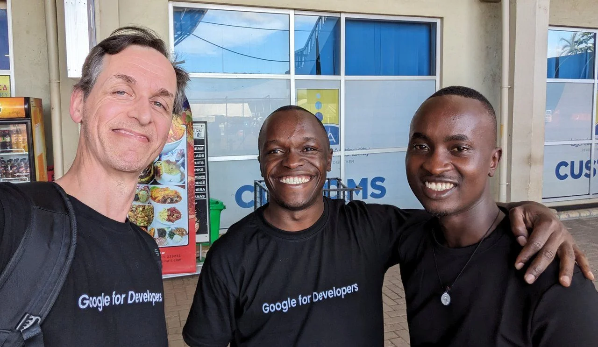

Some days earlier we discussed details about the airport transfer to the guest house I'm staying in Jinja. Of course, I could have a booked a taxi or an arrangement with the guest house but this premium community service was by far the better option.

From Entebbe to Jinja is roughly 130km to drive. So we stopped at the Victoria Mall in Entebbe, got ourselves some snacks and refreshments, and off we went...

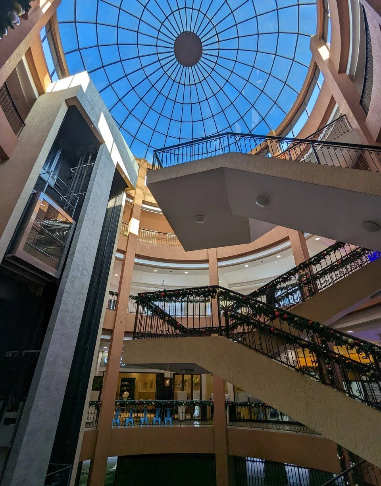

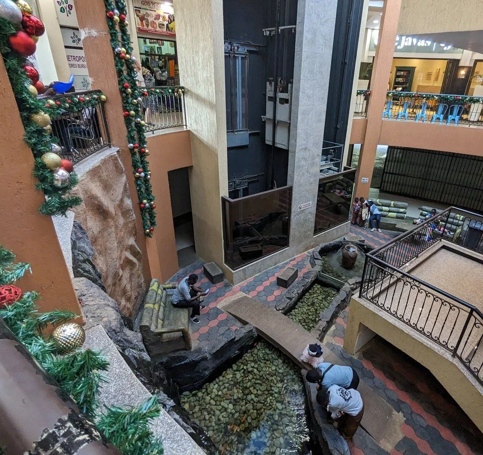

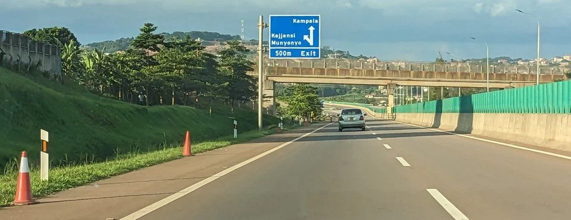

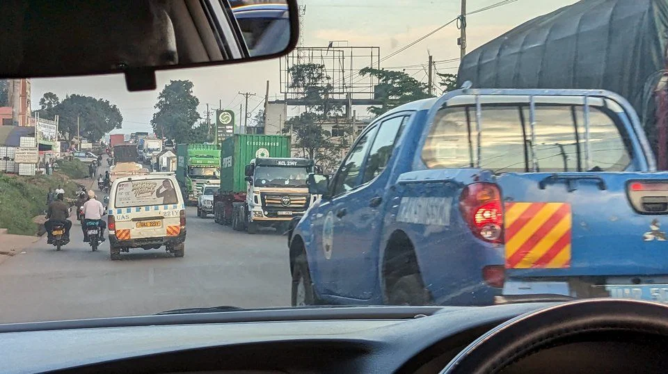

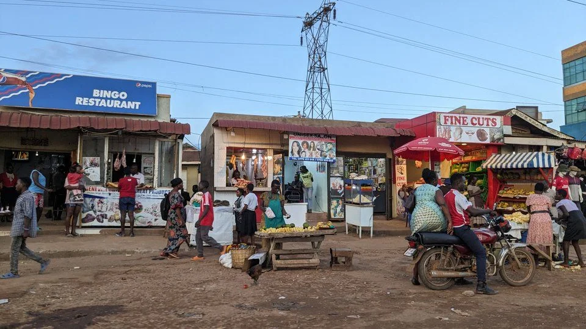

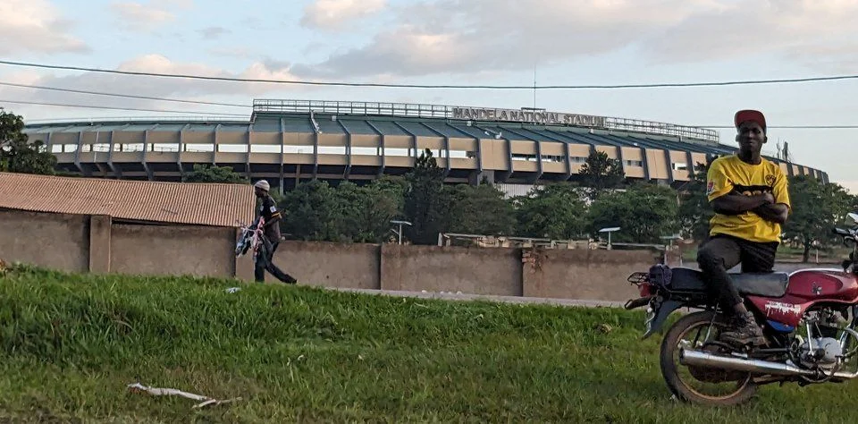

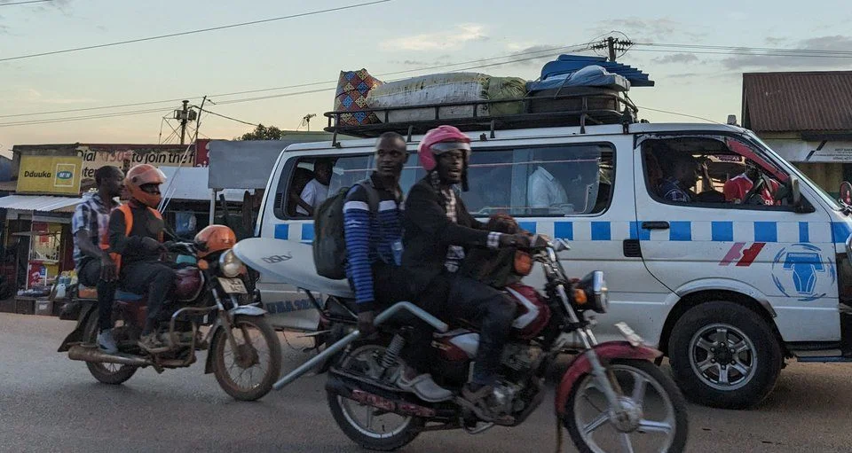

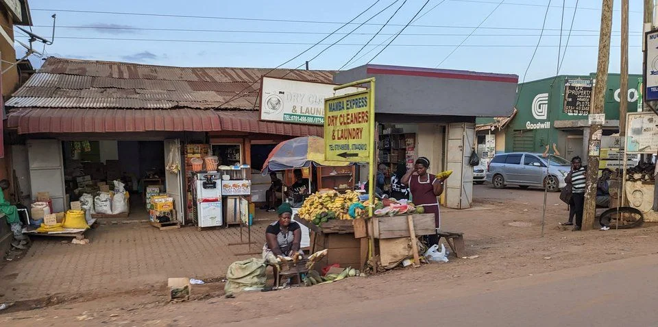

Giving or taking it took us approximately five hours to the guesthouse in Jinja. Thanks to Google Maps we managed to find the place straight away. After check-in and inspection of the room we headed to a nearby Indian-Asian restaurant and we treated ourselves with some tasty delights. Later on I could finally enjoy a well-deserved shower and rest in bed. It was an exciting but also tiring day of travelling.

## Source of the Nile

Arriving at least a day in advance has some advantages than just being there for the DevFest. I've seen this already with GDEs that came to speak at DevFest Mauritius, and I've done it travelling to [DevFest Dar es Salaam](xref:devfest-dar-es-salaam-2023) previously.

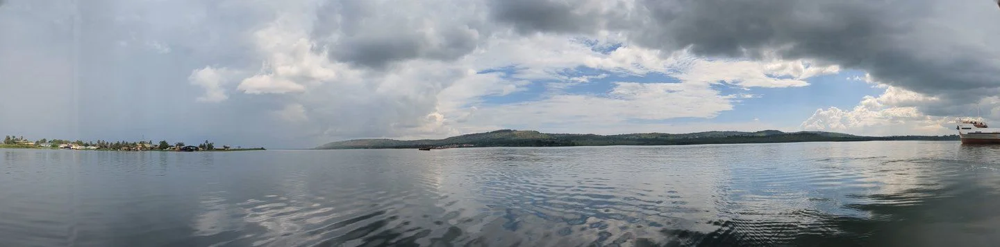

Francis suggested to meet first at my place, so that Marvin and Cynthia could deposit their stuff in my room, then a quick check of the venue and then seeing what we could do for the rest of the day. Weeks ago I mentioned that I would like to explore the source of the Nile which isn't too far from my local guesthouse anyways.

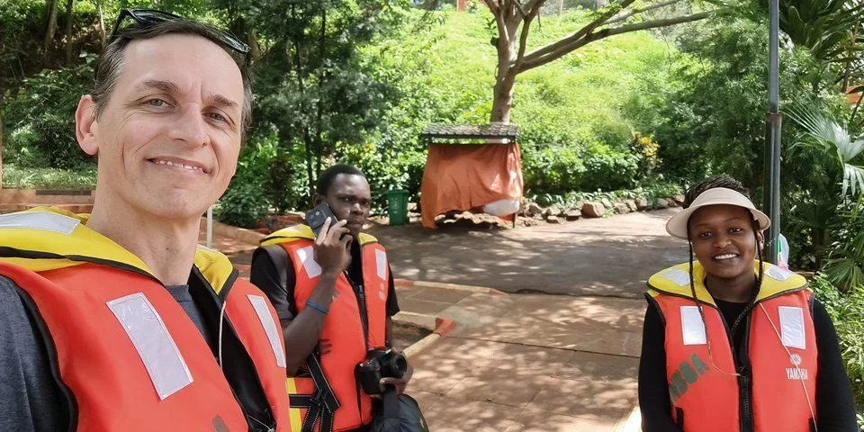

It was an amazing excursion and learning that ashes of the late Mahatma Gandhi have been spread out here at source was an interesting note.

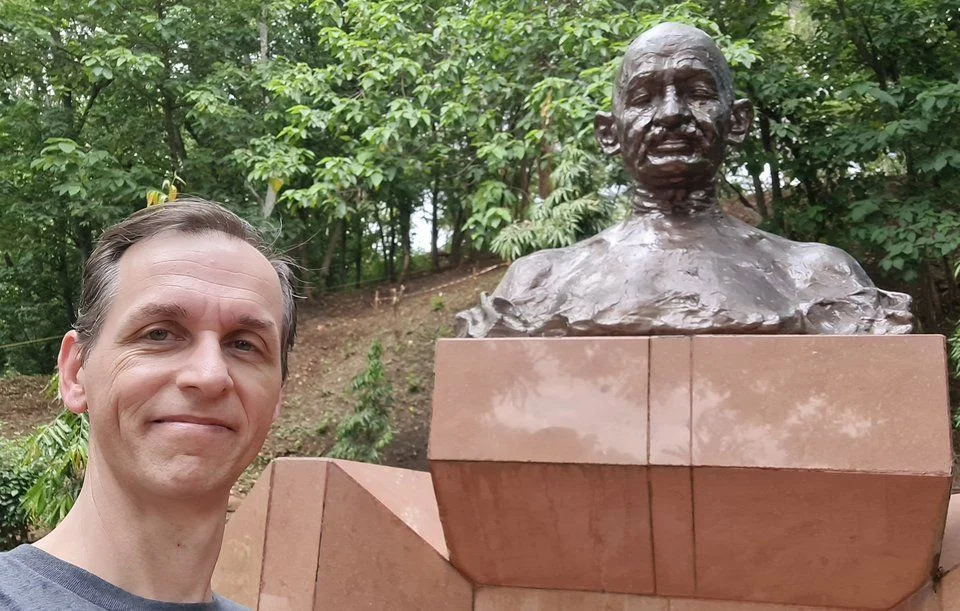

I had a great day, good company and delicious food. Highly recommended!

## DevFest Jinja

After getting some hours of sleep the big day had finally arrived. I enjoyed a nice local breakfast - called Rolex - and then called for a boda to get to [The Innovation Village](https://innovationvillage.africa/) for DevFest Jinja.

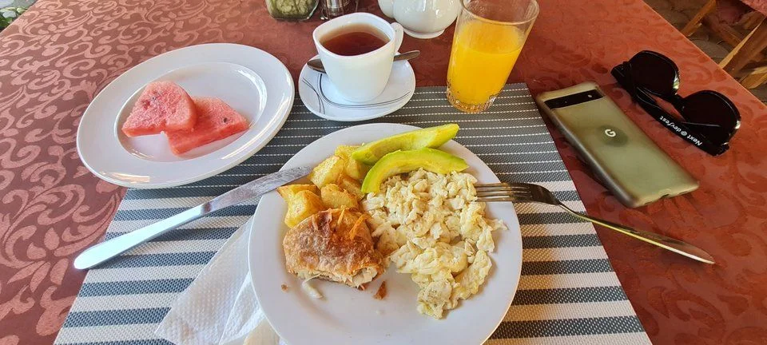

It was clearly way too early when I arrived at the venue. But well, better too early than too late, and therefore I took some time to talk to other GDG organisers, spoke to Fiona Nangobi, and was chit-chatting with Marvin and Cynthia about yesterday's excursion and other highlights.

More and more people arrived and so Francis kicked off DevFest Jinja with a respectable crowd. A few minutes in the reception and registration area was swarmed with WTM ladies, already in their gowns for the dinner arrangement later that day. It was an amazing display of vibrant colours, great happiness and big smiles on the faces of all attendees.

I was scheduled with two sessions. During the first half of the day, I spoke about the benefits of .NET and how implementations in C# as well as ASP.NET can be developed swiftly and deployed easily to various services offered by Google Cloud Platform. There were numerous questions about use cases of C# and how the available Google APIs can be accessed via NuGet packages.

In the afternoon session I talked about the importance and advantages of professional certifications, in particular given the survey results that Google Cloud certifications are ranked among the highest paid ones. Build up your expertise and prove to yourself and others that you know your subject and that you are a knowledgable Google Cloud engineer. Those certification can open doors to higher payment on the job, better job offers and potentially a chance to work remotely with companies abroad.

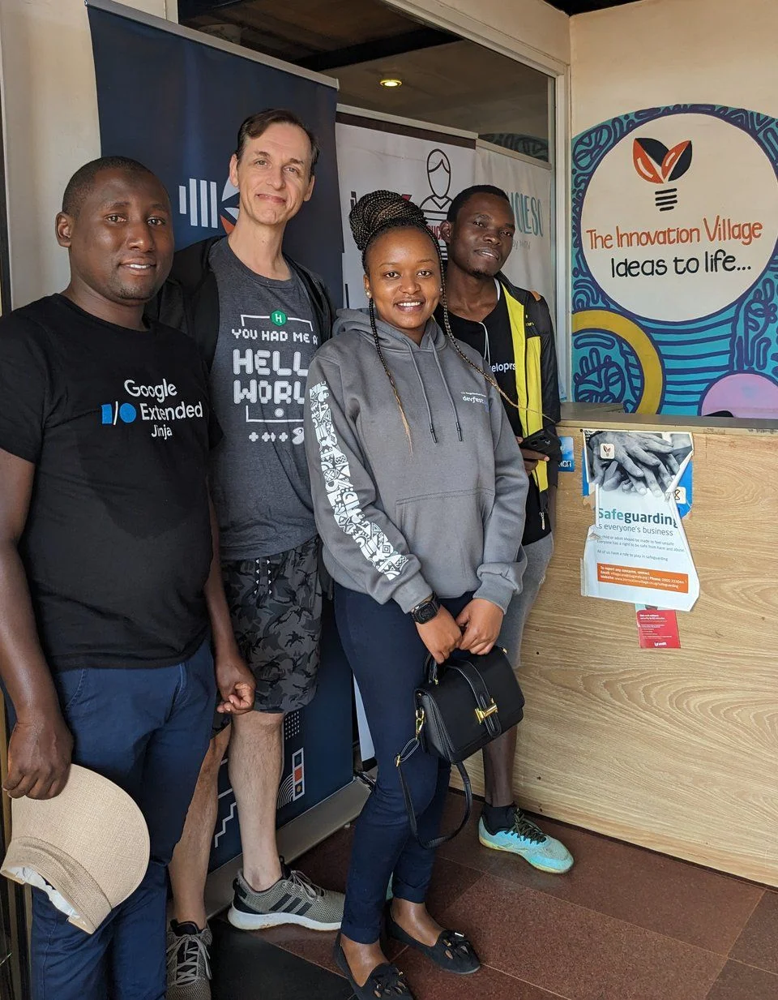

It was informative listening to the talks by other speakers. Feel free to check out the [full agenda of DevFest Jinja](https://gdg.community.dev/events/details/google-gdg-jinja-presents-devfest-jinja-2023/) to see what you eventually missed.

With all those lovely people around, all the ongoing conversations and networking chats I somehow didn't realize that I had an exchange [Zirabamuzale Rawaha aka RumzTech](https://x.com/Rawahanector), organiser of GDG Luwero, with whom I did several remote sessions as part of the [Road to Google Developers Certification](https://gdg.community.dev/events/details/google-gdg-luwero-presents-certification-study-group-associate-cloud-engineer-2023-05-27/) earlier this year. Mea culpa, Rawaha!

## Ever tasted Nsenene?

Purely by chance Asa and I were standing outside on the pavement trying to get a bit of fresh air and having an interesting conversation when this guy with an orange bucket walked pass us. As I wasn't sure whether I saw correctly I asked Asa about the content of the bucket. "Ohh, you gotta taste this. Would you like to try?"

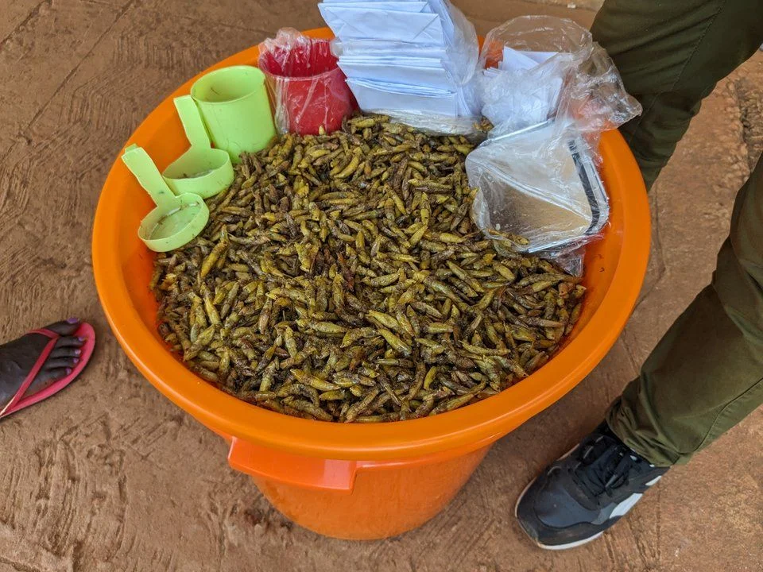

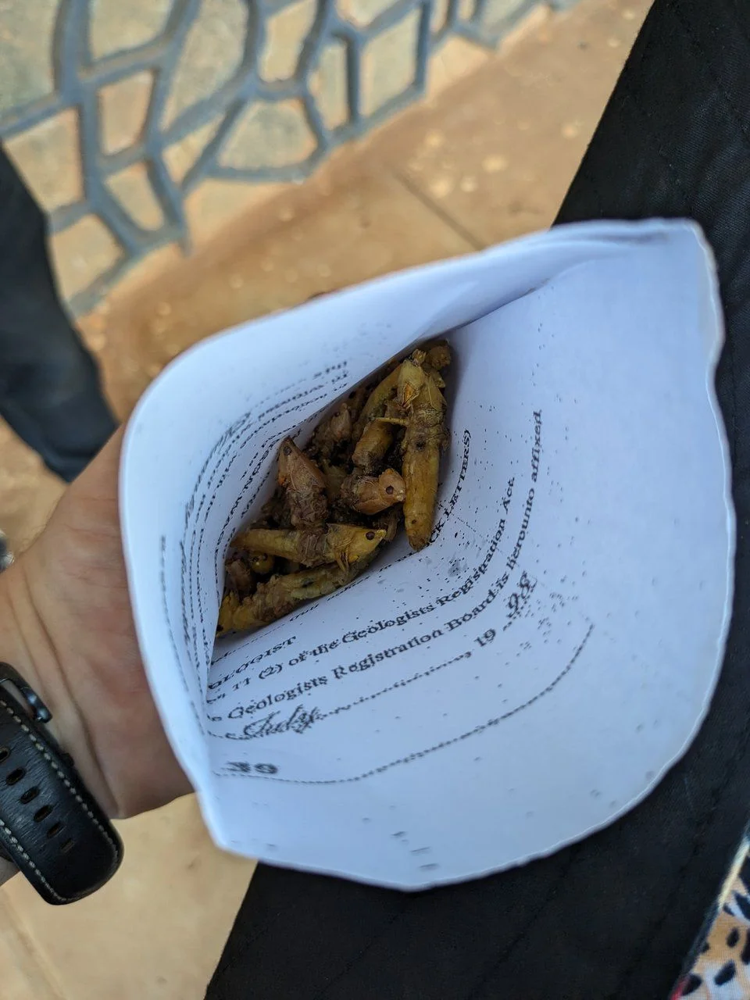

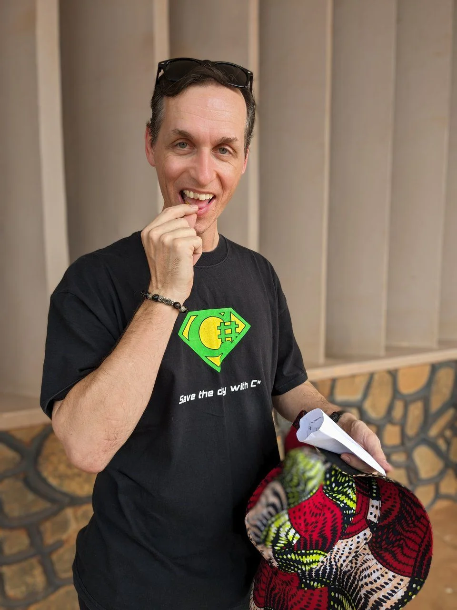

Yes, of course! Let's snack a handful roasted crickets - [called nsenene in Luganda](https://en.wikipedia.org/wiki/Nsenene) - with small chopped white onions. This species is a delicacy in central and south-western Uganda. That's what I'm looking for while travelling other countries. Experiencing new flavours, new delicacies and new smells. And actually, those crickets are yummy. If you have a chance to taste... do it. You might be surprised.

## On my way back home

Unfortunately, trips to speak at DevFest events are quite short, and so it was already time to say good bye. Thankfully Asa and Arnold offered to provide transfer to the airport, and we had to start quite early in the morning already. Shortly before driving through the Mabira Central Forest Reserve we were greeted by a massive weather spectacle with mesmerizing lightnings and roaring thunders. Whew, the streets turned into small streams and here and there we were joking about paddling in a kayak rather than driving in the car. We made it well ahead of departure time, and even managed to stop at the Victoria Mall again to have some breakfast with tea.

Another surprise was caused by Kenya Airways after we had landed in Nairobi. The scheduled flight to Mauritius had been delayed by another one and half hour so. Other travellers I met in the lounge were less lucky and were stranded for over twelve hours already. Eagerly hoping to continue their journeys.

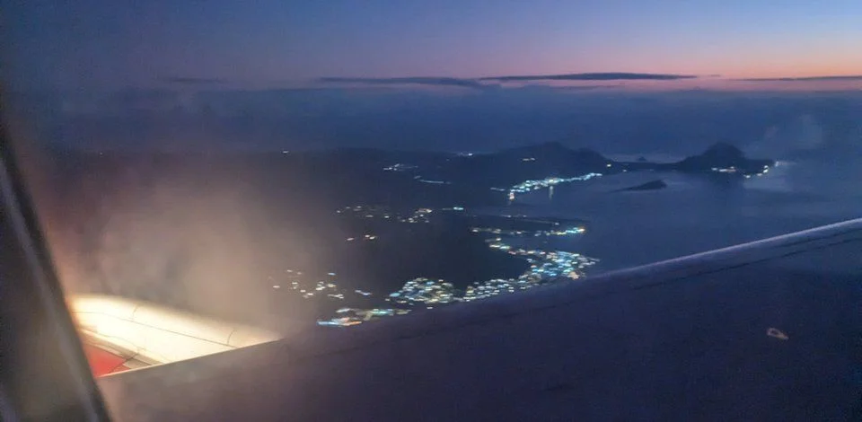

## Shout out to GDG Jinja and WTM Jinja

Congratulations to such a wonderful DevFest. Thank you so much for the warm welcome, the overwhelming care-taking and the joy I have experienced during those few days in Uganda. I'm really happy about the new impressions and experiences made.

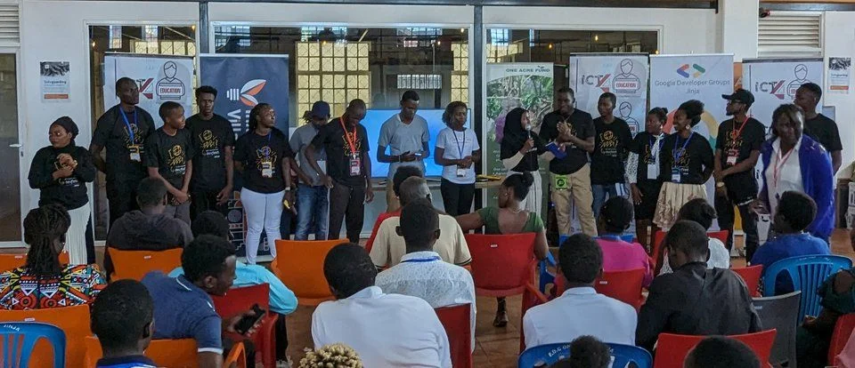

Personal thanks to Francis Akol, Asa Lugada and Fiona Nangobi! Keep shining all of you!

*Photo credits*: Shared album on Google Photos by GDG Jinja.