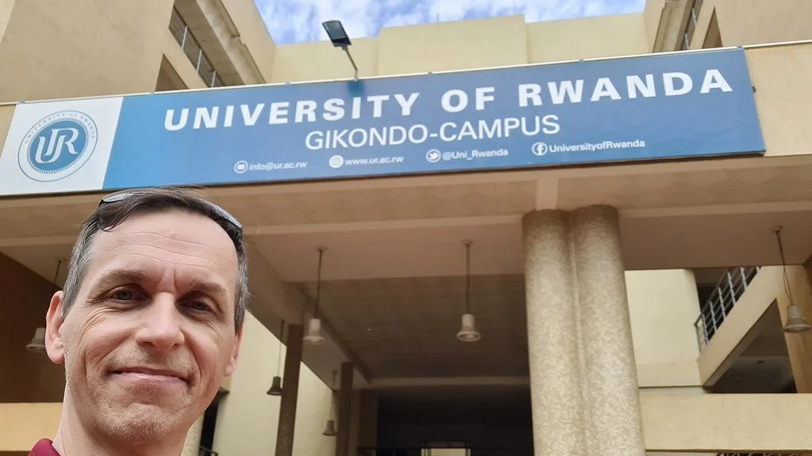
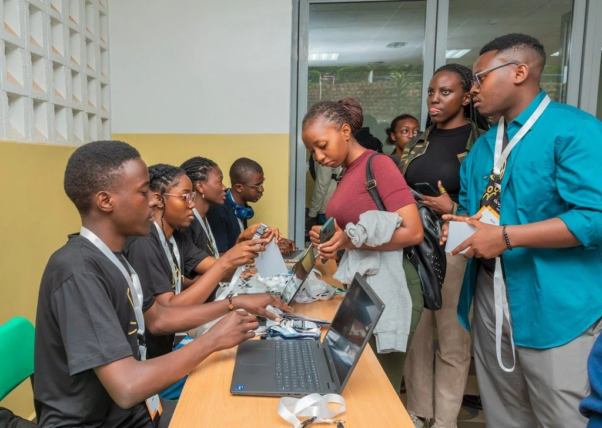
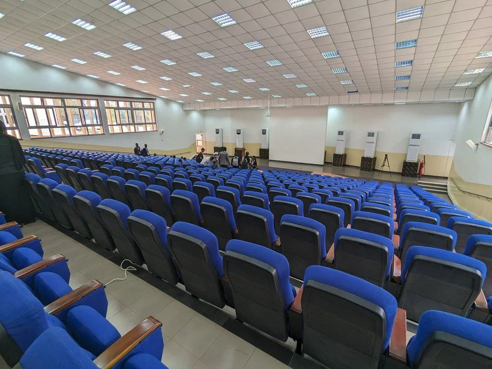
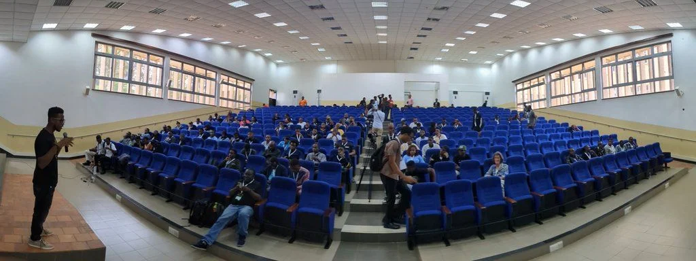
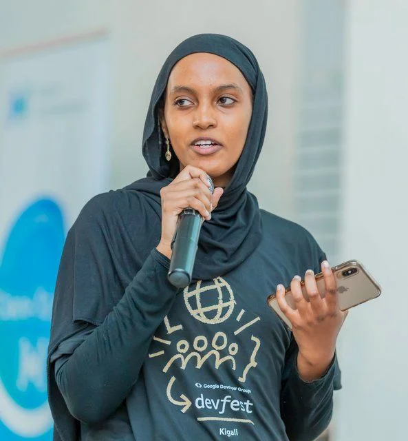
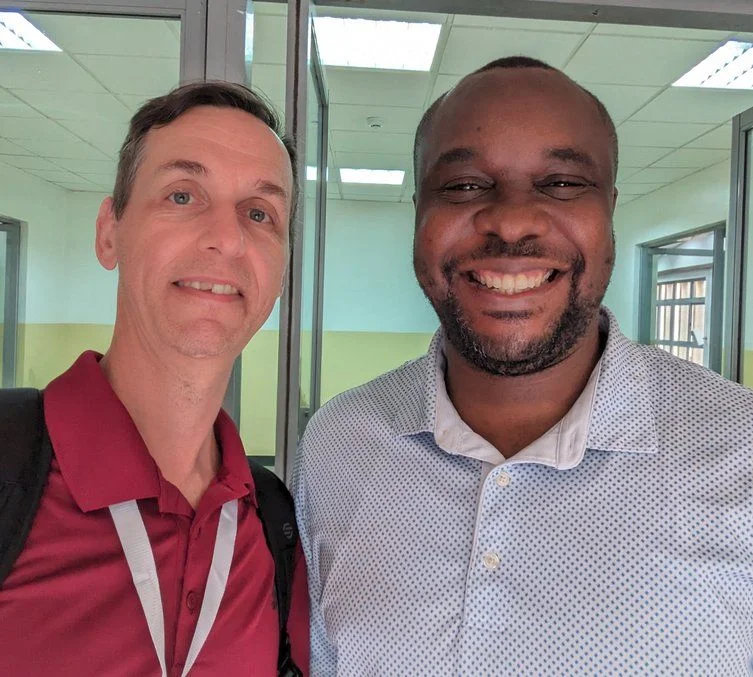
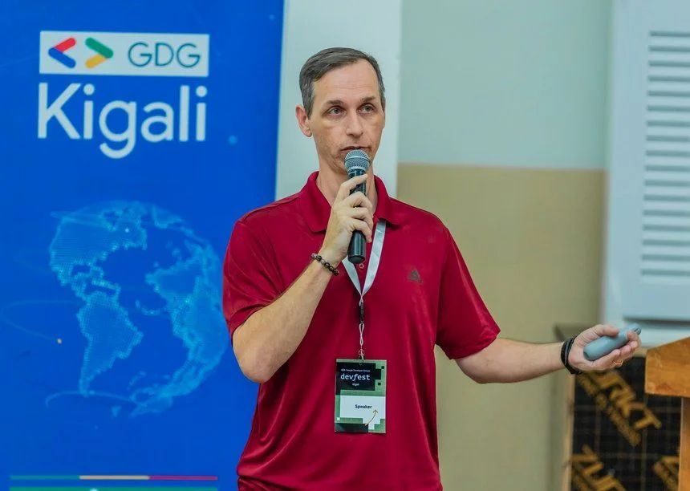
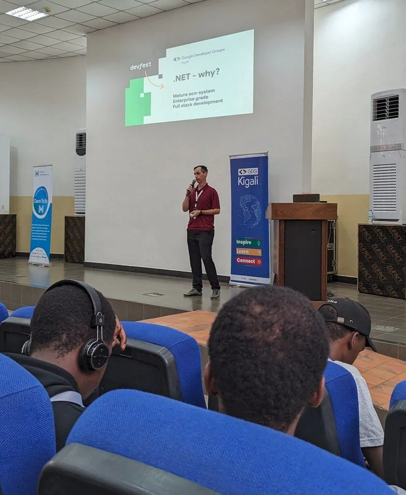
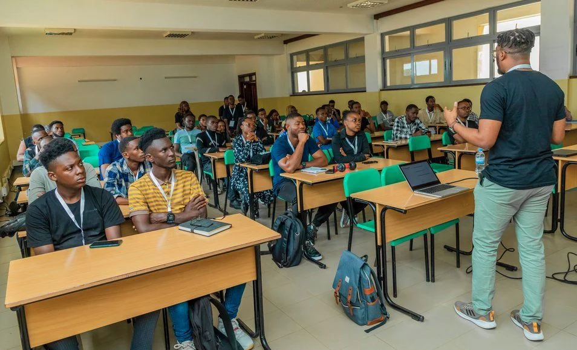
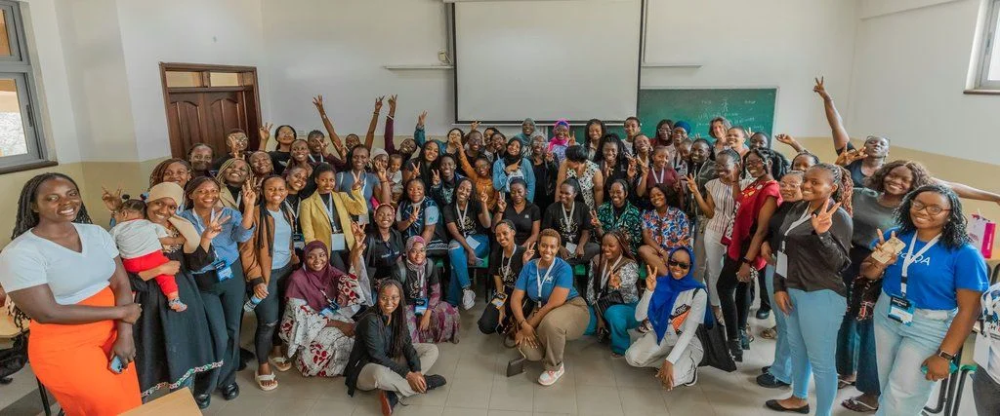

Again Rwanda, and [GDG Kigali](https://gdg.community.dev/gdg-kigali/) agreed to organise their DevFest at the same time as the annual [SSA Community Summit](xref:ssa-community-summit-2023). In comparison to last year I reached out to the organising commitee early and sent them a proposal to talk.

## The venue

Given those circumstances bus transport from the hotel to the University of Rwanda, Gikondo Campus, has been organised and after a brief breakfast we went off. Luckily I was in the bus that drove to the right destination in first attempt. An earlier bus went the wrong direction but arrived we us at the same time.

As usual, we were heading towards the registration desks to check in and to collect our badges. It took us a moment to gain orientation as there are several stores in the building. Our entrance was actually on level 2 and we had to go to ground level. Arriving there it was already packed with attendees and the team of GDG Kigali was heavily engaged welcoming everyone. Gladly, the check-in for speakers was separately and all went very smooth and quickly. Thanks guys!

Entering the theatre GR (Ground Right) brought back memories from my times at the Technical University of Kaiserslautern with its large auditoriums.

It would seat approx. 300 attendees. Hopefully enough space for all those technology interested participants.

## As the agenda

had been shared and my talk was scheduled after the lunch break, I was quite relaxed during the whole morning and I enjoyed listening to the various talks from other speakers.

Just in case, the complete agenda is accessible [here](https://docs.google.com/document/d/e/2PACX-1vS0dMJIexEzzZLN1TBS2AIzhfWJ98Y7-Mmva51HfLuiRXDPsbDMFPyqxj1iTL1aWS2zHk9rwxDVc81r/pub).

## SpaceX Starlink

So while kind of chilling during the morning hours I checked the bandwidth and speed of the provided internet connection. Interestingly, the university is using SpaceX Starlink.

> First time using SpaceX Starlink. Getting better... 😁[#DevFestKigali](https://x.com/hashtag/DevFestKigali?src=hash&ref_src=twsrc%5Etfw)  
[https://t.co/e17EqbAhgw](https://t.co/e17EqbAhgw)
>
> — Jochen Kirstätter (JoKi) (@JKirstaetter) [October 7, 2023](https://x.com/JKirstaetter/status/1710563318379810900?ref_src=twsrc%5Etfw)

The speedtest.net results look pretty good. Better than connectivity offered back home. Supposedly, Starlink is coming soon to Mauritius.

With so much bandwidth at hands what better to do than chasing around and collecting numerous selfies? Yeah, let's go hunting...

Can you name everyone in the shots above?

Apart from taking pictures I had some really good conversations with attendees regarding Google Cloud Platform, the right choice of technology stack to develop application XYZ (which obviously depends), personal growth and career advice, and about the island of Mauritius in general.

## State of GCP: .NET edition

Right after the lunch break my session had been scheduled in the main auditorium. It's a tough slot and as a speaker you have to try to keep your audience from falling into a well-deserved food-coma, read: after-lunch-nap.

It is interesting to realise that the majority of the audience is not familiar with .NET. Given that it is a Google focused event I can understand. Even more interesting is it then to observe the changes happening during my talk. As soon as I'm starting to show the first snippets of source code it seems there is a shift in attention.

Some of the pain-points I mention regarding other technology stacks compared to how it can be handled in .NET, respectively written the code in C#. Perhaps use of third-party libraries and package management is one of those hot topics which are, in my opinion, easier to handle in .NET using NuGet compared to Node.js and node modules. Especially as soon as it comes to upgrading versions in longer running projects.

## More sessions

Throughout the day there had been two periods with so-called breakout sessions were six presentations were held in parallel. It's actually an interesting concept to shift attendees based on their interest while keeping the focus in the main auditorium when needed.

Finally, although I didn't attend, I'd like to mention that there had been a designated breakfast session for Women in Tech (WIT) and Women TechMakers (WTM).

It's great to see this level of consciousness during DevFest Kigali and the dedication to make it comfortable as well as welcoming for women in technology to come, to participate and to network.

## My gratitude to GDG Kigali

Clearly, there is so much potential in Rwanda, perhaps in whole Africa most likely, and participating in a DevFest event being asked for advice, asking a few questions to hopefully stimulate attendees to shift their view on their situation slightly, as well as sharing from my own experience is so rewarded. I'm really grateful for this opportunity to attend and speak at DevFest Kigali.

Big thanks to [Josue](https://www.linkedin.com/in/josue-mutabazi-84bb33163/), [Jean Salvi](https://x.com/salviosage), and the whole team of [GDG Kigali](https://gdg.community.dev/gdg-kigali/). You guys rock! Keep doing community and shine.

Lastly, I'm hoping to come back to Kigali another day (or two). It was again amazing.

*Photo credits*: Shared Photos album by SSA Community Leads and Flicker album by GDG Kigali