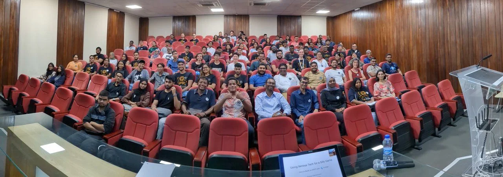
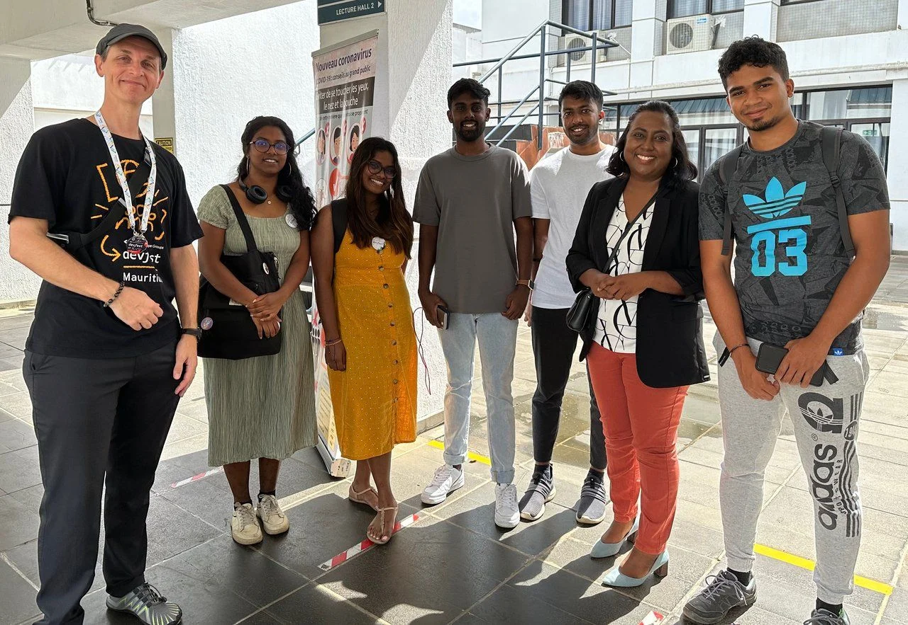
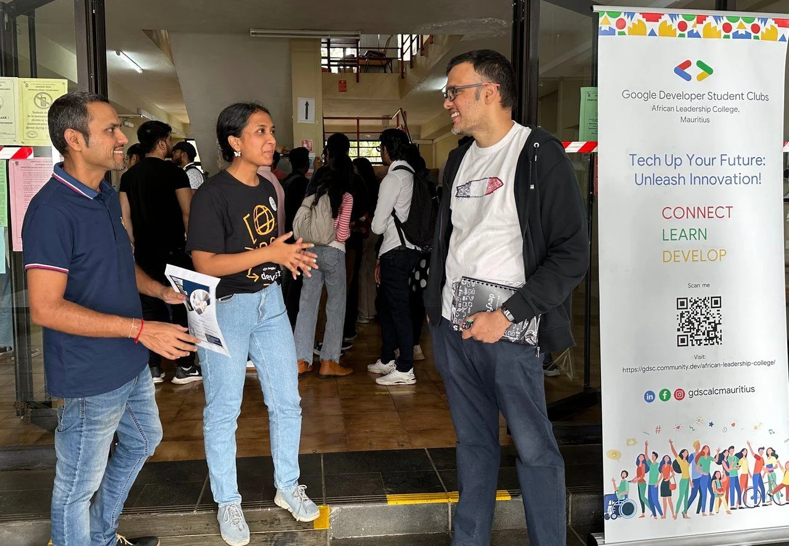
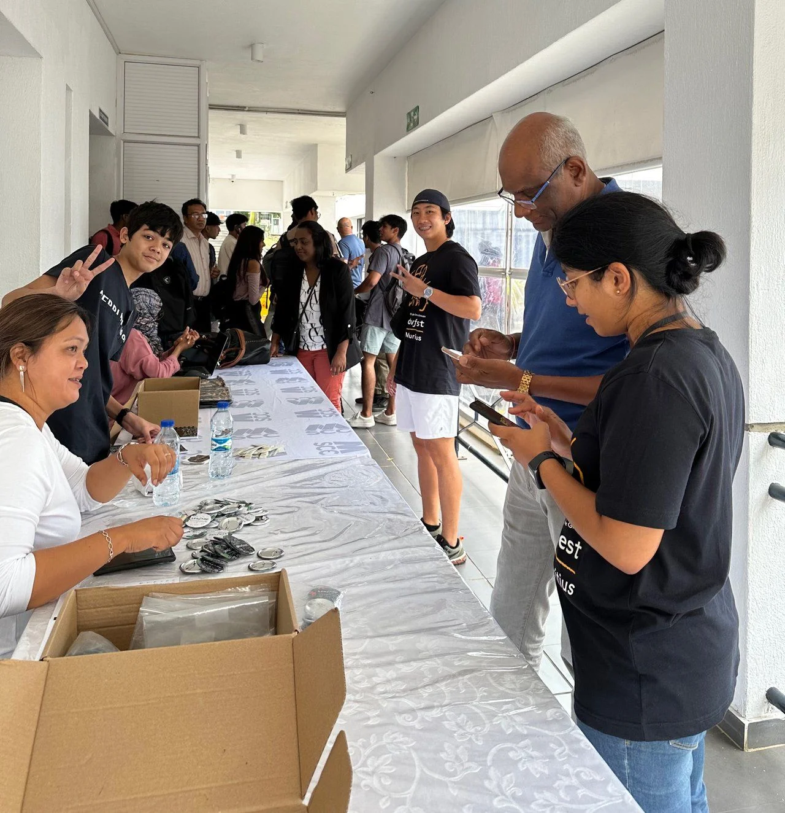
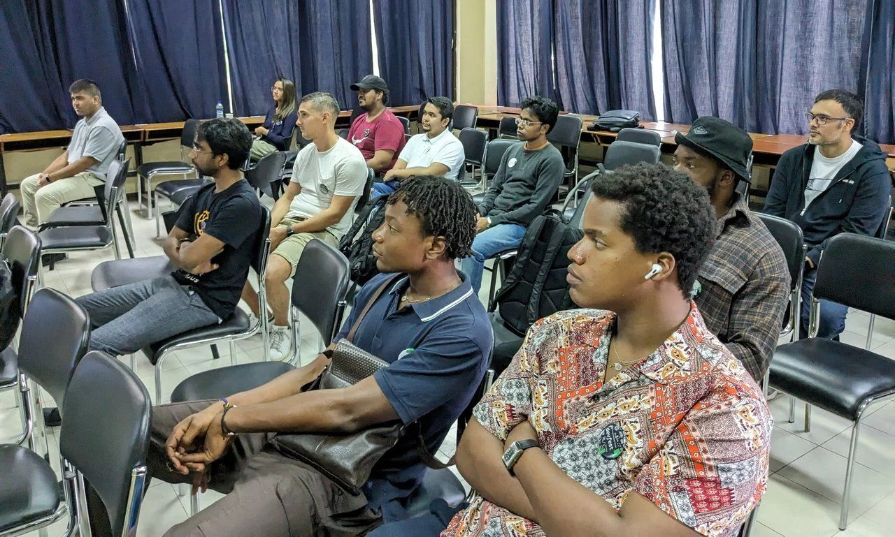
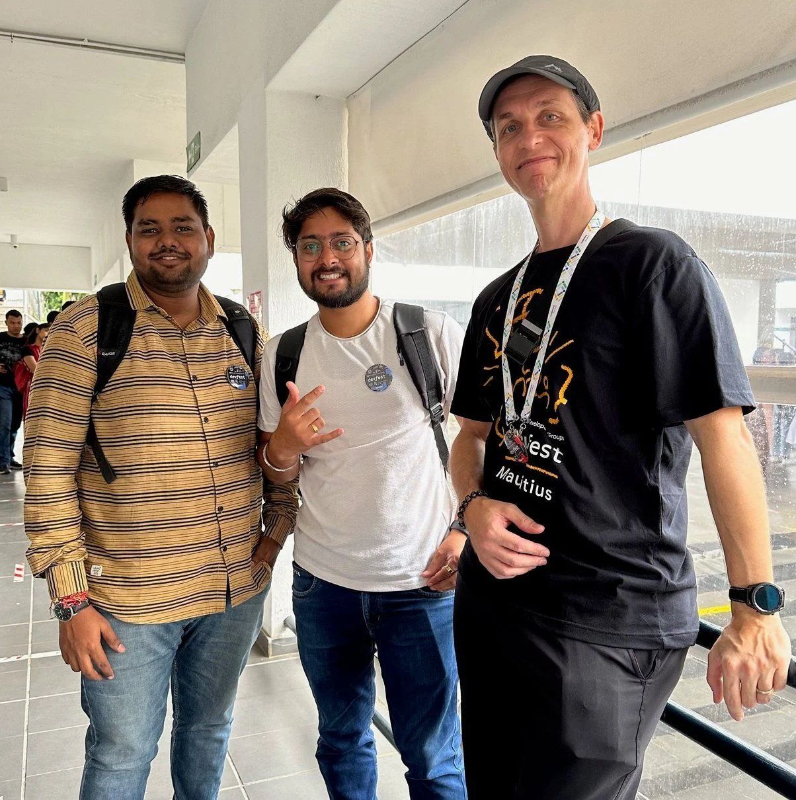
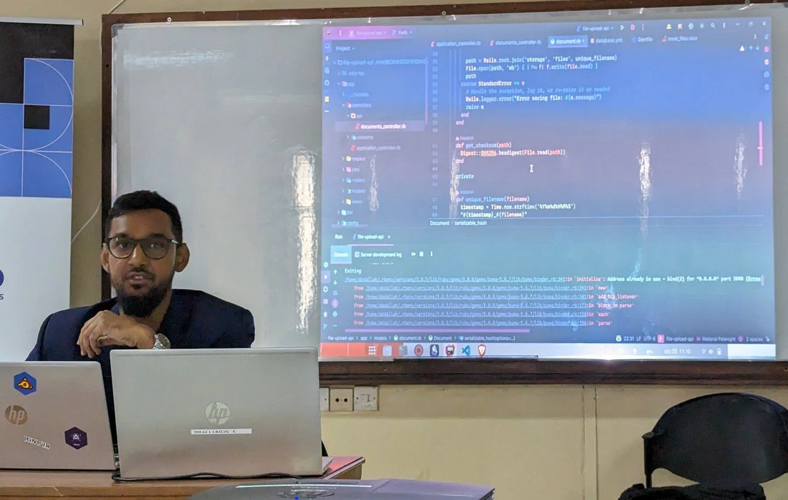
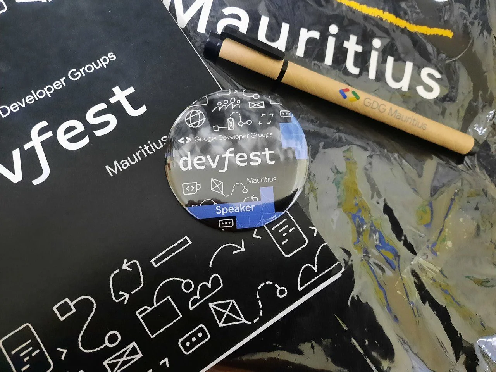
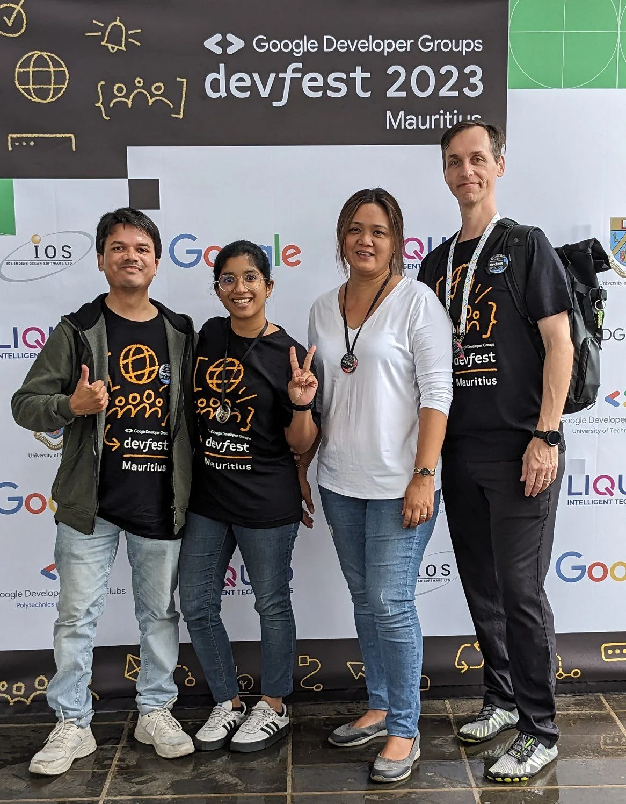

Speaking on home turf is an exciting situation. You know the venue(s), you probably know the audience of the event, and overall, preparations are usually completed a few days or even weeks ahead of time. Nonetheless, it's still very exciting.

Since 2018 organised the local GDG chapter in Mauritius the annual DevFest, with the exception in 2021 due to COVID related restrictions, and it is a well received opportunity to get your head into the latest technologies offered by Google. Whether it is mobile, web, cloud, AI, or machine learning (ML) the topics are wide spread and the range of speakers is great.

## The venue: University of Mauritius

GDG Mauritius is the only chapter on the island due the small dimensions and population here, and every year DevFest is held at a new location. So this year, we teamed up with students at the University of Mauritius (UoM) to handle all administrative task to secure a spot on their campus. Luckily, there is the Google Developers Student Club (GDSC) UoM which assisted big time with the communication towards responsible parties at the university and on choosing the right location(s) on the campus.

## DevFest is community first

With this approach in mind, all preparational and organisational steps have been worked out together with all four, currently active GDSC chapters in Mauritius. Which are in no particular order

- [GDSC University of Mauritius](https://gdsc.community.dev/university-of-mauritius/)
- [GDSC African Leadership College](https://gdsc.community.dev/african-leadership-college/)
- [GDSC University of Technology](https://gdsc.community.dev/university-of-technology-mauritius/)
- [GDSC Polytechnics Mauritius Ltd](https://gdsc.community.dev/polytechnics-mauritius-ltd/)

Please check out their chapter pages and see their activities throughout the year.

Personally, I really love this kind of collaborative work. It helps to delegate various tasks and the input received from various students was valuable for the GDG Mauritius.

Plus, as GDG organiser I'm also hoping to attract some of the students to continue their user group engagements after graduating and leaving their GDSC chapter in the future.

### Highlight #1 - Over 250 attendees!

What an outstanding number. Finally we are back to the attendance as before the pandemic and it was a buzzling DevFest. People started to come while the organising team was setting up the registration desk. Note: we are usually too early.

It was a joy to see all the networking interactions. Students from different campuses mingled with seasoned professionals. Our speakers were present and had constantly conversations with attendees - before their respective and surely afterwards.

Really great to have in-person conferences happening.

### Highlight #2 - GDEs!

This has been my favourite highlight of DevFest. Thanks to the generous support of the GDE travel grant program the organising team managed to bring a whooping four Google Developer Experts (GDE) to Mauritius. Let me quickly give you their names and links to their social media profiles.

- [Wayne Gakuo](https://x.com/wayne_gakuo), GDE Angular, Kenya
- [Vivek Yadav](https://x.com/viveky259259), GDE Flutter, India
- [Vrijraj Singh](https://x.com/SVrijraj), GDE Firebase & Web Technologies, India
- [Sylvia Dieckmann](https://x.com/sylviedie), GDE Flutter, South Africa
- [Jochen Kirstätter](https://x.com/jkirstaetter), GDE Google Cloud, Mauritius
- [Sandeep Ramgolam](https://x.com/__sun__), GDE Web Technologies, Mauritius

I'm also very happy about our two guests from India, meaning they are GDEs from outside the Sub-Saharan Africa (SSA) region. Which is an exceptional handling on the GDE program's side. Many thanks for this unique experience.

### Lots of interesting talks

Thanks to the high interest of speakers and submissions of proposals the agenda of DevFest Mauritius 2023 was packed with interesting topics.

All details and the full agenda plus information about all speakers is available on the event page.

[DevFest Mauritius 2023](https://devfest.mscc.mu/)

And alternatively on the[Community Dev event page](https://gdg.community.dev/events/details/google-gdg-mauritius-presents-devfest-mauritius-2023/). Here can also join the GDG Mauritius and stay informed about future activities and events.

## Thanks everyone involved

Many thanks to our DevFest host - University of Mauritius -, represented by [Dr Baby Gobin-Rahimbux](https://www.linkedin.com/in/baby-gobin-062a1335/) and [Mrs Anuja Meetoo-Appavoo](https://www.linkedin.com/in/anuja-meetoo/). To the helping staff of UoM before and during the event. Thank you!

Shout out to all GDSC members involved in the DevFest preparations in all kind of ways. You all did a great job and contributed to the success of this year's event. Thanks!

Respect and heartfelt thanks to all speakers. And attendees. For spending your precious spare time with other like-minded IT and tech people here at DevFest Mauritius. I hope you DevFest was a worthy experience. Really appreciated and you're the driving force for more. Thanks!

Many thanks to our partners Google, Liquid Intelligent Technologies and IOS Indian Ocean Software Ltd for financial assistance and adminstrative handling. The goodies have been well received and I think the pin badge makes a huge difference... Thanks!

And lastly kudos to the "core" organising team of GDG Mauritius for pulling it off once again.

And with this bombshell, I'm looking forward to DevFest 2024.

*Photo credits*: Shared album on Photos with wonderful images contributed by other attendees of DevFest Mauritius 2023.