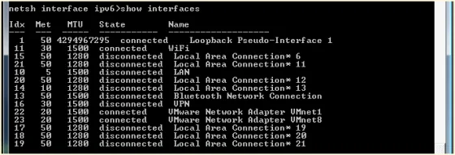
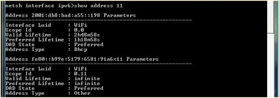
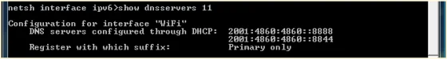

Even though IPv6 might not be that important within your local network it might be good to get yourself into shape, and be able to provide some details of your infrastructure automatically to your network clients.

This is the second article in a series on IPv6 configuration:

- [Configure IPv6 on your Linux system](xref:configure-ipv6-on-ubuntu)
- [DHCPv6: Provide IPv6 information in your local network](xref:dhcpv6-ipv6-in-your-local-network)
- [Enabling DNS for IPv6 infrastructure](xref:enabling-dns-for-ipv6-infrastructure)
- [Accessing your web server via IPv6](xref:accessing-apache2-web-server-via-ipv6)

**Piece of advice**: This is based on my findings on the internet while reading other people's helpful articles and going through a couple of man-pages on my local system.

## IPv6 addresses for everyone (in your network)

Okay, after setting up the configuration of your local system, it might be interesting to enable all your machines in your network to use IPv6. There are two options to solve this kind of requirement... Either you're busy like a bee and you go around to configure each and every system manually, or you're more the lazy and effective type of network administrator and you prefer to work with Dynamic Host Configuration Protocol (DHCP). Obviously, I'm of the second type.

Enabling dynamic IPv6 address assignments can be done with a new or an existing instance of a DHCPd. In case of Ubuntu-based installation this might be isc-dhcp-server. The isc-dhcp-server allows address pooling for IP and IPv6 within the same package, you just have to run to independent daemons for each protocol version. First, check whether isc-dhcp-server is already installed and maybe running your machine like so:

```
$ service isc-dhcp-server6 status
```

In case, that the service is unknown, you have to install it like so:

```
$ sudo apt-get install isc-dhcp-server
```

Please bear in mind that there is no designated installation package for IPv6.

Okay, next you have to create a separate configuration file for IPv6 address pooling and network parameters called **/etc/dhcp/dhcpd6.conf**. This file is not automatically provided by the package, compared to IPv4. Again, use your favourite editor and put the following lines:

```
$ sudo nano /etc/dhcp/dhcpd6.conf

authoritative;
default-lease-time 14400; 
max-lease-time 86400;
log-facility local7;
subnet6 2001:db8:bad:a55::/64 {
    option dhcp6.name-servers 2001:4860:4860::8888, 2001:4860:4860::8844;
    option dhcp6.domain-search "ios.mu";
    range6 2001:db8:bad:a55::100 2001:db8:bad:a55::199;
    range6 2001:db8:bad:a55::/64 temporary;
}
```

Next, save the file and start the daemon as a foreground process to see whether it is going to listen to requests or not, like so:

```
$ sudo /usr/sbin/dhcpd -6 -d -cf /etc/dhcp/dhcpd6.conf eth0
```

The parameters are explained quickly as `-6` we want to run as a DHCPv6 server, `-d` we are sending log messages to the standard error descriptor (so you should monitor your /var/log/syslog file, too), and we explicitely want to use our newly created configuration file (`-cf`). You might also use the command switch `-t` to test the configuration file prior to running the server.

In my case, I ended up with a couple of complaints by the server, especially reporting that the necessary lease file wouldn't exist. So, ensure that the lease file for your IPv6 address assignments is present:

```
$ sudo touch /var/lib/dhcp/dhcpd6.leases
$ sudo chown dhcpd:dhcpd /var/lib/dhcp/dhcpd6.leases
```

Now, you should be good to go. Stop your foreground process and try to run the DHCPv6 server as a service on your system:

```
$ sudo service isc-dhcp-server6 start
isc-dhcp-server6 start/running, process 15883
```

Check your log file /var/log/syslog for any kind of problems. Refer to the man-pages of isc-dhcp-server and you might check out [Chapter 22.6 of Peter Bieringer's IPv6 Howto](https://tldp.org/HOWTO/html_single/Linux+IPv6-HOWTO/#HINTS-DAEMONS-ISC-DHCP "Chapter 22.6 of Peter Bieringer's IPv6 Howto"). The instructions regarding [DHCPv6 on the Ubuntu Wiki](https://wiki.ubuntu.com/DHCPv6 "DHCPv6 on the Ubuntu Wiki") are not as complete as expected and it might not be as helpful as this article or Peter's HOWTO. But see for yourself.

## Does the client get an IPv6 address?

Running a DHCPv6 server on your local network surely comes in handy but it has to work properly. The following paragraphs describe briefly how to check the IPv6 configuration of your clients,

### Linux - ifconfig or ip command

First, you have enable IPv6 on your Linux by specifying the necessary directives in the `/etc/network/interfaces` file, like so:

```
$ sudo nano /etc/network/interfaces

iface eth1 inet6 dhcp
```

**Note**: Your network device might be eth0 - please don't just copy my configuration lines.

Then, either restart your network subsystem, or enable the device manually using the `dhclient` command with IPv6 switch, like so:

```
$ sudo dhclient -6
```

You would either use the `ifconfig` or (if installed) the `ip` command to check the configuration of your network device like so:

```
$ sudo ifconfig eth1
eth1  Link encap:Ethernet  HWaddr 00:1d:09:5d:8d:98  
      inet addr:192.168.160.147  Bcast:192.168.160.255  Mask:255.255.255.0
      inet6 addr: 2001:db8:bad:a55::193/64 Scope:Global
      inet6 addr: fe80::21d:9ff:fe5d:8d98/64 Scope:Link
      UP BROADCAST RUNNING MULTICAST  MTU:1500  Metric:1
```

Looks good, the client has an IPv6 assignment. Now, let's see whether DNS information has been provided, too.

```
$ less /etc/resolv.conf
# Dynamic resolv.conf(5) file for glibc resolver(3) generated by resolvconf(8)
#     DO NOT EDIT THIS FILE BY HAND -- YOUR CHANGES WILL BE OVERWRITTEN
nameserver 2001:4860:4860::8888
nameserver 2001:4860:4860::8844
nameserver 192.168.1.2
nameserver 127.0.1.1
search ios.mu
```

Nicely done.

### Windows - netsh

Per [description on TechNet](https://technet.microsoft.com/en-us/library/cc778925%28v=ws.10%29.aspx) the netsh is defined as following:

> "Netsh is a command-line scripting utility that allows you to, either locally or remotely, display or modify the network configuration of a computer that is currently running. Netsh also provides a scripting feature that allows you to run a group of commands in batch mode against a specified computer. Netsh can also save a configuration script in a text file for archival purposes or to help you configure other servers."

And even though TechNet states that it applies to Windows Server (only), it is also available on Windows client operating systems, like Vista, Windows 7 and Windows 8.

In order to get or even set information related to IPv6 protocol, we have to switch the netsh interface context prior to our queries. Open a command prompt in Windows and run the following statements:

```
C:\Users\joki>netsh
netsh>interface ipv6
netsh interface ipv6>show interfaces
```



Select the device index from the Idx column to get more details about the IPv6 address and DNS server information (here: I'm going to use my WiFi device with device index 11), like so:

```
netsh interface ipv6>show address 11
```



Okay, address information has been provided. Now, let's check the details about DNS and resolving host names:

```
netsh interface ipv6>show dnsservers 11
```



That looks good already. Our Windows client has a valid IPv6 address lease with lifetime information and details about the configured DNS servers.

Talking about DNS server...  
Your clients should be able to connect to your network servers via IPv6 using hostnames instead of IPv6 addresses. Please read on about [how to enable a local named with IPv6](xref:enabling-dns-for-ipv6-infrastructure).