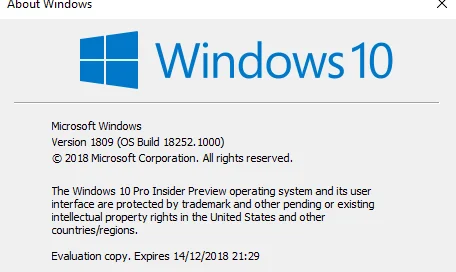
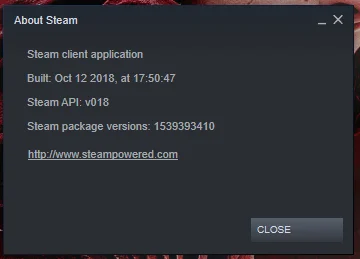
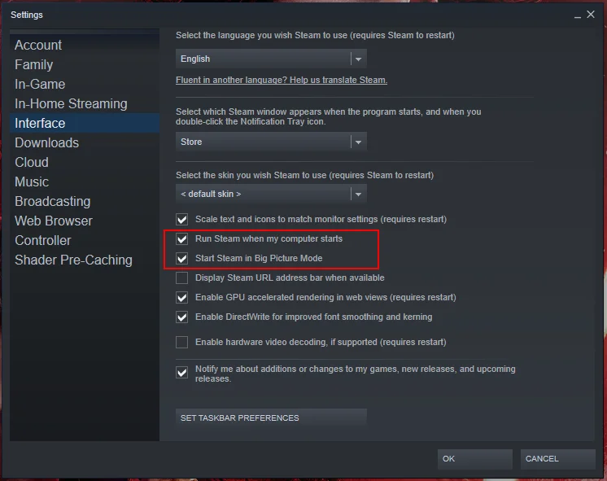
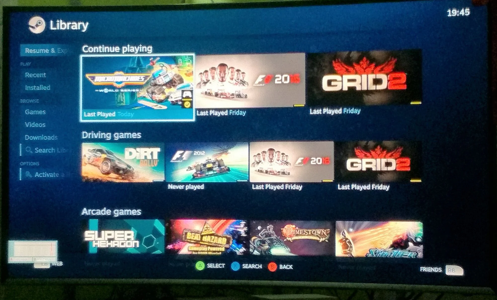
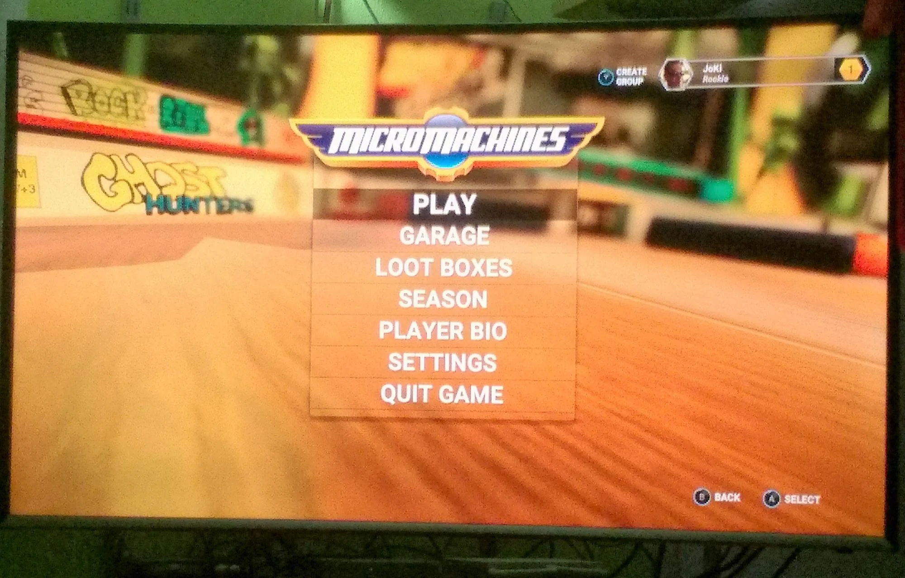
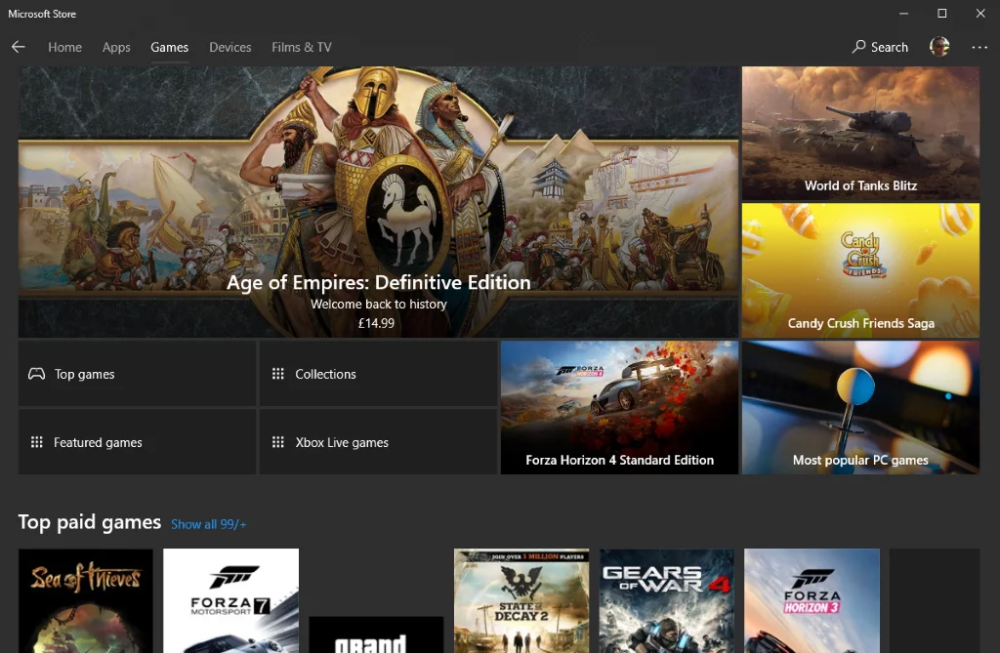

Working in IT has its up's and down's. One of the up's is probably the circumstance of purchasing new hardware on a regular base. (Un)fortunately two events came together this year - an aging machine and tax depreciation purpose - which *encouraged* me to purchase a new rig for software development.

As for the aging machine, an MSI GS70 2PE Stealth Pro, I had a few issues cropping up lately, and so I decided to get in touch with the original supplier to discuss possibilities to refurbish the system. My main sorrow was a partially broken display connector cable, meaning I couldn't open the display beyond a certain angle anymore. Otherwise, the screen would either freeze or would show stripe patterns from a different world. While this would be manageable by using an external screen, two actually, there were other glitches in the matrix...

Long story short, after I received my new machine, an MSI GS73VR 7RF Stealth Pro, that old system went back to the supplier for general cleaning and check up. Luckily, it didn't take that long to get it back... Now, what to do with it?

## Installing latest Windows 10 Insider

Having a spare system with such a powerful specification it was somehow obvious to me to use it as a bare metal playground for the latest Windows 10 Insider editions. And with the intention to not use the system for any work-related tasks I thought that it would probably be an interesting experiment to convert it into a full-fledged gaming machine. And I mean not that kind of emulator stuff only but recent titles and so on.

Previously, I was using mainly VMs to explore Windows 10 Insider versions, and now using a dedicated bare metal system would surely improve my experience in that area. If you're interested in setting up a new system, please read on here: [How to get your computer from blank disk(s) to fully operational in no time... (Windows edition)](xref:windows10-quick-installation)

The nice side-effect of using a Windows 10 Insider version is that it comes for free, too. And actually, I like the thrill to get the latest features and the ability to provide feedback - positive and negative - to Microsoft. It's kind of fun...

## Steam - Big Picture mode

On a common Windows system you might like to install and to use [Steam](https://store.steampowered.com/about/) as a regular software application. Perhaps accept the auto-start feature after logging in, and letting it run in the background. As stated earlier, not for that machine...

Its main purpose is getting the maximum out of it for gaming at home. After installation of the latest Steam version ([via chocolatey](xref:windows10-quick-installation): steam) I opened the `File` menu and checked under Settings &gt; Account &gt; Beta participation whether a vNext might be available.

Tada! The option to opt-in into the Steam beta program is given. Let's do it! After quick download and restart of Steam software we are all set.

Now, the system is ready for the big screen and therefore needs to launch into the Big Picture mode of Steam automatically. Open the `File` menu and navigate to Settings &gt; Interface in order to tick the two checkboxes - Run Steam when my computer starts & Start Steam in Big Picture Mode, as shown in the screenshot below.

## HDMI and a bit of cabling

After installation of Windows 10 and adjusting Steam properly, it is time to pay a little attention to further hardware. The GE70 has three video outputs - one HDMI and two mini-DisplayPort. To keep things simple I got a 2 meter-long HDMI 1.4 cable from the electronics shop around the corner to connect the laptop to the TV. The cable is long enough to allow comfortable placement of the computer under the TV and provides enough length for flexible handling.

I directly bought an HDMI cable with version 1.4 specification which in case of a future upgrade of the TV to 4K resolution would still be sufficient. Oh yes, thanks to the NVidia GeForce GTX 870M graphics card the laptop has enough resources for such a configuration.

## Time for a test run...

Having everything in place it is finally time to give the whole system a test run. I shutdown the machine completely, and then let it boot again. After entering login pin for my account it takes a short moment and Steam starts automatically into Big Picture Mode on the TV screen.

Well, that went very well for a first attempt.

Launching an installed Steam game works as expected and it appears nicely on the TV, too.

Let the games begin...

## Itch.io - Marketplace for independent game creators

Next, I installed the [desktop version](https://itch.io/app) of [Itch.io](https://itch.io/) and went through my library of games. One of my current titles I absolutely adore is "[Return of the Tentacle - Prologue](https://catmic.itch.io/return-of-the-tentacle)" by game developer [catmic](https://catmic.itch.io/) - a fan project and the unofficial sequel to the iconic adventure game "Day of the Tentacle".

" by game developer [catmic](https://catmic.itch.io/)](../content/images/2018/10/Itch_ReturnOfTheTentacle.webp)

It is a good old 2D point and click adventure game developed on Unity and has astonishing graphics and superb soundtrack. Highly recommended for any gamer that misses titles like [Sam & Max](https://en.wikipedia.org/wiki/Sam_%26_Max), [Zak McKracken and the Alien Mindbenders](https://en.wikipedia.org/wiki/Zak_McKracken_and_the_Alien_Mindbenders), or even the [Monkey Island series](https://en.wikipedia.org/wiki/Monkey_Island_%28series%29).

Again, no surprises and the game launches nicely into full screen mode on the TV set. Splendid!

## Let's explore the Microsoft Store

Of course, it's interesting to check out the Microsoft Store for any kind of games.

Your mileage may vary... For testing purpose I installed Asphalt 9: Legends. Although the download took a while to complete, launching and playing the game on the TV was a breeze. It's actually good fun to drift around on the big screen, and the sound from the TV is amazing compared to the laptop speakers.

## Xbox app

I would say it works, too. As of writing this article I did not venture that much into the application but so far I did not run into any surprises nor issues.

Perhaps I have to give it a bit more time... We will see.

## ScummVM

Sorry folks... Haven't had the time to install [ScummVM](https://www.scummvm.org/) yet. Totally bummed about that, and one of the best 2D game platforms on the planet. It's definitely on my roadmap, and I'll keep you posted as soon as it's done.

## Optional hardware (recommendations)

Using a spare machine like I did here and converting it into an experimental DIY gaming box does not seem to be that difficult after all. Of course, the real feel of gaming is related to additional hardware, mainly gamepads and a remotely connected keyboard and mouse.

For the gamepads you can literally take anything that hooks up nicely with Windows 10, e.g. Xbox or PlayStation game controllers. I managed to pair one of my [OUYA](https://www.ouya.tv/)Game Controllers via Bluetooth, and also plugged in an older Thrustmaster gaming pad via USB. After an initial calibration they both work nicely. Although I had to set up a controller profile on Steam to map the various buttons and axis correctly.

## Next stage: Video calls

The next chapter I going to explore is all about instant messengers and their video call capabilities. I'm aware that the laptop has built-in video camera and microphone... The quality is also good for regular desktop use, meaning close proximity.

The usual suspects, e.g. Skype, Messenger, Signal, etc. should work nicely in regards to display the call partner on the TV but before trying it out I would like to purchase a better HD camera with wide-field microphone and then connect it via USB to the system.

Guess that this is going to be good fun to have family conversations...

## Future experiment: Live Streaming

Yeah, this might sound a bit crazy, who knows but having all the gaming applications in operation I'm actually interested to see whether it will be possible to get live streaming on Steam, Xbox Live, [Twitch](https://www.twitch.tv/jkirstaetter) or perhaps even YouTube done.

Surely, there is more work to be done and proper video and audio equipment will be essential for this adventure. I'm curious about it. And I'm looking forward to write another blog about that...

## Give your 'older' hardware a chance

Computer systems are quite powerful since a few years already. One might say that they are over-dimensioned for common use, like browsing the web, taking care of emails and writing letters, etc. Given the hardware specs of my previous machine I gave it try to convert it into a decent gaming 'DIY console' - successfully, IMHO.

Maybe you have a spare system lying around on your desk, and perhaps you don't know what to do with it. Hopefully, this article gave you a little bit of an inspiration. And, in case of lower specs you may look into alternative approaches. There are some great arcade emulators around that will offer same or even better fun than Steam & Co. Have a look at [Lakka - The open source game console](https://www.lakka.tv/)...

What about you? Did you set up something similar already? If yes, what did you do? Did you run into any obstacles or speed bumps? Do you have any recommendations to look into? I'm really interested to hear about your DIY game console in the comment section below.

Thanks and happy gaming!