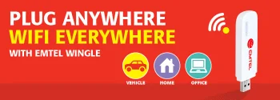
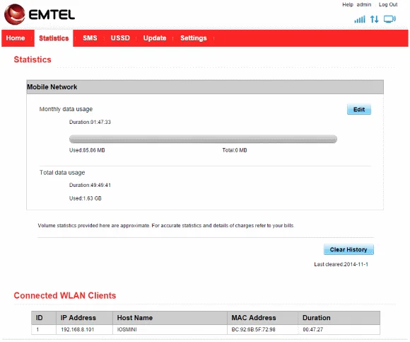
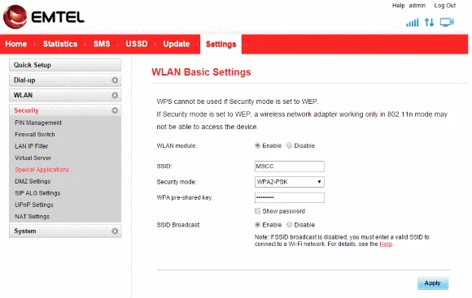

How would you call the approach of taking the [concept of "In-Car WiFi"](https://jochen.kirstaetter.name/how-to-build-in-car-wifi-hotspot/ "DIY: Concept of \"In-Car WiFi\" using an old Android device with WiFi tethering") and the marketing of "Home & Office Broadband" to the next level? Well, it's called [Emtel Wingle](https://www.emtel.com/emtel-wingle/ "Emtel Wingle product information").

The Wingle is an artificial word combination of **Wi**Fi do**ngle**, and Emtel seems to be right on spot with this device. Identical to a regular USB surf stick, the Wingle offers an instant WiFi hot-spot as soon as powered up. Of course, you can plug into your laptop or desktop PC to surf the internet but with the hotspot you can also provide a shared connection for up to 10 devices via wireless network. The device also works on plain power supply coming from a wall socket or maybe from a portable USB charger in the vehicle.

## Occasional usage

Personally, I use the Wingle every time I'm on tour. On several outings I simply plugged it into the mobile USB charger in my car, and the rest of the family was able to be online - either checking Facebook, having instant chats or having a Skype session with relatives abroad - all while driving around the island. It's kind of fun actually. Furthermore, it's also a nice option while hanging out on the beach. The distance range of the Wingle's wireless network is quite good.

Furthermore, during the regular meetings of the [Mauritius Software Craftsmanship Community (MSCC)](https://meetup.com/MauritiusSoftwareCraftsmanshipCommunity "Mauritius Software Craftsmanship Community (MSCC)") I give access to my hotspot to other community members, and they love the experience, too. Being able to get access to online repositories on github or Visual Studio online, or logging into virtual machines on the cloud is a very positive aspect for our IT get-togethers. Nowadays, it's an always-on situation for most people working in IT. Even though you should keep an eye on proper balance it's a fact that one is regularly online.

## Connection speeds

Well, the Emtel Wingle is a regular USB surf stick and offers internet bandwidth up to 21 MBit/s on the download, and up to 7 MBit/s for uploads. During the last couple of weeks (okay, already months) I did a variety of speed test at different locations. The performance is okay and limitations are given by the international bandwidth constraints here on the island.

## Web interface for administration

As soon as you plug the device into your computer it fires up its default website for administration. The initial page is "public" and provides information about your current connection status and bandwidth usage. In order to get more details and additional features you have to log in.

  
*Emtel Wingle: Statistics information about your bandwidth usage*

Next to more statistics about bandwidth usage and connected devices you also have the ability to send and receive SMS with your device. Side-note: Emtel sends you an informal message in case your bandwidth usage reaches a certain threshold on your subscription (applies only to post-paid SIM cards).

The Settings area is equivalent to the options you would expect from a full-featured internet router/gateway. You have the ability to tweak the configuration for your wireless network (WLAN) and other sophisticated services, incl. WLAN MAC filter, DHCP settings, enabling virtual servers and DMZ settings for advanced configurations.

  
*Emtel Wingle: Lots of settings for your personalised configuration and optimal usage*

Actually, it would be great if Emtel would provide a demo website to explore the Wingle's administration online for everyone.

## Resume

Sincerely, I love this type of USB surf stick. Not only I'm able to get my laptop only but also provide internet connection sharing via wireless network to 10 additional devices. This is absolutely great during meetups with others. The handling is just plug-n-play and you're ready to use it.

At the time of writing this article, Emtel offered the Wingle for Rs. 1,699 inclusive VAT.