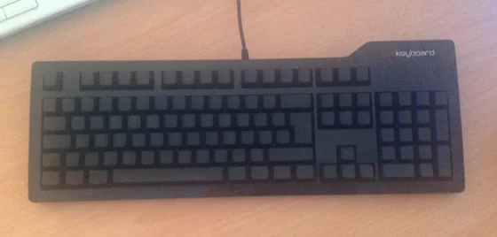
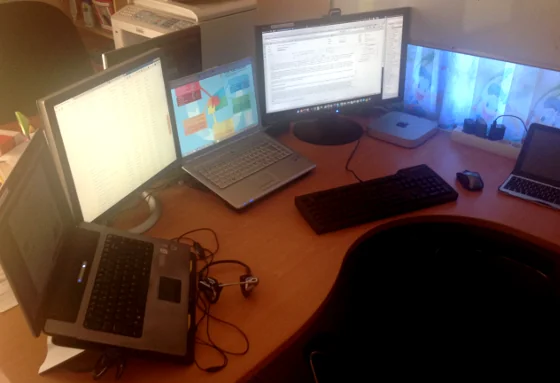
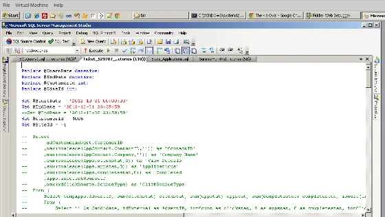

I have been talking about the following on many occasions during the last years already. Actually, it is always part of my consulting services when companies ask for advice on what they should do to improve the overall satisfaction of their software developers. But in general, it's pretty simple: The following are my essentials for any software developer or craftsman that is taking her or his profession seriously.

Originally, I started my list with the first four topics only but experience taught me that there is more to this. And even nowadays, I would clearly say that this overview scratches the surface only.

## Touch-typing

After being introduced to a team of software developers and/or testers by project or company management, I really enjoy myself to ask this particular question at a very early stage:

> **"Do you touch-type?"**

I can tell you the expressions of their faces says more than any written book I've read so far. It's absolutely amazing how such a simple question puts everyone in the room into a dazzling state and gets them to look, uhm sometimes even to gaze at me with a touch of glare in their eyes, as if I just spoke in an unknown language. The reactions are mixed but usually the responses are similar to this short selection:

- "What?"
- "Sorry, I don't understand."
- "What do mean by touch-typing?"
- "No... ?"

Honestly, I have to admit that I totally understand this kind of answer based on the fact that absolutely nowhere young programmers or developers are educated and trained in an efficient way to use their daily tools of future work. Seriously, that question would be comparable to ask an architect whether she uses a calculator on her job. Only, that her reply would be more like this: "Of course."

So what is the actual problem about the fact that most developers I meet here on the island are not capable to touch-type, or sometimes don't even know what I'm actually talking about? Sincerely, I have no straight answer to this but it seems obvious to all of them that working 6+ hours per day at the PC, using the keyboard to get the work done, doesn't necessarily require to be fast and efficient.

> Definition of TOUCH-TYPE

> : to type by the touch system  
-- touch typist *noun*

> Source: Definition taken from Merriam-Webster - https://www.merriam-webster.com/dictionary/touch-type

Know your tools... well, getting a glimpse at the various curriculum at the tertiary educational institutes reveals a little bit more. Touch-typing isn't part of the education and therefore ignored. Any software developer without touch-type capability would have difficulties with my equipment - [das keyboard](https://www.amazon.com/gp/product/B003F7WXTG/ref=as_li_ss_tl?ie=UTF8&camp=1789&creative=390957&creativeASIN=B003F7WXTG&linkCode=as2&tag=geblbyjo-20 "das keyboard") Ultimate:

  
*das keyboard Ultimate is a keyboard with blank keys and the ultimate experience of touch-typing*

Most people really don't understand the consequences. It's not only about time, effort and cost but also plays a great role in daily motivation. I know that developers want to **write** code first, uhm, maybe I should say to **type** code first. But what's the purpose of creating wonderful code when your physical capabilities are far behind your mental ones? It's like producing a lot of output that gets finally stuck in the I/O buffers of your body.

## Latest generation of hardware and software  
Obviously this should be a no-brainer but reality bites and quite often developers' machines are not top-notch. There are various reasons for that and hundreds of excuses made by an employer but frankly speaking at least every two to three years latest it is necessary to upgrade the work equipment. Again, this is also something I clearly advice to other companies: Faster machine, less time-consuming and more efficiency of their developers and software testers. When I begin to work with new teams I like to get a better understanding of their opinion about their work, and as you might have guessed already... The computer they are using is usually part of those conversations. Either because I ask about it or they already tell me that they are not happy about their PC. Usually, they have more powerful machines at home, either for gaming or to develop on private projects. Imagine the frustration they have coming to work and only finding a dead-slow machine. The pain of waiting until the IDE has started and loaded the recent projects finally. Some of them even switch on the machine, wait to login and then go for their cup of coffee until auto-started software applications enter a state of readiness.

In rare cases I witnessed that they even brought in their own laptop and left alone the hardware provided by their employer. How embarrassing this might be...

Anyway, latest hardware means faster processing, lower latency and higher productivity of each single employee. Or at least it is plausible to cut off that argument that a job couldn't be done due to hardware-related limitations, etc. blah blah.

Oh before I forget to write about that one: Get yourself at least a second screen!

  
*Working with multiple screens increases a software developers productivity*

No matter the screen size, okay at least 19" should do, put an additional screen on your desk. If you are working on a laptop, use the VGA or HDMI output for the better. In worst case you could use an older machine and [install Synergy on both of them](xref:synergy-easy-share-of-keyboard-and-mouse-between-multiple-computers "install Synergy on both of them").

The rise in your productivity using a second screen compared to switching applications is outstanding. And the return of investment (ROI) is incredible fast. I really wonder how archaic certain software companies are when they don't provide a second screen to their employees. Here is a little anecdote from the past: It was on my explicit request that my former employer started to introduce additional screens at work desks after I simply demonstrated to the manager that it is more efficient and productive to work on multiple screens. At that time I was used to work on three screens since years on my private machine at home, and it was absolutely frustrating to go to work. A couple of days later, I got a new graphics card, a second screen and my boss was overly happy with his own dual-screen machine. ;-)

Next, let's talk about software. Once again, stay on top of the game and work with the latest and greatest version that is currently on the market. Not only to show your commitment to your job but also to have access to the state-of-the-art on productivity. Just recently, I worked as consultant for a local company here in Mauritius and honestly I was shocked to see the numerous installations of Visual Studio 2005 on their Windows 7 machines. And to make things even worse, team leaders had either Visual Studio 2008 or 2010 on their machines. Taking into consideration that Visual Studio 2012 was in the final stages to hit the market, I urged them to plan and run a general upgrade on all machines.

Eventually, you might ask for the reason. Well, there were several of them and I'm going to discuss them in no preferential order.

### Cost of licenses

True, software licenses do cost money and unfortunately it isn't obvious to some people that you have to take expenses on licenses into your annual budget planning. So no money planned, no upgrades available. Interestingly, while addressing this dilemma to my clients they are not aware of certain subsidizes programmes offered by the software producers. For example, as [Registered Microsoft Partner](https://partner.microsoft.com/ "Registered Microsoft Partner") you can purchase tailor-made variations of MSDN at an affordable price.

I'm always working on the latest available version of [Microsoft Visual Studio](https://microsoft.com/vstudio "Microsoft Visual Studio"), Microsoft SQL Server or [Xamarin Studio](https://xamarin.com/ "Xamarin Studio and tools"). And if time allows even on the beta versions...

### Project circumstances

The project is targeted to version X of the operating system and has to work with version Y of that product. Well, software changes and so should your development environment. There have been rare cases that a newer operating system simply sucked but in general go for the latest. Simply to leverage the improvements, read: bug fixes, and the new features that those software packages are offering. And to be prepared just in case that the client is going to ask you:

> "Is (y)our software working properly on the upcoming OS?"

It's always better to say something like this

> "Yes, it does (with some minor modifications). We already tested it some weeks/months ago while in beta stage."

than to shrug your shoulders and respond something like that "We don't know."

### Maintenance of deployed applications

Oh yes, the crux with legacy code and the demons from the past. Well, in that case do yourself a big big favour and virtualise the environment. Simple as that, get a copy of either Microsoft Hyper-V, [Oracle VirtualBox](https://www.virtualbox.org "Oracle VirtualBox") or [VMware Workstation or Player](https://www.vmware.com "VMware Workstation or Player"), and move that old-fashioned piece of code over there. I'm going to write more on software virtualisation later in this article.

## Proper chair

Remember what I wrote about touch typing? As a software developer you are likely to sit between six and eight hours every day at your workplace. Okay, there are these 'unpleasant' interruptions to either have a break or to attend a meeting but at the end of the day you are sitting most of the time at your desk. Either to code, to test or to read about your active tasks. Again, I think it is absolutely essential that you have an ergonomic chair that is well-suited for your body. Don't save money on your health! In case that you're employed and not comfortable with your chair or desk, speak to your manager or superior and evaluate possible solutions. It will be in their interest that you are confident and happy to come to work instead of having that annoying tension in your right shoulder or aches in your spine after an intensive coding session.

You will be surprised what a difference a good chair can make compared to one of those standard office chairs that you get for cheap. and it doesn't have to be expensive but at least there should be a couple of decent features:

- Height adjustable
- Adjustable back shield
- Support for your lower spine and pelvis
- Adjustable arm rests
- Mesh fabrics

Well, you might think that I can easily speak of that being self-employed. But hey, no wait a second... even being an employer I took care of the well-being of my employees at their work space. As said, it is crucial that you feel comfortable at work.

> **Comfort = happiness = motivation = results**

It's that simple!

Again, when consulting companies I usually ask them whether they have an initial budget for each new employee or even an annual allowance for the existing ones that could be used for the working environment. Of course, there is none... What would be the benefit of this? Hm, isn't it obvious that if an employee is allowed to 'design and implement' her work desk based on her choices is eventually higher bonded emotionally to this environment and therefore less likely to change later on? No?

## Virtualisation and isolated project environments

This might not be applicable in all cases but nonetheless I think it is worth to mention and discuss it here, too. Frankly speaking, I use virtualisation of software since more than a decade. If I remember correctly, I used to have an early copy of VMware Workstation at that time, and it was quite an experimental experience to run multiple copies of Windows on the same computer. But it was absolutely delightful to be able to work on Windows 2000 and to test the software on Windows 98 or Windows NT 4.0 without the necessity of having another physical machine. Actually, virtualisation software is always one of the first software packages that I install on a new (or re-installed) machine.

Furthermore, as soon as you are working on multiple projects or for a number of clients, virtualisation always provides me with a clean development environment. Do you remember the old days of DLL hell? Yes? Well, I don't! ;-)

When I was assigned to work a new project I either asked the responsible project manager to give me a virtual machine, or if not available I created a master image which I put an the company's file server for all my team mates. The purpose of the virtualised environment is simply to avoid any kind of unpredictable behaviour of your development conditions. Furthermore, I am able to design and create the virtual image exactly to the likings of one of the customer machines. Later on, I used to run VMware Converter in order to virtualise one of the client's computer into a virtual one. This way, I was able to develop, run and test the software under more 'real' conditions.

And compared to my colleagues I had absolutely no trouble to install patches, upgrades and newer versions of software packages that are involved in the development process of a particular project. If it happened that it didn't work for the better, revert to latest snapshot and tada I'm back on track without any serious delays or whatsoever. Again, this also allows any developer to install and experience new versions of their IDE or additional software packages. Well, at that time it was mainly about incompatibility of different ActiveX controls or versions of Microsoft Office.

In case that you have to provide support for older operating systems for your customers. No problem, put that old-faggot in a VM and enjoy the latest OS you can get on your amazing hardware.

  
*Virtualise your work environment to ease your life*

Need to test your latest web project with various browsers on another operating system or older versions of a particular browser, use a virtual machine and be happy!

Don't forget that this also shows your expertise and knowledge towards your clients. If it runs on your machine doesn't necessarilty mean that it runs on any machine. So be prepared and test it as much as you can. I recently had the situation that one of my clients had their website designed and implemented by another web designer. Fair enough everything was displayed and working as expected until I started to run my usual cross-OS and cross-browser tests in order to check my modifications in the code behind. You can't imagine the visual differences on various browsers on Mac OS X, Linux, Android or an iOS-based device. 'Unfortunately', it was a real eye-opener for the client and more work for the web designer to improve the site.

## Ergonomic desk and working environment

  
*Source:imgur.com*

Well, this chapter is related to your proper choice of chair but goes a little bit beyond that. I'm going to leave my point of view on the working desk, on some accessories and constraints on your surrounding. You should pay some attention to your work desk, mainly on the height of the surface which is supposed to align properly with the position of your arms, especially your wrists. In case that you don't have access to a height-adjustable desk, you might be surprised what wonders a couple of bricks can do...

Talking about elevation, last year I saw a couple of alternatives to the conventional sitting position. Personally, I was mainly impressed by the concepts of the standing desk and the treadmill desk. The first one comes in quite handy and could be realised easily with only a few additional items whereas the latter might not be the best choice for your surrounding after all. But in case that you are working in your noise-reduced cubicle or even in your own office room. Yes, why not work-out while pouring those challenging software requirements into lines of code and test cases.

Next, take care that you spend some bucks on the keyboard, mouse, touch pad or trackball that you are using all day long. Based on my own experience I can tell you to take this dead-serious. At the beginning of my programmer's career I was always wondering about a tensed neck and shoulder. Finally, I found out that this was caused by hand movements on the mouse! And as soon as I replaced the mouse with a trackball I never had any issues of that kind anymore. There are serious, chronically injuries reported for any kind of typing work. Don't ruin your health because you (or rather your employer) saved some bucks on a proper keyboard. It's absolutely not worth it. The problem here is that the symptoms are not visible at the beginning but slowly sneak in after some months or even years of working at the desk. Listen to your body and change your equipment in case of problems. Just give it a try and see how it works.

Also, take care that your surrounding is calm and quiet. Put your maximum effort into your working comfort. If there's a problem, address it - ad hoc. Do not ignore it or push it away from you. Again, if you are not happy with your workspace your motivation will start to decay. Treat yourself with a professional environment and also don't be afraid of talking to your manager. It is very simple to describe your show-case and to proof that the circumstance might have a negative impact on your ability to focus, to concentrate and to deliver proper results as expected. A quick and cheap solution to 'dis-connect' yourself from your surrounding is to put on headphones or earplugs. Not only do you block any disturbing sounds but you also visualise to your colleagues a simple yet effective 'Do not disturb'. Again, I can tell you out of my own experience it works incredible well. I used to yell (and sometimes even swear) at my mates when they came to my desk and talked to me out of the blue. Guys, my apologies for that but we found a solution. After I discussed this with my boss, we came up with a simple system that in case of questions or issues to speak about to notify each other through an instant message. It worked flawlessly from day one on, and was quickly adapted by all colleagues.

This paragraph might be restricted to offices in Mauritius only but you never know... Comfortable temperature!

I cannot recall how many times I went into a freezer instead of an office for software developers here over the island. It is sheer insanity of some companies on how they set the temperature of their air conditioning. As a rule of thumb the inside temperature should not exceed a difference of 5 degrees Celsius compared to the outdoor temperature. Anything else is not healthy and will get you sick. Can you imagine to see computer workers sitting in long-sleeves or even cardigans at their PC while everything else outside is literally melting away and daring for water? No? Then you should come to Mauritius...

## Clean desk policy

Another hot topic that you should pay some attention to are those 'unnecessary extras' on your work desk.

> Golden rule #1: **No food on or near the desk!**

Seriously, do not keep any kind of food or snacks or whatsoever edible in the reachable surrounding of your work desk. It is not only disgusting to have crumbs of bread between the keys of a keyboard but also unhealthy for your body as you tend to eat mindless and unconsciousness. And leaving your desk to have a drink or to have a snack gives you the ability to chat and exchange with your co-workers, too.

Please, feel free and tell me in the comment section about how your desktop currently looks like. If you'd like to, take a picture and send it to me via email. I would be glad to write a follow-up article on this one with your contributions, seriously. Looking at my desk at the moment, I'm not too happy either. And as a matter of fact I just interrupted my work on this article, cleared up my desk and took a picture for you:

  
*Keep your desk as clean as possible to avoid any kind of distraction*

Now, I'm feeling more comfortable and more important: Less distracted!

> Golden rule #2: **Divide your daily tasks into chunks!**

You don't have to monitor your email inbox every minute, don't need those nasty notification popups, or check your buddies' status on any social network. Instead, just have your instant messaging software up and running minimized, and focus on your main work: Coding.

Same as you are off from your desk occasionally, take care of this kind of tasks on specific times or bind them to other activities. For example, my mail client is usually closed during the day and only on certain activities, like ie. going to the tea kitchen to drink some water or to have my lunch break, etc. I check my mails and reply to them immediately. Don't forget, email is actually an asynchronous way of communication and you might assume that your communication partner is **not** expecting an answer within a couple of minutes. If they do, sorry then the choice of medium is rather poor; in such cases it would be better to use either instant messaging or pick up the phone and call the person.

> Golden rule #3: **Put your mobile away!**

If your (personal) cellular or your smartphone isn't involved into your development process, simply do yourself a favour and put it out of your sight. Best would be to switch it into 'Meeting' profile and simply leave it in your bag. Please don't forget that you are at work, and not somewhere at a cafe or in a pub.

But there might be some kind of emergency case, you might argue. True but honestly, everyone is (or should be) aware of that you are actually at work and that they should call at the office in order to reach you. And let's not forget that the battery could be down, you forgot your mobile at home, etc. So, in case of an emergency it is way safer to call at the office.

## Access to literature and training

Apart from writing software it is absolutely compulsory for any serious software developer to read books, blog articles and technical advisories, to watch tutorials or even to attend conferences on the technology you are working in. Actually, this is common to any kind of profession! Maybe I might be wrong here but for example doctors have to document their annual progress on latest research and products in the medical field. And so should software developers, too.

- When was the last time that you read a book on a specific technology?  
- Do you know how many software-related books you read during a year?  
- Did you read any book since you left university?

Again, these are some of my standard questions when working with a new team of software developers. As for my part, I read approximately 5 to 6 technical titles in one year. Sometimes, I don't even need the content on an active project but the title did attract my attention and therefore I go for it. Interestingly, there had been occasions where that non-related title gave me an advantage on future work.

Nowadays, there are endless possibilities to gain access to high-quality material, especially in the field of software development. If you are a Windows developer go and check out [MSDN](https://msdn.microsoft.com "MSDN") and [TechNet](https://technet.microsoft.com "TechNet"). Microsoft's latest achievement is called [Microsoft Virtual Academy](xref:microsoft-virtual-academy "Microsoft Virtual Academy") which provides online material and video courses on specific topics - for free! The recorded material is top-notch and you are able to download it for latter reference. Furthermore, I highly recommend you to get a subscription to one of the many eLearning platforms like [Pluralsight](https://pluralsight.com/training "Pluralsight"), [Lynda](https://www.lynda.com/ "Lynda"), [TekPub](https://tekpub.com/ "TekPub"), etc. just to name a few. And not to forget, check out the online tutorials from tool and libraries; ie. [Telerik TV](https://tv.telerik.com/ "Telerik TV") is a great resource in case you are working with their products.

Pick up the challenge and [go for certifications](xref:learning-content-for-mcsds-web-applications-and-windows-store-apps-using-html5). Yes, certifications will help you massively to know where you are standing with your knowledge, how to isolate blank spots and give you a deeper insight on the technologies you are dealing with on a daily base. Depending on your position, you should classify certifications as an investment into your future and to be able to stand out against other competitors on the market. As an employee you might like to discuss certifications as being part of your annual performance report. Not only do you show your employer clearly that you care for your job but it also increases your value for your employer. And honestly, it is a simple win-win situation for both parties. You get the chance to proof your knowledge and the certifications are personal, and your employer knows that you are able to deliver high quality results at a certain standard.

Learning on the job or during your spare time is essential as a [software craftsman](https://manifesto.softwarecraftsmanship.org/ "Manifesto for Software Craftsmanship"). Keep yourself educated and valuable to yourself, your employer and your clients.

<small>Image credit: JC Gellidon</small>