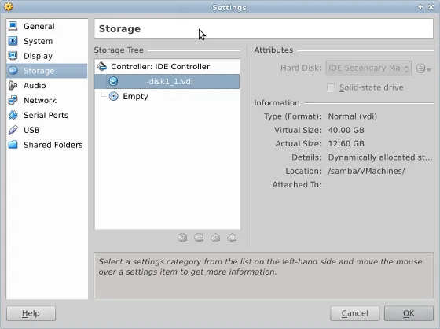
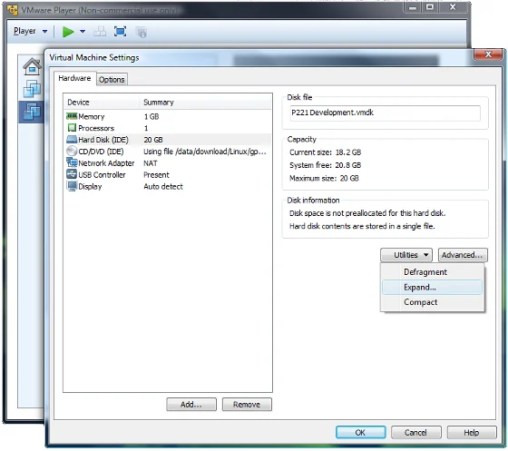

Lately, I ran into the situation that one of my services which is hosted in a virtual machine stopped working. A quick check revealed that the hard disk ran out of disk space and it was about time to increase the available storage. Don't laugh but the system is running on CentOS 5.x with a mere 13 GB virtual disk - well, since years already. And one golden rule I learned from experience: Never touch a running system - kept me away from any modifications. Well, there's always a time that change has more benefits than not touching the system...

## []()Running out of disk space

That is (now: was) the situation before the following steps.

```
# df -h
Filesystem            Size  Used Avail Use% Mounted on
/dev/mapper/VolGroup00-LogVol00
                       12G   12G    0G 100% /
/dev/hdc1              99M   36M   59M  38% /boot
tmpfs                 252M     0  252M   0% /dev/shm
```

And I can tell you that even a Linux OS doesn't like the lack of space on the system drive at all.

## []()Backup your data and drives

Although, I think it is not necessary to stress the fact that you should (read: have to) backup your data and drives always. Just to be on the safe side, and to revert back to the original state easily and quickly.

## []()Preparing the virtual disk

First, shut down your virtual machine. Even though it is possible to run almost all of the following in a running environment I doubt that for the casual (home) administrator reading this article it might not be necessary to risk your data. Okay next, it would be necessary to expand the size of virtual hard disk, and then afterwards extend the logical volume with the newly created partition.

### Converting the disk format from VMDK to VDI

Well, the system has kind of a past and it was originally created on VMware Server 1.0, then upgraded to VMware Server 2.0, and some years back I switched over to SUN, eh Oracle, [VirtualBox](https://www.virtualbox.org/). So, the original virtual disk was still in VMware's format - vmdk. VirtualBox is not able to expand that type of disk drive (yet):

```
$ vboxmanage modifyhd virtual-disk1.vmdk --resize 40960
0%...
Progress state: VBOX_E_NOT_SUPPORTED
VBoxManage: error: Resize hard disk operation for this format is not implemented yet!
```

In order to complete this initial task it was necessary to convert the format from VMDK to VDI. This is done by cloning the disk into the new format:

```
$ vboxmanage clonehd virtual-disk1.vmdk virtual-disk1.vdi --format VDI
0%...10%...20%...30%...40%...50%...60%...70%...80%...90%...100%
Clone hard disk created in format 'vdi'. UUID: 37ef6965-0000-4159-861a-d1c64d9c060f
```

Depending on the actual disk size and your system performance this might take some time. Remain patient and let the system do the job. Meanwhile, you might check your mails or post your intentions on various social media networks. Just kidding! ;-)

Note: Additionally to your backup, it might be interesting to keep an archive of the original VMDK file. Just in case...

### Resizing the virtual drive

Now, that we have our drive in VDI format we are able to expand the disk size. Let's try our previous statement again, but this time with the newly created VDI disk:

```
$ vboxmanage modifyhd virtual-disk1.vdi --resize 40960
0%...10%...20%...30%...40%...50%...60%...70%...80%...90%...100%
```

After successful expansion it is about time to check our disk modifications in the settings of the virtual machine. Launch the Oracle VM VirtualBox Manager, select your virtual machine and either press the Settings button in the toolbar or choose from the menu Machine -- Settings (Ctrl+S). Next, select the Storage entry from the side pane and then the virtual hard disk that we just modified. You should see something similar to the following screenshot.

  
*Oracle VM VirtualBox: Settings of virtual disk size and proper assignment*

In case that you had to convert an VMDK drive to VDI, please select the newly cloned drive from the dropdown list in the Attributes area. You should have the .VDI disk attached to your virtual machine.

**Pro tip**: In case that you want to keep the original disk type in VMDK format, do a complete round-trip and clone the extended drive back to VMDK format, like so:

```
$ vboxmanage clonehd virtual-disk1.vdi virtual-disk1.vmdk --format VMDK
0%...10%...20%...30%...40%...50%...60%...70%...80%...90%...100%
Clone hard disk created in format 'vmdk'. UUID: 37ef6965-0000-4159-861a-d1c64d9c060f
```

### Using VMware Player

The above mentioned conversion is not necessary in case that you have an installation of VMware Player or even VMware Workstation at hand. In my case, I didn't. Anyway, VMware Player gives you the ability to expand the disk capacity through the UI directly. Open the Virtual Machine Settings, then select the Hard Disk from the list of devices and below the Disk information you'll have a list of utilities in the dropdown list. Choose "Expand..." in order to change the disk's capacity.

  
*VMware Player: Virtual Machine Settings and ability to expand the disk capacity*

That's all for the 'physical' expansion of our hard drive. Now, start your virtual machine as we are going to take of the software part.

## []()Preparing the partition

The system in our virtual machine is still out of space and we are going to change this now. Please follow the next steps closely. Accidentally, I trapped myself and had to revert a couple of steps because I didn't pay enough attention to the details. I'll come back to that at the end of this article. Okay, we enlarged the physical drive, and now we have to take care of that unallocated space. Let's check the partition table first like so:

```
$ sudo fdisk -l
Disk /dev/hdc: 42.9 GB, 42949672960 bytes
255 heads, 63 sectors/track, 5221 cylinders
Units = cylinders of 16065 * 512 = 8225280 bytes

   Device Boot      Start         End      Blocks   Id  System
/dev/hdc1   *           1          13      104391   83  Linux
/dev/hdc2              14        1827    14570955   8e  Linux LVM
```

This will give us an overview of the existing partitions. The new disk size has been accepted already and it's now time to create a new partition.

### Creating a new partition

This article is not about how to use fdisk on the command line. There are other tutorials with more detailed information about the particular steps, and you might have a look at the manual page of fdisk directly. To create a new partition we launch fdisk on our hard drive.

```
# fdisk /dev/hdc
```

Then we create a new full-size partition at the end of the disk drive with the following sequence of keystrokes:

```
n - new partition
p - primary partition
3 - next partition number
[Enter] - confirm first cylinder
[Enter] - confirm last cylinder
t - change partition's type or system id
3 - choose newly created partition id
8e - specify hex code of system type (Linux LVM)
w - write partition table to disk
```

Of course, this might vary depending on your existing partition table. Please, adapt your inputs accordingly.

After completing all steps your hard drive might have a similar output like this one:

```
# fdisk -l
Disk /dev/hdc: 42.9 GB, 42949672960 bytes
255 heads, 63 sectors/track, 5221 cylinders
Units = cylinders of 16065 * 512 = 8225280 bytes

   Device Boot      Start         End      Blocks   Id  System
/dev/hdc1   *           1          13      104391   83  Linux
/dev/hdc2              14        1827    14570955   8e  Linux LVM
/dev/hdc3            1828        5221    27262305   8e  Linux LVM
```

### Alternative: Extend an existing partition

During my research in preparation of this 'surgery' I also came across a couple of resources online where it is stated that it is also possible to enlarge an existing partition to the full extend of the new capacity of the disk drive. The general recommendation is to use a more sophisticated partitioning tool like the freely available [GParted](https://gparted.sourceforge.net/). While using a Windows operating system, I clearly would recommend this approach, too. Mainly because it's your system drive that runs out of space and Windows is hardly capable to span over multiple drives (at least in casual environments like home and office desktops). I already did this in the past to enlarge a Windows Server 2008 R2 system, and it went as smooth as expected.

You can download the [GParted LiveCD ISO here](https://gparted.sourceforge.net/download.php).

## []()Expanding the logical volume

Once you understood the necessary steps to extend an existing logical volume it's fairly easy to reproduce. The general concept is well documented in [Chapter 4](https://www.centos.org/docs/5/html/Cluster_Logical_Volume_Manager/LVM_CLI.html) of the [LVM Administrator's Guide for CentOS](https://www.centos.org/docs/5/html/Cluster_Logical_Volume_Manager/index.html), and is based on the following procedure. First, you create a physical volume (PV) based on your new partition which is then extended into an existing volume group (VG), and then finally extended into a logical volume (LV) within a volume group. After resizing the logical volume you are ready to go and the new disk space is available in your system.

### Creating the physical volume

This will prepare the partition for use in a volume group.

```
# pvcreate /dev/hdc3
  Physical volume "/dev/hdc3" successfully created
```

Note: Depending on whether you are going to extend your system with an additional partition or a whole drive, you might even skip the partitioning and create a physical volume using the whole hard disk.

### Extending the volume group

Prior to any extension is not too bad to get an overview of the existing volume groups. This can be done like so:

```
# vgdisplay
  --- Volume group ---
  VG Name               VolGroup00
  System ID             
...
```

With the information of the available name of the volume group, we are now able to extend it with our physical partition:

```
# vgextend VolGroup00 /dev/hdc3
  Volume group "VolGroup00" successfully extended
```

Done. Next step is to assign the available space to the logical volume that we would like to expand.

### Extending the logical volume, finally

Same procedure here, it's advised to have an overview of the existing logical volume first:

```
# lvdisplay
  --- Logical volume ---
  LV Name                /dev/VolGroup00/LogVol00
  VG Name                VolGroup00
...
     
  --- Logical volume ---
  LV Name                /dev/VolGroup00/LogVol01
  VG Name                VolGroup00
...
```

In my case, I'm going to extend the first logical volume with the new physical volume.

```
# lvextend /dev/VolGroup00/LogVol00 /dev/hdc3
  Extending logical volume root to 37.94 GB
  Logical volume LogVol00 successfully resized
```

Almost done. After expanding the volume group and the logical volume we only have to populate the information about the new total size of our logical volume.

```
# resize2fs /dev/VolGroup00/LogVol00
```

That's it!  
Just to complete the whole process check the available disk space:

```
# df -h
Filesystem            Size  Used Avail Use% Mounted on
/dev/mapper/VolGroup00-LogVol00
                       37G   12G   24G  32% /
/dev/hdc1              99M   36M   59M  38% /boot
tmpfs                 252M     0  252M   0% /dev/shm
```

Okay, my system has now more than triple the original disk size. Let's see how many years it is going to run before I might have to add another partition to the logical volume.

## []()Summary

Once you understood the necessary steps on how to expand a logical volume it's actually very simple to reproduce. You start with the physical preparation of the hard disk, either by adding a new drive or by expanding an existing virtual drive. Then you create a partition of type 8e - Linux LVM - for that new unallocated drive space. And to complete the procedure you have to walk through the LVM handling by creating the physical volume, extending the volume group and finally extending and resizing the logical volume in that volume group.

Even in case of an error it's relatively simple to track down the root cause and take care of it.

## []()Beware of the details... Troubleshooting

As mentioned earlier I got stuck in the process because of two issues.

First, my Linux operating system, here CentOS 5.3, didn't get the new partition table automatically. So when I run the following command I got the response that the specified device isn't available.

```
# pvcreate /dev/hdc3
  Device /dev/hdc3 not found (or ignored by filtering).
```

A quick look on the internet revealed that this could happen and the modified partition table can be updated manually like so:

```
# partprobe -s
/dev/hdc: msdos partitions 1 2 3
# partx -a /dev/hdc
```

Or to keep things simple, just reboot the system. But that would be too easy and a waste of time...

And second, I mistyped the name of the logical volume - LogVol01 instead of LogVol00 - and added the new partition to the swap area. Well, following are some details on how to detect that kind of issue and how to remove a physical drive from a logical volume and volume group.

I came to an abrupt stop on the very last step, resizing the file system with the newly allocated volume:

```
# resize2fs /dev/VolGroup00/LogVol01
resize2fs: bad magic number in super-block while trying to open /dev/VolGroup00/LogVol01
couldn’t find valid filesystem superblock
```

That's kind of bummer. Especially, so close to the finish line. Well, it turned out that volume group had two logical volumes LogVol00 and LogVol01. And the second one is actually used for the swap area. Which easily explains why there is absolutely no valid filesystem superblock to be found - no matter how hard I would try it. First, I thought that it might have been a problem with the filesystem type, as I am using ext2, ext3, ext4, and xfs interchangeable. But a quick check confirmed that I'm using the right command. In case of xfs you might have to work with xfs_grow command instead of resize2fs.

Then I checked the overview output of my logical volumes again and I was kind of lucky that I discovered that I increased the wrong volume:

```
# lvdisplay
  --- Logical volume ---
  LV Name                /dev/VolGroup00/LogVol01
  VG Name                VolGroup00
...
  LV Size                24.83 GB
  Current LE             891
  Segments               2
```

The original output stated a LV Size of 1.91 GB. Due to the nature of LVM I couldn't remove the physical hard drive because it is reported to be in use. Therefore, it is first necessary to decrease the volume size to its original value like so:

```
# lvreduce -L 1.9G /dev/VolGroup00/LogVol01
  Rounding up size to full physical extent 1.91 GB
```

Eventually, you might have to move all allocated space off the physical volume to other free physical volumes in the same volume group like so:

```
# pvmove /dev/hdc3
```

Then it's possible to remove (or better said to reduce) the drive from the volume group like so:

```
# vgreduce VolGroup00 /dev/hdc3
```

And then to start over again by adding the fresh physical volume back to the volume group again and then assigning it to the proper logical volume, like so:

```
# pvcreate /dev/hdc3
# vgextend VolGroup00 /dev/hdc3
# lvextend /dev/VolGroup00/LogVol00 /dev/hdc3
# resize2fs /dev/VolGroup00/LogVol00
```

Now, everything went smooth and my last system check of the logical volumes looks like so:

```
# lvdisplay
--- Logical volume ---
  LV Name                /dev/VolGroup00/LogVol00
  VG Name                VolGroup00
...
  LV Size                37.94 GB
  Current LE             1214
  Segments               2
    
--- Logical volume ---
  LV Name                /dev/VolGroup00/LogVol01
  VG Name                VolGroup00
...
  LV Size                1.91 GB
  Current LE             61
  Segments               1
```

As usual, follow administrator's rule number 1: **Don't Panic!**

Have a look at the history of your inputs, here your commands on the console, and check them entirely with the outputs of the various display commands - `pvdisplay` to show information about physical volumes, `vgdisplay` for details about volume groups, and finally `lvdisplay` to get an overview of your logical volumes.

Good luck with your mission and leave your comments below.