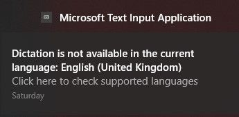
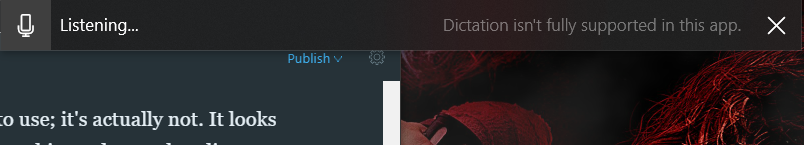
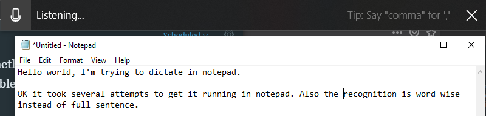

Let's try to do an experiment using dictation mode in Windows 10 to write a whole article.

Dictation mode in Windows 10 can be launched instantly hitting the Win + H hotkey. This opens a small information bar at the of your screen and enables active listening to your microphone. Eventually, you might have to allow permissions.

Currently, [dictation in Windows 10](https://support.microsoft.com/en-us/help/4042244/windows-10-use-dictation) seems to be limited to certain languages, i.e. English (United States). Other languages like German or English (United Kingdom) might be available in the near future.

Although dictation mode sounds very easy to use; it's actually not.

It looks pretty simple when you see it in movies or watching a practitioner that dictates something into a recording device. Trying to write or better said to dictate an article the first time requires a lot more concentration than typing. The challenge here is to clear up your mind and then articulate the whole sentence or paragraph in one go. I assume, that with a little bit more practice it becomes more natural and fluent. Right now, it's really hard for me.

## Story editor in Ghost Desktop

I'm currently trying to figure out whether there are special commands and expressions that would help to improve the experience. My first impression about dictation mode is that it seems to be a bit clumsy. Perhaps this is related to using the editor in Ghost Desktop instead of a regular text box. I'm going to explore dictation mode in other applications like Microsoft Word, too.

Surprisingly, when the system understands you the results are OK and usable. I guess, that it boils down to little bit more training regarding speed and proper pronunciation.

At the current stage there seems to be a number of glitches. For example, dictating more than one sentence seems to have an issue. Commonly used expressions like 'to', 'too' and the number 'two' cannot be differentiated. Sometimes words are completely misinterpreted. Key words like 'Comma' or 'Period' are quite often misunderstood.

Dictation mode also notifies me that the current app, meaning the story editor in Ghost Desktop, is not fully supported at this stage.

Another observation is that dictation mode seems to rely on a proper Internet connectivity in order to work as expected.

## OneNote

Using OneNote seems to be a better option to use dictation mode properly. The flow of information while you speak is OK. It is better than the story editor in Ghost Desktop.

It is interesting to observe progress in OneNote compared to other applications. In OneNote it seems to be a constant evaluation of the spoken word whereas in Ghost it takes the whole sentence. Also, it is amazing to see that it works over multiple sentences. Special commands or common expressions like 'Comma' and 'Period' are correctly interpreted as ',' and as '.' respectively. It should be noted that OneNote offers its own Dictate mode. For this test I'm using the Windows 10 dictation mode only.

<iframe width="459" height="344" src="https://www.youtube.com/embed/cwenK2N_ct4?feature=oembed" frameborder="0" allow="accelerometer; autoplay; encrypted-media; gyroscope; picture-in-picture" allowfullscreen=""></iframe>

Screen recording: First steps using Windows 10 dictation mode in OneNote (UWP)

"I'm using the built-in Game Capture feature of Windows 10 to record this dictation. The interesting aspect here seems to be that everything is going out to the Internet. It is quite impressive to see your own words written on to the screen. Although, it is really hard to articulate a sentence in your head first and then to speak it out loud, it takes some time and training to improve over time. Overall the dictation mode in OneNote is better compared to the story editor in Ghost Desktop. More tests should be conducted soon.

Trying out more commands like Spelling mode: m o z 5 w

Spelling mode clearly requires more training on my side to know the international alphabet by heart. Also there are several commands available but it is not clear at the moment which can be used in which ones not to operate properly.

Dictation mode gives you visual feedback whether a command is currently supported or not. Unfortunately it is not visible in this screen recording."

## Word Online

Instead of using the desktop application of Microsoft Word I thought that I give the online edition a try first. So far, it seems that it works similar to OneNote.

For the first attempt I'm using Firefox on Windows, later on I will try Microsoft Edge on the same document.

## Notepad

A quick test with Microsoft Notepad did not succeed. It seems that the scenarios to use dictation mode are limited at the moment. Which seems kind of strange because other online references showed an earlier version of Dictation used in Notepad.

Okay, it took me several attempts to successfully dictate some sentences into Notepad. It was mainly to stop and launch Dictation several times hitting Win + H hotkey. Patience seems to be key...

## Tweetdeck

An interesting use case for dictation could be tweets. They are short and concise, meaning relatively ease to articulate and to get them out in one attempt.

> The street has been dictated. I'm currently running some tests Using dictation mode in Windows 10. It's actually pretty fun. More to come soon. [#WindowsInsiders](https://twitter.com/hashtag/WindowsInsiders?src=hash&ref_src=twsrc%5Etfw)  
  
PS: unmodified text...
>
> — Jochen Kirstätter ハッカー (@JKirstaetter) [January 6, 2019](https://twitter.com/JKirstaetter/status/1081830822162894848?ref_src=twsrc%5Etfw)

Dictated my first tweet of 2019

I'm using [Tweetdeck](https://tweetdeck.twitter.com/) as my main client and posting my first dictated tweet of 2019 went surprisingly well, inclusive punctuation and hashtag. Going to try this more often now.

## Auxiliary noise or ambient music

Most of the time while working on this article I was listening to music. Different styles depending on mood and hour of day, as well as via loudspeakers from the laptop or using my headset.

Either way, given the volume wasn't too high on the speakers, there had been no implications or drawbacks while dictating my sentences. Also, having a noisy fan or the TV set running did not lower the results. Of course, your mileage might vary depending on your environment. For me it worked as good as being in a complete quiet room.

## Dictation Mode - It works...

This entire article has been dictated as much as possible without manual interaction. Editing and additional resources like images, hyperlinks, and formatting have been added manually afterwards.

Due to the issues noted with the story editor of Ghost Desktop the remainder of this article was dictated in OneNote. My overall impression and experience with dictation mode so far is positive. I'm going to research more information on the Internet about compatible applications that are capable to work with Windows 10 dictation mode.

I still haven't figured out how to re-activate Listening other then to click on the microphone icon in the dictation bar at the top of the screen. If any reader knows about a hotkey, please leave a comment for me and others. According to the [official documentation there is none](https://support.microsoft.com/en-us/help/4042244/windows-10-use-dictation). The suggested solution is to re-initialize dictation pressing Win + H twice.

However there are still some rough edges that need some TLC and polishing. I'm looking forward to evaluate the updates to come and will continue to work with the [dictation in Windows 10](https://support.microsoft.com/en-us/help/4042244/windows-10-use-dictation).

<small>Image credit: Jason Rosewell</small>
