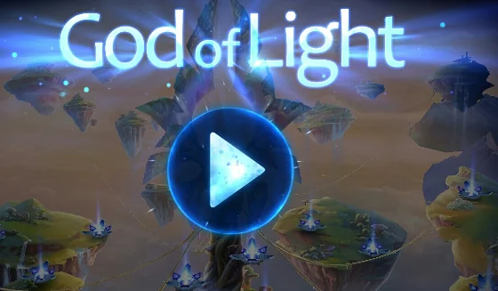
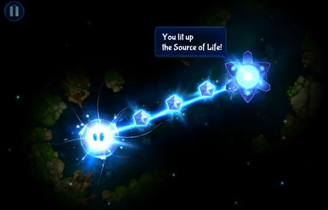
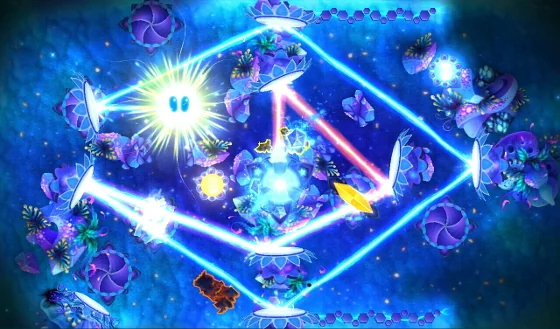

Luckily I came across this title at a very early stage. If I remember correctly, I took notice of God of Light on Twitter right on the weekend it has been published on the Play Store.

> *"Sit back and become immersed into the world of God of Light, the game that rethinks the physics puzzle genre with its unique environment exploration gameplay, amazing graphics and exclusive soundtrack created by electronic music icon UNKLE.*
>
> *Join cute game mascot, Shiny, on his way to saving the universe from the impending darkness. Play through a variety of exciting game worlds and dozens of levels with mind-blowing puzzles. Your goal is to explore game levels, seek for game objects that reflect, split, combine, paint, bend and teleport rays of light energy to activate the Sources of Life and bring light back to the universe."*

Mastering the various reflection items in God of Light is very easy to learn and new elements are introduced during the game.

## Amazing puzzle game

Here's the initial review I posted on the Play Store:

> "**Great change in puzzles**
>
> Fantastic and refreshing concept of puzzle solving. The effects and the music match very well, putting the player in the right mood to game. Get enlightened and grow your skills until you are a true God of Light."

And it remains true, even after completing the first realm completely. Similar to [Quell](xref:game-review-quell "Game Review: Quell") it took me only a couple of hours during the evening to complete all levels in the available three realms, unfortunately. God of Light currently consists of 75 levels, well it's 25 in each realm to be precise, and the challenges are increasing. Compared to the iOS version from the AppStore, God of Light is available for free on Android - at least the first realm (25 levels). Unlocking the other two remaining realms is done through an in-app purchase.

The visual appearance, the sound effects and the background music provided by UNKLE makes God of Light a superb package for any puzzle gamer. Whether it is simply reflecting light over multiple mirrors, or later on bending the rays of light with black holes, or using prisms to either split, enforce, or colourise your beam, God of Light is great fun and offers a good amount of joy. Check out the following screenshots for some impressions.

  
*God of Light: Astonishing graphics and visual appeal throughout the game*

  
*God of Light - Introduction to the game during the first levels. New light items are introduced at each stage during the game play*

  
*God of Light: Increasing complexity and puzzle fun*

Hopefully, Playmous is going to provide more astonishing looking realms and interesting gimmicks in future versions.

Play Store: [God of Light](https://play.google.com/store/apps/details?id=com.playmous.godoflight "God of Light")

Also, check out the latest game updates on the [official web site of Playmous](https://www.playmous.com "official web site of Playmous")