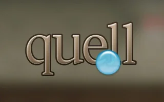
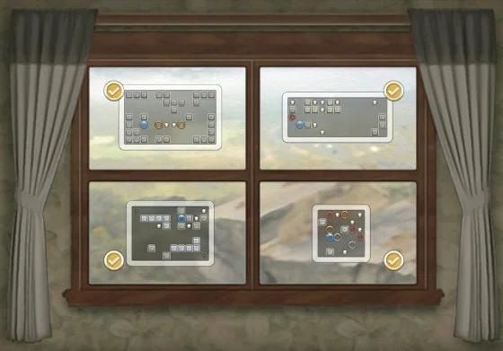
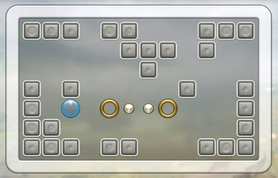

Only by chance reading a posting from one of my FB contacts I got a hint about Quell.

> *"Quell is an enchanting game of logic which has taken the puzzle world by storm. Don’t take our word for it! Read our user reviews (thanks guys!), and see for yourself!"*

And I'm very glad that I went for it.

## Great puzzle game

Quell is a puzzle game in its own league. I mean seriously... it keeps you captivated.

Quell is available on the Google Play Store in two editions - one free, ad-supported version and a paid, ad-free one -, namely Quell and Quell+. Don't get confused, it's still the same game after all. Quell's visual appeal lies in the details. Your task is to push a water drop (the quell) in order to collect coins in various mazes within a given number of moves. The aim in each level is to solve the puzzle in the perfect number of moves necessary. Starting in the past you are faced with more 'simply' challenges and the guidance steps are clearly understandable. From stage to stage, from level to level difficulty increases slowly but steadily. New obstacles and features are introduced as well.

I took me a couple of evening hours to complete all levels but it was worth the time.  
Following some impressions taken from the actual game and the links to the Play Store.

  
*Quell: Level overview in a stage*

  
*Quell: Push the water drop to collect all coins in a level*

Play Store: [Quell](https://play.google.com/store/apps/details?id=com.fallentreegames.quellfree "Quell") (free edition) & [Quell+](https://play.google.com/store/apps/details?id=com.fallentreegames.quell "Quell+")

Don't miss the other games of [FallenTreeGames](https://www.fallentreegames.com/ "FallenTreeGames"): Quell Reflect and Quell Memento.