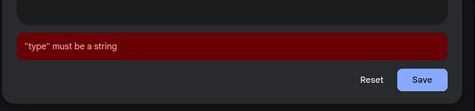

Recently, while developing some changes in the Gemini SDK for .NET and given a reported issue on GitHub I had a look at the possibilities of passing an object as the expected structured output in JSON format in order to get the response from the Gemini API.

Turns out it's not trivial and there are several options available, each with of their own obstacles. Let's have a look...

## JSON schema exporter in .NET 9

First, I came across a new feature in .NET 9 - [JSON schema exporter](https://learn.microsoft.com/en-us/dotnet/standard/serialization/system-text-json/extract-schema).

> The [JsonSchemaExporter](https://learn.microsoft.com/en-us/dotnet/api/system.text.json.schema.jsonschemaexporter) class, introduced in .NET 9, lets you extract [JSON schema](https://json-schema.org/) documents from .NET types using either a [JsonSerializerOptions](https://learn.microsoft.com/en-us/dotnet/api/system.text.json.jsonserializeroptions) or [JsonTypeInfo](https://learn.microsoft.com/en-us/dotnet/api/system.text.json.serialization.metadata.jsontypeinfo) instance. The resultant schema provides a specification of the JSON serialization contract for the .NET type. The schema describes the shape of what would be serialized and what can be deserialized.

Although interesting, it's too new and the Gemini SDK for .NET needs support for previous versions of .NET including .NET Framework. So, not an option yet.

## NJsonSchema by Rico Suter

Next, I found the [NJsonSchema](https://github.com/RicoSuter/NJsonSchema) library and gave it a try. The library is well written and actively maintained. Also, the package supports .NET Framework 4.6.2 or higher, .NET Standard 2.0, and .NET 6.0 or higher. Sounds like the perfect candidate to integrate into my SDK.

However, I noticed that there are slight differences between the available documentation and the latest version 11.x of the NuGet package. Using the previous, latest version 10.x of the package solved that.

Unfortunately, I ran into the problem described below regarding the generation of `type` keys as arrays of principle types, and I couldn't find a solution to output a single string value (as expected by the Gemini API).

The latest version seems to migrate from `Newtonsoft.Json` to `System.Text.Json` but that process has not been completed yet. Throughout the Gemini SDK for .NET I'm using `System.Text.Json` everywhere as much as possible. I think the test projects still use `Newtonsoft.Json`indirectly somehow. Anyway, I didn't like adding another JSON library to the SDK and I couldn't resolve the described issue with the `type` array, so not an option.

## json-everything by Greg Dennis

Lastly, I came across the [json-everything](https://github.com/json-everything/json-everything) library which generated the JSON schema as expected by the Gemini API. The NuGet package is compatible with .NET Standard 2.0 (which works for .NET Framework 4.7.1 or higher, IIRC) as well as .NET 8.0 or higher. As I ditched support for .NET 6.0 recently in the SDK it's a match.

## Serialization of .NET types to JSON and JSON

Yes, you read this correctly. Most commonly the Gemini SDK for .NET has to serialize the payload for the REST API endpoint requests. That's regular stuff and nothing special about it using `System.Text.Json`.

```csharp
/// <summary>
/// Return serialized JSON string of request payload.
/// </summary>
/// <param name="request"></param>
/// <returns></returns>
protected string Serialize<T>(T request)
{
	return JsonSerializer.Serialize(request, _options);
}
```

The "usual" method to serialize to JSON in .NET

However, to generate a structured output one has to provide a JSON Schema describing the object used for the response. JSON schema uses a defined syntax to describe objects which is different from a regular object serialization. Hence the need to integrate one of the previously mentioned libraries in order to be generate a JSON schema based on a .NET type.

One of the solutions is to implement a specialized JSON converter and attribute the property to use it. Here's how it's done in the SDK.

```csharp
/// <summary>
/// Optional. Output response schema of the generated candidate text when response mime type can have schema.
/// </summary>
/// <remarks>
/// Schema can be objects, primitives or arrays and is a subset of [OpenAPI schema](https://spec.openapis.org/oas/v3.0.3#schema).
/// If set, a compatible response_mime_type must also be set. Compatible mimetypes: `application/json`: Schema for JSON response.
/// </remarks>
[JsonConverter(typeof(ResponseSchemaJsonConverter))]
public object? ResponseSchema { get; set; }
```

Assign a custom JSON converter to the property

A custom converter needs to overwrite two methods - Read and Write. See further details about [How to write custom converters for JSON serialization (marshalling) in .NET](https://learn.microsoft.com/en-us/dotnet/standard/serialization/system-text-json/converters-how-to). Here's the current implementation (kindly ignore Read as its not used).

```csharp
#if NET472_OR_GREATER || NETSTANDARD2_0
using System;
using System.Text.Json;
using System.Text.Json.Serialization;
#endif
using Json.Schema;
using Json.Schema.Generation;

namespace Mscc.GenerativeAI
{
    /// <summary>
    /// Custom JSON converter to serialize and deserialize JSON schema.
    /// </summary>
    public sealed class ResponseSchemaJsonConverter : JsonConverter<object>
    {
        /// <inheritdoc cref="JsonConverter"/>
        public override object? Read(ref Utf8JsonReader reader, Type typeToConvert, JsonSerializerOptions options)
        {
            return JsonSerializer.Deserialize<dynamic>(reader.GetString()!, options);
        }

        /// <inheritdoc cref="JsonConverter"/>
        public override void Write(
            Utf8JsonWriter writer,
            object value,
            JsonSerializerOptions options)
        {
            var type = value.GetType();
            // How to figure out: type vs anonymous vs dynamic?
            if (type.Name.Substring(0,Math.Min(type.Name.Length, 20)).Contains("AnonymousType"))
            {
                var newOptions = new JsonSerializerOptions(options);
                newOptions.Converters.Remove(this);
                JsonSerializer.Serialize(writer, value, value.GetType(), newOptions);
            }
            else
            {
                var config = new SchemaGeneratorConfiguration()
                {
                    PropertyNameResolver = PropertyNameResolvers.CamelCase
                };
                var schemaBuilder = new JsonSchemaBuilder();
                var schema = schemaBuilder.FromType(type, config).Build();
                JsonSerializer.Serialize(writer, schema, schema.GetType(), options);
            }
        }
    }
}
```

Custom JSON Converter class to generate JSON schema output

As you see, there's still of room to improve the implementation. For once, I'm struggling with the serialization of types from the `System.Dynamic` namespace, eg. ExpandoObject. Why? Because this generates (again) additional JSON keys like `readOnly` which are rejected. Right now, it's not clear to me whether it's a specs problem against JSON Schema or an incompatibility on the side of the Gemini API.

*Note: The boolean keywords `readOnly`and `writeOnly` are part of the [JSON Schema Annotations](https://json-schema.org/understanding-json-schema/reference/annotations) and have been added in draft 7.*

Feel free to drop a note or hint in the article comments below. Or create a PR in the repository on GitHub.

Following is the post I published on the [Build with Google AI Forum](https://discuss.ai.google.dev/t/responseschema-and-json-schema-specs-of-type-as-array/61211):

## Incompatibility issue in the Gemini API regarding JSON Schema

I'm facing an issue regarding the generation of JSON Schema used as value of `GenerationConfig.ResponseSchema` given the following scenario. The class is defined like this

```
class Recipe {
    public string Name { get; set; }
}
```

Which is then passed into the property as a list / array in order to retrieve multiple suggestions from the Gemini API.

```
var generationConfig = new GenerationConfig()
{
    ResponseMimeType = "application/json",
    ResponseSchema = new List<Recipe>()
};
```

The generated output looks like this

```
{
  "model" : "models/gemini-1.5-pro-latest",
  "contents" : [ {
    "role" : "user",
    "parts" : [ {
      "text" : "List a few popular cookie recipes."
    } ]
  } ],
  "generationConfig" : {
    "responseMimeType" : "application/json",
    "responseSchema" : {
      "type" : "array",
      "items" : {
        "type" : "object",
        "properties" : {
          "name" : {
            "type" : [ "string", "null" ]
          }
        },
        "required" : [ "name" ]
      }
    }
  }
}
```

Specifying the property `Name` as a **nullable string**. This is conform with the specs of `type` according to [https://json-schema.org/understanding-json-schema/reference/type](https://json-schema.org/understanding-json-schema/reference/type) allowing *instances that can be of multiple primitive types*.

*The type keyword may either be a string or an array:*  
\*\* If it's a string, it is the name of one of the basic types above.\*  
\*\* If it is an array, it must be an array of strings, where each string is the name of one of the basic types, and each element is unique. In this case, the JSON snippet is valid if it matches any of the given types.\*

See also [https://json-schema.org/draft/2020-12/json-schema-core#section-7.6.1](https://json-schema.org/draft/2020-12/json-schema-core#section-7.6.1) and following paragraphs.

Currently, the Gemini API returns an HTTP 400 Bad Request with this information.

```
{
  "error": {
    "code": 400,
    "message": "Invalid JSON payload received. Unknown name \"type\" at 'generation_config.response_schema.items.properties[0].value': Proto field is not repeating, cannot start list.\nInvalid JSON payload received. Unknown name \"type\" at 'generation_config.response_schema.items.properties[1].value': Proto field is not repeating, cannot start list.",
    "status": "INVALID_ARGUMENT",
    "details": [
      {
        "@type": "type.googleapis.com/google.rpc.BadRequest",
        "fieldViolations": [
          {
            "field": "generation_config.response_schema.items.properties[0].value",
            "description": "Invalid JSON payload received. Unknown name \"type\" at 'generation_config.response_schema.items.properties[0].value': Proto field is not repeating, cannot start list."
          },
          {
            "field": "generation_config.response_schema.items.properties[1].value",
            "description": "Invalid JSON payload received. Unknown name \"type\" at 'generation_config.response_schema.items.properties[1].value': Proto field is not repeating, cannot start list."
          }
        ]
      }
    ]
  }
}
```

The error message essentially showing **"type": Proto field is not repeating, cannot start list.**

And therefor indicating that the value of `type` cannot be a list/array of primitives types.

Adding to this observation on the API side, using the same response schema in AIS gives me the following error message on Save.



Sorry to say but this seems to be a short-coming on Gemini's side regarding the interpretation of JSON Schema specifications.

Similarly, I'm getting HTTP 400 Bad Request responses when other keys, like eg. "readOnly" and others are used in the schema definition.

This doesn't align with the specs of JSON Schema.

Changing the type value to a single primitive type returns an HTTP 200 OK.

```
{
  "model" : "models/gemini-1.5-pro-latest",
  "contents" : [ {
    "role" : "user",
    "parts" : [ {
      "text" : "List a few popular cookie recipes."
    } ]
  } ],
  "generationConfig" : {
    "responseMimeType" : "application/json",
    "responseSchema" : {
      "type" : "array",
      "items" : {
        "type" : "object",
        "properties" : {
          "name" : {
            "type" : "string"
          }
        }
      }
    }
  }
}
```

and the result as expected.

```
{
  "candidates" : [ {
    "content" : {
      "parts" : [ {
        "text" : "[{\"name\": \"Chocolate Chip Cookies\"}, {\"name\": \"Peanut Butter Cookies\"}, {\"name\": \"Oatmeal Raisin Cookies\"}, {\"name\": \"Snickerdoodles\"}, {\"name\": \"Shortbread Cookies\"}]"
      } ],
      "role" : "model"
    },
    "finishReason" : "STOP",
    "avgLogprobs" : -0.009499770402908326
  } ],
  "usageMetadata" : {
    "promptTokenCount" : 8,
    "candidatesTokenCount" : 45,
    "totalTokenCount" : 53
  },
  "modelVersion" : "gemini-1.5-pro-002"
}
```

Someone else observing this issue?  
Right now, this seems to be an issue with the Gemini API not accepting a conforming JSON Schema with multiple primitive types as the `type` definition of a property.

Assistance please. Thanks.

<small>Image courtesy of Jochen Kirstätter</small>
