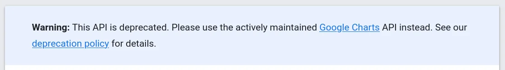
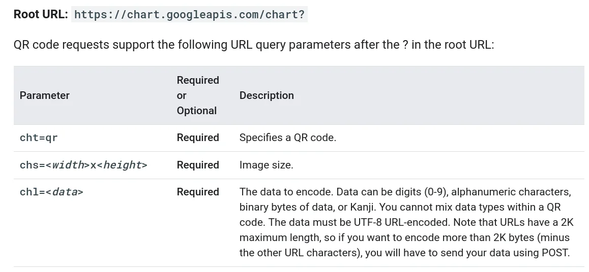
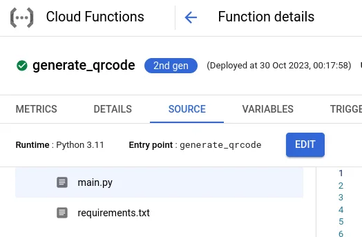
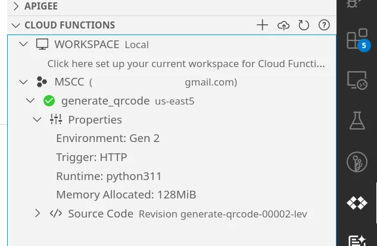

Using QR codes to assist people to find the right information quickly is a good choice nowadays. A QR code can be scanned easily with any mobile camera application and get your visitors straight into the action where you want them to be.

## The Easy

One of the fastest and easiest ways to get a QR code is to sign up to one of the many online sites offering it as a Software-as-a-Service (SaaS) model and hoping the best. I used to do that in the past but recently noticed that the available conditions of a free tier had been reduced massively, meaning I lost a good number of QR codes.

Maybe more interestingly might be to check out the [Google Charts API](https://developers.google.com/chart/) and to use their URL pattern to create your own QR codes quickly. You'll find that API under the section of [Infographics](https://developers.google.com/chart/infographics/docs/qr_codes). However, at the time of writing there is a small drawback.



Using the API is based on an HTTP GET request with a few query string parameters.



The result is ad hoc ready and usable.


Feel free to scan it with your mobile camera app and visit the URL presented.

One possible use case would be to integrate that URL template with a spreadsheet application like Sheets and have a column holding the hyperlink to the QR codes. Kindly read the description above for the `chl` parameter to keep an eye on the format of the payload data.

This approach has been used twice for the annual [MSCC Developers Conference](https://conference.mscc.mu/) in Mauritius and generated over 4,000 QR codes across two years. The individual QR codes were sent out as embedded image in emails to registrants and used to check in attendees during the event.

## The Comfy

Now with Google's API deprecation warning in mind, it might be better to look for a more future-safe variation to generate QR codes. Interestingly, I was inspired by a post on LinkedIn for the initial solution: Write a small Python snippet to generate the QR code.

### Using Python

```python
import qrcode 
qr = qrcode.make("https://jochen.kirstaetter.name/")
qr.save("qrcode.png")
```

Python code snippet to generate a QR code

Save that snippet as `generateqrcode.py` file and run it using the Python 3 interpreter, like so.

```bash
$ python generateqrcode.py
```

Executing the Python snippet to create a QR code

This small program is going to create the QR code and save it as a PNG file in the same directory where you run it. In the most likely case that you are going to be greeted by an error regarding missing module you have to install it.

```bash
 ModuleNotFoundError: No module named 'qrcode' 
 $ pip install qrcode
```

Install the missing module `qrcode` using `pip`.

However a little bit of comfort and flexibility would be most appreciated though. After a few iterations the Python snippet might be transformed to the following.

```python
# Duet AI: Generate a QR code from command-line argument
# using the qrcode library 
# 
# ModuleNotFoundError: No module named 'qrcode' 
#   $ pip install qrcode 

# Import the qrcode library 
import qrcode 
import sys 

# Check if the command line argument is provided 
if len(sys.argv) < 2:
  print("Usage: python3 " + sys.argv[0] + " <url> [<filename>]")
  sys.exit(1) 

# Get the command line argument(s)
url = sys.argv[1] 
filename = "qrcode.png" 
if len(sys.argv) == 3:
  filename = sys.argv[2] 

# Check if the image filename has an extension 
if not filename.endswith(".png"): 
  filename += ".png" 
  
# Create the QR code 
qr = qrcode.make(url) 

# Save the QR code to a file 
qr.save(filename) 

# Print a message to the user 
print("QR code saved to " + filename)
```

A more versatile Python snippet to generate a QR code

The program reads the URL and the filename of the QR code to generate from the command line and has a bit of usage information. With this implementation it is possible to generate QR codes in a more versatile approach using the following command line statement.

```bash
$ python generateqrcode.py https://jochen.kirstaetter.name/ getblogged.png
```

Pass the payload data and file name to generate the QR code


This approach allows you to generate any QR code offline on your local machine.

Using a little bit of bash-Fu, aka shell scripting, one can write a small loop reading single lines from another file and feed them into this Python script to quickly produce any number of QR code images. One approach could be using the `while read -r line; do COMMAND; done < input.file` syntax. Probably combined with the `xargs` command to specify the URL for the QR data and the file name of the generated QR code image per line in the given input file.

Avid readers of my blog might be wondering: But why did you use Python?

As mentioned earlier, I got the initial idea from a post on LI and simply took the Python snippet as-is. This way it took me less than 15 minutes from reading to finished implementation. OK, I had minor help from my P-AI-R programming buddy Duet AI giving me the code fragments to read the command line arguments, to do the argument sanity checks and to deal with default values. Although I know Python in general I'm not familiar with it on a daily base.

It is also possible to "translate" the implementation above to C#.

### Using C\#

Let's create a similar console application using .NET instead. Additionally, we use a NuGet package called `QRCoder` to generate the QR codes based on our payload. It's an open source library and [hosted on GitHub](https://github.com/codebude/QRCoder).

```bash
$ dotnet new console -o qrcode-csharp
$ cd qrcode-csharp
$ dotnet add package QRCoder
```

Create a .NET console application and add QRCoder NuGet package

Open the newly created file `Program.cs` with your favourite text editor and replace the existing code with the following.

```csharp
using QRCoder;

using (QRCodeGenerator qrGenerator = new QRCodeGenerator())
using (QRCodeData qrCodeData = qrGenerator.CreateQrCode("https://jochen.kirstaetter.name", QRCodeGenerator.ECCLevel.Q))
{
  PngByteQRCode qrCode = new PngByteQRCode(qrCodeData);
  byte[] qrCodeAsPngByteArr = qrCode.GetGraphic(20);
  File.WriteAllBytes("qrcode.png", qrCodeAsPngByteArr);
}
Console.WriteLine("QR code saved.");
```

Save the file and launch the console application. We are using the new minimal approach of .NET 6.

```bash
$ dotnet run
QR code saved.
```

If there are no typos and the project compiled without any errors you should see the generated QR code in the same directory. Here's the PNG image I created on my Chromebook using .NET 6.


I leave the implementation to deal with command line arguments, default values and parameter checks to you. Or better said, the complete source code is available in my GitHub repository.

## The Smarty

With the easy approach we saw that we are able to create QR codes online and integrate them into any kind of other resources online; however we are dependent on the circumstances that those resources continue to be available to our liking (which didn't happen to be the case for me previously). The comfortable approach was to have a command line tool that is capable to produce the images we would need; however it is limited to the local machine and lacks the previous level of integration.

How about combining both ways in a smart fashion?

Let's embrace cloud computing and more precisely serverless cloud computing. With minimal to no changes to the previous code snippet it is possible to create a Google Cloud Function (or Azure Function) and bring back the online integration with other applications. But how does this work?

### Google Cloud Function in Python

First, create a new directory on your machine and create a file called `main.py` in which we copy the Python code from the previous command line script. Using that file name is by convention for Google Cloud Functions.

```python
# Duet AI: Create a Cloud Function in Python that accepts
# a URL as a query string parameter and returns the generated 
# QR code as a PNG image.

# Import the necessary modules
import functions_framework
import qrcode
import base64
import io
from io import BytesIO

# Define the function that will be executed by the Cloud Function
@functions_framework.http
def generate_qrcode(request):
    # For more information about CORS and CORS preflight requests, see:
    # https://developer.mozilla.org/en-US/docs/Glossary/Preflight_request

    # Set CORS headers for the preflight request
    if request.method == "OPTIONS":
        # Allows GET requests from any origin with the Content-Type
        # header and caches preflight response for an 3600s
        headers = {
            "Access-Control-Allow-Origin": "*",
            "Access-Control-Allow-Methods": "GET",
            "Access-Control-Allow-Headers": "Content-Type",
            "Access-Control-Max-Age": "3600",
        }

        return ("", 204, headers)

    # Set CORS headers and mime-type for the main request
    headers = {
      "Access-Control-Allow-Origin": "*",
      "Content-Type": "image/png"
    }

    # Get the URL from the query string parameter
    url = request.args.get('url')

    # Check if the URL is valid
    if not url:
        return 'Missing URL parameter', 400

    # Generate the QR code
    #qr = qrcode.make(url)
    # Convert the QR code to a PNG image
    #img = qr.make_image()

    # Generate the QR code
    qr = qrcode.QRCode(
      version=1,
      error_correction=qrcode.constants.ERROR_CORRECT_L,
      box_size=10,
      border=4,
    )
    qr.add_data(url)
    qr.make(fit=True)

    img = qr.make_image(fill_color="black", back_color="white")

    img_byte_arr = io.BytesIO()
    img.save(img_byte_arr)
    img_byte_arr = img_byte_arr.getvalue()

    return (img_byte_arr, 201, headers)
```

The main.py file of Cloud Functions (GCF)

The implementation of the Cloud Function in Python is according to the console application. Main difference here is that we do not handle command-line arguments but read the payload from a query string parameter called `url` and we return the generated PNG image in the HTTP response using the correct mime-type.

To import additional Python modules into the Cloud function it is necessary to create a file called `requirements.txt` in the same folder where the `main.py` file resides. Enter the following content and save it.

```
functions-framework==3.*
google-cloud-error-reporting==1.9.1
qrcode==7.*
```

Specify required modules for the Python function to run

Before deployment to Google Cloud Functions it is recommended to run, test and debug your code locally. Use the [Functions Framework](https://cloud.google.com/functions/docs/running/overview) to run your function without deploying. If not already installed, run the following command to install.

```bash
$ pip install functions-framework
```

Install Google's Functions Framework in Python

Then you can launch it using this command.

```bash
$ functions-framework --target generate_qrcode
```

Run a Cloud Function locally listening on port 8080

Next, open a browser tab or window and navigate to the URL `http://localhost:8080/`. In case that you prefer staying in the terminal you can use `curl` to call same URL. You see the following HTTP 400 response: Missing URL parameter. Which is expected given our implementation of the function checking for the required query string parameter `url`.

To generate an actual QR code image you have to provide information in the required query string parameter: [`http://localhost:8080/?url=https://jochen.kirstaetter.name/`](http://localhost:8080/?url=https://jochen.kirstaetter.name/)


You can use Cltr+C to stop the local function execution.

Alternatively, you might give the [Functions Emulator](https://cloud.google.com/functions/docs/running/functions-emulator) a try. At the time of writing is was tagged as Preview feature. Due to the lack of Docker environment on my machine I didn't try this. The command-line to deploy the Python function locally using the Functions Emulator would be like this.

```bash
$ gcloud alpha functions local deploy generate_qrcode \
    --entry-point=generate_qrcode \
    --runtime=python
```

Use Functions Emulator to deploy a Cloud Function locally

**Note**: *Use the Functions Emulator at your own risk!*

Finally, it is time to deploy the function to Google Cloud Functions. There are multiple options available. You could log into the Cloud Console and navigate to the Cloud Functions area and create a new function in the browser, or you have the gcloud SDK already installed and use the following command.

```bash
$ gcloud functions deploy generate_qrcode \
    --gen2 \
    --source=. \
    --entry-point=generate_qrcode \
    --runtime=python311 \
    --region=us-east5 \
    --trigger-http \
    --allow-unauthenticated \
    --memory=128Mi \
    --max-instances=5
```

Deploy a Cloud Function using the gcloud command-line tool

See [deploying the function](https://cloud.google.com/functions/docs/create-deploy-gcloud#deploying_the_function) in the official documentation for more details. Using a 2nd gen Cloud Function is recommended. Those are built on Cloud Run and EventArc to provide an enhanced feature set. See [Cloud Function version comparison](https://cloud.google.com/functions/docs/concepts/version-comparison) for more information and explanation.

You can optionally use the `--allow-unauthenticated` flag to reach the function [without authentication](https://cloud.google.com/functions/docs/securing/managing-access-iam#allowing_unauthenticated_http_function_invocation). This is useful for testing, but we don't recommend using this setting in production unless you are creating a public API or website.

After successful deployment you should have a working instance of your Cloud Function in the Console. It will also show you its URL to use the function.



You can also query the so-called description of your deployed Cloud Function using the gcloud command. This will give you the `uri` address to reach the function.

```bash
$ gcloud functions describe generate_code
```

Alternatively, there is also the Google Cloud extension for Visual Studio Code that provides you access to your Cloud Functions to access and deploy them.



Again, you can test your deployed Cloud Function at the given URL. Given identical payload in the `url` query string parameter the generated PNG image is showing the same QR code as your locally run function earlier.

### Google Cloud Function in C\#

The steps are similar to the previous ones however we are going to use the project template for Google Cloud Functions to start a new project using the `dotnet` CLI tool.

```bash
$ dotnet new gcf-http -o QrCodeFunctionCsharp
$ cd QrCodeFunctionCsharp
$ dotnet add package QRCoder
$ code . -r
```

Create a new Google Cloud Function with HTTP trigger

In case you don't have the project template you need to install it. See here for more information: [The .NET Runtime](https://cloud.google.com/functions/docs/concepts/dotnet-runtime)

```bash
$ dotnet new install Google.Cloud.Functions.Templates
```

Install the project templates for Cloud Functions

Replace the content of the newly created `Program.cs` with the following implementation.

```csharp
using Google.Cloud.Functions.Framework;
using Microsoft.AspNetCore.Http;
using QRCoder;
using System.Threading.Tasks;

namespace QrCodeFunctionCsharp;

public class GenerateQrCode : IHttpFunction
{
    /// <summary>
    /// Generates a QR code and writes the PNG image to the response.
    /// </summary>
    /// <param name="context">The HTTP context, containing the request and the response.</param>
    /// <returns>The generated QR code as PNG image.</returns>
    public async Task HandleAsync(HttpContext context)
    {
        /// Set CORS headers for the preflight request
        /// https://developer.mozilla.org/en-US/docs/Glossary/Preflight_request
        if (context.Request.Method == "OPTIONS")
        {
            /// Allows GET requests from any origin with the Content-Type
            /// header and caches preflight response for an 3600s
            context.Response.Headers.Add("Access-Control-Allow-Origin", "*");
            context.Response.Headers.Add("Access-Control-Allow-Methods", "GET");
            context.Response.Headers.Add("Access-Control-Allow-Headers", "Content-Type");
            context.Response.Headers.Add("Access-Control-Max-Age", "3600");
            context.Response.StatusCode = 204;
            return;
        }

        /// read query string
        string url = context.Request.Query["url"];

        /// check url parameter
        if (string.IsNullOrEmpty(url))
        {
            context.Response.StatusCode = 400;
            await context.Response.WriteAsync("Missing url parameter.");
            return;
        }

        /// generate QR code
        using (QRCodeGenerator qrGenerator = new QRCodeGenerator())
        using (QRCodeData qrCodeData = qrGenerator.CreateQrCode(url, QRCodeGenerator.ECCLevel.Q))
        {
            PngByteQRCode qrCode = new PngByteQRCode(qrCodeData);
            byte[] qrCodeAsPngByteArr = qrCode.GetGraphic(20);

            /// return byte array as response
            context.Response.Headers.Add("Access-Control-Allow-Origin", "*");
            context.Response.ContentType = "image/png";
            context.Response.StatusCode = 201;
            await context.Response.Body.WriteAsync(qrCodeAsPngByteArr, 0, qrCodeAsPngByteArr.Length);
            await context.Response.Body.FlushAsync();
        }
    }
}
```

Cloud Function to generate and respond a QR code as PNG image

To test your function launch the project.

```bash
$ dotnet run
2023-11-06T08:12:53.637Z [Google.Cloud.Functions.Hosting.EntryPoint] [info] Serving function QrCodeFunctionCsharp.GenerateQrCode
2023-11-06T08:12:53.665Z [Microsoft.Hosting.Lifetime] [info] Now listening on: http://127.0.0.1:8080
2023-11-06T08:12:53.666Z [Microsoft.Hosting.Lifetime] [info] Application started. Press Ctrl+C to shut down.
2023-11-06T08:12:53.666Z [Microsoft.Hosting.Lifetime] [info] Hosting environment: Production
2023-11-06T08:12:53.666Z [Microsoft.Hosting.Lifetime] [info] Content root path: /.../QrCodeFunctionCsharp
```

Run the .NET function locally

Either navigate your browser or use `curl` to access the URL [`http://localhost:8080/?url=https://jochen.kirstaetter.name/`](http://localhost:8080/?url=https://jochen.kirstaetter.name/) to get the generated QR code as PNG image.


Finally, deploy the .NET project to Google Cloud Functions via the `gcloud` CLI tool using the following command.

```bash
$ gcloud functions deploy generate_qrcode-csharp \
    --gen2 \
    --source=. \
    --entry-point=QrCodeFunctionCsharp.GenerateQrCode \
    --runtime=dotnet6 \
    --trigger-http \
    --allow-unauthenticated \
    --memory=128Mi \
    --max-instances=5
```

Deploy a Cloud Function using the gcloud command-line tool

The value of the `entry-point` flag is based on the used namespace and type (class) you defined in your project. See also the output of `dotnet run` regarding the EntryPoint information. At the time of writing, the two possible values for the `runtime` flag were `dotnet3` and `dotnet6` only. I hope that with the launch of .NET 8 mid of November that a new runtime `dotnet8` for Cloud Functions will be available.

Same recommendations as described in the paragraph on Python-based deployment apply. See above for details.

## Conclusion

There is no excuse of not generating and using QR codes after you reached this far. As mentioned, we use them to provide unique images for our event registrations which we send out by email. Any registrant coming simply shows us her/his QR code and we are able to check them in quickly. It's a real time-saver.

Please take into consideration that the code snippets in Python and C# above are merely a proof of concept although a powerful and production-ready one. Both libraries `qrcode` and `QRCoder` offer a ton of features to create more sophisticated QR codes. You can customise your codes with a branded centre image, use different error correction levels, dimensions and colours. I sincerely encourage you to explore those options in the official documentation of each package.

Furthermore, having your own QR code generator online provides independence from any service provider or risk of deprecation. Actually with the described functionality you could start your own QR code Software-as-a-Service product and offer valuable features to others. Combining this blue print with a URL shortener with redirect feature to gather statistics on usage, a user authentication to isolate customers' instances of the Cloud Function from each other, and providing an appealing UX/UI website offering a management of QR code payloads.

Spice it up with a landing page and affordable pricing structure which could potentially kick off a new business.

Hmm, maybe more on that in the future...

<small>Image generated using Bing Image Creator: "A fleet of QR codes in the clouds"</small>