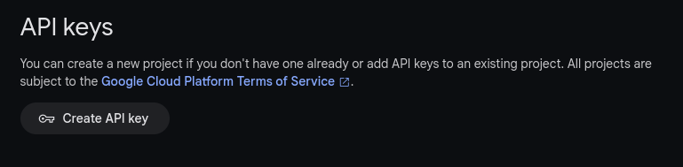
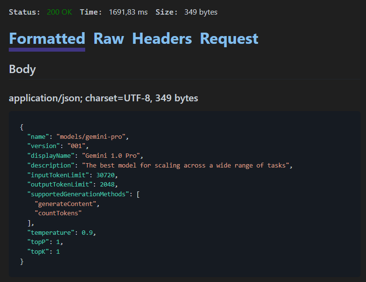
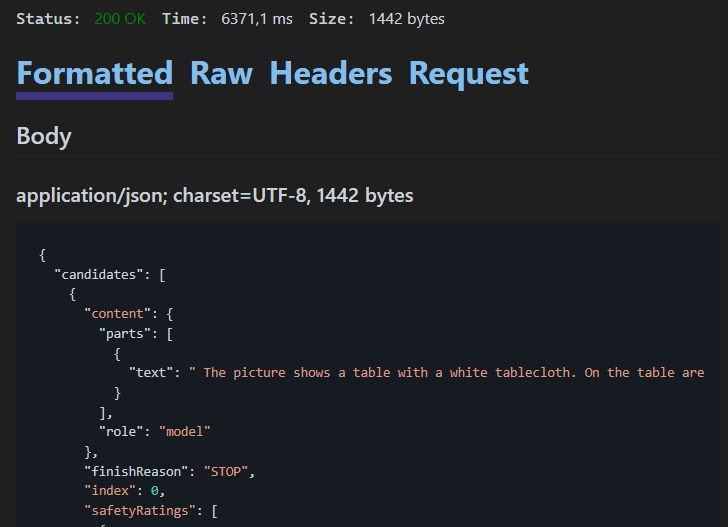
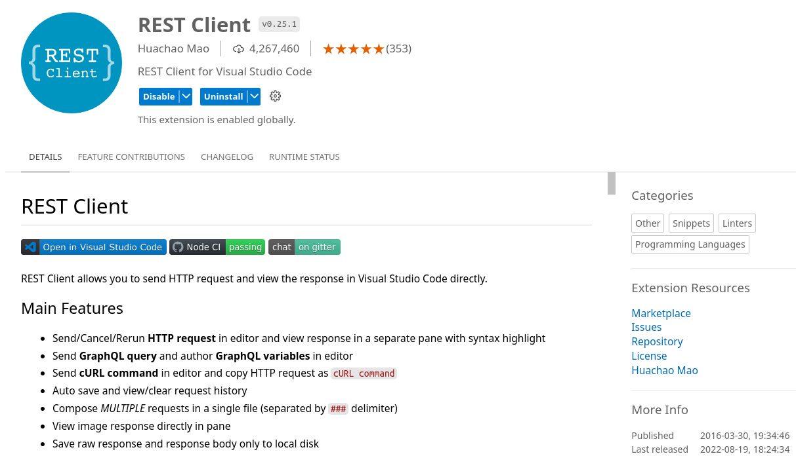
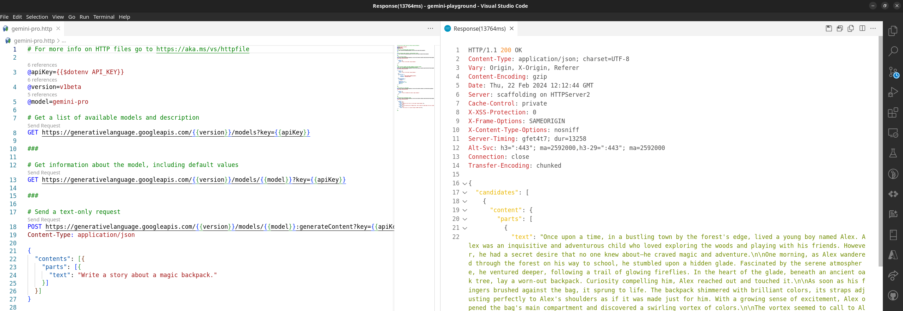
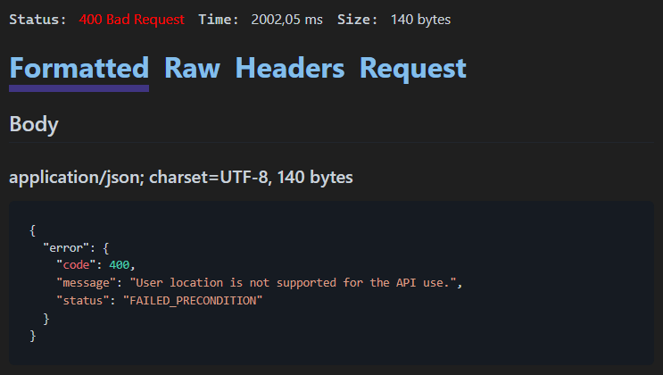

With the release of Visual Studio 2022 Version 17.5 there is a new feature available that allows for better, faster API development using `.http`/`.rest` files with an integrated HTTP client. Those files enable you to "run" your API endpoints and manipulate various REST calls to iterate within parameters and see the outputs in a structured way.

Access to Gemini is currently offered through SDKs for various programming languages like Python, Go, Node.js, and so forth, including the barebone REST API. You can get an overview here: [https://ai.google.dev/tutorials](https://ai.google.dev/tutorials)

The tutorial on [Quickstart: Get started with Gemini using the REST API](https://ai.google.dev/tutorials/rest_quickstart) is limited to the use of the `curl` command only.

> If you want to quickly try out the Gemini API, you can use `curl` commands to call the methods in the REST API. The examples in this tutorial show calls for each API method.

As a Windows developer using Visual Studio this might not be the optimum starting point, hence this article which calls the same REST API using .http/.rest files in Visual Studio.

> These .http/.rest files aren’t meant to replace integration and unit testing. Instead, they provide a new way to rapidly iterate on API development, as well as a common place to monitor the APIs your app may be using and investigate required inputs/outputs during development.

Learn more about [Visual Studio 2022 - 17.5 release announcement](https://devblogs.microsoft.com/visualstudio/visual-studio-2022-17-5-released/#api).

### Set up your API key

To use the Gemini API, you'll need an API key. If you don't already have one, create a key in [Google AI Studio](https://aistudio.google.com/app/apikey).

[Get an API key](https://aistudio.google.com/app/apikey) 

In order to keep private, sensitive information and secrets out of your source code repositories, it is recommended to use either Environment Variables, User Secrets, or Azure Key Vault to retrieve data like an API key. Here, I'm going to create an `.env` file and place it into the project folder with the following content.

```
API_KEY=<The generated Gemini API key>
```

To access the value of a variable that is defined in a `.env` file, use `$dotenv`. More details are described under [Environment Variables](https://learn.microsoft.com/en-us/aspnet/core/test/http-files?view=aspnetcore-8.0#environment-variables) in the official documentation.

All examples read the API key as environment variable from the `.env` file and stores it as a (local) variable. Additionally, there are variables for the API `version` and the `model` to be used. More information on [API versions explained](https://ai.google.dev/docs/api_versions) in the official documentation.

## Model info

When starting with the Gemini API there is often the question of `What's available?` Apart from the [documentation](https://ai.google.dev/tutorials/rest_quickstart) you can query the Gemini API to retrieve a list of available models, and you can get the details of an individual model.

### List models

If you `GET` the `models` directory, it uses the `list` method to list all of the models available through the API, including both the Gemini and PaLM family models.

```
@apiKey={{$dotenv API_KEY}}
@version=v1beta

# Get a list of available models and description
GET https://generativelanguage.googleapis.com/{{version}}/models?key={{apiKey}}
```

### Get model

If you `GET` a model's URL, the API uses the `get` method to return information about that model such as version, display name, input token limit, etc.

```
@apiKey={{$dotenv API_KEY}}
@version=v1beta
@model=gemini-pro

# Get information about the model, including default values
GET https://generativelanguage.googleapis.com/{{version}}/models/{{model}}?key={{apiKey}}
```

Get model details from Gemini API

The response might look like this.



## Gemini and Content based APIs

### Text-only input (Gemini Pro)

For text-only input use the `gemini-pro` model and call the `generateContent` method to generate a response from the model. Using the variable values a `POST` request is send to the Gemini API endpoint with the prompt specified in JSON format.

```
@apiKey={{$dotenv API_KEY}}
@version=v1beta
@model=gemini-pro

# Send a text-only request
POST https://generativelanguage.googleapis.com/{{version}}/models/{{model}}:generateContent?key={{apiKey}}
Content-Type: application/json

{
  "contents": [{
    "parts": [{
      "text": "Write a story about a magic backpack."
    }]
  }]
}
```

Calling the text-only API using gemini-pro model

### Text-and-image input (Gemini Pro Vision)

If the input contains both text and image, use the `gemini-pro-vision` model. The following snippets help you build a request and send it to the REST API.

```
@apiKey={{$dotenv API_KEY}}
@version=v1beta
@model=gemini-pro-vision

# Send a text and image as input request. 
# Command Prompt base64 conversion used: certutil -encodehex -f "scones.jpg" "output.txt" 0x40000001 1>nul
POST https://generativelanguage.googleapis.com/{{version}}/models/{{model}}:generateContent?key={{apiKey}}
Content-Type: application/json

{
  "contents":[
    {
      "parts":[
        {
          "text": "What is this picture?"
        },
        {
          "inline_data": {
            "mime_type":"image/jpeg",
            "data": "/9j/4AAQSkZ...GTWup/9k="
          }
        }
      ]
    }
  ]
}
```

Multimodal prompt with image analysis using gemini-pro-vision model

The various elements of your input are defined as `parts` in your prompt. Like previously, the `text` part contains your actual prompt and an additional file like an image is added as base64-encoded inline data including its mime type. The `data` key has a base64 encoded representation of the image to inspect using the prompt.



> The picture shows a table with a white tablecloth. On the table are two cups of coffee, two small bowls, one filled with blueberries and the other with a silver spoon. There are also three scones with blueberries on the table. Next to the scones are some peony flowers.

Here are the steps to get the sample image and encode it in base64. The image is available here. It has been resized to a width of 512px prior to base64 encoding.


```bsh
https://storage.googleapis.com/generativeai-downloads/images/scones.jpg
```

On Windows use a Command Prompt with the `certutil` command.

```
> certutil -encodehex -f "scones.jpg" "output.txt" 0x40000001 1>nul
```

Whereas on Linux or macOS use the `base64` command to encode the image.

```
$ base64 -w0 scones.jpg > output.txt
```

Note: *At the time of writing .http/.rest files in Visual Studio 2022 do not provide a functionality to read external files directly.*

### Count tokens

When using long prompts, it might be useful to count tokens before sending any content to the model.

```
@apiKey={{$dotenv API_KEY}}
@version=v1beta
@model=gemini-pro

# Count tokens for a long prompt
POST https://generativelanguage.googleapis.com/{{version}}/models/{{model}}:countTokens?key={{apiKey}}
Content-Type: application/json

{
  "contents": [{
    "parts": [{
      "text": "Write an extended story about a magic backpack."
    }]
  }]
}
```

### Multi-turn conversations (chat)

Using Gemini, you can build freeform conversations across multiple turns.

```
@apiKey={{$dotenv API_KEY}}
@version=v1beta
@model=gemini-pro

# Using multi-turn conversations (chat)
POST https://generativelanguage.googleapis.com/{{version}}/models/{{model}}:generateContent?key={{apiKey}}
Content-Type: application/json

{
  "contents": [
    {"role": "user",
      "parts": [{
        "text": "Write the first line of a story about a magic backpack."}]},
    {"role": "model",
      "parts": [{
        "text": "In the bustling city of Meadow brook, lived a young girl named Sophie. She was a bright and curious soul with an imaginative mind."}]},
    {"role": "user",
      "parts": [{
        "text": "Can you set it in a quiet village in 1600s France?"}]},
  ]
}
```

### Working with configuration parameters

Every prompt you send to the model includes parameter values that control how the model generates a response. The model can generate different results for different parameter values. Learn more about [model parameters](https://ai.google.dev/docs/concepts#model_parameters).

Also, you can use safety settings to adjust the likelihood of getting responses that may be considered harmful. By default, safety settings block content with medium and/or high probability of being unsafe content across all dimensions. Learn more about [safety settings](https://ai.google.dev/docs/concepts#safety_setting).

The following example specifies values for all the parameters of the `generateContent` method.

```
@apiKey={{$dotenv API_KEY}}
@version=v1beta
@model=gemini-pro

# Send a text-only request with model parameters and safety settings
# Ref: https://ai.google.dev/docs/concepts#model-parameters
POST https://generativelanguage.googleapis.com/{{version}}/models/{{model}}:generateContent?key={{apiKey}}
Content-Type: application/json

{
  "contents": [{
    "parts": [{
      "text": "Write a story about a magic backpack."
    }]
  }],
  "safetySettings": [
    {
        "category": "HARM_CATEGORY_DANGEROUS_CONTENT",
        "threshold": "BLOCK_ONLY_HIGH"
    }
  ],
  "generationConfig": {
    "stopSequences": [
        "Title"
    ],
    "temperature": 1.0,
    "maxOutputTokens": 800,
    "topP": 0.8,
    "topK": 10
  }
}
```

## Limited to Visual Studio?

Absolutely not!

I successfully used the same set of .http files in the following text editors and environments with the REST Client extension by Huachao Mao.

- Visual Studio Code - locally and online [https://vscode.dev/](https://vscode.dev/)
- Google Cloud Shell Editor (Code OSS for the Web)
- Project IDX - [https://idx.dev/](https://idx.dev/)





## Source code: Gemini Playground

I created a repository on GitHub [gemini-playground](https://github.com/mscraftsman/gemini-playground) that contains all samples described above with the exception of the `.env` file and the API key to access the Gemini REST API. Feel free to give it a star and fork it for your own purpose.

## Georestricted access to API of Gemini AI

Unfortunately, if you are residing in a country that has no access to the API endpoints of Gemini AI you will get an HTTP 400 response like the following one.



## Lastly, a story about a magic backpack

Here's the response I was provided by Gemini API.

*Once upon a time, in a bustling town by the forest's edge, lived a young boy named Alex. Alex was an inquisitive and adventurous child who loved exploring the woods and playing with his friends. However, he had a secret desire that no one knew about—he craved magic and adventure.*

*One morning, as Alex wandered through the forest on his way to school, he stumbled upon a hidden glade. Fascinated by the serene atmosphere, he ventured deeper, following a trail of glowing fireflies. In the heart of the glade, beneath an ancient oak tree, lay a worn-out backpack. Curiosity compelling him, Alex reached out and touched it.*

*As soon as his fingers brushed against the bag, it sprung to life. The backpack shimmered with brilliant colors, its straps adjusting perfectly to Alex's shoulders as if it was made just for him. With a growing sense of excitement, Alex opened the bag's main compartment and discovered a swirling vortex of colors.*

*The vortex seemed to call to Alex, inviting him to step inside. Hesitating for a moment, he realized this was the magic and adventure he had always yearned for. With newfound courage, he took a deep breath and stepped through the portal, disappearing into the vibrant void.*

*The world inside the backpack was nothing like Alex had ever imagined. It was an expansive realm filled with floating islands, luminous waterfalls, and ethereal creatures. Every corner held a new discovery, from talking animals to enchanted artifacts.*

*Alex spent countless hours exploring this magical realm, making friends with the creatures and unraveling its mysteries. He learned the art of flying, telekinesis, and even conjuring illusions. Along his journey, he met a wise old wizard who became his mentor, teaching him valuable lessons about magic and responsibility.*

*As Alex grew wiser and more skilled, he realized that the backpack's magic was not without its consequences. With every spell he cast, a faint shimmer of darkness would appear on the bag's surface. He soon understood that the backpack had a life of its own, and its power could be both a blessing and a curse.*

*Determined to make the most of his time in the magical realm, Alex embarked on a quest to find the legendary "Heart of Magic," an artifact said to hold the power to restore balance and harmony to the backpack's magic. Along the way, he faced challenges, encountered dangerous creatures, and forged alliances with unlikely companions.*

*When Alex finally found the Heart of Magic, he was given the choice to either return home to his old life or remain in the magical realm forever. With a heavy heart, he made the difficult decision to say goodbye to his friends and the world he had come to love.*

*Stepping back through the vortex in the backpack, Alex found himself back in the forest glade, the backpack now nothing more than an ordinary worn-out bag. He carried it with him, cherishing the memories of his magical journey, knowing that he had grown and learned valuable lessons about friendship, magic, and the choices that shape one's destiny.*
