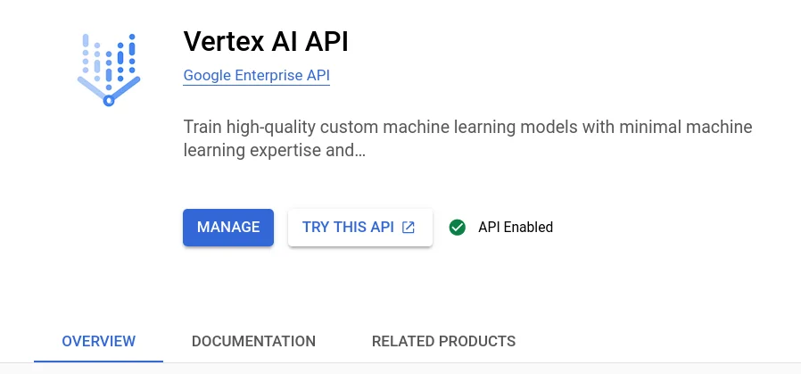
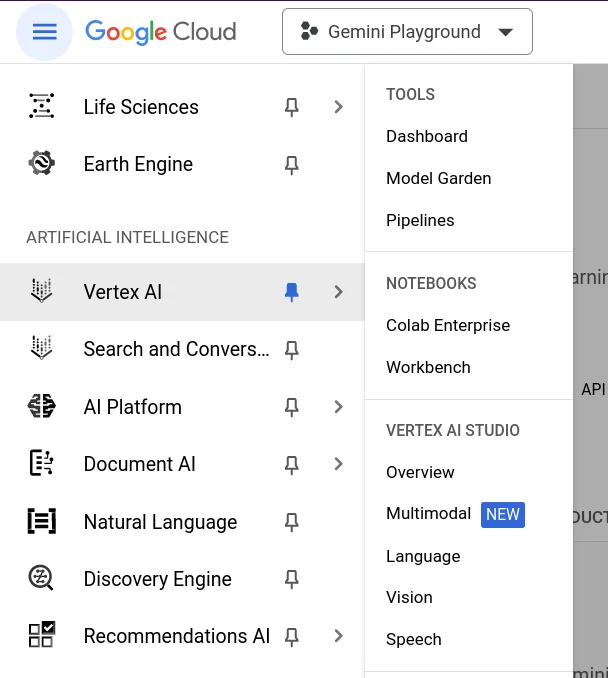
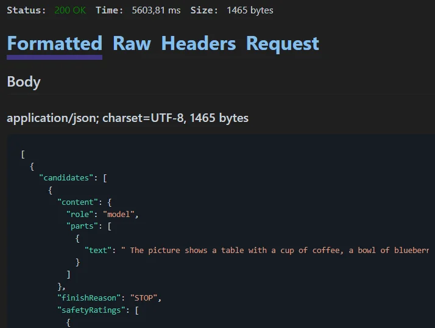
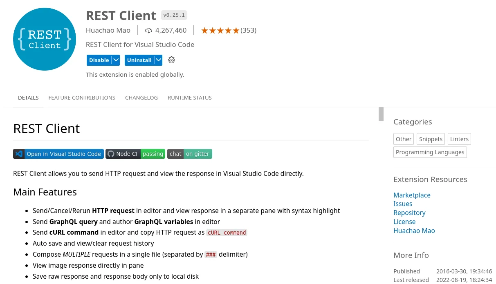
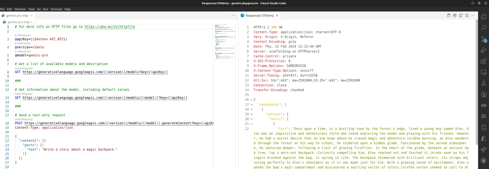

Naming things in information technology is a hard nut to crack, and so it is not surprising that recent announcements about the line of Gemini products might be confusing. This article focuses on using the [Vertex AI Gemini API](https://cloud.google.com/vertex-ai/docs/generative-ai/learn/overview) provided by Google Cloud Platform.

> Generative AI on Vertex AI (also known as *genAI* or *gen AI*) gives you access to Google's large generative AI models so you can test, tune, and deploy them for use in your AI-powered applications.

It's the professional or enterprise offering compared to the consumer oriented AI Studio. Access to Vertex AI Gemini API is currently offered through SDKs for various programming languages like Python, Go, Node.js, and Java.

## Set up Vertex AI

First, you need an account on [Google Cloud](https://console.cloud.google.com/). If you don't already have one you can sign up and benefit from $US 300 credits to start with.

To use Vertex AI it is necessary to create or use an existing project, billing needs to be enabled for that project, and the Vertex AI API needs to be enabled.



Then navigate to the Artificial Intelligence section, choose Vertex AI menu and open the Multimodal entry under Vertex AI Studio. This should be your launch base to prompts and the documentation, if necessary.



### Gemini API offerings

The [Vertex AI Gemini API](https://cloud.google.com/vertex-ai/docs/generative-ai/multimodal/overview) contains the publisher endpoints for the Gemini models developed by Google DeepMind.

- **Gemini 1.0 Pro** is designed to handle natural language tasks, multiturn text and code chat, and code generation.
- **Gemini 1.0 Pro Vision** supports multimodal prompts. You can include text, images, and video in your prompt requests and get text or code responses.

## Set up Visual Studio

With the release of Visual Studio 2022 Version 17.5 there is a new feature available that allows for better, faster API development using `.http`/`.rest` files with an integrated HTTP client. Those files enable you to "run" your API endpoints and manipulate various REST calls to iterate within parameters and see the outputs in a structured way. Learn more about [Visual Studio 2022 - 17.5 release announcement](https://devblogs.microsoft.com/visualstudio/visual-studio-2022-17-5-released/#api).

Similar to the set up procedures for [Getting started with Gemini using Visual Studio](xref:getting-started-with-gemini-using-vs-http) create a project, probably a web application or API one and create an .http file to start with.

In order to keep private, sensitive information and secrets out of your source code repositories, it is recommended to use either Environment Variables, User Secrets, or Azure Key Vault to retrieve data like the project ID or an access token. Here, I'm going to create an `.env` file and place it into the project folder with the following content.

```
PROJECT_ID=<your Google Cloud project ID>
ACCESS_TOKEN=<your access token to Google Cloud>
```

To access the value of a variable that is defined in a `.env` file, use `$dotenv`. More details are described under [Environment Variables](https://learn.microsoft.com/en-us/aspnet/core/test/http-files?view=aspnetcore-8.0#environment-variables) in the official documentation.

After you logged into Google Cloud either using the Console Shell or the `gcloud` CLI tool (recommended) you can retrieve the access token with the following command.

```
$ gcloud auth print-access-token
```

Copy and paste the output as value of the `ACCESS_TOKEN` variable into your `.env` file. In case that the next request is still not authorized, make a small change to the `.http` fle content and try again. There seems to be a slight delay or synchronisation issue in the integrated REST client.

## Use the Vertex AI Gemini API

The documentation on Google Cloud describes the [Generative AI foundational model reference](https://cloud.google.com/vertex-ai/docs/generative-ai/model-reference/overview) in general, and its [Gemini API](https://cloud.google.com/vertex-ai/docs/generative-ai/model-reference/gemini) in particular. Here, there are two API endpoints of interest.

```
https://{REGION}-aiplatform.googleapis.com/v1/projects/{PROJECT_ID}/locations/{REGION}/publishers/google/models/gemini-1.0-pro:streamGenerateContent

https://{REGION}-aiplatform.googleapis.com/v1/projects/{PROJECT_ID}/locations/{REGION}/publishers/google/models/gemini-1.0-pro-vision:streamGenerateContent
```

The difference between both is simply the selection of model - `gemini-1.0-pro` and `gemini-1.0-pro-vision`. There is the method `streamGenerateContent` only to generate information based on the data and prompts you send to the API.

## Use the Gemini 1.0 Pro model

The Gemini 1.0 Pro (`gemini-1.0-pro`) model is tailored for natural language tasks such as classification, summarization, extraction, and writing.

### Generate text from text

Send a text prompt to the model. The Gemini 1.0 Pro (`gemini-1.0-pro`) model provides a streaming response mechanism: `streamGenerateContent`. With this approach, you don't need to wait for the complete response; you can start processing fragments as soon as they're accessible.

```
@projectId={{$dotenv PROJECT_ID}}
@accessToken={{$dotenv ACCESS_TOKEN}}
@region=us-central1
@model=gemini-1.0-pro
@apiEndpoint={{region}}-aiplatform.googleapis.com

# Send a text-only request
POST https://{{apiEndpoint}}/v1/projects/{{projectId}}/locations/{{region}}/publishers/google/models/{{model}}:streamGenerateContent
Authorization: Bearer {{accessToken}}
Content-Type: application/json

{
  "contents": {
    "role": "USER",
    "parts": { "text": "Why is the sky blue?" }
  }
}
```

### Working with configuration parameters

Every prompt you send to the model includes parameter values that control how the model generates a response. The model can generate different results for different parameter values. Learn more about [model parameters](https://ai.google.dev/docs/concepts#model_parameters).

Also, you can use safety settings to adjust the likelihood of getting responses that may be considered harmful. By default, safety settings block content with medium and/or high probability of being unsafe content across all dimensions. Learn more about [safety settings](https://ai.google.dev/docs/concepts#safety_setting).

```
@projectId={{$dotenv PROJECT_ID}}
@accessToken={{$dotenv ACCESS_TOKEN}}
@region=us-central1
@model=gemini-1.0-pro
@apiEndpoint={{region}}-aiplatform.googleapis.com

# Send a text-only request with model parameters and safety settings
POST https://{{apiEndpoint}}/v1/projects/{{projectId}}/locations/{{region}}/publishers/google/models/{{model}}:streamGenerateContent
Authorization: Bearer {{accessToken}}
Content-Type: application/json

{
  "contents": {
    "role": "USER",
    "parts": { "text": "Why is the sky blue?" }
  },
  "generation_config": {
    "temperature": 0.2,
    "top_p": 0.1,
    "top_k": 16,
    "max_output_tokens": 2048,
    "candidate_count": 1,
    "stop_sequences": []
  },
  "safety_settings": {
    "category": "HARM_CATEGORY_SEXUALLY_EXPLICIT",
    "threshold": "BLOCK_LOW_AND_ABOVE"
  }
}
```

### Multi-turn conversations (chat)

The Gemini 1.0 Pro model supports natural multi-turn conversations and is ideal for text tasks that require back-and-forth interactions. Specify the `role` field only if the content represents a turn in a conversation. You can set `role` to one of the following values: `user`, `model`.

```
@projectId={{$dotenv PROJECT_ID}}
@accessToken={{$dotenv ACCESS_TOKEN}}
@region=us-central1
@model=gemini-1.0-pro
@apiEndpoint={{region}}-aiplatform.googleapis.com

# Using multi-turn conversations (chat)
POST https://{{apiEndpoint}}/v1/projects/{{projectId}}/locations/{{region}}/publishers/google/models/{{model}}:streamGenerateContent
Authorization: Bearer {{accessToken}}
Content-Type: application/json

{
  "contents": [
    {
      "role": "user",
      "parts": [
        { "text": "Hello" }
      ]
    },
    {
      "role": "model",
      "parts": [
        { "text": "Hello! I am glad you could both make it." }
      ]
    },
    {
      "role": "user",
      "parts": [
        { "text": "So what is the first order of business?" }
      ]
    }
  ]
}
```

> The first order of business is to introduce ourselves and get to know each other.

## Use the Gemini 1.0 Pro Vision model

The Gemini 1.0 Pro Vision (`gemini-1.0-pro-vision`) is a multimodal model that supports adding image and video in text or chat prompts for a text response.

**Note**: *Text-only prompts are not supported by the Gemini 1.0 Pro Vision model. Instead, use the Gemini 1.0 Pro model for text-only prompts.*

### Generate text from a local image

Specify the [base64](https://en.wikipedia.org/wiki/Base64) encoding of the image or video to include inline in the prompt and the `mime_type` field. The supported [MIME types](https://en.wikipedia.org/wiki/Media_type) for images include `image/png` and `image/jpeg`.

```
@projectId={{$dotenv PROJECT_ID}}
@accessToken={{$dotenv ACCESS_TOKEN}}
@region=us-central1
@model=gemini-1.0-pro-vision
@apiEndpoint={{region}}-aiplatform.googleapis.com

# Generate text from a local image. 
# Command Prompt base64 conversion used: certutil -encodehex -f "scones.jpg" "output.txt" 0x40000001 1>nul
POST https://{{apiEndpoint}}/v1/projects/{{projectId}}/locations/{{region}}/publishers/google/models/{{model}}:streamGenerateContent
Authorization: Bearer {{accessToken}}
Content-Type: application/json

{
  "contents": {
    "role": "USER",
    "parts": [
      {
        "text": "What is this picture?"
      },
      {
        "inline_data": {
          "mime_type":"image/jpeg",
          "data": "/9j/4AAQSkZJRgA...Wup/9k="
        }
      }
    ]
  }
}
```

Here's the excerpt from the streamed response.



> The picture shows a table with a cup of coffee, a bowl of blueberries, and several blueberry scones. There are also pink flowers on the table.

Here are the steps to get the sample image and encode it in base64. The image is available here. It has been resized to a width of 512px prior to base64 encoding.


```bsh
https://storage.googleapis.com/generativeai-downloads/images/scones.jpg
```

On Windows use a Command Prompt with the `certutil` command.

```
> certutil -encodehex -f "scones.jpg" "output.txt" 0x40000001 1>nul
```

Whereas on Linux or macOS use the `base64` command to encode the image.

```
$ base64 -w0 scones.jpg > output.txt
```

Note: *At the time of writing .http/.rest files in Visual Studio 2022 do not provide a functionality to read external files directly.*

### Generate text from an image on Google Cloud Storage

Specify the Cloud Storage URI of the image to include in the prompt. The bucket that stores the file must be in the same Google Cloud project that's sending the request. You must also specify the `mime_type` field. The supported image MIME types include `image/png` and `image/jpeg`.


```
@projectId={{$dotenv PROJECT_ID}}
@accessToken={{$dotenv ACCESS_TOKEN}}
@region=us-central1
@model=gemini-1.0-pro
@apiEndpoint={{region}}-aiplatform.googleapis.com

# Generate text from an image on Google Cloud Storage.
POST https://{{apiEndpoint}}/v1/projects/{{projectId}}/locations/{{region}}/publishers/google/models/{{model}}:streamGenerateContent
Authorization: Bearer {{accessToken}}
Content-Type: application/json

{
  "contents": {
    "role": "USER",
    "parts": [
      {"text": "Is it a cat?"},
      {"file_data": {
        "mime_type": "image/jpeg",
        "file_uri": "gs://cloud-samples-data/generative-ai/image/320px-Felis_catus-cat_on_snow.jpg"
      }}
    ]
  }
}
```

> A cat with gray and black stripes is walking in the snow.

### Generate text from a video file

Specify the Cloud Storage URI of the video to include in the prompt. The bucket that stores the file must be in the same Google Cloud project that's sending the request. You must also specify the `mime_type` field. The supported MIME types for video include `video/mp4`.

```
@projectId={{$dotenv PROJECT_ID}}
@accessToken={{$dotenv ACCESS_TOKEN}}
@region=us-central1
@model=gemini-1.0-pro
@apiEndpoint={{region}}-aiplatform.googleapis.com

# Generate text from a video file.
# Using Google Storage as a source.
POST https://{{apiEndpoint}}/v1/projects/{{projectId}}/locations/{{region}}/publishers/google/models/{{model}}:streamGenerateContent
Authorization: Bearer {{accessToken}}
Content-Type: application/json

{
  "contents": {
    "role": "USER",
    "parts": [
      {
        "text": "Answer the following questions using the video only. What is the profession of the main person? What are the main features of the phone highlighted?Which city was this recorded in?Provide the answer JSON."
      },
      {
        "file_data": {
          "mime_type": "video/mp4",
          "file_uri": "gs://github-repo/img/gemini/multimodality_usecases_overview/pixel8.mp4"
        }
      }
    ]
  }
}
```

## Limited to Visual Studio?

Absolutely not!

I successfully used the same set of .http files in the following text editors and environments with the REST Client extension by Huachao Mao.

- Visual Studio Code - locally and online [https://vscode.dev/](https://vscode.dev/)
- Google Cloud Shell Editor (Code OSS for the Web)
- Project IDX - [https://idx.dev/](https://idx.dev/)

::: grid


:::
## Source code: Gemini Playground

I created a repository on GitHub [gemini-playground](https://github.com/mscraftsman/gemini-playground) that contains all samples described above with the exception of the `.env` file and the credentials to access the Vertex AI Gemini API. Feel free to give it a star and fork it for your own purpose.

## Migrate from Gemini on Google AI to Vertex AI

As mentioned initially there are multiple "Gemini AI" offerings available. If you are new to Gemini, using the [quickstarts](https://ai.google.dev/tutorials/python_quickstart) and [plans](https://ai.google.dev/pricing) for [Google AI Studio](https://ai.google.dev/tutorials/ai-studio_quickstart) is the fastest way to get started.

However, as your generative AI solutions mature, you may need a platform for building and deploying generative AI applications and solutions end to end. Google Cloud provides a comprehensive ecosystem of tools to enable developers to harness the power of generative AI, from the initial stages of app deployment to managing complex data at scale. [Google Cloud's Vertex AI platform](https://console.cloud.google.com/vertex-ai/generative) offers a suite of MLOps tools that streamline the usage, deployment, and monitoring of AI models for efficiency and reliability.

Learn more about Gemini API and the [Google AI versus Vertex AI differences](https://cloud.google.com/vertex-ai/docs/generative-ai/migrate/migrate-google-ai).

## Lastly, why is the sky blue?

Here's the response I was provided by Vertex AI Gemini API.

> The sky is blue due to a phenomenon called Rayleigh scattering. This scattering occurs because the shorter wavelengths of sunlight (blue and violet) are scattered more effectively by molecules in the atmosphere than longer wavelengths (red and orange). The scattered blue light is what we see when we look up at the sky, while the longer wavelengths of light pass through the atmosphere and reach our eyes as sunlight.
