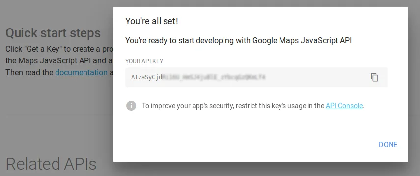
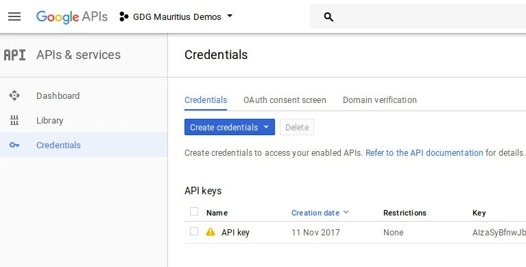
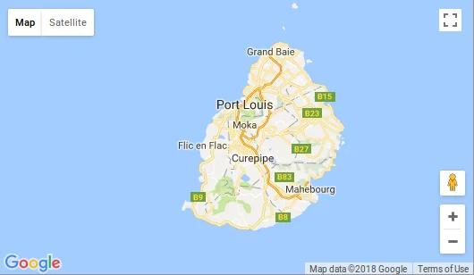

Starting with a first integration of the Google Maps JavaScript API to add a map into your web site, you could add additional APIs and hence more value to your site and provide interesting features.

## Google Developers - Build **anything** with Google

To get started building anything with Google tools you have to have a registered account on [Google Developers](https://developers.google.com/products/develop/). The account is compulsory to be able to enable and to manage any Google services under your responsibility. Usually, you would do this in the [Google API Console](https://console.developers.google.com/).

## Getting started with Google Maps API

Following are few links to related API provided by Google. It's a selection that has been covered during the meeting. And you might like to explore the other available options for either your effort in web development or your mobile application.

- [Google Maps JavaScript API](https://developers.google.com/maps/documentation/javascript/)
- [Google Maps Directions API](https://developers.google.com/maps/documentation/directions/)
- [Google Maps Distance Matrix AP](https://developers.google.com/maps/documentation/distance-matrix/)I
- [Google Maps Elevation API](https://developers.google.com/maps/documentation/elevation/start)
- [Google Maps Geocoding API](https://developers.google.com/maps/documentation/geocoding/start)
- [Google Maps Geolocation API](https://developers.google.com/maps/documentation/geolocation/intro)

### Create a Google Developer account

First, you would need to sign up for a developer account with Google. You can to do this by signing up [here](https://developers.google.com/). Eventually you should have a regular Google account already. Otherwise, you can create one for free, too.

### Get your API key

Next, you would hit the `Get a Key` button to create a project on the Google API Console, activate the Maps JavaScript API and any related services, and get an API key.



Like mentioned the APIs you would like to use have to be enabled in your developer account.



### Use Google Maps API on your website

Adding Google Maps to your website is based on four steps.

- Create a designated `<div>` element with an unique identifier, ie. "map"
- Add CSS instructions to provide dimensions of the newly created div element
- Add a JavaScript code snippet to create the map, and
- Reference and load the Maps JavaScript API in a `<script>` element, using your own `YOUR_API_KEY` as URL parameter.

The resulting HTML should look similar to this:

```
<!DOCTYPE html>
<html>
  <head>
    <title>Simple Map</title>
    <meta name="viewport" content="initial-scale=1.0">
    <meta charset="utf-8">
    <style>
      /* Always set the map height explicitly to define the size of the div
       * element that contains the map. */
      #map {
        height: 100%;
      }
      /* Optional: Makes the sample page fill the window. */
      html, body {
        height: 100%;
        margin: 0;
        padding: 0;
      }
    </style>
  </head>
  <body>
    <div id="map"></div>
    <script>
      var map;
      function initMap() {
        map = new google.maps.Map(document.getElementById('map'), {
          center: {lat: -20.258, lng: 57.475},
          zoom: 10
        });
      }
    </script>
    <script src="https://maps.googleapis.com/maps/api/js?key=YOUR_API_KEY&callback=initMap"
    async defer></script>
  </body>
</html>
```

*Source: [Google Maps API documentation - Getting Started](https://developers.google.com/maps/documentation/javascript/tutorial)*

The above code will load a map of Mauritius, like so:



Check out the numerous samples provided by Google to see what other options are available and how to create more sophisticated maps on your site.

### Usage limits

Please bear in mind that although the Google Maps JavaScript API is free to use there are restrictions in free usage. More details are described in [Google Maps JavaScript API Usage Limits](https://developers.google.com/maps/documentation/javascript/usage). Given an average blogging site or a low frequented web site you might be just fine using the free tier provided by Google. In case that you hit the limits you can enable pay-as-you-go billing to unlock higher quotas.

## Meetings on Google Maps APIs

A couple of weeks earlier there had been a joined meeting between the [Mauritius Software Craftsmanship Community](https://www.mscc.mu/) (MSCC) and the [GDG Mauritius](https://www.meetup.com/GDG-Mauritius/) to explore the possibilities of using Google Maps API a little bit. See more information here:  
[Google Maps APIs](https://www.meetup.com/MauritiusSoftwareCraftsmanshipCommunity/events/244777511)  
[Build anything with Google: Google Maps APIs](https://www.meetup.com/GDG-Mauritius/events/244777442)