Thankfully, we received a number of positive and encouraging comments on the recently concluded Virtual Developers Conference 2020 by the MSCC. The format of the conference being a full-time, online event was a total novum to members of our community.

I mean, in the past, we already talked about live streaming some or all talks of our Developers Conference but practically nobody in the community ever did it before. And so, there was only one mission statement at the beginning.

> "Create the best Report Writer in the world, out of only sawdust, bubblegum, and dreams." – Kerry Nietz, author of [FoxTales](xref:foxtales-behind-the-scenes-at-fox-software-by-kerry-nietz)

Instead of a "Report Writer" it's the annual Developers Conference of the MSCC, the pinnacle event of our regular meetings. With the implications and constraints of the pandemic - full lockdown of Mauritius back in March and still ongoing - we needed to come up with a different solution.

And literally baaed on those few ingredients - sawdust, bubblegum, and dreams - I did some research on the interweb to figure out how it would be possible for our community to provide the best possible approach to bring you the community experience and networking atmosphere of an offline event... without breaking the bank.

## Existing online meeting platforms

Obviously, I looked at existing online meetings platforms first. Systems like Google Meet, Microsoft Teams, Zoom (nah, not really - AMA!), GoToMeeting or Jitsi Meet and many more offer quick and easy access to meetings online.

However there are a number of technical limitations that I wanted to avoid or better said wanted to go beyond. Let me briefly list a few of them.

- No weird URL pattern for meeting rooms
- Availability of client applications across operating systems
- Avoidance of "Zoom-Bombing"
- Cost - free of charge was the high target
- Flexible layout handling
- Branding and customisation of each live stream / recording
- Low level of distraction for speakers
- Guided approach by track moderators
- etc.

Although all online meeting platforms are superb for any kind of daily meetings and conference calls they run short on at least two of the bullet points mentioned above.

## Streaming services

Ah, you might say but there are streaming service platforms, ie. [Lightstream Studio](https://www.golightstream.com/), [StreamYard](https://streamyard.com/), [Twitch](https://www.twitch.tv/), [Periscope](https://www.periscope.tv/), [UStream](https://video.ibm.com/), [ON24](https://www.on24.com/), etc.

Yes, indeed there are many. And surely they are an interesting option to go with. Lightstream actually looks pretty awesome, it was a recommendation from one of our community members, and it heads into the right direction with a lot of the requirements mentioned. I might give it a test run for another personal project some day.

However, all of them are subscription-based and the available free tier, if any, has too many constraints that wouldn't allow us to realise what we had in our minds, e.g. limited time of live streaming. Plus, this event is a one-off so far, and it's not about signing a monthly contract for an unknown period.

## So, what now?

Well, I had a look what others were doing...

The [Virtual Azure Community Day](https://azureday.community) (VACD) caught my attention. Back in April they ran their first online event and documented their approach in two blog articles.

First article I came across has been written by Maarten Balliauw from Belgium: [Streaming a Community Event on YouTube - Sharing the Technologies and Learnings from Virtual Azure Community Day](https://blog.maartenballiauw.be/post/2020/04/02/streaming-a-community-event-on-youtube-sharing-the-technologies-and-learnings-from-virtual-azure-community-day.html) in which he nicely described the approach.

Maarten refers to a second article [Online meetups with OBS and Skype](https://www.henkboelman.com/articles/online-meetups-with-obs-and-skype/) by Henk Boelman. And that blog post revealed everything in detail I needed to know for our conference.

The combined information from both articles created the full picture though. Okay, let's dig a little bit deeper into the architecture, the pitfalls, and possible solutions.

## The big picture

The general architecture for our approach is based on four main ingredients:

- GPU-enabled virtual machine (VM) in the cloud
- Skype with its built-in NDI technology
- Open Broadcaster Software, aka. OBS Studio
- Live streaming service, ie. YouTube

Now with that information I would like to elaborate on each one a little bit more in detail.

](../content/images/2020/09/image-27.webp)

### VM with GPU

Stable and uninterrupted access to internet has been improved here in Mauritius and there are hardly any complaints on my side anymore. Also, recently I upgraded the outdated WiFi infrastructure here in my home office with a modern mesh system.

However, live streaming is a different beast and reliable bandwidth and connectivity is key to success. Although it is possible at my place I'm not feeling comfortable to have responsibility for four live streams, and having to rely on my ISP as well as the local energy supplier which still surprises me with power outages from time to time.

The solution here is to opt-in for a virtual machine operated by one of the cloud computing providers. In order to provide enough power to handle the video source(s) and streaming it has to be a GPU-enabled VM. Check your trusted cloud provider for such type of machines, mainly used for machine learning and AI activities, and look for the GPU options.

You probably might be surprised about the price tags of such type of compute engine. Nothing to worry about, those prices are based on 24/7 operation over the period of a month. Yes, the prices are probably in the 4-digits range. Taking into consideration that our VM is going to run for a few hours a day only embrace the "Pay what you use" model and oversize your VM!

Following are some links to get started:

- [Create a free account on Microsoft Azure](https://azure.microsoft.com/free/?WT.mc_id=AZ-MVP-5001701)
- [Quickstart: Create a Windows virtual machine in the Azure portal](https://docs.microsoft.com/en-us/azure/virtual-machines/windows/quick-create-portal?WT.mc_id=AZ-MVP-5001701)
- [Get started for free on Google Cloud Platform](https://console.cloud.google.com/freetrial)
- [Windows on Compute Engine](https://cloud.google.com/compute/docs/instances/windows) and [GPUs on Compute Engine](https://cloud.google.com/compute/docs/gpus/)

I chose a Windows 10 based VM on Microsoft Azure and decided to connect via Remote Desktop Protocol (RDP) in order to provide a shared audio device to the VM. I have seen that PulseAudio could be configured in similar fashion on Linux VMs. Due to time constraints I did not explore this option.

### Let's use Microsoft Azure

Either create a new account (recommended because of free credit allocated) or log into an existing one. I'm not going into the details of signing up here. There are enough walkthroughs on the net.

On your Home screen click on **Create a resource** and Search the marketplace for `Windows 10`.

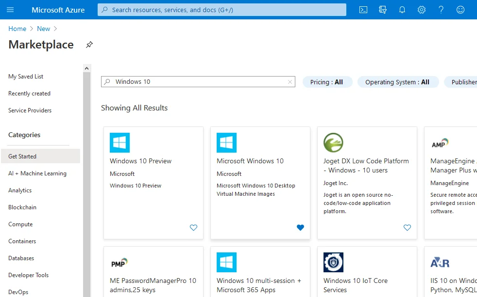

Choose the `Microsoft Windows 10` option, not the `Preview` one, and proceed.

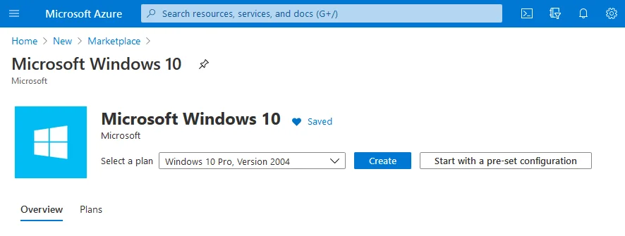

In the dropdown you can look for other editions and language packs. I usually pick the latest Pro edition. Then click on **Create**.

During the **Basics** configuration there are two important choices to make - Region and Size of the VM.

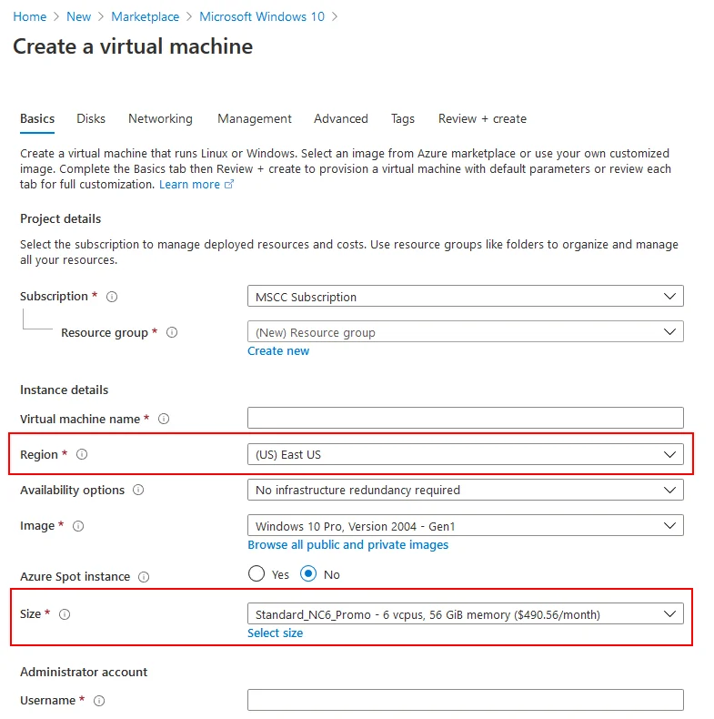

Your default size might be different. Click on `Select size` and choose an appropriate VM type and dimension from the available options of the region.

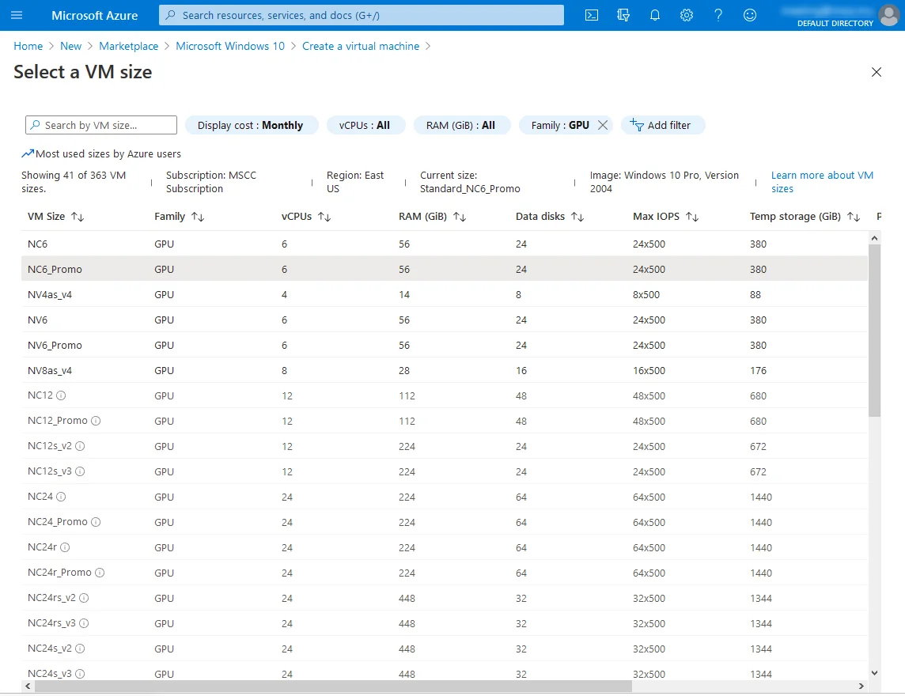

Optionally, add a filter to the list of available VM sizes specifying that you want GPU support.

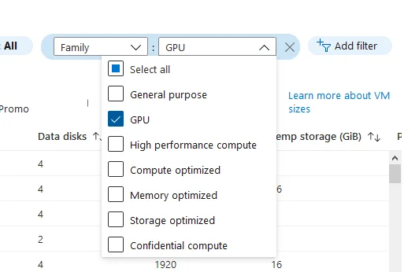

Check for any VM size with the `_Promo` suffix in the name. Those offer a better price given same specs.

For the Virtual Developers Conference I chose the `NC6_Promo` size which offers 6 vCPUs, 56 GB RAM and decent IOPS. The price tag is slightly below $500 a month. Again, don't let the price scare you.

Unfortunately, a basic subscription on Azure is limited to 10 vCPUs by default and if you would like to go for more cores you need to request an increase of resources.

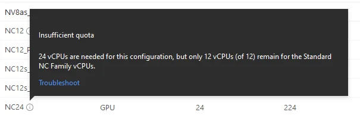

However, six vCPUs are just fine...

Here you'll find more details on the various [GPU optimized virtual machine sizes](https://docs.microsoft.com/en-us/azure/virtual-machines/sizes-gpu?WT.mc_id=AZ-MVP-5001701). Just note the following:

> NC-series, NCv2-series, NCv3-series and NCT4\_v3-series sizes are optimized for compute-intensive and network-intensive applications and algorithms.

Enter the remaining fields and tick the checkbox at the bottom to confirm the Windows 10 license aspect. Then go back to the top of the page and click on the tab **Advanced**.

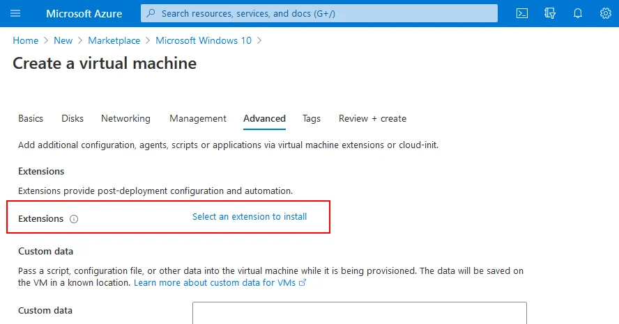

There, click on **Select an extension to install** and choose the NVIDIA GPU Driver Extension on the next blade.

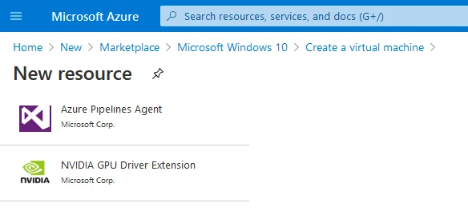

Click on **Create** at the bottom of the page.

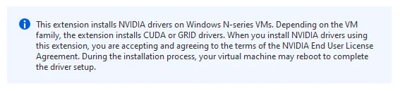

Confirm the installation with a click on **OK** and the Azure portal takes you back to the Advanced options of the VM. The result should look like this.

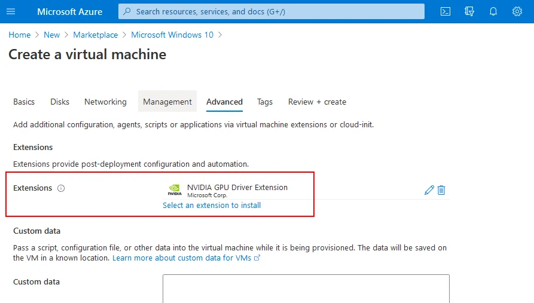

Finally, click on the **Review + create** button at the bottom and let Azure validate your entries. The resulting overview should look similar to this.

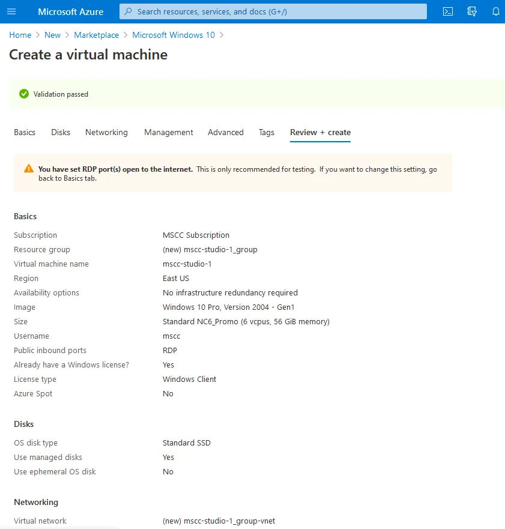

And with a click on **Create** Azure starts the deployment of your new VM. This process takes about 4-5 minutes. Time to have break and enjoy some refreshments.

## Setting up the "Studio"

Now with the VM in place it is time to work out the actual online studio and communication channels between hosts and speaker(s).

That's where [Skype](https://www.skype.com/en/get-skype/) comes into play. Skype is free of charge and available for all major operating systems. In worst case even as a web client. This provides maximum adaption on all parties involved. For the Virtual Developers Conference I can attest that we had people running on Windows, macOS and Linux - they were all welcome equally.

The actors for a single track are based on the following constraints:

- Studio account that hosts the conference call and runs on the VM
- 1-2 Speaker accounts
- 1-2 Moderator / Host accounts

This gives us a total of 5 Skype accounts bound to one live stream. You might probably ask why I create all those Skype accounts? Well, more on that in the next chapter on OBS Studio and how the integration of Skype works.

It is also highly recommended that you create your Skype accounts a few days or even weeks in advance. Start using them from time to time, especially the Skype accounts for the speakers. Microsoft monitors any activities on those accounts and unusual behaviour like sign ins from different locations get noticed.

Because the Skype account for speakers is recycled and used by multiple people Microsoft might consider this as an unusual activity and therefore asks for verification, especially when the login is happening in a “new” location / country. In such a situation you will be asked to verify the account.

Confirm the email address and click on **Next**. Then kindly **wait**.

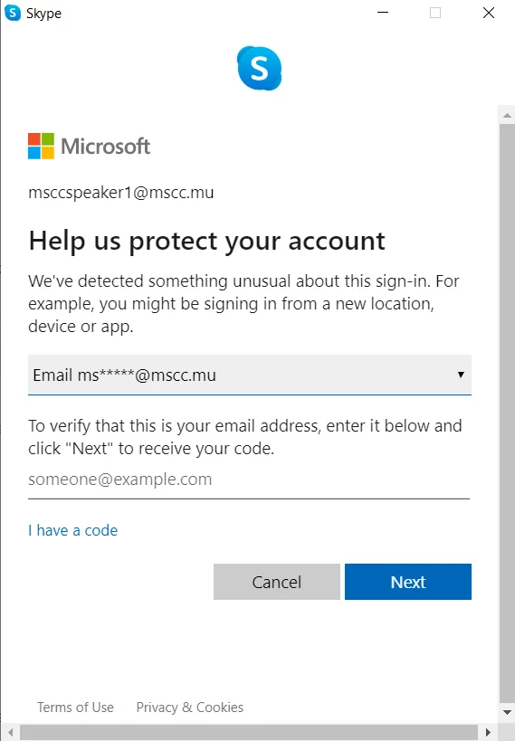

Microsoft is going to send an email to the account’s address with the security code. **It might take a few minutes** until you receive the security code by email, **kindly wait patiently**. BTW, that's good reason to organise a dry run, especially with your speakers from abroad.

### Skype for Desktop on the VM

There is only one real requirement in regards to Skype. And that's the choice of client application running on the VM. There you have to use Skype for Desktop because that's the only client version that provides support for the NDI® technology we are going to use to hook up OBS Studio.

On your VM, open the Settings of Skype and choose the Calling options.

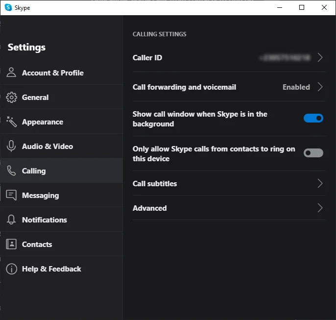

In the Advanced settings enable `Answer incoming calls automatically` and `Allow NDI® usage`. Those two settings are the most important ones.

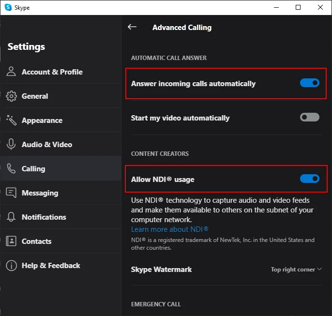

Surely you can review other options to reduce the level of distraction and improve the visual appearance of the contact list, etc.

To make it as simple as possible for the other four Skype accounts, I added them already as contacts into the designated studio account and created a conference/chat room using the name of the live stream, e.g. Batcave or Avengers Tower.

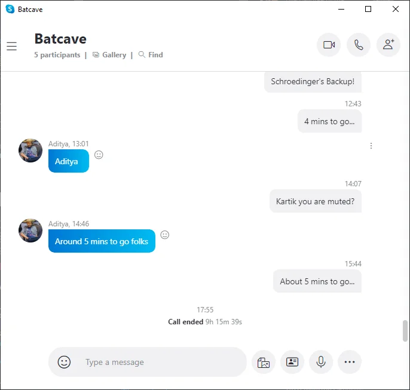

The choice of Skype client for the speaker or for a host is secondary. However there are other obstacles to consider...

### Skype for Business

You **cannot** use Skype for Business because those speaker / moderator accounts are not associated with a company but personal Skype accounts.

### Skype for Web

This might be the simplest solution of all. However, the web client of Skype does not allow you to use webcam and screen sharing at the same time. Kind of weird compared to other web solutions.

### Skype for Desktop (macOS)

During the test runs we observed that several speakers had permission issues on macOS. In order to provide the necessary permissions on macOS check your system settings.

Under Privacy you need to grant permission to Skype to access your Camera, Microphone and probably Screen Recording.

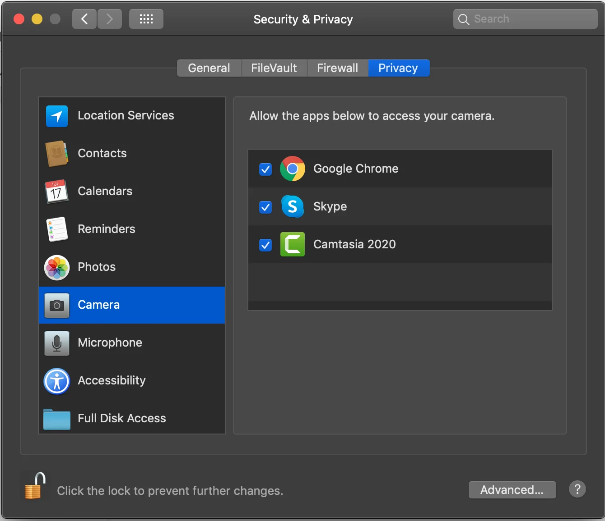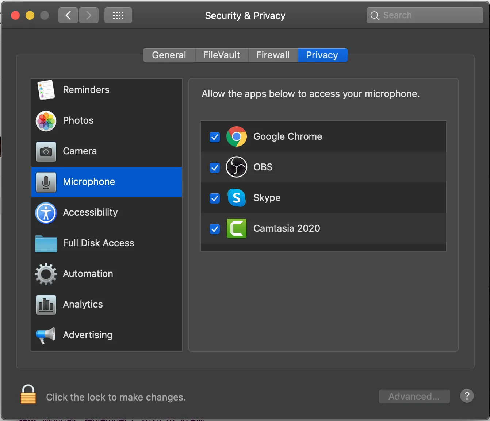

This shall be checked and adjusted **before** launching Skype as it requires to restart Skype anyways.

## Open Broadcaster Software, aka. OBS Studio

With all Skype participants of a live stream in place it is time to configure OBS Studio. Connect to the Windows VM via RDP. Download and install OBS Studio and enable NDI® support in OBS.

- [Download OBS Studio](https://obsproject.com/download)
- [Install the NDI® runtime](http://new.tk/NDIRedistV4)
- [Get the NDI extension for OBS](https://github.com/Palakis/obs-ndi/releases)

Your VM might ask for some reboots. Time to have a break and let the machine reboot.

### Set the stage (Scenes)

That's the area where the actual customisation starts, and I'm going to provide you with some thoughts that we took into consideration.

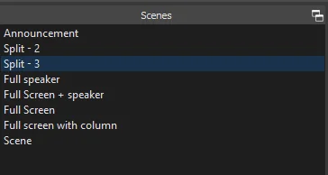

For the Virtual Developers Conference we created multiple scenes that show different elements offered by Skype - web cams and shared screen - and our visual theme consisting of MSCC branding, conference super heroes, hashtag, news ticker, rotation of partner logos, etc.

Effectively each scene is a combination of Sources. More on that in the next paragraph.

### Add your elements to each stage (Sources)

**Important**: Start the Skype conference call with all accounts involved before you add them to your instance of OBS Studio. **Only active NDI® sources can be accessed.**

Most importantly is the addition of all Skype actors into your OBS scenes. Either click on the Plus button under the Sources or right-click somewhere in the list of sources to add an NDI™ Source.

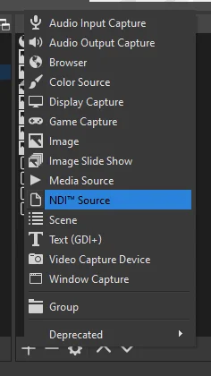

Then give it a name under **Create new** and confirm the dialog with **OK**.

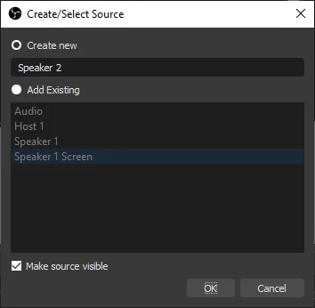

In the next dialog choose the Skype account you would like to assign to the source. It helps to have a list of the account names or Live IDs at hand to choose the right one.

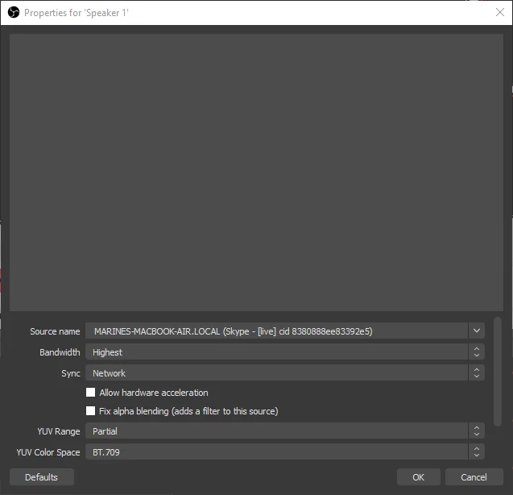

Complete this step with a click on **OK** and repeat the steps for all 4 actors in your conference call.

Finally, we are going to add two specialised NDI® sources to the scene. First, we take care of screen sharing and add the `Skype - Shared screen` option.

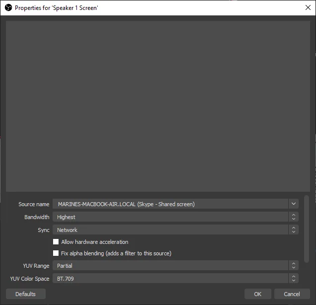

And then the `Skype - Active speaker` to round up all sources needed.

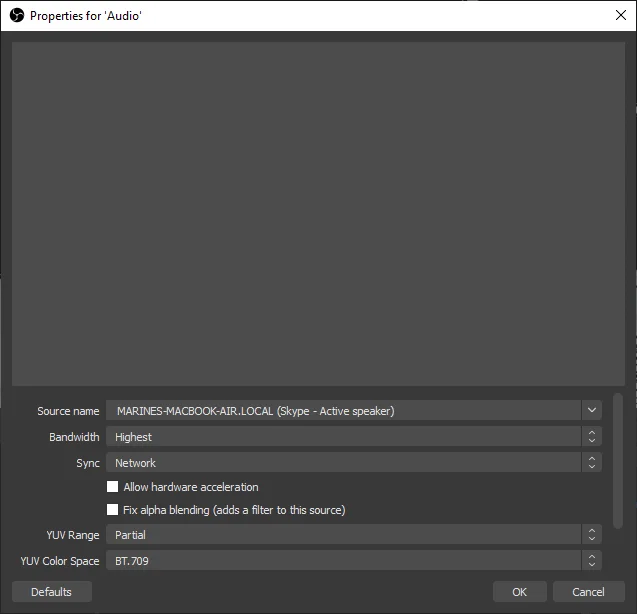

The list of sources for one of our stages called `Split - 3` that shows two hosts and one speaker looks similar to this.

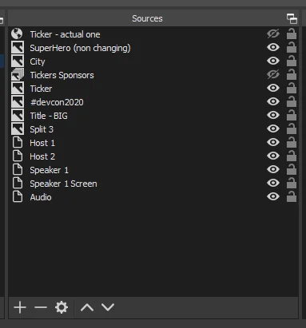

**Note**: The position of each source defines its z-index in the scene. The specialised source `Audio` (Skype active speaker) comes last to avoid any overlap with other resources. That source can even be positioned outside the viewport of the scene. The resulting scene looks like this.

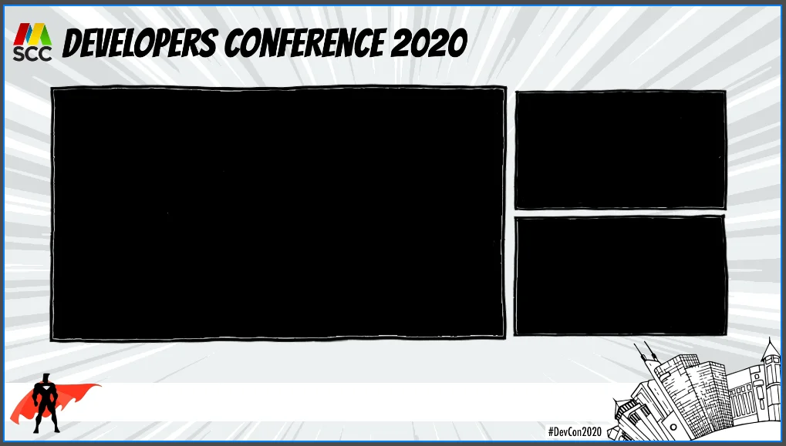

A scene that shows both hosts on the right-hand side and the speaker on the left-hand side. We used it at the beginning to introduce a single speaker and to run the Q&A session at the end of each talk.

### Keep the cameras in place

After you placed and resized each NDI® source into your scene make sure that the feeds stop changing their size automatically. To achieve this right-click each NDI® source and choose **Transform**, then select **Edit Transform**, and set the Bounding Box Type to `Scale to inner bounds`.

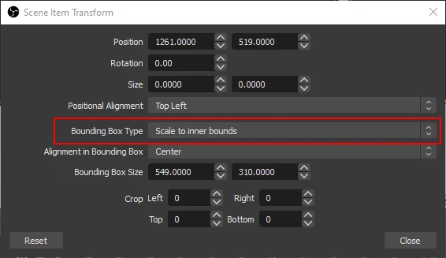

Confirm the transformation with **Close**. More details are described in the support area of Skype: [What is Skype for content creators?](https://support.skype.com/en/faq/FA34853/what-is-skype-for-content-creators)

### Each Skype source provides audio!

Pay attention to your settings under the Audio Mixer section. Each NDI® source that is active (visible) in the scene provides an audio stream. However each Skype source plays back everything that is being said in the conference call. Meaning, that is causing extreme echoes in the stream, and the main reason we use the specialised `Skype - Active speaker` source.

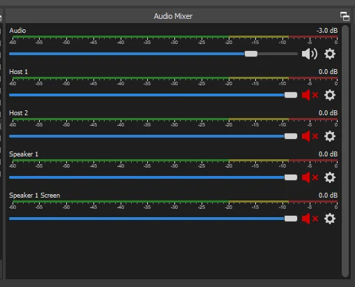

To avoid any echoes mute all audio sources except the `Skype - Active speaker` which btw should be present in all your scenes.

Keep an eye on the level indicator and adjust the slider of the audio level accordingly. Your peaks should never reach into the red area but stay in the lower yellow area all the time.

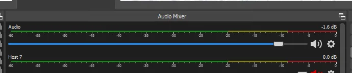

That's the another good reason to organise a dry run before the event.

## Live streaming: And... Action!

The final piece of the puzzle is the configuration of streaming. Henk mentions in his article to use [Restream](https://restream.io/) which allows you to broadcast to multiple platforms simultaneously. We thought about it but decided to use YouTube directly because we wanted to keep the audience in one place.

Navigate to your [YouTube Studio](xref:how-did-we-run-the-virtual-developers-conference-2020) and configure a new video stream. If you want to run multiple streams at the same time like we did over those three days you need to schedule them ahead of time.

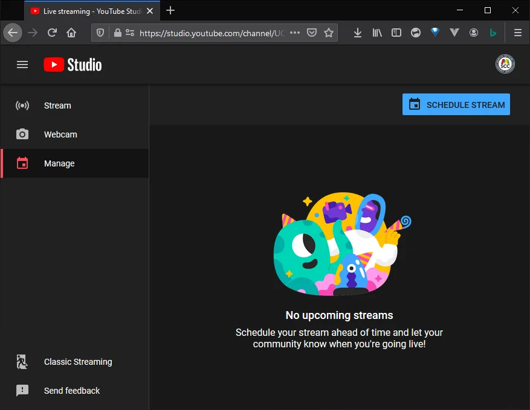

**Important**: In case that it's your first time streaming be informed that YouTube has a 24 hours warm up period before you can actually use your account to stream. Other features are bound to the number of Subscribers of your channel. Plan ahead and make announcements to advertise your new broadcast channel.

Now, in the Stream Settings you can retrieve the **Stream key** you need to paste into your encoder, for us: OBS Studio.

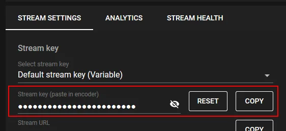

Click on the **Copy** button and switch back to OBS Studio and open the Settings. Paste the key into the Stream Key input field.

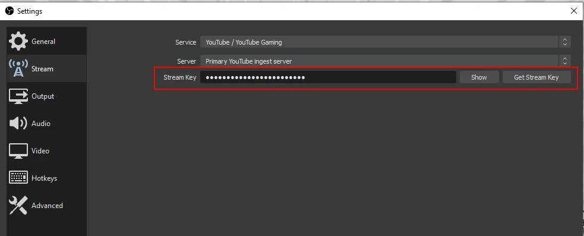

Confirm your settings with **OK** and you are ready to stream your Skype conference call in OBS Studio. Or better said: Not Yet!

## A studio (VM) needs an audio device

By default the VM on Azure or GCP might not have an audio device for local playback. However you need to provide one for the Skype conference call to work properly. Without there is no sound on your stream.

The solution here is to share your local sound card capabilities via Remote audio playback options in the Remote Desktop Connection (RDP). Check the settings of your `Local Resources` and choose `Play on this computer`.

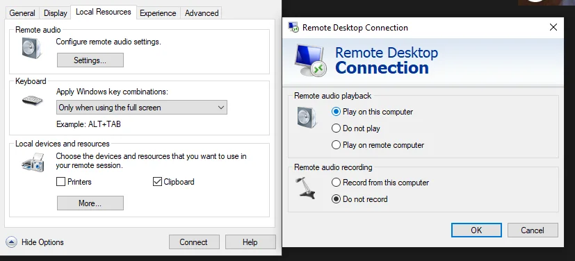

Your VM is now audio-enabled using a virtual audio driver and playing the test sound in Skype rings nicely on your local machine.

To avoid any annoyance with your local audio it is recommended that you mute that RDP audio device in your mixer settings.

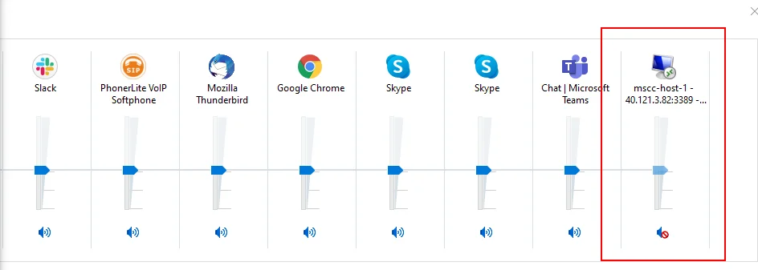

If it doesn't show in the first place, scroll to the right. ;-)

Or better use an app like Ear Trumpet from the Microsoft Store for easier access and handling.

## Screen resolution and bandwidth

That's now totally up to your hardware and screens. On my side I run a setup with four screens, among them also one with 4K resolution. However for your VM you do not need so much real estate running OBS Studio and Skype only.

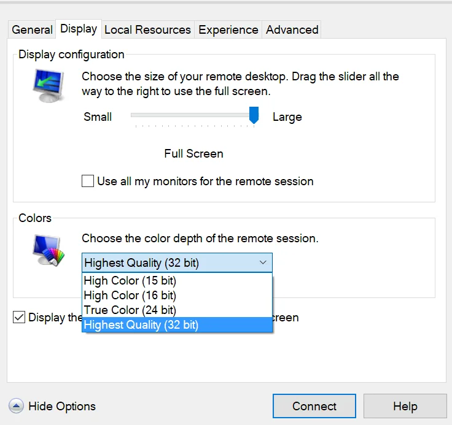

Adjusting the **Display configuration** to maximum full HD - 1920 by 1080 pixels - is more than sufficient to operate the studio. In case that your internet connectivity doesn't provide enough bandwidth, consider to lower the resolution furthere and to reduce the colour depth of your remote session.

**Note**: OBS Studio is not 4K friendly either. No need to stress the connection after all.

## Community in mind...

BTW, all our assets and configurations that we used for the Virtual Developers Conference are openly available on GitHub: [OBS configurations and assets for MSCC events](https://github.com/mscraftsman/mscc-obs).

I used that repository to provision a studio. For an emergency deployment on Wednesday night on the Kryptone track it took me roughly 10 minutes or less to have a fully operational OBS studio up and running.

Finally, the article [Streaming a Community Event on YouTube - Sharing the Technologies and Learnings from Virtual Azure Community Day](https://blog.maartenballiauw.be/post/2020/04/02/streaming-a-community-event-on-youtube-sharing-the-technologies-and-learnings-from-virtual-azure-community-day.html) by Maarten Balliauw has more tips and advice to often.

Given that this article is now beyond the 3,500 words mark I'm going to save more of our notes for a second blog article. It will also contain more 'behind the scenes' looks of our battle stations and other helpful resources like our Guide for Speakers and Guide for Hosts.
