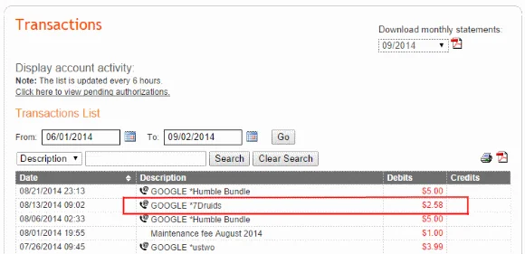
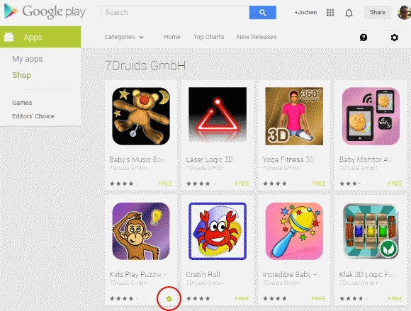
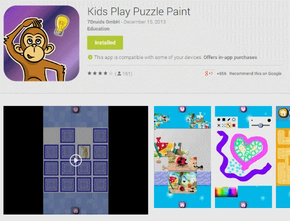
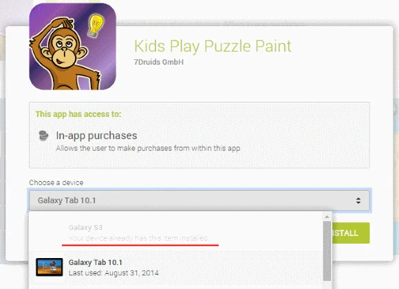
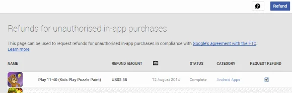
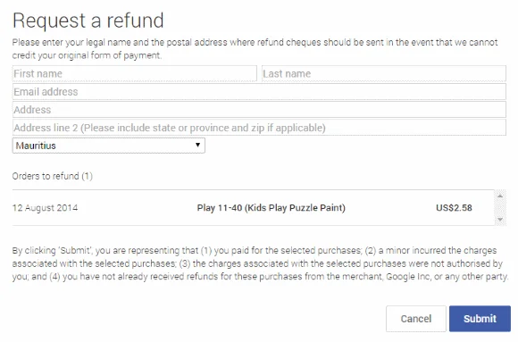

Handing over your Droid to one of your children might be an option to entertain them but be aware that one of the highest revenue is generated by advertisement, app and in-app purchases. Sometimes, this might be kind of surprising for you to discover that your credit card has been charged. You should keep an eye on the payment settings on your device, too.

Lately, we were joking about this on some social media network, and we heard about some expensive adventures from our friends...

## Check your credit card statements regularly

If you don't... Well, eventually you might find some "unknown" transactions on your credit card statement. I already had this pleasure thanks to my little engineers (read: cutie monsters). Yesterday night I went to check the balance and transactions of last month and was kind of surprised to see this:

  
*Check your credit card statements regularly for unknown transactions. Specifically those ones prefixed by "Google \*". It might be surprising...*

Yup, clearly a transaction I'm 100% sure that it wasn't done by myself.

## Let's do a quick root cause analysis

Finding the source of this issue was quite easy. I started with a search on Google using the keyword presented on the account statement: 7Druids. Skimming the results brought me directly into the Play Store, and I was presented with quite a number of apps for children and some for grown-ups, too.

  
*7Druids GmbH has a selection of apps for children and adults.*

Following the breadcrumbs I found out which app might have been the root cause. Turns out someone likes to paint on Android...

  
*Well, children usually like Kids Play Puzzle Paint. The app seems to be available for free but in-app purchases not.*

But at least in our house-hold one question remained open: One which device did it happen?

Even though the app has been installed already, you can still again on the **Installed** button and you will be presented with a drop-down selection of compatible devices. But most interestingly, you will also get the information on which smartphone or tablet the app has been installed already.

  
*Finding out on which device the app has been installed is visible in the drop down selection.*

Aha, there we go... Not my one! I guess, I have to have a word with my BWE. Anyway, let's see how we can avoid this kind of unattended in-app purchase.

## How to prevent accidental purchases?

Actually, it's very simple to improve the situation on your device. In case that you have multiple devices running on the same Google account, you have to go through the steps on every smartphone or tablet in order to maximise protection.

- Go into the **Settings** of the Play Store app,
- Check the **User Controls** section, and
- Adjust the setting of **Require password for purchase**.

By default it's configured as Never.  
Change it to one of the other available options, confirm the change with your Google account password and you're done.

BTW, this is official procedure from the Help section of the Google Play Store: [Use password protection for purchases](https://support.google.com/googleplay/answer/1626831?hl=en)

## Anything else?

Yes, there are additional options you might take into consideration, like not providing any credit card at all in Google Wallet. In my case, I'm actually using a dedicated credit card which I more or less use for online expenses exclusively. Furthermore, the credit limit on that particular card is very low. In case of the inevitable event the damage won't be too high after all.

Did you already have this kind of experience?  
Do you have any additional tipps and tricks dealing with this kind of situation?

Leave a comment...

## Update

Google sent out a mandatory email service announcement regarding improved services:

> Dear Google Play customer,
>
> We strive to provide you with the best experience possible across all of our products and services. We take pride in giving you the tools to use Google Play the way you want, including the ability to control how you authorize the purchases on your account.
>
> We understand some parents might have been charged for in-app purchases made by young children who did not have permission to make those purchases. As a result, we’ve added tools to help parents avoid unauthorized in-app purchases by their young children. We are also offering refunds in certain cases in line [with our agreement with the FTC](https://www.ftc.gov/system/files/documents/cases/140904googleplayorder.pdf).
>
> Our records show that your account was previously charged for in-app purchases. If any of those charges were the result of unauthorized purchases by a minor between March 1, 2011, and November 18, 2014, and you haven’t already received a refund for those charges, you might be eligible for a refund.
>
> In order to make the refund process as easy and quick as possible, we encourage you to use the link below.
>
> To submit a refund request:
>
> - Use [this link](https://play.google.com/store/ftc) to sign into your Google account and review your in-app purchase history.
> - Select any in-app purchases that were unauthorized purchases made by a minor and click "Refund."
> - Provide the requested information for any in-app purchases selected and click "Submit."
>
> Google will review your request and contact you via email about your refund status or if we have any additional questions. All refund requests must be submitted no later than December 2, 2015.
>
> If you have any questions or need further assistance with your refund request, please refer to [this FAQ](https://support.google.com/googleplay/answer/6099759?p=inapp_faq&rd=1).
>
> You can learn more about [in-app purchases](https://support.google.com/googleplay/answer/1061913) and [parental controls in Google Play](https://support.google.com/googleplay/answer/1626831) on our [Help Center](https://support.google.com/googleplay/digital-content#topic=3364260).
>
> Thank you,  
The Google Play Team

## Request of refunds for unauthorised in-app purchases

As written by Google the link to request for refunds will navigate you to an overview in the Play Store. Unsurprisingly, the above analysed scenario is listed on top of my potential refunds.

  
*This page can be used to request refunds for unauthorised in-app purchases in compliance with Google's agreement with the FTC.*

Next, you have to provide your name and contact details in case that Google has to issue a cheque if a refund to the original payment option is not possible anymore.

  
*Enter your legal name and the postal address where refund cheques should be sent in the event that we cannot credit your original form of payment.*

Of course, I requested a refund for this purchase... Let's see what's going to happen. I'm going to update this article accordingly.