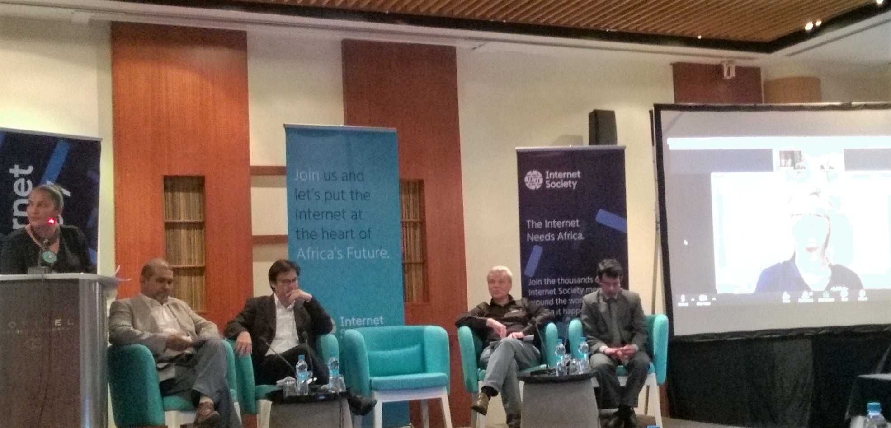
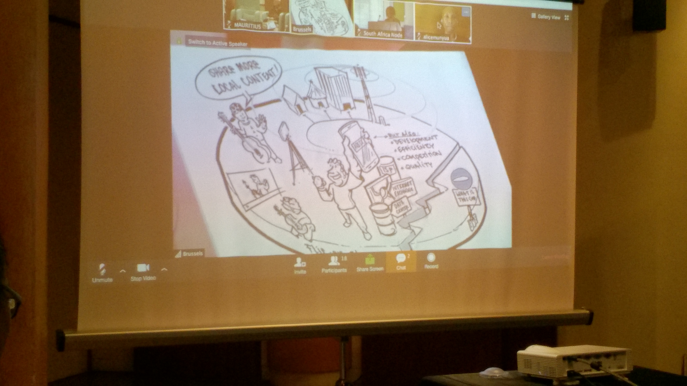

Following an informative posting by Duskh Koonjoobeeharry, founder of the [Atlassian User Group Mauritius](https://aug.atlassian.com/mauritius/) on Facebook, I signed up first time to attend the annual [InterCommunity 2017](https://www.internetsociety.org/intercommunity/2017/) by the [Internet Society (ISOC)](https://www.internetsociety.org/).

This year marked the [25th anniversairy](https://www.internetsociety.org/blog/2017/09/internet-societys-25th-anniversary-renewal-commitment/) of the Internet Society, and a 24 hours live stream among several nodes across the globe gave me an opportunity to learn more about the association.

Mauritius actively participated as one of the [16 Interactive Regional Nodes](https://www.internetsociety.org/intercommunity/2017/interact) world-wide. Having Flic En Flac listed among other big cities like Los Angeles, Singapore, Geneva, or Montevideo indicates that it's not just about location or size but active participation and contribution. The interactive node here in Mauritius was possible thanks to [AFRINIC](https://afrinic.net/) who generously sponsored the venue and handled all the logistics.

## What to expect?

Although I already knew a little about the existence and work of the Internet Society (in Mauritius) based on a previous invitation to attend the [AFRINIC-25](https://afrinic.net/en/community/afrinic-events) conference, I was mainly interested in the advertised panel discussion dubbed "Digital Divides and the Internet Economy: The case of Mauritius". It would have been great to get information on the past, current and hopefully plans of the future.

Attending the event would also give me a chance to meet new people, and learn from their experience and knowledge.

## Literally next door...

[AFRINIC](https://afrinic.net/) chose the Sofitel Hotel in Wolmar for their get together. So, literally for me it was just next door, and although leaving just-in-time I was among the first to show up at the venue. Later on, it was reported that some attendees got stuck in traffic jam coming down the link road from Mon Desir towards Beaux Songes. Yes, that's a daily obstacle. Luckily, my office is located in Quatre Bornes and therefore I'm going opposite direction the other days.

The registration went smooth given nobody was around, and while having a cup of tea for breakfast Kevin G. Chege, ISOC, joined me and we had a brief conversation about my expectation of today's event, the Internet Society in general, and the IT communities in Mauritius. Great, exactly what I was looking for. ;-)

Before the sessions kicked off I managed to chat a bit with [Logan](https://twitter.com/loganaden_42) and [Yashvi](https://twitter.com/YashPaupiah) about the upcoming [Code Wars hackathon organised by the Computer Club of the UoM](https://uomcc.wordpress.com/2017/09/13/code-wars/). Fantastic idea and yes it's important to give students a chance to get their "hands dirty" and to participate in coding writing activities. Later on, SM sat next to me and we had some exchange about InterCommunity 2017, the Internet Society as well as [AFRINIC](https://afrinic.net/). Finally, some folks of LSL Digital came through the traffic jam, and started their own live stream on Facebook.

## Panel discussion and livestream

According to the schedule the local panel discussion was set for one hour starting at 10:00 hrs (6:00 hrs UTC). Vymala Thuron from [AFRINIC](https://afrinic.net/) managed the handover from the broadcasting HQ in Brussels and kicked off the conversation with some interesting questions for the four panelists.

Following I'm trying to summarise what was discussed.

### Bandwidth

Mr Johnny Lim Fook, IP & Broadband Manager of Mauritius Telecom mentioned that with the development of fiber networks and the constant increase of bandwidth the demands of companies but also households have gone up, too. The new challenges are about providing a reliable network infrastructure for permanent eLearning and more remote work scenarios. The aim would be to create local nodes for providers of Content Distribution Networks (CDNs) and to provide higher capacity on data caches in Mauritius.

### Working together for the better of all

Given the existing technology and infrastructure it is now more an issue between people to agree on corporation rather than keeping the competition alive, says Mr Patrick Rene. He highlighted that *sharing is important* in order to move Mauritius to the next level of a knowledge-based society.

### Pricing in Mauritius

Despite the improvements of technology and the easier access to internet connectivity one major obstacle still remains according to Mr Alan Barrett, CEO of [AFRINIC](https://afrinic.net/), which is pricing. Whether it is the current price structure of last mile lines or hosting space in local data centres. The cost is still too high in Mauritius.

### Handling of cyber security

With the rapid adoption of Internet of Things (IoT) Mr Kaleem Usmani, Assistant Manager CERT-MU of the National Computer Board (NCB) explained that it is important that the Mauritian government is aware of recent threats and that education of the general public in regards to cyber security needs more attention. Free WiFi given by various local providers is surely interesting to nourish easy access to the internet but it is not without risks.

There were more interesting questions on the digital divide but overall it can be said that Mauritius has a fair standing in Africa.

Watch the full session on [YouTube](https://www.youtube.com/watch?v=P1lcFjtcyLc) or here:

<iframe width="560" height="315" src="https://www.youtube.com/embed/P1lcFjtcyLc?rel=0&amp;html5=1" frameborder="0" allowfullscreen=""></iframe>

Prior to the hand-over to the next InterComm node in Johannesburg all attendees were kindly asked to join the birthday cake ceremony here in Mauritius.

## Exhaustion of IPv4 addresses

After a quick break and some refreshments Mrs Madhvi Gokool of [AFRINIC](https://afrinic.net/) gave an overview of the [IPv4 address management and it's exhaustion](https://afrinic.net/en/community/ipv4-exhaustion) in the near future. Several Regional Internet Registries (RIRs) are already out of addresses and the few remaining ones introduced rigid regulation on the application and assignment of addresses.

It was also mentioned that the adaption of IPv6 is increasing and that current internet service providers (ISPs) should give some more attention to dual-stacking network hardware instead of masquerading their clients into private IPv4 address spaces. Thanks to the constant climb of IoT devices the necessity of IPv6 is unavoidable.

## Share more local content

Right now Mauritius is still consuming more content than actually creating and sharing information.

Whether it is through video services like Netflix, Hulu or Amazon Prime several attendees showed their concerns that our island could be cut-off from the interweb very easily. The recent incident on one of the internet sea cables also made this very prominent. On the one hand it would be positive to gain more resilience and redundancy on internet connectivity and on the other hand it is welcoming to offer more content and information produced locally. As stated, with better understanding and corporation between local service providers and a revised price structure this could be achieved soon, given the existing technology available today.
