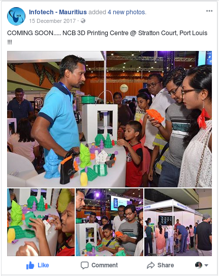
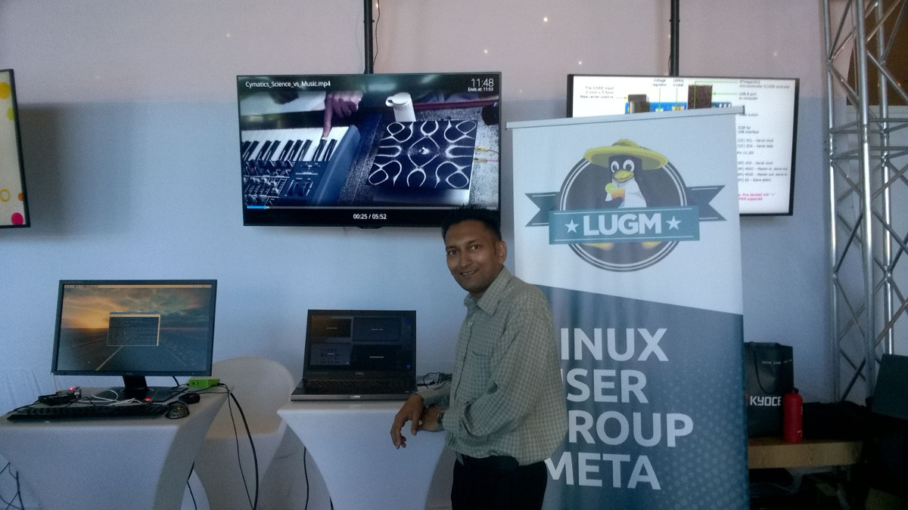
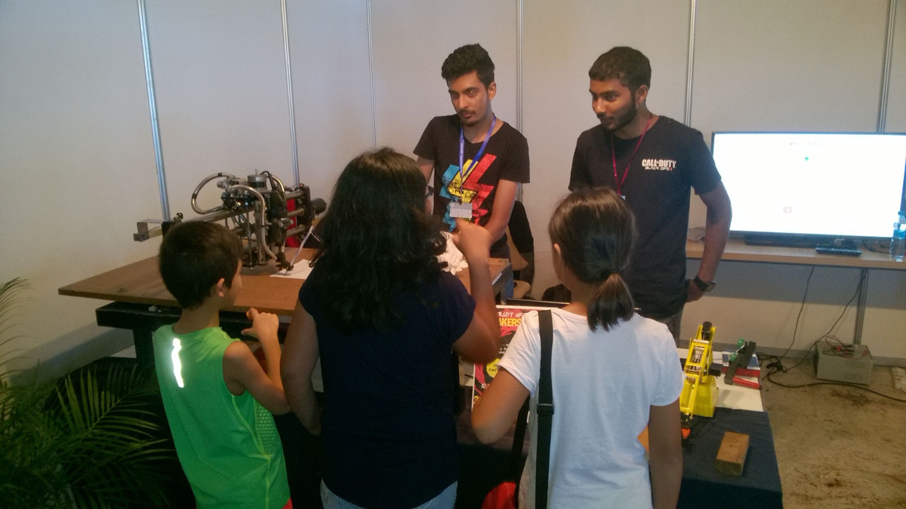
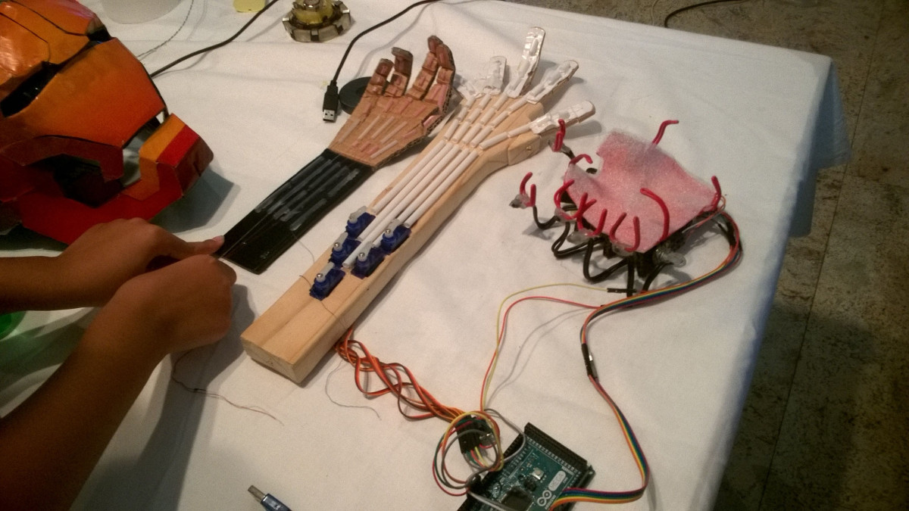
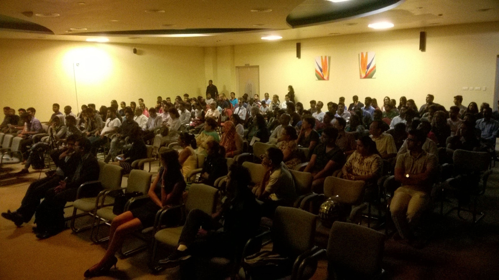

Infotech or commonly known as the annual IT tech bazaar in Mauritius was looking for possibilities to change in 2017 - moving away from the dominant sales activities during the past years back to its original roots of being an innovative and informative IT event.

And they did it!

## Infotech - the known parts

I'm just going to quote their mission statement here:  
*[INFOTECH](http://infotech.mu/) is the major annual Information and Communication Technology (ICT) event organised in Mauritius by the National Computer Board (NCB) in collaboration with the Ministry of Technology, Communication and Innovation. The aim is to create awareness on emerging technologies and provide business opportunities in the ICT sector.*

Personally, I went to Infotech first time in [2008](xref:infotech-2008), and back then there were more product demonstration than a vast range of discounts.  
And yes, every year Infotech is surely offering business opportunities and people are looking forward to it. Given the annual dates around end of November or begin of December it takes somehow into consideration that a good number of people in the IT sector and in general already received their annual bonus payments. What else better than to spend it on some hardware gadgets like a new mobile phone, a large smart TV, a new computer or laptop?

But unfortunately that seemed to have been one of the major reasons why the [reputation of Infotech](xref:infotech-2013) as an event to create awareness on emerging technologies has lost out. There was too much emphasis on sales and too few on innovation. Eventually, this might be an opinionated view of things on my side. Would be great to have your input in the comments below.

## Infotech - the changed parts

Interestingly, Infotech 2017 had less booths of retailers than in previous years and there were a good number of technology representatives. Among them someone advertising the possibilities that Mauritius could go for its own satellite in space. How cool would that be?

  
*Source: [https://www.facebook.com/InfotechMauritius/](https://www.facebook.com/InfotechMauritius/)*

Also the organisers arranged the available exhibition space into several zones, most remarkable a designated area for 3D printing only. Then there was the LAN gaming zone strategically well placed at the back of the convention centre. And many more others.

The foyer area had also more to offer than the usual food court. Most outstanding change was that the booth of the National Computer Board sprung right in your face at the entry. Fantastic placement and so easy to reach for every visitor. Really loved it. Like in previous years the NCB offered part of their booth to the [Linux User Group of Mauritius (LUGM)](https://lugm.org) to advocate for [Free and Open Source Software (FOSS)](https://www.fsf.org/).

  
*Linux User Group of Mauritius (LUGM) to advocate for Free and Open Source Software (FOSS)*

The guys of the LUGM did a great job during those few days and the demonstration of Linux inclusive standard software like office, email, browser, graphics, etc. as well as show casing a complete multimedia centre running on the TV, openElec if I remember correctly, provided a solid overview and insight to visitors that there is more than just Windows for their computers.

Also in the foyer there was a booth run by students of the University of Mauritius. Here they demonstrated some of their final year assignments in action. My children were really into it and glad that they were allowed to literally try everything.

  
*Final year assignments and projects by students of the University of Mauritius*  
  
*Interesting prototypes of robotic hands - even with remote controlled operation mode*

Check out more [Photos section on the Infotech page on Facebook](https://www.facebook.com/InfotechMauritius/).

## InnovTech - the new parts

[InnovTech Conference](http://infotech.govmu.org/English/Components/Pages/Innovtech-Conference-.aspx), a new format of Infotech or let's better say an innovative complimentary to Infotech was organised the first time during the 2017 event.

And I'm grateful about this unique opportunity to have worked with the National Computer Board to bring this new 'mini conference' format to Infotech.

> Mr. Jochen Kirstätter, the founder of MSCC [note: Mauritius Software Craftsmanship Community], and the Ministry of TCI [note: Ministry of Technology, Communication and Innovation] will take the lead for Day 2 and Day 3 of Innovtech Conference.

Eventually inspired by the annual [Developers Conference](https://conference.mscc.mu) of the [Mauritius Software Craftsmanship Community](https://www.mscc.mu) the NCB got in touch with several representatives of local IT communities, and invited us to several meetings in regards to InnovTech. It was a great experience, and I'm glad that some of our ideas were taken into consideration.

  
*Approximately 280 attendees came to InnovTech*

During Infotech the convention centre is completely used by the NCB but in the past years the various conference rooms upstairs were given no importance or value. By helping to create and to organise InnovTech I think (and hope) that future events will offer greater value to all visitors.

According to officials of the National Computer Board we were able to attract approximately 280 attendees to come and follow the various presentations of InnovTech during those two days.

## More to read...

Probably, this article might be a touch too biased given my involvement in InnovTech. Therefore I would like to invite you to read what other attendees and speakers of Infotech 2017 had to say about the event.

[My interactive session on Innovation during Infotech / Innovtech 2017](https://www.avinashmeetoo.com/2017/12/20/my-interactive-session-on-innovation-during-infotech-innovtech-2017/) by Avinash Meetoo, Advisor to the Minister of TCI

[Infotech 2017: la vision 2030 pour le secteur des TIC en ligne de mire](https://www.lexpress.mu/article/321783/infotech-2017-vision-2030-pour-secteur-tic-en-ligne-mire) by Florian Lepoigneur, Lexpress.mu

[Infotech 2017: les imprimantes 3D volent la vedette](https://www.lexpress.mu/article/322026/infotech-2017-imprimantes-3d-volent-vedette) by Florian Lepoigneur, Lexpress.mu

## Eagerly expecting Infotech/InnovTech 2018

I have to admit that the combination of exhibition area on the ground floor with the designated technology zones and the informative presentations in the Kestrel conference room on first level gave Infotech 2017 a positive twist. The National Computer Board managed to put new, fresh life into the event.

Looking forward to this year's Infotech / InnovTech.

How about you? Did you check out the exhibits or eventually did you attend one or more presentations? What's your opinion of Infotech 2017 compared to previous years?

PS: Yeah, my children raided the Cyber Caravan to do another [Hour of Code](https://hourofcode.com/) like professionals.
